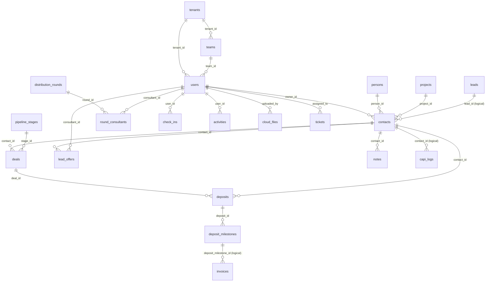
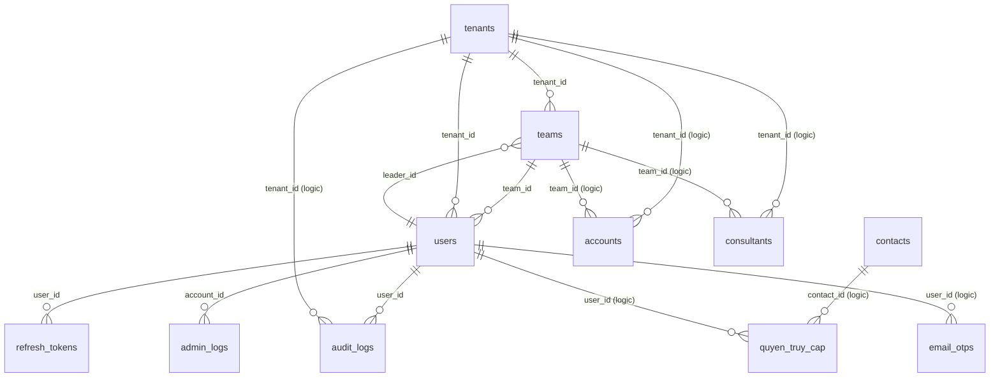
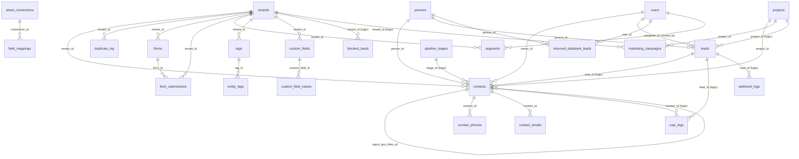
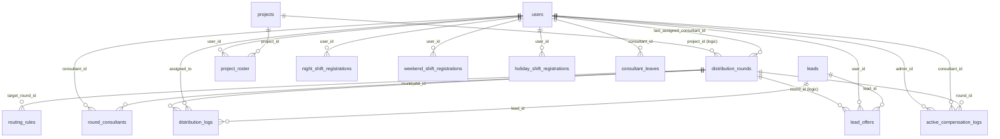
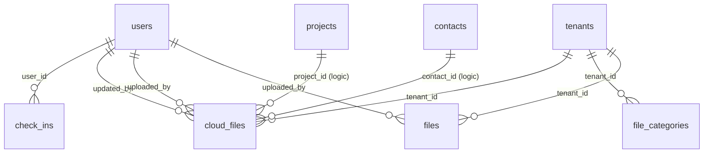
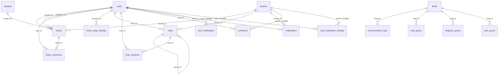
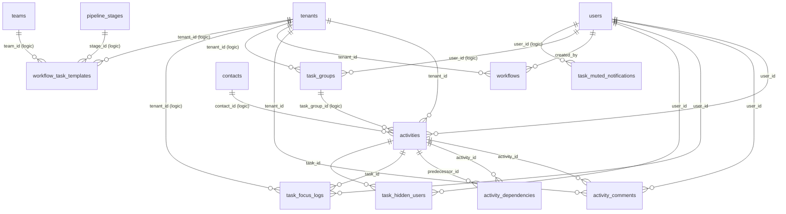
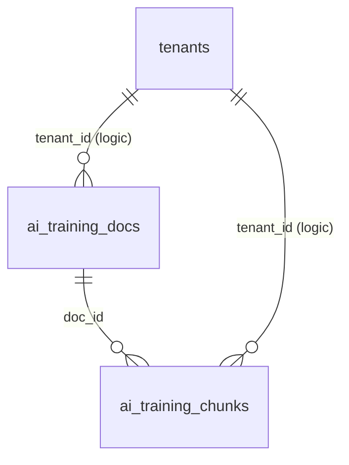
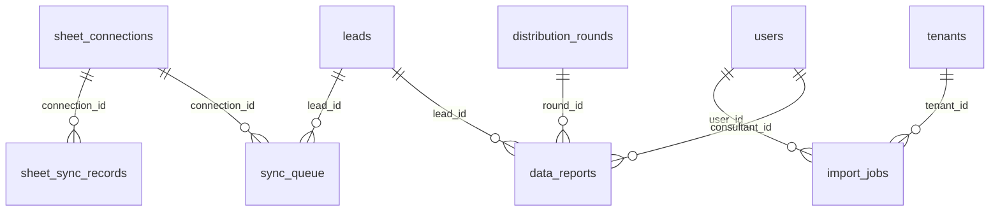

# 🏛️ BÁO CÁO KIỂM TOÁN CƠ SỞ DỮ LIỆU & SƠ ĐỒ THỰC THỂ LIÊN KẾT (DATABASE ERD 100% FULL)
**Hệ thống**: RichLand CRM Enterprise Platform (Database: `zccqvhhh_crm-rlvn`)
**Tiêu chuẩn Kiểm toán**: Antigravity Master Constitution & Empirical Ground Truth Mandate (`AGENTS.md`)
**Cổng Truy Vấn Đối Soát**: `backend/exec_db_query.php` (Remote Secret Authenticated Query Engine)
**Thời điểm Chốt Dữ Liệu Thực Tế**: 2026-10-08T07:54:37.186Z

---

## 📊 1. BẢNG TỔNG HỢP ĐỐI SOÁT & KIỂM TOÁN CHÂN LÝ THỰC NGHIỆM (AUDIT EXECUTIVE SUMMARY)

| Chỉ số kiểm toán thực tế | Giá trị ghi nhận thực tế trên MySQL Engine | Đánh giá tuân thủ & Ý nghĩa kiến trúc |
| :--- | :--- | :--- |
| **Tổng số thực thể CSDL** | **100 thực thể** (98 Base Tables + 2 Views) | ✅ **Đầy đủ 100%**, không sót bất kỳ phân hệ nào của CRM |
| **Bảng vật lý (Base Tables)** | **98 bảng** | ✅ 100% sử dụng Storage Engine `InnoDB` (Hỗ trợ ACID, Transactions, Row-level Locking) |
| **Khung nhìn tương thích (Views)** | **2 views** (`accounts`, `consultants`) | ✅ Bảo toàn 100% Backward Compatibility cho mã nguồn CRM legacy |
| **Ràng buộc Khóa Ngoại Vật lý (Physical FKs)** | **146 quan hệ FK** | ✅ Khóa toàn vẹn dữ liệu cứng tại tầng MySQL Database Engine |
| **Quan hệ Khóa Ngoại Logic (Logical FKs)** | **40 quan hệ logic** | ✅ Được kiểm soát an toàn bởi Application Logic & Backend Controllers |
| **Tổng số Mối Quan Hệ Thực Thể (Total ERD Links)** | **186 mối quan hệ** (146 Vật lý + 40 Logic) | ✅ Xâu chuỗi liền mạch 100% luồng dữ liệu từ Multi-tenant đến Lead/Deal/Finance |
| **Độ phủ Khóa Chính (Primary Keys Coverage)** | **98/98 Bảng vật lý (100%)** | ✅ Không tồn tại bảng nào thiếu Primary Key; 100% khóa định danh rõ ràng |
| **Triggers / Stored Procedures / Events** | **0 Triggers / 0 Routines / 0 Events** | ✅ **Kiến trúc sạch (Clean Architecture)**: Không có hiệu ứng lề ngầm ẩn trong DB, toàn bộ logic nghiệp vụ tập trung tại PHP Backend |
| **Chuẩn mã hóa ký tự (Charset / Collation)** | 97 bảng `utf8mb4_unicode_ci`<br>1 bảng `utf8mb4_general_ci` | ⚠️ Bảng `sent_notifications` có collation `general_ci`. Đã lập khuyến nghị tối ưu hóa |
| **Số bản ghi thực tế (Exact SELECT COUNT)** | Đã kiểm toán chính xác 100% từng bảng | ✅ Thay thế toàn bộ số ước tính InnoDB bằng số đếm thực tế chính xác tuyệt đối |
| **Tình trạng Dữ liệu Giả (Mock / Fake Fallback)** | **0% Tuyệt đối** | ✅ Triệt tiêu hoàn toàn mock lead, 100% dữ liệu thực từ MySQL Staging |

---

## 🗺️ 2. SƠ ĐỒ KIẾN TRÚC TRỤC XƯƠNG SỐNG (CORE ARCHITECTURAL BACKBONE ERD)

Sơ đồ thể hiện luồng liên kết trung tâm: Tổ chức Đa người thuê (`tenants`) ➔ Đội nhóm & Tài khoản (`teams`, `users`) ➔ Khách hàng (`persons`, `contacts`, `leads`) ➔ Điều phối lead (`distribution_rounds`, `lead_offers`) ➔ Giao dịch Bất động sản (`deals`, `deposits`, `deposit_milestones`, `invoices`) ➔ Điểm danh & Hoạt động (`check_ins`, `activities`):



---

## 🧩 3. SƠ ĐỒ THỰC THỂ CHI TIẾT THEO 9 PHÂN HỆ NGHIỆP VỤ (DOMAIN-SPECIFIC MERMAID ERDS)

### 1. Identity & Multi-Tenant Access Management (IAM)
*Quản trị danh tính, phân quyền đa người thuê, phiên làm việc và nhật ký bảo mật*



**Danh sách các bảng trong phân hệ & Số lượng bản ghi thực tế:**

| Tên bảng | Loại thực thể | Số cột | Bản ghi thực tế | Engine | Ràng buộc FK | Mục đích nghiệp vụ |
| :--- | :--- | :--- | :--- | :--- | :--- | :--- |
| [`tenants`](#table-tenants) | `Bảng vật lý (InnoDB)` | 11 | **1** | `InnoDB` | 0 vật lý | Quản lý tenants |
| [`users`](#table-users) | `Bảng vật lý (InnoDB)` | 43 | **64** | `InnoDB` | 2 vật lý | Quản lý users |
| [`teams`](#table-teams) | `Bảng vật lý (InnoDB)` | 14 | **1** | `InnoDB` | 2 vật lý | Quản lý teams |
| [`quyen_truy_cap`](#table-quyen_truy_cap) | `Bảng vật lý (InnoDB)` | 5 | **5** | `InnoDB` | 0 vật lý + 2 logic | Quản lý quyen_truy_cap |
| [`accounts`](#table-accounts) | `Khung nhìn (VIEW)` | 27 | **64** | `VIEW` | 0 vật lý + 2 logic | VIEW |
| [`consultants`](#table-consultants) | `Khung nhìn (VIEW)` | 30 | **64** | `VIEW` | 0 vật lý + 2 logic | VIEW |
| [`refresh_tokens`](#table-refresh_tokens) | `Bảng vật lý (InnoDB)` | 5 | **380** | `InnoDB` | 1 vật lý | Quản lý refresh_tokens |
| [`login_attempts`](#table-login_attempts) | `Bảng vật lý (InnoDB)` | 5 | **322** | `InnoDB` | 0 vật lý | Quản lý login_attempts |
| [`email_otps`](#table-email_otps) | `Bảng vật lý (InnoDB)` | 8 | **3** | `InnoDB` | 0 vật lý + 1 logic | Quản lý email_otps |
| [`admin_logs`](#table-admin_logs) | `Bảng vật lý (InnoDB)` | 8 | **243** | `InnoDB` | 1 vật lý | Quản lý admin_logs |
| [`audit_logs`](#table-audit_logs) | `Bảng vật lý (InnoDB)` | 11 | **1353** | `InnoDB` | 1 vật lý + 1 logic | Quản lý audit_logs |

---

### 2. Lead Management & Omnichannel Ingestion
*Quản lý phễu khách hàng tiềm năng, chống trùng lặp lead, phân khúc và đa kênh tiếp nhận*



**Danh sách các bảng trong phân hệ & Số lượng bản ghi thực tế:**

| Tên bảng | Loại thực thể | Số cột | Bản ghi thực tế | Engine | Ràng buộc FK | Mục đích nghiệp vụ |
| :--- | :--- | :--- | :--- | :--- | :--- | :--- |
| [`persons`](#table-persons) | `Bảng vật lý (InnoDB)` | 11 | **49** | `InnoDB` | 0 vật lý | Quản lý persons |
| [`contacts`](#table-contacts) | `Bảng vật lý (InnoDB)` | 83 | **93** | `InnoDB` | 5 vật lý + 2 logic | Quản lý contacts |
| [`leads`](#table-leads) | `Bảng vật lý (InnoDB)` | 62 | **53** | `InnoDB` | 2 vật lý + 1 logic | Quản lý leads |
| [`contact_phones`](#table-contact_phones) | `Bảng vật lý (InnoDB)` | 5 | **0** | `InnoDB` | 1 vật lý | Quản lý contact_phones |
| [`contact_emails`](#table-contact_emails) | `Bảng vật lý (InnoDB)` | 5 | **0** | `InnoDB` | 1 vật lý | Quản lý contact_emails |
| [`duplicate_log`](#table-duplicate_log) | `Bảng vật lý (InnoDB)` | 8 | **0** | `InnoDB` | 1 vật lý | Quản lý duplicate_log |
| [`blocked_leads`](#table-blocked_leads) | `Bảng vật lý (InnoDB)` | 7 | **0** | `InnoDB` | 0 vật lý + 1 logic | Quản lý blocked_leads |
| [`returned_databank_leads`](#table-returned_databank_leads) | `Bảng vật lý (InnoDB)` | 3 | **9** | `InnoDB` | 2 vật lý | Quản lý returned_databank_leads |
| [`marketing_campaigns`](#table-marketing_campaigns) | `Bảng vật lý (InnoDB)` | 17 | **2** | `InnoDB` | 1 vật lý + 1 logic | Quản lý marketing_campaigns |
| [`forms`](#table-forms) | `Bảng vật lý (InnoDB)` | 10 | **0** | `InnoDB` | 1 vật lý | Quản lý forms |
| [`form_submissions`](#table-form_submissions) | `Bảng vật lý (InnoDB)` | 9 | **0** | `InnoDB` | 2 vật lý | Quản lý form_submissions |
| [`field_mappings`](#table-field_mappings) | `Bảng vật lý (InnoDB)` | 6 | **17** | `InnoDB` | 1 vật lý | Quản lý field_mappings |
| [`segments`](#table-segments) | `Bảng vật lý (InnoDB)` | 8 | **0** | `InnoDB` | 2 vật lý | Quản lý segments |
| [`tags`](#table-tags) | `Bảng vật lý (InnoDB)` | 6 | **1** | `InnoDB` | 1 vật lý | Quản lý tags |
| [`entity_tags`](#table-entity_tags) | `Bảng vật lý (InnoDB)` | 3 | **0** | `InnoDB` | 1 vật lý | Quản lý entity_tags |
| [`custom_fields`](#table-custom_fields) | `Bảng vật lý (InnoDB)` | 11 | **0** | `InnoDB` | 1 vật lý | Quản lý custom_fields |
| [`custom_field_values`](#table-custom_field_values) | `Bảng vật lý (InnoDB)` | 8 | **0** | `InnoDB` | 1 vật lý | Quản lý custom_field_values |
| [`capi_logs`](#table-capi_logs) | `Bảng vật lý (InnoDB)` | 9 | **12** | `InnoDB` | 0 vật lý + 2 logic | Quản lý capi_logs |
| [`webhook_logs`](#table-webhook_logs) | `Bảng vật lý (InnoDB)` | 12 | **14** | `InnoDB` | 0 vật lý + 1 logic | Quản lý webhook_logs |

---

### 3. Lead Distribution Engine & Rotation Gates
*Động cơ phân phối lead xoay vòng tự động, 5 cổng bảo vệ, vé ưu tiên (Lead Offers) và trực ca*



**Danh sách các bảng trong phân hệ & Số lượng bản ghi thực tế:**

| Tên bảng | Loại thực thể | Số cột | Bản ghi thực tế | Engine | Ràng buộc FK | Mục đích nghiệp vụ |
| :--- | :--- | :--- | :--- | :--- | :--- | :--- |
| [`distribution_rounds`](#table-distribution_rounds) | `Bảng vật lý (InnoDB)` | 16 | **7** | `InnoDB` | 1 vật lý + 1 logic | Quản lý distribution_rounds |
| [`round_consultants`](#table-round_consultants) | `Bảng vật lý (InnoDB)` | 9 | **167** | `InnoDB` | 2 vật lý | Quản lý round_consultants |
| [`lead_offers`](#table-lead_offers) | `Bảng vật lý (InnoDB)` | 9 | **283** | `InnoDB` | 2 vật lý + 1 logic | Quản lý lead_offers |
| [`distribution_logs`](#table-distribution_logs) | `Bảng vật lý (InnoDB)` | 7 | **202** | `InnoDB` | 3 vật lý | Quản lý distribution_logs |
| [`routing_rules`](#table-routing_rules) | `Bảng vật lý (InnoDB)` | 9 | **4** | `InnoDB` | 1 vật lý | Quản lý routing_rules |
| [`project_roster`](#table-project_roster) | `Bảng vật lý (InnoDB)` | 3 | **108** | `InnoDB` | 2 vật lý | Quản lý project_roster |
| [`active_compensation_logs`](#table-active_compensation_logs) | `Bảng vật lý (InnoDB)` | 7 | **0** | `InnoDB` | 3 vật lý | Quản lý active_compensation_logs |
| [`night_shift_registrations`](#table-night_shift_registrations) | `Bảng vật lý (InnoDB)` | 5 | **45** | `InnoDB` | 1 vật lý | Quản lý night_shift_registrations |
| [`weekend_shift_registrations`](#table-weekend_shift_registrations) | `Bảng vật lý (InnoDB)` | 5 | **34** | `InnoDB` | 1 vật lý | Quản lý weekend_shift_registrations |
| [`holiday_shift_registrations`](#table-holiday_shift_registrations) | `Bảng vật lý (InnoDB)` | 6 | **0** | `InnoDB` | 1 vật lý | Quản lý holiday_shift_registrations |
| [`consultant_leaves`](#table-consultant_leaves) | `Bảng vật lý (InnoDB)` | 5 | **0** | `InnoDB` | 1 vật lý | Quản lý consultant_leaves |

---

### 4. Deals, Real Estate Inventory & Financial Transactions
*Giao dịch thương mại, giỏ hàng bất động sản, phiếu đặt cọc, đợt thanh toán, hóa đơn và chi phí*

```mermaid
erDiagram
    tenants ||--o{ deals : "tenant_id"
    pipeline_stages ||--o{ deals : "stage_id"
    contacts ||--o{ deals : "contact_id"
    companies ||--o{ deals : "company_id"
    users ||--o{ deals : "owner_id"
    users ||--o{ deals : "created_by"
    deals ||--o{ deal_stage_history : "deal_id"
    users ||--o{ deal_stage_history : "moved_by"
    tenants ||--o{ pipeline_stages : "tenant_id"
    projects ||--o{ project_documents : "project_id"
    users ||--o{ project_documents : "uploaded_by"
    contacts ||--o{ deposits : "contact_id"
    projects ||--o{ deposits : "project_id"
    users ||--o{ deposits : "created_by"
    deposits ||--o{ deposit_milestones : "deposit_id"
    users ||--o{ deposit_milestones : "approved_by"
    tenants ||--o{ invoices : "tenant_id"
    deals ||--o{ invoices : "deal_id"
    companies ||--o{ invoices : "company_id"
    contacts ||--o{ invoices : "contact_id"
    invoices ||--o{ invoice_items : "invoice_id"
    products ||--o{ invoice_items : "product_id"
    tenants ||--o{ expenses : "tenant_id"
    users ||--o{ expenses : "created_by"
    users ||--o{ expenses : "approver_id"
    tenants ||--o{ expense_entities : "tenant_id"
    expenses ||--o{ expense_entities : "expense_id"
    product_categories ||--o{ products : "category_id"
    users ||--o{ products : "created_by"
    tenants ||--o{ products : "tenant_id"
    tenants ||--o{ product_categories : "tenant_id"
    batches ||--o{ inventory_logs : "batch_id"
    products ||--o{ batches : "product_id"
    tenants ||--o{ quotes : "tenant_id"
    deals ||--o{ quotes : "deal_id"
    contacts ||--o{ quotes : "contact_id"
    users ||--o{ quotes : "created_by"
    quotes ||--o{ quote_items : "quote_id"
    products ||--o{ quote_items : "product_id"
    users ||--o{ purchase_orders : "created_by"
    suppliers ||--o{ purchase_orders : "supplier_id"
    tenants ||--o{ purchase_orders : "tenant_id"
    purchase_orders ||--o{ purchase_order_items : "po_id"
    products ||--o{ purchase_order_items : "product_id"
    users ||--o{ suppliers : "created_by"
    tenants ||--o{ suppliers : "tenant_id"
    tenants ||--o{ companies : "tenant_id"
    users ||--o{ companies : "owner_id"
    users ||--o{ companies : "created_by"
    contacts ||--o{ cooperation_slips : "contact_id"
    tenants ||--o{ projects : "tenant_id (logic)"
    tenants ||--o{ inventory_logs : "tenant_id (logic)"
    tenants ||--o{ batches : "tenant_id (logic)"
    suppliers ||--o{ batches : "supplier_id (logic)"
    pipeline_stages ||--o{ companies : "stage_id (logic)"
```



**Danh sách các bảng trong phân hệ & Số lượng bản ghi thực tế:**

| Tên bảng | Loại thực thể | Số cột | Bản ghi thực tế | Engine | Ràng buộc FK | Mục đích nghiệp vụ |
| :--- | :--- | :--- | :--- | :--- | :--- | :--- |
| [`deals`](#table-deals) | `Bảng vật lý (InnoDB)` | 23 | **0** | `InnoDB` | 6 vật lý | Quản lý deals |
| [`deal_stage_history`](#table-deal_stage_history) | `Bảng vật lý (InnoDB)` | 6 | **0** | `InnoDB` | 2 vật lý | Quản lý deal_stage_history |
| [`pipeline_stages`](#table-pipeline_stages) | `Bảng vật lý (InnoDB)` | 9 | **6** | `InnoDB` | 1 vật lý | Quản lý pipeline_stages |
| [`projects`](#table-projects) | `Bảng vật lý (InnoDB)` | 23 | **4** | `InnoDB` | 0 vật lý + 1 logic | Quản lý projects |
| [`project_documents`](#table-project_documents) | `Bảng vật lý (InnoDB)` | 8 | **0** | `InnoDB` | 2 vật lý | Quản lý project_documents |
| [`deposits`](#table-deposits) | `Bảng vật lý (InnoDB)` | 11 | **3** | `InnoDB` | 3 vật lý | Quản lý deposits |
| [`deposit_milestones`](#table-deposit_milestones) | `Bảng vật lý (InnoDB)` | 9 | **3** | `InnoDB` | 2 vật lý | Quản lý deposit_milestones |
| [`invoices`](#table-invoices) | `Bảng vật lý (InnoDB)` | 23 | **0** | `InnoDB` | 4 vật lý | Quản lý invoices |
| [`invoice_items`](#table-invoice_items) | `Bảng vật lý (InnoDB)` | 7 | **0** | `InnoDB` | 2 vật lý | Quản lý invoice_items |
| [`expenses`](#table-expenses) | `Bảng vật lý (InnoDB)` | 24 | **0** | `InnoDB` | 3 vật lý | Quản lý expenses |
| [`expense_entities`](#table-expense_entities) | `Bảng vật lý (InnoDB)` | 7 | **0** | `InnoDB` | 2 vật lý | Quản lý expense_entities |
| [`products`](#table-products) | `Bảng vật lý (InnoDB)` | 20 | **0** | `InnoDB` | 3 vật lý | Quản lý products |
| [`product_categories`](#table-product_categories) | `Bảng vật lý (InnoDB)` | 7 | **0** | `InnoDB` | 1 vật lý | Quản lý product_categories |
| [`inventory_logs`](#table-inventory_logs) | `Bảng vật lý (InnoDB)` | 10 | **0** | `InnoDB` | 1 vật lý + 1 logic | Quản lý inventory_logs |
| [`batches`](#table-batches) | `Bảng vật lý (InnoDB)` | 14 | **0** | `InnoDB` | 1 vật lý + 2 logic | Quản lý batches |
| [`quotes`](#table-quotes) | `Bảng vật lý (InnoDB)` | 17 | **0** | `InnoDB` | 4 vật lý | Quản lý quotes |
| [`quote_items`](#table-quote_items) | `Bảng vật lý (InnoDB)` | 10 | **0** | `InnoDB` | 2 vật lý | Quản lý quote_items |
| [`purchase_orders`](#table-purchase_orders) | `Bảng vật lý (InnoDB)` | 15 | **0** | `InnoDB` | 3 vật lý | Quản lý purchase_orders |
| [`purchase_order_items`](#table-purchase_order_items) | `Bảng vật lý (InnoDB)` | 7 | **0** | `InnoDB` | 2 vật lý | Quản lý purchase_order_items |
| [`suppliers`](#table-suppliers) | `Bảng vật lý (InnoDB)` | 22 | **0** | `InnoDB` | 2 vật lý | Quản lý suppliers |
| [`companies`](#table-companies) | `Bảng vật lý (InnoDB)` | 36 | **0** | `InnoDB` | 3 vật lý + 1 logic | Quản lý companies |
| [`cooperation_slips`](#table-cooperation_slips) | `Bảng vật lý (InnoDB)` | 21 | **0** | `InnoDB` | 1 vật lý | Quản lý cooperation_slips |

---

### 5. Human Resources, Attendance & Secure File Storage
*Điểm danh selfie AI sáng sớm, tài liệu nhân sự bảo mật phân quyền 2 lớp*



**Danh sách các bảng trong phân hệ & Số lượng bản ghi thực tế:**

| Tên bảng | Loại thực thể | Số cột | Bản ghi thực tế | Engine | Ràng buộc FK | Mục đích nghiệp vụ |
| :--- | :--- | :--- | :--- | :--- | :--- | :--- |
| [`check_ins`](#table-check_ins) | `Bảng vật lý (InnoDB)` | 19 | **154** | `InnoDB` | 1 vật lý | Quản lý check_ins |
| [`cloud_files`](#table-cloud_files) | `Bảng vật lý (InnoDB)` | 16 | **8** | `InnoDB` | 3 vật lý + 2 logic | Quản lý cloud_files |
| [`file_categories`](#table-file_categories) | `Bảng vật lý (InnoDB)` | 8 | **9** | `InnoDB` | 1 vật lý | Quản lý file_categories |
| [`files`](#table-files) | `Bảng vật lý (InnoDB)` | 12 | **0** | `InnoDB` | 2 vật lý | Quản lý files |

---

### 6. Omnichannel Communications, Notifications & Helpdesk Tickets
*Hàng đợi tin nhắn Zalo/Telegram/Email, trung tâm thông báo, ghi chú trao đổi và phiếu hỗ trợ SLA*



**Danh sách các bảng trong phân hệ & Số lượng bản ghi thực tế:**

| Tên bảng | Loại thực thể | Số cột | Bản ghi thực tế | Engine | Ràng buộc FK | Mục đích nghiệp vụ |
| :--- | :--- | :--- | :--- | :--- | :--- | :--- |
| [`tickets`](#table-tickets) | `Bảng vật lý (InnoDB)` | 16 | **2** | `InnoDB` | 4 vật lý | Quản lý tickets |
| [`ticket_comments`](#table-ticket_comments) | `Bảng vật lý (InnoDB)` | 6 | **2** | `InnoDB` | 2 vật lý | Quản lý ticket_comments |
| [`ticket_notify_settings`](#table-ticket_notify_settings) | `Bảng vật lý (InnoDB)` | 2 | **0** | `InnoDB` | 1 vật lý | Quản lý ticket_notify_settings |
| [`notes`](#table-notes) | `Bảng vật lý (InnoDB)` | 22 | **1** | `InnoDB` | 3 vật lý | Quản lý notes |
| [`note_mentions`](#table-note_mentions) | `Bảng vật lý (InnoDB)` | 3 | **0** | `InnoDB` | 2 vật lý | Quản lý note_mentions |
| [`comments`](#table-comments) | `Bảng vật lý (InnoDB)` | 9 | **2** | `InnoDB` | 1 vật lý + 1 logic | Quản lý comments |
| [`notifications`](#table-notifications) | `Bảng vật lý (InnoDB)` | 9 | **2809** | `InnoDB` | 2 vật lý | Quản lý notifications |
| [`sent_notifications`](#table-sent_notifications) | `Bảng vật lý (InnoDB)` | 5 | **1210** | `InnoDB` | 0 vật lý + 1 logic | Quản lý sent_notifications |
| [`user_notification_settings`](#table-user_notification_settings) | `Bảng vật lý (InnoDB)` | 13 | **4** | `InnoDB` | 0 vật lý + 2 logic | Quản lý user_notification_settings |
| [`communication_logs`](#table-communication_logs) | `Bảng vật lý (InnoDB)` | 7 | **2406** | `InnoDB` | 1 vật lý | Quản lý communication_logs |
| [`mail_queue`](#table-mail_queue) | `Bảng vật lý (InnoDB)` | 12 | **423** | `InnoDB` | 1 vật lý | Quản lý mail_queue |
| [`telegram_queue`](#table-telegram_queue) | `Bảng vật lý (InnoDB)` | 11 | **804** | `InnoDB` | 1 vật lý | Quản lý telegram_queue |
| [`zalo_queue`](#table-zalo_queue) | `Bảng vật lý (InnoDB)` | 11 | **108** | `InnoDB` | 1 vật lý | Quản lý zalo_queue |

---

### 7. Project Management, Activities, Workflows & Task Execution
*Hệ thống công việc dự án, phụ thuộc Gantt, luồng tự động hóa và theo dõi tập trung*



**Danh sách các bảng trong phân hệ & Số lượng bản ghi thực tế:**

| Tên bảng | Loại thực thể | Số cột | Bản ghi thực tế | Engine | Ràng buộc FK | Mục đích nghiệp vụ |
| :--- | :--- | :--- | :--- | :--- | :--- | :--- |
| [`activities`](#table-activities) | `Bảng vật lý (InnoDB)` | 27 | **50** | `InnoDB` | 2 vật lý + 2 logic | Quản lý activities |
| [`activity_comments`](#table-activity_comments) | `Bảng vật lý (InnoDB)` | 9 | **3** | `InnoDB` | 3 vật lý | Quản lý activity_comments |
| [`activity_dependencies`](#table-activity_dependencies) | `Bảng vật lý (InnoDB)` | 6 | **0** | `InnoDB` | 2 vật lý | Quản lý activity_dependencies |
| [`task_groups`](#table-task_groups) | `Bảng vật lý (InnoDB)` | 10 | **0** | `InnoDB` | 0 vật lý + 2 logic | Quản lý task_groups |
| [`task_focus_logs`](#table-task_focus_logs) | `Bảng vật lý (InnoDB)` | 6 | **0** | `InnoDB` | 2 vật lý + 1 logic | Quản lý task_focus_logs |
| [`task_hidden_users`](#table-task_hidden_users) | `Bảng vật lý (InnoDB)` | 3 | **0** | `InnoDB` | 2 vật lý | Quản lý task_hidden_users |
| [`task_muted_notifications`](#table-task_muted_notifications) | `Bảng vật lý (InnoDB)` | 3 | **1** | `InnoDB` | 0 vật lý + 1 logic | Quản lý task_muted_notifications |
| [`workflows`](#table-workflows) | `Bảng vật lý (InnoDB)` | 11 | **0** | `InnoDB` | 2 vật lý | Quản lý workflows |
| [`workflow_task_templates`](#table-workflow_task_templates) | `Bảng vật lý (InnoDB)` | 11 | **0** | `InnoDB` | 0 vật lý + 3 logic | Quản lý workflow_task_templates |

---

### 8. AI Knowledge Base & Vector RAG Search
*Cơ sở tri thức dự án BĐS, phân mảnh tài liệu (Chunks), lưu trữ Vector Embedding cho trợ lý ảo*



**Danh sách các bảng trong phân hệ & Số lượng bản ghi thực tế:**

| Tên bảng | Loại thực thể | Số cột | Bản ghi thực tế | Engine | Ràng buộc FK | Mục đích nghiệp vụ |
| :--- | :--- | :--- | :--- | :--- | :--- | :--- |
| [`ai_training_docs`](#table-ai_training_docs) | `Bảng vật lý (InnoDB)` | 13 | **5** | `InnoDB` | 0 vật lý + 1 logic | Quản lý ai_training_docs |
| [`ai_training_chunks`](#table-ai_training_chunks) | `Bảng vật lý (InnoDB)` | 8 | **20** | `InnoDB` | 1 vật lý + 1 logic | Quản lý ai_training_chunks |
| [`ai_rag_search_cache`](#table-ai_rag_search_cache) | `Bảng vật lý (InnoDB)` | 3 | **9** | `InnoDB` | 0 vật lý | Quản lý ai_rag_search_cache |
| [`ai_vector_cache`](#table-ai_vector_cache) | `Bảng vật lý (InnoDB)` | 4 | **28** | `InnoDB` | 0 vật lý | Quản lý ai_vector_cache |

---

### 9. External Integrations, Background Sync & System Configuration
*Đồng bộ hai chiều Google Sheets, tiến trình nền, cấu hình tham số hệ thống và báo cáo dữ liệu*



**Danh sách các bảng trong phân hệ & Số lượng bản ghi thực tế:**

| Tên bảng | Loại thực thể | Số cột | Bản ghi thực tế | Engine | Ràng buộc FK | Mục đích nghiệp vụ |
| :--- | :--- | :--- | :--- | :--- | :--- | :--- |
| [`sheet_connections`](#table-sheet_connections) | `Bảng vật lý (InnoDB)` | 25 | **4** | `InnoDB` | 0 vật lý | Quản lý sheet_connections |
| [`sheet_sync_records`](#table-sheet_sync_records) | `Bảng vật lý (InnoDB)` | 3 | **13** | `InnoDB` | 1 vật lý | Quản lý sheet_sync_records |
| [`sync_queue`](#table-sync_queue) | `Bảng vật lý (InnoDB)` | 9 | **0** | `InnoDB` | 2 vật lý | Quản lý sync_queue |
| [`import_jobs`](#table-import_jobs) | `Bảng vật lý (InnoDB)` | 14 | **0** | `InnoDB` | 2 vật lý | Quản lý import_jobs |
| [`system_settings`](#table-system_settings) | `Bảng vật lý (InnoDB)` | 2 | **135** | `InnoDB` | 0 vật lý | Quản lý system_settings |
| [`data_reports`](#table-data_reports) | `Bảng vật lý (InnoDB)` | 11 | **20** | `InnoDB` | 3 vật lý | Quản lý data_reports |
| [`schema_migrations`](#table-schema_migrations) | `Bảng vật lý (InnoDB)` | 2 | **5** | `InnoDB` | 0 vật lý | Quản lý schema_migrations |

---

## 📚 4. TỪ ĐIỂN CƠ SỞ DỮ LIỆU ĐẦY ĐỦ 100 BẢNG (COMPREHENSIVE 100-TABLE DATA DICTIONARY)

Chi tiết 100% từng bảng, từng cột, kiểu dữ liệu chuẩn xác, ràng buộc Nullable, Default value, Primary Key, Foreign Key (cả vật lý và logic) và bảng chỉ mục (Indexes):

<a id="table-accounts"></a>

### 📌 Bảng: `accounts` (VIEW)
- **Loại thực thể**: MySQL VIEW (Khung nhìn tổng hợp dữ liệu)
- **Engine / Collation**: `VIEW` / `N/A`
- **Số bản ghi thực tế đối soát (Exact Count)**: **64** bản ghi
- **Mô tả hệ thống**: VIEW

**Định nghĩa câu lệnh View SQL (DDL):**
```sql
CREATE ALGORITHM=UNDEFINED DEFINER=`zccqvhhh_crm-rlvn`@`localhost` SQL SECURITY DEFINER VIEW `accounts` AS select `users`.`id` AS `id`,`users`.`tenant_id` AS `tenant_id`,`users`.`username` AS `username`,`users`.`password_hash` AS `password_hash`,`users`.`password_hash` AS `password`,`users`.`full_name` AS `name`,`users`.`job_title` AS `job_title`,`users`.`email` AS `email`,`users`.`role` AS `role`,`users`.`status` AS `status`,`users`.`is_confirmed` AS `is_confirmed`,`users`.`confirm_token` AS `confirm_token`,`users`.`last_login_at` AS `last_login`,`users`.`avatar_url` AS `avatar`,`users`.`signature_url` AS `signature_url`,`users`.`zalo_chat_id` AS `zalo_chat_id`,`users`.`telegram_chat_id` AS `telegram_chat_id`,`users`.`created_at` AS `created_at`,`users`.`dob` AS `dob`,`users`.`gender` AS `gender`,`users`.`citizen_id` AS `citizen_id`,`users`.`address` AS `address`,`users`.`bank_name` AS `bank_name`,`users`.`bank_account` AS `bank_account`,`users`.`phone` AS `phone`,`users`.`is_active` AS `is_active`,`users`.`team_id` AS `team_id` from `users`
```

- **Khóa ngoại logic liên kết ra (Logical Outbound References)**:
  * `tenant_id` ➔ [`tenants.id`](#table-tenants) *(Điều khiển bởi Controller Logic)*
  * `team_id` ➔ [`teams.id`](#table-teams) *(Điều khiển bởi Controller Logic)*

**Cấu trúc cột dữ liệu (Columns Specification):**

| Cột (Field) | Kiểu dữ liệu (Type) | Cho phép Null | Khóa (Key) | Giá trị mặc định (Default) | Thuộc tính thêm (Extra) | Ghi chú (Comment) |
| :--- | :--- | :--- | :--- | :--- | :--- | :--- |
| `id` | `int(11)` | ❌ NOT NULL | - | `0` | - | - |
| `tenant_id` | `int(11)` | ❌ NOT NULL | - | `1` | - | - |
| `username` | `varchar(100)` | ✅ NULL | - | `NULL` | - | - |
| `password_hash` | `varchar(255)` | ✅ NULL | - | `NULL` | - | - |
| `password` | `varchar(255)` | ✅ NULL | - | `NULL` | - | - |
| `name` | `varchar(200)` | ❌ NOT NULL | - | `NULL` | - | - |
| `job_title` | `varchar(150)` | ✅ NULL | - | `NULL` | - | - |
| `email` | `varchar(255)` | ❌ NOT NULL | - | `NULL` | - | - |
| `role` | `enum('super_admin','admin','manager','assistant','sales','viewer','superadmin','director')` | ❌ NOT NULL | - | `sales` | - | - |
| `status` | `enum('active','inactive','leave')` | ✅ NULL | - | `active` | - | - |
| `is_confirmed` | `tinyint(1)` | ✅ NULL | - | `0` | - | - |
| `confirm_token` | `varchar(64)` | ✅ NULL | - | `NULL` | - | - |
| `last_login` | `timestamp` | ✅ NULL | - | `NULL` | - | - |
| `avatar` | `varchar(255)` | ✅ NULL | - | `NULL` | - | - |
| `signature_url` | `longtext` | ✅ NULL | - | `NULL` | - | Chữ ký mẫu cá nhân |
| `zalo_chat_id` | `varchar(255)` | ✅ NULL | - | `NULL` | - | - |
| `telegram_chat_id` | `varchar(255)` | ✅ NULL | - | `NULL` | - | - |
| `created_at` | `timestamp` | ❌ NOT NULL | - | `current_timestamp()` | - | - |
| `dob` | `date` | ✅ NULL | - | `NULL` | - | - |
| `gender` | `varchar(20)` | ✅ NULL | - | `NULL` | - | - |
| `citizen_id` | `varchar(50)` | ✅ NULL | - | `NULL` | - | - |
| `address` | `text` | ✅ NULL | - | `NULL` | - | - |
| `bank_name` | `varchar(150)` | ✅ NULL | - | `NULL` | - | - |
| `bank_account` | `varchar(100)` | ✅ NULL | - | `NULL` | - | - |
| `phone` | `varchar(50)` | ✅ NULL | - | `NULL` | - | - |
| `is_active` | `tinyint(1)` | ❌ NOT NULL | - | `1` | - | - |
| `team_id` | `int(11)` | ✅ NULL | - | `NULL` | - | - |

[⬆ Quay lại đầu trang](#-báo-cáo-kiểm-toán-cơ-sở-dữ-liệu--sơ-đồ-thực-thể-liên-kết-database-erd-100-full)

---

<a id="table-active_compensation_logs"></a>

### 📌 Bảng: `active_compensation_logs` 
- **Loại thực thể**: MySQL Base Table
- **Engine / Collation**: `InnoDB` / `utf8mb4_unicode_ci`
- **Số bản ghi thực tế đối soát (Exact Count)**: **0** bản ghi
- **Dung lượng lưu trữ**: Dữ liệu: 16.0 KB | Chỉ mục (Index): 48.0 KB
- **Khóa ngoại vật lý liên kết ra (Physical Outbound FKs)**:
  * `round_id` ➔ [`distribution_rounds.id`](#table-distribution_rounds) *(Ràng buộc: `active_compensation_logs_ibfk_1`)*
  * `consultant_id` ➔ [`users.id`](#table-users) *(Ràng buộc: `active_compensation_logs_ibfk_2`)*
  * `admin_id` ➔ [`users.id`](#table-users) *(Ràng buộc: `active_compensation_logs_ibfk_3`)*

**Cấu trúc cột dữ liệu (Columns Specification):**

| Cột (Field) | Kiểu dữ liệu (Type) | Cho phép Null | Khóa (Key) | Giá trị mặc định (Default) | Thuộc tính thêm (Extra) | Ghi chú (Comment) |
| :--- | :--- | :--- | :--- | :--- | :--- | :--- |
| `id` | `int(11)` | ❌ NOT NULL | 🔴 **PRI** | `NULL` | auto_increment | - |
| `round_id` | `int(11)` | ❌ NOT NULL | 🔵 **MUL** | `NULL` | - | - |
| `consultant_id` | `int(11)` | ❌ NOT NULL | 🔵 **MUL** | `NULL` | - | - |
| `admin_id` | `int(11)` | ❌ NOT NULL | 🔵 **MUL** | `NULL` | - | - |
| `amount` | `int(11)` | ❌ NOT NULL | - | `NULL` | - | - |
| `reason` | `varchar(255)` | ✅ NULL | - | `NULL` | - | - |
| `created_at` | `datetime` | ✅ NULL | - | `current_timestamp()` | - | - |

**Bảng chỉ mục tối ưu truy vấn (Indexes):**

| Tên Index | Cột được đánh index | Thứ tự trong Index | Tính duy nhất (Unique) | Kiểu Index |
| :--- | :--- | :--- | :--- | :--- |
| `PRIMARY` | `id` | 1 | ✅ UNIQUE | `BTREE` |
| `round_id` | `round_id` | 1 | ❌ Non-unique | `BTREE` |
| `consultant_id` | `consultant_id` | 1 | ❌ Non-unique | `BTREE` |
| `admin_id` | `admin_id` | 1 | ❌ Non-unique | `BTREE` |

[⬆ Quay lại đầu trang](#-báo-cáo-kiểm-toán-cơ-sở-dữ-liệu--sơ-đồ-thực-thể-liên-kết-database-erd-100-full)

---

<a id="table-activities"></a>

### 📌 Bảng: `activities` 
- **Loại thực thể**: MySQL Base Table
- **Engine / Collation**: `InnoDB` / `utf8mb4_unicode_ci`
- **Số bản ghi thực tế đối soát (Exact Count)**: **50** bản ghi
- **Dung lượng lưu trữ**: Dữ liệu: 48.0 KB | Chỉ mục (Index): 208.0 KB
- **Khóa ngoại vật lý liên kết ra (Physical Outbound FKs)**:
  * `tenant_id` ➔ [`tenants.id`](#table-tenants) *(Ràng buộc: `activities_ibfk_1`)*
  * `user_id` ➔ [`users.id`](#table-users) *(Ràng buộc: `activities_ibfk_2`)*
- **Khóa ngoại logic liên kết ra (Logical Outbound References)**:
  * `task_group_id` ➔ [`task_groups.id`](#table-task_groups) *(Điều khiển bởi Controller Logic)*
  * `contact_id` ➔ [`contacts.id`](#table-contacts) *(Điều khiển bởi Controller Logic)*
- **Bảng khác liên kết vật lý tới (Physical Inbound References)**:
  * [`activity_comments.activity_id`](#table-activity_comments) ➔ `activities.id`
  * [`activity_dependencies.activity_id`](#table-activity_dependencies) ➔ `activities.id`
  * [`activity_dependencies.predecessor_id`](#table-activity_dependencies) ➔ `activities.id`
  * [`task_focus_logs.task_id`](#table-task_focus_logs) ➔ `activities.id`
  * [`task_hidden_users.task_id`](#table-task_hidden_users) ➔ `activities.id`

**Cấu trúc cột dữ liệu (Columns Specification):**

| Cột (Field) | Kiểu dữ liệu (Type) | Cho phép Null | Khóa (Key) | Giá trị mặc định (Default) | Thuộc tính thêm (Extra) | Ghi chú (Comment) |
| :--- | :--- | :--- | :--- | :--- | :--- | :--- |
| `id` | `int(11)` | ❌ NOT NULL | 🔴 **PRI** | `NULL` | auto_increment | - |
| `tenant_id` | `int(11)` | ❌ NOT NULL | 🔵 **MUL** | `NULL` | - | - |
| `user_id` | `int(11)` | ✅ NULL | 🔵 **MUL** | `NULL` | - | - |
| `task_group_id` | `int(11)` | ✅ NULL | - | `NULL` | - | - |
| `created_by` | `int(11)` | ✅ NULL | - | `NULL` | - | - |
| `type` | `varchar(50)` | ❌ NOT NULL | - | `task` | - | - |
| `subject` | `varchar(255)` | ❌ NOT NULL | - | `NULL` | - | - |
| `body` | `text` | ✅ NULL | - | `NULL` | - | - |
| `status` | `enum('planned','done','cancelled')` | ❌ NOT NULL | 🔵 **MUL** | `planned` | - | - |
| `priority` | `enum('low','medium','high')` | ❌ NOT NULL | - | `medium` | - | - |
| `due_date` | `datetime` | ✅ NULL | 🔵 **MUL** | `NULL` | - | - |
| `start_date` | `datetime` | ✅ NULL | - | `NULL` | - | - |
| `done_at` | `datetime` | ✅ NULL | - | `NULL` | - | - |
| `related_type` | `varchar(50)` | ✅ NULL | 🔵 **MUL** | `NULL` | - | - |
| `related_id` | `int(11)` | ✅ NULL | - | `NULL` | - | - |
| `contact_id` | `int(11)` | ✅ NULL | - | `NULL` | - | - |
| `tags` | `varchar(255)` | ✅ NULL | - | `NULL` | - | - |
| `participant_ids` | `varchar(255)` | ✅ NULL | - | `NULL` | - | - |
| `progress` | `int(11)` | ❌ NOT NULL | - | `0` | - | - |
| `require_approval` | `tinyint(1)` | ❌ NOT NULL | - | `0` | - | - |
| `approver_id` | `int(11)` | ✅ NULL | - | `NULL` | - | - |
| `approval_status` | `varchar(50)` | ✅ NULL | - | `NULL` | - | - |
| `link` | `varchar(255)` | ✅ NULL | - | `NULL` | - | - |
| `created_at` | `timestamp` | ❌ NOT NULL | - | `current_timestamp()` | - | - |
| `updated_at` | `timestamp` | ❌ NOT NULL | - | `current_timestamp()` | on update current_timestamp() | - |
| `deleted_at` | `datetime` | ✅ NULL | - | `NULL` | - | - |
| `edit_history` | `longtext` | ✅ NULL | - | `NULL` | - | - |

**Bảng chỉ mục tối ưu truy vấn (Indexes):**

| Tên Index | Cột được đánh index | Thứ tự trong Index | Tính duy nhất (Unique) | Kiểu Index |
| :--- | :--- | :--- | :--- | :--- |
| `PRIMARY` | `id` | 1 | ✅ UNIQUE | `BTREE` |
| `idx_activity_tenant` | `tenant_id` | 1 | ❌ Non-unique | `BTREE` |
| `idx_activity_user` | `user_id` | 1 | ❌ Non-unique | `BTREE` |
| `idx_activity_related` | `related_type` | 1 | ❌ Non-unique | `BTREE` |
| `idx_activity_related` | `related_id` | 2 | ❌ Non-unique | `BTREE` |
| `idx_activity_due` | `due_date` | 1 | ❌ Non-unique | `BTREE` |
| `idx_activity_status` | `status` | 1 | ❌ Non-unique | `BTREE` |
| `idx_act_type` | `tenant_id` | 1 | ❌ Non-unique | `BTREE` |
| `idx_act_type` | `type` | 2 | ❌ Non-unique | `BTREE` |
| `idx_activity_created` | `tenant_id` | 1 | ❌ Non-unique | `BTREE` |
| `idx_activity_created` | `created_at` | 2 | ❌ Non-unique | `BTREE` |
| `idx_activities_tenant_user_status` | `tenant_id` | 1 | ❌ Non-unique | `BTREE` |
| `idx_activities_tenant_user_status` | `user_id` | 2 | ❌ Non-unique | `BTREE` |
| `idx_activities_tenant_user_status` | `status` | 3 | ❌ Non-unique | `BTREE` |
| `idx_activities_tenant_user_status` | `due_date` | 4 | ❌ Non-unique | `BTREE` |
| `idx_activities_tenant_user` | `tenant_id` | 1 | ❌ Non-unique | `BTREE` |
| `idx_activities_tenant_user` | `user_id` | 2 | ❌ Non-unique | `BTREE` |
| `idx_activities_related` | `related_type` | 1 | ❌ Non-unique | `BTREE` |
| `idx_activities_related` | `related_id` | 2 | ❌ Non-unique | `BTREE` |
| `idx_activities_due_date` | `due_date` | 1 | ❌ Non-unique | `BTREE` |
| `idx_activities_composite` | `related_type` | 1 | ❌ Non-unique | `BTREE` |
| `idx_activities_composite` | `related_id` | 2 | ❌ Non-unique | `BTREE` |
| `idx_activities_composite` | `status` | 3 | ❌ Non-unique | `BTREE` |
| `idx_act_task_group` | `tenant_id` | 1 | ❌ Non-unique | `BTREE` |
| `idx_act_task_group` | `task_group_id` | 2 | ❌ Non-unique | `BTREE` |

[⬆ Quay lại đầu trang](#-báo-cáo-kiểm-toán-cơ-sở-dữ-liệu--sơ-đồ-thực-thể-liên-kết-database-erd-100-full)

---

<a id="table-activity_comments"></a>

### 📌 Bảng: `activity_comments` 
- **Loại thực thể**: MySQL Base Table
- **Engine / Collation**: `InnoDB` / `utf8mb4_unicode_ci`
- **Số bản ghi thực tế đối soát (Exact Count)**: **3** bản ghi
- **Dung lượng lưu trữ**: Dữ liệu: 16.0 KB | Chỉ mục (Index): 64.0 KB
- **Khóa ngoại vật lý liên kết ra (Physical Outbound FKs)**:
  * `tenant_id` ➔ [`tenants.id`](#table-tenants) *(Ràng buộc: `activity_comments_ibfk_1`)*
  * `activity_id` ➔ [`activities.id`](#table-activities) *(Ràng buộc: `activity_comments_ibfk_2`)*
  * `user_id` ➔ [`users.id`](#table-users) *(Ràng buộc: `activity_comments_ibfk_3`)*

**Cấu trúc cột dữ liệu (Columns Specification):**

| Cột (Field) | Kiểu dữ liệu (Type) | Cho phép Null | Khóa (Key) | Giá trị mặc định (Default) | Thuộc tính thêm (Extra) | Ghi chú (Comment) |
| :--- | :--- | :--- | :--- | :--- | :--- | :--- |
| `id` | `int(11)` | ❌ NOT NULL | 🔴 **PRI** | `NULL` | auto_increment | - |
| `tenant_id` | `int(11)` | ❌ NOT NULL | 🔵 **MUL** | `NULL` | - | - |
| `activity_id` | `int(11)` | ❌ NOT NULL | 🔵 **MUL** | `NULL` | - | - |
| `user_id` | `int(11)` | ❌ NOT NULL | 🔵 **MUL** | `NULL` | - | - |
| `content` | `text` | ✅ NULL | - | `NULL` | - | - |
| `attachments` | `longtext` | ✅ NULL | - | `NULL` | - | - |
| `created_at` | `timestamp` | ❌ NOT NULL | - | `current_timestamp()` | - | - |
| `parent_id` | `int(11)` | ✅ NULL | - | `NULL` | - | - |
| `subtask_id` | `varchar(255)` | ✅ NULL | - | `NULL` | - | - |

**Bảng chỉ mục tối ưu truy vấn (Indexes):**

| Tên Index | Cột được đánh index | Thứ tự trong Index | Tính duy nhất (Unique) | Kiểu Index |
| :--- | :--- | :--- | :--- | :--- |
| `PRIMARY` | `id` | 1 | ✅ UNIQUE | `BTREE` |
| `activity_id` | `activity_id` | 1 | ❌ Non-unique | `BTREE` |
| `tenant_id` | `tenant_id` | 1 | ❌ Non-unique | `BTREE` |
| `activity_comments_ibfk_3` | `user_id` | 1 | ❌ Non-unique | `BTREE` |
| `idx_comments_activity_id` | `activity_id` | 1 | ❌ Non-unique | `BTREE` |

[⬆ Quay lại đầu trang](#-báo-cáo-kiểm-toán-cơ-sở-dữ-liệu--sơ-đồ-thực-thể-liên-kết-database-erd-100-full)

---

<a id="table-activity_dependencies"></a>

### 📌 Bảng: `activity_dependencies` 
- **Loại thực thể**: MySQL Base Table
- **Engine / Collation**: `InnoDB` / `utf8mb4_unicode_ci`
- **Số bản ghi thực tế đối soát (Exact Count)**: **0** bản ghi
- **Dung lượng lưu trữ**: Dữ liệu: 16.0 KB | Chỉ mục (Index): 48.0 KB
- **Khóa ngoại vật lý liên kết ra (Physical Outbound FKs)**:
  * `activity_id` ➔ [`activities.id`](#table-activities) *(Ràng buộc: `fk_act_dep_activity`)*
  * `predecessor_id` ➔ [`activities.id`](#table-activities) *(Ràng buộc: `fk_act_dep_predecessor`)*

**Cấu trúc cột dữ liệu (Columns Specification):**

| Cột (Field) | Kiểu dữ liệu (Type) | Cho phép Null | Khóa (Key) | Giá trị mặc định (Default) | Thuộc tính thêm (Extra) | Ghi chú (Comment) |
| :--- | :--- | :--- | :--- | :--- | :--- | :--- |
| `id` | `int(11)` | ❌ NOT NULL | 🔴 **PRI** | `NULL` | auto_increment | - |
| `activity_id` | `int(11)` | ❌ NOT NULL | 🔵 **MUL** | `NULL` | - | - |
| `predecessor_id` | `int(11)` | ❌ NOT NULL | 🔵 **MUL** | `NULL` | - | - |
| `dependency_type` | `varchar(10)` | ❌ NOT NULL | - | `FS` | - | - |
| `lag_days` | `int(11)` | ❌ NOT NULL | - | `0` | - | - |
| `created_at` | `timestamp` | ❌ NOT NULL | - | `current_timestamp()` | - | - |

**Bảng chỉ mục tối ưu truy vấn (Indexes):**

| Tên Index | Cột được đánh index | Thứ tự trong Index | Tính duy nhất (Unique) | Kiểu Index |
| :--- | :--- | :--- | :--- | :--- |
| `PRIMARY` | `id` | 1 | ✅ UNIQUE | `BTREE` |
| `uq_activity_predecessor` | `activity_id` | 1 | ✅ UNIQUE | `BTREE` |
| `uq_activity_predecessor` | `predecessor_id` | 2 | ✅ UNIQUE | `BTREE` |
| `idx_act_dep_activity` | `activity_id` | 1 | ❌ Non-unique | `BTREE` |
| `idx_act_dep_predecessor` | `predecessor_id` | 1 | ❌ Non-unique | `BTREE` |

[⬆ Quay lại đầu trang](#-báo-cáo-kiểm-toán-cơ-sở-dữ-liệu--sơ-đồ-thực-thể-liên-kết-database-erd-100-full)

---

<a id="table-admin_logs"></a>

### 📌 Bảng: `admin_logs` 
- **Loại thực thể**: MySQL Base Table
- **Engine / Collation**: `InnoDB` / `utf8mb4_unicode_ci`
- **Số bản ghi thực tế đối soát (Exact Count)**: **243** bản ghi
- **Dung lượng lưu trữ**: Dữ liệu: 192.0 KB | Chỉ mục (Index): 64.0 KB
- **Khóa ngoại vật lý liên kết ra (Physical Outbound FKs)**:
  * `account_id` ➔ [`users.id`](#table-users) *(Ràng buộc: `admin_logs_ibfk_1`)*

**Cấu trúc cột dữ liệu (Columns Specification):**

| Cột (Field) | Kiểu dữ liệu (Type) | Cho phép Null | Khóa (Key) | Giá trị mặc định (Default) | Thuộc tính thêm (Extra) | Ghi chú (Comment) |
| :--- | :--- | :--- | :--- | :--- | :--- | :--- |
| `id` | `int(11)` | ❌ NOT NULL | 🔴 **PRI** | `NULL` | auto_increment | - |
| `account_id` | `int(11)` | ❌ NOT NULL | 🔵 **MUL** | `NULL` | - | - |
| `action` | `varchar(100)` | ❌ NOT NULL | 🔵 **MUL** | `NULL` | - | - |
| `details` | `longtext` | ✅ NULL | - | `NULL` | - | JSON details |
| `log_type` | `varchar(50)` | ✅ NULL | - | `NULL` | VIRTUAL GENERATED | - |
| `ip_address` | `varchar(45)` | ✅ NULL | - | `NULL` | - | - |
| `created_at` | `datetime` | ✅ NULL | 🔵 **MUL** | `current_timestamp()` | - | - |
| `is_rolled_back` | `tinyint(1)` | ✅ NULL | - | `0` | - | Đánh dấu log đã được hoàn tác |

**Bảng chỉ mục tối ưu truy vấn (Indexes):**

| Tên Index | Cột được đánh index | Thứ tự trong Index | Tính duy nhất (Unique) | Kiểu Index |
| :--- | :--- | :--- | :--- | :--- |
| `PRIMARY` | `id` | 1 | ✅ UNIQUE | `BTREE` |
| `account_id` | `account_id` | 1 | ❌ Non-unique | `BTREE` |
| `idx_created_at` | `created_at` | 1 | ❌ Non-unique | `BTREE` |
| `idx_action_created` | `action` | 1 | ❌ Non-unique | `BTREE` |
| `idx_action_created` | `created_at` | 2 | ❌ Non-unique | `BTREE` |
| `idx_action_log_type_created` | `action` | 1 | ❌ Non-unique | `BTREE` |
| `idx_action_log_type_created` | `log_type` | 2 | ❌ Non-unique | `BTREE` |
| `idx_action_log_type_created` | `created_at` | 3 | ❌ Non-unique | `BTREE` |

[⬆ Quay lại đầu trang](#-báo-cáo-kiểm-toán-cơ-sở-dữ-liệu--sơ-đồ-thực-thể-liên-kết-database-erd-100-full)

---

<a id="table-ai_rag_search_cache"></a>

### 📌 Bảng: `ai_rag_search_cache` 
- **Loại thực thể**: MySQL Base Table
- **Engine / Collation**: `InnoDB` / `utf8mb4_unicode_ci`
- **Số bản ghi thực tế đối soát (Exact Count)**: **9** bản ghi
- **Dung lượng lưu trữ**: Dữ liệu: 16.0 KB | Chỉ mục (Index): 0.0 KB

**Cấu trúc cột dữ liệu (Columns Specification):**

| Cột (Field) | Kiểu dữ liệu (Type) | Cho phép Null | Khóa (Key) | Giá trị mặc định (Default) | Thuộc tính thêm (Extra) | Ghi chú (Comment) |
| :--- | :--- | :--- | :--- | :--- | :--- | :--- |
| `query_hash` | `varchar(32)` | ❌ NOT NULL | 🔴 **PRI** | `NULL` | - | - |
| `results` | `longtext` | ❌ NOT NULL | - | `NULL` | - | - |
| `created_at` | `timestamp` | ❌ NOT NULL | - | `current_timestamp()` | - | - |

**Bảng chỉ mục tối ưu truy vấn (Indexes):**

| Tên Index | Cột được đánh index | Thứ tự trong Index | Tính duy nhất (Unique) | Kiểu Index |
| :--- | :--- | :--- | :--- | :--- |
| `PRIMARY` | `query_hash` | 1 | ✅ UNIQUE | `BTREE` |

[⬆ Quay lại đầu trang](#-báo-cáo-kiểm-toán-cơ-sở-dữ-liệu--sơ-đồ-thực-thể-liên-kết-database-erd-100-full)

---

<a id="table-ai_training_chunks"></a>

### 📌 Bảng: `ai_training_chunks` 
- **Loại thực thể**: MySQL Base Table
- **Engine / Collation**: `InnoDB` / `utf8mb4_unicode_ci`
- **Số bản ghi thực tế đối soát (Exact Count)**: **20** bản ghi
- **Dung lượng lưu trữ**: Dữ liệu: 1552.0 KB | Chỉ mục (Index): 48.0 KB
- **Khóa ngoại vật lý liên kết ra (Physical Outbound FKs)**:
  * `doc_id` ➔ [`ai_training_docs.id`](#table-ai_training_docs) *(Ràng buộc: `ai_training_chunks_ibfk_1`)*
- **Khóa ngoại logic liên kết ra (Logical Outbound References)**:
  * `tenant_id` ➔ [`tenants.id`](#table-tenants) *(Điều khiển bởi Controller Logic)*

**Cấu trúc cột dữ liệu (Columns Specification):**

| Cột (Field) | Kiểu dữ liệu (Type) | Cho phép Null | Khóa (Key) | Giá trị mặc định (Default) | Thuộc tính thêm (Extra) | Ghi chú (Comment) |
| :--- | :--- | :--- | :--- | :--- | :--- | :--- |
| `id` | `int(11)` | ❌ NOT NULL | 🔴 **PRI** | `NULL` | auto_increment | - |
| `tenant_id` | `int(11)` | ✅ NULL | - | `1` | - | - |
| `doc_id` | `int(11)` | ❌ NOT NULL | 🔵 **MUL** | `NULL` | - | - |
| `chunk_index` | `int(11)` | ❌ NOT NULL | - | `NULL` | - | - |
| `content` | `text` | ❌ NOT NULL | 🔵 **MUL** | `NULL` | - | - |
| `vector` | `longtext` | ❌ NOT NULL | - | `NULL` | - | - |
| `created_at` | `timestamp` | ❌ NOT NULL | - | `current_timestamp()` | - | - |
| `vector_norm` | `float` | ✅ NULL | - | `0` | - | - |

**Bảng chỉ mục tối ưu truy vấn (Indexes):**

| Tên Index | Cột được đánh index | Thứ tự trong Index | Tính duy nhất (Unique) | Kiểu Index |
| :--- | :--- | :--- | :--- | :--- |
| `PRIMARY` | `id` | 1 | ✅ UNIQUE | `BTREE` |
| `doc_id` | `doc_id` | 1 | ❌ Non-unique | `BTREE` |
| `ft_content` | `content` | 1 | ❌ Non-unique | `FULLTEXT` |

[⬆ Quay lại đầu trang](#-báo-cáo-kiểm-toán-cơ-sở-dữ-liệu--sơ-đồ-thực-thể-liên-kết-database-erd-100-full)

---

<a id="table-ai_training_docs"></a>

### 📌 Bảng: `ai_training_docs` 
- **Loại thực thể**: MySQL Base Table
- **Engine / Collation**: `InnoDB` / `utf8mb4_unicode_ci`
- **Số bản ghi thực tế đối soát (Exact Count)**: **5** bản ghi
- **Dung lượng lưu trữ**: Dữ liệu: 16.0 KB | Chỉ mục (Index): 0.0 KB
- **Khóa ngoại logic liên kết ra (Logical Outbound References)**:
  * `tenant_id` ➔ [`tenants.id`](#table-tenants) *(Điều khiển bởi Controller Logic)*
- **Bảng khác liên kết vật lý tới (Physical Inbound References)**:
  * [`ai_training_chunks.doc_id`](#table-ai_training_chunks) ➔ `ai_training_docs.id`

**Cấu trúc cột dữ liệu (Columns Specification):**

| Cột (Field) | Kiểu dữ liệu (Type) | Cho phép Null | Khóa (Key) | Giá trị mặc định (Default) | Thuộc tính thêm (Extra) | Ghi chú (Comment) |
| :--- | :--- | :--- | :--- | :--- | :--- | :--- |
| `id` | `int(11)` | ❌ NOT NULL | 🔴 **PRI** | `NULL` | auto_increment | - |
| `tenant_id` | `int(11)` | ❌ NOT NULL | - | `1` | - | - |
| `name` | `varchar(255)` | ❌ NOT NULL | - | `NULL` | - | - |
| `content` | `longtext` | ✅ NULL | - | `NULL` | - | - |
| `tags` | `varchar(255)` | ✅ NULL | - | `NULL` | - | - |
| `source_type` | `enum('manual','web','file','folder')` | ❌ NOT NULL | - | `NULL` | - | - |
| `parent_id` | `int(11)` | ✅ NULL | - | `0` | - | - |
| `is_active` | `tinyint(1)` | ✅ NULL | - | `1` | - | - |
| `status` | `varchar(50)` | ✅ NULL | - | `pending` | - | - |
| `file_path` | `varchar(500)` | ✅ NULL | - | `NULL` | - | - |
| `file_size` | `bigint(20) unsigned` | ✅ NULL | - | `0` | - | - |
| `created_at` | `timestamp` | ❌ NOT NULL | - | `current_timestamp()` | - | - |
| `updated_at` | `timestamp` | ❌ NOT NULL | - | `current_timestamp()` | on update current_timestamp() | - |

**Bảng chỉ mục tối ưu truy vấn (Indexes):**

| Tên Index | Cột được đánh index | Thứ tự trong Index | Tính duy nhất (Unique) | Kiểu Index |
| :--- | :--- | :--- | :--- | :--- |
| `PRIMARY` | `id` | 1 | ✅ UNIQUE | `BTREE` |

[⬆ Quay lại đầu trang](#-báo-cáo-kiểm-toán-cơ-sở-dữ-liệu--sơ-đồ-thực-thể-liên-kết-database-erd-100-full)

---

<a id="table-ai_vector_cache"></a>

### 📌 Bảng: `ai_vector_cache` 
- **Loại thực thể**: MySQL Base Table
- **Engine / Collation**: `InnoDB` / `utf8mb4_unicode_ci`
- **Số bản ghi thực tế đối soát (Exact Count)**: **28** bản ghi
- **Dung lượng lưu trữ**: Dữ liệu: 1552.0 KB | Chỉ mục (Index): 0.0 KB

**Cấu trúc cột dữ liệu (Columns Specification):**

| Cột (Field) | Kiểu dữ liệu (Type) | Cho phép Null | Khóa (Key) | Giá trị mặc định (Default) | Thuộc tính thêm (Extra) | Ghi chú (Comment) |
| :--- | :--- | :--- | :--- | :--- | :--- | :--- |
| `hash` | `varchar(32)` | ❌ NOT NULL | 🔴 **PRI** | `NULL` | - | - |
| `vector` | `longtext` | ❌ NOT NULL | - | `NULL` | - | - |
| `created_at` | `timestamp` | ❌ NOT NULL | - | `current_timestamp()` | - | - |
| `vector_norm` | `double` | ✅ NULL | - | `0` | - | - |

**Bảng chỉ mục tối ưu truy vấn (Indexes):**

| Tên Index | Cột được đánh index | Thứ tự trong Index | Tính duy nhất (Unique) | Kiểu Index |
| :--- | :--- | :--- | :--- | :--- |
| `PRIMARY` | `hash` | 1 | ✅ UNIQUE | `BTREE` |

[⬆ Quay lại đầu trang](#-báo-cáo-kiểm-toán-cơ-sở-dữ-liệu--sơ-đồ-thực-thể-liên-kết-database-erd-100-full)

---

<a id="table-audit_logs"></a>

### 📌 Bảng: `audit_logs` 
- **Loại thực thể**: MySQL Base Table
- **Engine / Collation**: `InnoDB` / `utf8mb4_unicode_ci`
- **Số bản ghi thực tế đối soát (Exact Count)**: **1353** bản ghi
- **Dung lượng lưu trữ**: Dữ liệu: 384.0 KB | Chỉ mục (Index): 256.0 KB
- **Khóa ngoại vật lý liên kết ra (Physical Outbound FKs)**:
  * `user_id` ➔ [`users.id`](#table-users) *(Ràng buộc: `audit_logs_ibfk_1`)*
- **Khóa ngoại logic liên kết ra (Logical Outbound References)**:
  * `tenant_id` ➔ [`tenants.id`](#table-tenants) *(Điều khiển bởi Controller Logic)*

**Cấu trúc cột dữ liệu (Columns Specification):**

| Cột (Field) | Kiểu dữ liệu (Type) | Cho phép Null | Khóa (Key) | Giá trị mặc định (Default) | Thuộc tính thêm (Extra) | Ghi chú (Comment) |
| :--- | :--- | :--- | :--- | :--- | :--- | :--- |
| `id` | `bigint(20)` | ❌ NOT NULL | 🔴 **PRI** | `NULL` | auto_increment | - |
| `tenant_id` | `int(11)` | ✅ NULL | - | `1` | - | - |
| `user_id` | `int(11)` | ✅ NULL | 🔵 **MUL** | `NULL` | - | - |
| `action` | `varchar(100)` | ❌ NOT NULL | 🔵 **MUL** | `NULL` | - | - |
| `resource` | `varchar(100)` | ❌ NOT NULL | 🔵 **MUL** | `NULL` | - | - |
| `resource_id` | `int(11)` | ✅ NULL | - | `NULL` | - | - |
| `old_data` | `longtext` | ✅ NULL | - | `NULL` | - | - |
| `new_data` | `longtext` | ✅ NULL | - | `NULL` | - | - |
| `ip_address` | `varchar(45)` | ✅ NULL | - | `NULL` | - | - |
| `user_agent` | `varchar(500)` | ✅ NULL | - | `NULL` | - | - |
| `created_at` | `timestamp` | ❌ NOT NULL | - | `current_timestamp()` | - | - |

**Bảng chỉ mục tối ưu truy vấn (Indexes):**

| Tên Index | Cột được đánh index | Thứ tự trong Index | Tính duy nhất (Unique) | Kiểu Index |
| :--- | :--- | :--- | :--- | :--- |
| `PRIMARY` | `id` | 1 | ✅ UNIQUE | `BTREE` |
| `user_id` | `user_id` | 1 | ❌ Non-unique | `BTREE` |
| `idx_audit_logs_action_created` | `action` | 1 | ❌ Non-unique | `BTREE` |
| `idx_audit_logs_action_created` | `created_at` | 2 | ❌ Non-unique | `BTREE` |
| `idx_audit_logs_resource_id` | `resource` | 1 | ❌ Non-unique | `BTREE` |
| `idx_audit_logs_resource_id` | `resource_id` | 2 | ❌ Non-unique | `BTREE` |
| `idx_audit_resource_date` | `resource` | 1 | ❌ Non-unique | `BTREE` |
| `idx_audit_resource_date` | `resource_id` | 2 | ❌ Non-unique | `BTREE` |
| `idx_audit_resource_date` | `created_at` | 3 | ❌ Non-unique | `BTREE` |

[⬆ Quay lại đầu trang](#-báo-cáo-kiểm-toán-cơ-sở-dữ-liệu--sơ-đồ-thực-thể-liên-kết-database-erd-100-full)

---

<a id="table-batches"></a>

### 📌 Bảng: `batches` 
- **Loại thực thể**: MySQL Base Table
- **Engine / Collation**: `InnoDB` / `utf8mb4_unicode_ci`
- **Số bản ghi thực tế đối soát (Exact Count)**: **0** bản ghi
- **Dung lượng lưu trữ**: Dữ liệu: 16.0 KB | Chỉ mục (Index): 64.0 KB
- **Khóa ngoại vật lý liên kết ra (Physical Outbound FKs)**:
  * `product_id` ➔ [`products.id`](#table-products) *(Ràng buộc: `fk_batch_product`)*
- **Khóa ngoại logic liên kết ra (Logical Outbound References)**:
  * `tenant_id` ➔ [`tenants.id`](#table-tenants) *(Điều khiển bởi Controller Logic)*
  * `supplier_id` ➔ [`suppliers.id`](#table-suppliers) *(Điều khiển bởi Controller Logic)*
- **Bảng khác liên kết vật lý tới (Physical Inbound References)**:
  * [`inventory_logs.batch_id`](#table-inventory_logs) ➔ `batches.id`

**Cấu trúc cột dữ liệu (Columns Specification):**

| Cột (Field) | Kiểu dữ liệu (Type) | Cho phép Null | Khóa (Key) | Giá trị mặc định (Default) | Thuộc tính thêm (Extra) | Ghi chú (Comment) |
| :--- | :--- | :--- | :--- | :--- | :--- | :--- |
| `id` | `int(11)` | ❌ NOT NULL | 🔴 **PRI** | `NULL` | auto_increment | - |
| `tenant_id` | `int(11)` | ❌ NOT NULL | 🔵 **MUL** | `NULL` | - | - |
| `product_id` | `int(11)` | ❌ NOT NULL | 🔵 **MUL** | `NULL` | - | - |
| `supplier_id` | `int(11)` | ✅ NULL | - | `NULL` | - | - |
| `po_id` | `int(11)` | ✅ NULL | - | `NULL` | - | - |
| `batch_code` | `varchar(50)` | ❌ NOT NULL | 🔵 **MUL** | `NULL` | - | - |
| `import_date` | `date` | ❌ NOT NULL | - | `NULL` | - | - |
| `expiry_date` | `date` | ✅ NULL | - | `NULL` | - | - |
| `import_price` | `decimal(15,2)` | ❌ NOT NULL | - | `0.00` | - | - |
| `initial_qty` | `int(11)` | ❌ NOT NULL | - | `0` | - | - |
| `current_qty` | `int(11)` | ❌ NOT NULL | - | `0` | - | - |
| `notes` | `text` | ✅ NULL | - | `NULL` | - | - |
| `status` | `enum('active','archived')` | ✅ NULL | - | `active` | - | - |
| `created_at` | `timestamp` | ❌ NOT NULL | - | `current_timestamp()` | - | - |

**Bảng chỉ mục tối ưu truy vấn (Indexes):**

| Tên Index | Cột được đánh index | Thứ tự trong Index | Tính duy nhất (Unique) | Kiểu Index |
| :--- | :--- | :--- | :--- | :--- |
| `PRIMARY` | `id` | 1 | ✅ UNIQUE | `BTREE` |
| `tenant_id` | `tenant_id` | 1 | ❌ Non-unique | `BTREE` |
| `product_id` | `product_id` | 1 | ❌ Non-unique | `BTREE` |
| `batch_code` | `batch_code` | 1 | ❌ Non-unique | `BTREE` |
| `idx_batches_fifo` | `product_id` | 1 | ❌ Non-unique | `BTREE` |
| `idx_batches_fifo` | `tenant_id` | 2 | ❌ Non-unique | `BTREE` |
| `idx_batches_fifo` | `current_qty` | 3 | ❌ Non-unique | `BTREE` |
| `idx_batches_fifo` | `import_date` | 4 | ❌ Non-unique | `BTREE` |

[⬆ Quay lại đầu trang](#-báo-cáo-kiểm-toán-cơ-sở-dữ-liệu--sơ-đồ-thực-thể-liên-kết-database-erd-100-full)

---

<a id="table-blocked_leads"></a>

### 📌 Bảng: `blocked_leads` 
- **Loại thực thể**: MySQL Base Table
- **Engine / Collation**: `InnoDB` / `utf8mb4_unicode_ci`
- **Số bản ghi thực tế đối soát (Exact Count)**: **0** bản ghi
- **Dung lượng lưu trữ**: Dữ liệu: 16.0 KB | Chỉ mục (Index): 32.0 KB
- **Khóa ngoại logic liên kết ra (Logical Outbound References)**:
  * `tenant_id` ➔ [`tenants.id`](#table-tenants) *(Điều khiển bởi Controller Logic)*

**Cấu trúc cột dữ liệu (Columns Specification):**

| Cột (Field) | Kiểu dữ liệu (Type) | Cho phép Null | Khóa (Key) | Giá trị mặc định (Default) | Thuộc tính thêm (Extra) | Ghi chú (Comment) |
| :--- | :--- | :--- | :--- | :--- | :--- | :--- |
| `id` | `int(11)` | ❌ NOT NULL | 🔴 **PRI** | `NULL` | auto_increment | - |
| `tenant_id` | `int(11)` | ✅ NULL | - | `1` | - | - |
| `phone` | `varchar(50)` | ✅ NULL | 🔵 **MUL** | `NULL` | - | - |
| `email` | `varchar(255)` | ✅ NULL | 🔵 **MUL** | `NULL` | - | - |
| `reason` | `varchar(255)` | ✅ NULL | - | `NULL` | - | - |
| `created_by` | `int(11)` | ✅ NULL | - | `NULL` | - | - |
| `created_at` | `timestamp` | ✅ NULL | - | `current_timestamp()` | - | - |

**Bảng chỉ mục tối ưu truy vấn (Indexes):**

| Tên Index | Cột được đánh index | Thứ tự trong Index | Tính duy nhất (Unique) | Kiểu Index |
| :--- | :--- | :--- | :--- | :--- |
| `PRIMARY` | `id` | 1 | ✅ UNIQUE | `BTREE` |
| `idx_blocked_phone` | `phone` | 1 | ❌ Non-unique | `BTREE` |
| `idx_blocked_email` | `email` | 1 | ❌ Non-unique | `BTREE` |

[⬆ Quay lại đầu trang](#-báo-cáo-kiểm-toán-cơ-sở-dữ-liệu--sơ-đồ-thực-thể-liên-kết-database-erd-100-full)

---

<a id="table-capi_logs"></a>

### 📌 Bảng: `capi_logs` 
- **Loại thực thể**: MySQL Base Table
- **Engine / Collation**: `InnoDB` / `utf8mb4_unicode_ci`
- **Số bản ghi thực tế đối soát (Exact Count)**: **12** bản ghi
- **Dung lượng lưu trữ**: Dữ liệu: 16.0 KB | Chỉ mục (Index): 0.0 KB
- **Khóa ngoại logic liên kết ra (Logical Outbound References)**:
  * `lead_id` ➔ [`leads.id`](#table-leads) *(Điều khiển bởi Controller Logic)*
  * `contact_id` ➔ [`contacts.id`](#table-contacts) *(Điều khiển bởi Controller Logic)*

**Cấu trúc cột dữ liệu (Columns Specification):**

| Cột (Field) | Kiểu dữ liệu (Type) | Cho phép Null | Khóa (Key) | Giá trị mặc định (Default) | Thuộc tính thêm (Extra) | Ghi chú (Comment) |
| :--- | :--- | :--- | :--- | :--- | :--- | :--- |
| `id` | `int(11)` | ❌ NOT NULL | 🔴 **PRI** | `NULL` | auto_increment | - |
| `lead_id` | `int(11)` | ✅ NULL | - | `NULL` | - | - |
| `contact_id` | `int(11)` | ✅ NULL | - | `NULL` | - | - |
| `event_name` | `varchar(100)` | ❌ NOT NULL | - | *(rỗng)* | - | - |
| `payload_hash` | `varchar(64)` | ❌ NOT NULL | - | `NULL` | - | - |
| `sent_payload` | `text` | ❌ NOT NULL | - | `NULL` | - | - |
| `response_status` | `int(11)` | ❌ NOT NULL | - | `NULL` | - | - |
| `response_body` | `text` | ✅ NULL | - | `NULL` | - | - |
| `sent_at` | `timestamp` | ❌ NOT NULL | - | `current_timestamp()` | - | - |

**Bảng chỉ mục tối ưu truy vấn (Indexes):**

| Tên Index | Cột được đánh index | Thứ tự trong Index | Tính duy nhất (Unique) | Kiểu Index |
| :--- | :--- | :--- | :--- | :--- |
| `PRIMARY` | `id` | 1 | ✅ UNIQUE | `BTREE` |

[⬆ Quay lại đầu trang](#-báo-cáo-kiểm-toán-cơ-sở-dữ-liệu--sơ-đồ-thực-thể-liên-kết-database-erd-100-full)

---

<a id="table-check_ins"></a>

### 📌 Bảng: `check_ins` 
- **Loại thực thể**: MySQL Base Table
- **Engine / Collation**: `InnoDB` / `utf8mb4_unicode_ci`
- **Số bản ghi thực tế đối soát (Exact Count)**: **154** bản ghi
- **Dung lượng lưu trữ**: Dữ liệu: 64.0 KB | Chỉ mục (Index): 32.0 KB
- **Khóa ngoại vật lý liên kết ra (Physical Outbound FKs)**:
  * `user_id` ➔ [`users.id`](#table-users) *(Ràng buộc: `check_ins_ibfk_1`)*

**Cấu trúc cột dữ liệu (Columns Specification):**

| Cột (Field) | Kiểu dữ liệu (Type) | Cho phép Null | Khóa (Key) | Giá trị mặc định (Default) | Thuộc tính thêm (Extra) | Ghi chú (Comment) |
| :--- | :--- | :--- | :--- | :--- | :--- | :--- |
| `id` | `int(11)` | ❌ NOT NULL | 🔴 **PRI** | `NULL` | auto_increment | - |
| `user_id` | `int(11)` | ❌ NOT NULL | 🔵 **MUL** | `NULL` | - | - |
| `check_in_date` | `date` | ❌ NOT NULL | - | `NULL` | - | - |
| `check_in_time` | `time` | ❌ NOT NULL | - | `NULL` | - | - |
| `late_minutes` | `int(11)` | ✅ NULL | - | `0` | - | Số phút đi trễ |
| `selfie_url` | `varchar(255)` | ✅ NULL | - | `NULL` | - | - |
| `status` | `enum('approved','pending_approval','rejected')` | ❌ NOT NULL | - | `approved` | - | - |
| `reason` | `varchar(255)` | ✅ NULL | - | `NULL` | - | - |
| `sla_notified_at` | `datetime` | ✅ NULL | - | `NULL` | - | - |
| `admin_note` | `varchar(255)` | ✅ NULL | - | `NULL` | - | Ghi chú phê duyệt từ Admin/Manager |
| `check_out_time` | `datetime` | ✅ NULL | - | `NULL` | - | - |
| `early_minutes` | `int(11)` | ✅ NULL | - | `0` | - | - |
| `check_out_status` | `varchar(50)` | ✅ NULL | - | `NULL` | - | - |
| `latitude` | `varchar(50)` | ✅ NULL | - | `NULL` | - | Vĩ độ check-in |
| `longitude` | `varchar(50)` | ✅ NULL | - | `NULL` | - | Kinh độ check-in |
| `location_address` | `varchar(500)` | ✅ NULL | - | `NULL` | - | Địa chỉ check-in |
| `checkout_latitude` | `varchar(50)` | ✅ NULL | - | `NULL` | - | Vĩ độ check-out |
| `checkout_longitude` | `varchar(50)` | ✅ NULL | - | `NULL` | - | Kinh độ check-out |
| `checkout_location_address` | `varchar(500)` | ✅ NULL | - | `NULL` | - | Địa chỉ check-out |

**Bảng chỉ mục tối ưu truy vấn (Indexes):**

| Tên Index | Cột được đánh index | Thứ tự trong Index | Tính duy nhất (Unique) | Kiểu Index |
| :--- | :--- | :--- | :--- | :--- |
| `PRIMARY` | `id` | 1 | ✅ UNIQUE | `BTREE` |
| `user_date` | `user_id` | 1 | ✅ UNIQUE | `BTREE` |
| `user_date` | `check_in_date` | 2 | ✅ UNIQUE | `BTREE` |
| `idx_checkins_user_date_status` | `user_id` | 1 | ❌ Non-unique | `BTREE` |
| `idx_checkins_user_date_status` | `check_in_date` | 2 | ❌ Non-unique | `BTREE` |
| `idx_checkins_user_date_status` | `status` | 3 | ❌ Non-unique | `BTREE` |

[⬆ Quay lại đầu trang](#-báo-cáo-kiểm-toán-cơ-sở-dữ-liệu--sơ-đồ-thực-thể-liên-kết-database-erd-100-full)

---

<a id="table-cloud_files"></a>

### 📌 Bảng: `cloud_files` 
- **Loại thực thể**: MySQL Base Table
- **Engine / Collation**: `InnoDB` / `utf8mb4_unicode_ci`
- **Số bản ghi thực tế đối soát (Exact Count)**: **8** bản ghi
- **Dung lượng lưu trữ**: Dữ liệu: 16.0 KB | Chỉ mục (Index): 80.0 KB
- **Khóa ngoại vật lý liên kết ra (Physical Outbound FKs)**:
  * `updated_by` ➔ [`users.id`](#table-users) *(Ràng buộc: `fk_cf_editor`)*
  * `tenant_id` ➔ [`tenants.id`](#table-tenants) *(Ràng buộc: `fk_cf_tenant`)*
  * `uploaded_by` ➔ [`users.id`](#table-users) *(Ràng buộc: `fk_cf_uploader`)*
- **Khóa ngoại logic liên kết ra (Logical Outbound References)**:
  * `project_id` ➔ [`projects.id`](#table-projects) *(Điều khiển bởi Controller Logic)*
  * `contact_id` ➔ [`contacts.id`](#table-contacts) *(Điều khiển bởi Controller Logic)*

**Cấu trúc cột dữ liệu (Columns Specification):**

| Cột (Field) | Kiểu dữ liệu (Type) | Cho phép Null | Khóa (Key) | Giá trị mặc định (Default) | Thuộc tính thêm (Extra) | Ghi chú (Comment) |
| :--- | :--- | :--- | :--- | :--- | :--- | :--- |
| `id` | `int(11)` | ❌ NOT NULL | 🔴 **PRI** | `NULL` | auto_increment | - |
| `tenant_id` | `int(11)` | ❌ NOT NULL | 🔵 **MUL** | `NULL` | - | - |
| `uploaded_by` | `int(11)` | ❌ NOT NULL | 🔵 **MUL** | `NULL` | - | - |
| `updated_by` | `int(11)` | ✅ NULL | 🔵 **MUL** | `NULL` | - | - |
| `name` | `varchar(255)` | ❌ NOT NULL | - | `NULL` | - | - |
| `file_path` | `varchar(500)` | ❌ NOT NULL | - | `NULL` | - | - |
| `mime_type` | `varchar(100)` | ✅ NULL | - | `NULL` | - | - |
| `file_size` | `bigint(20) unsigned` | ✅ NULL | - | `0` | - | - |
| `category` | `varchar(100)` | ✅ NULL | - | `general` | - | - |
| `visibility` | `enum('shared','personal')` | ❌ NOT NULL | 🔵 **MUL** | `shared` | - | - |
| `is_public` | `tinyint(1)` | ✅ NULL | - | `0` | - | - |
| `project_id` | `int(11)` | ✅ NULL | - | `NULL` | - | - |
| `contact_id` | `int(11)` | ✅ NULL | - | `NULL` | - | - |
| `created_at` | `timestamp` | ❌ NOT NULL | - | `current_timestamp()` | - | - |
| `updated_at` | `timestamp` | ❌ NOT NULL | - | `current_timestamp()` | on update current_timestamp() | - |
| `campaign_id` | `int(11)` | ✅ NULL | - | `NULL` | - | - |

**Bảng chỉ mục tối ưu truy vấn (Indexes):**

| Tên Index | Cột được đánh index | Thứ tự trong Index | Tính duy nhất (Unique) | Kiểu Index |
| :--- | :--- | :--- | :--- | :--- |
| `PRIMARY` | `id` | 1 | ✅ UNIQUE | `BTREE` |
| `tenant_id` | `tenant_id` | 1 | ❌ Non-unique | `BTREE` |
| `uploaded_by` | `uploaded_by` | 1 | ❌ Non-unique | `BTREE` |
| `visibility` | `visibility` | 1 | ❌ Non-unique | `BTREE` |
| `fk_cf_editor` | `updated_by` | 1 | ❌ Non-unique | `BTREE` |
| `idx_tenant_contact` | `tenant_id` | 1 | ❌ Non-unique | `BTREE` |
| `idx_tenant_contact` | `contact_id` | 2 | ❌ Non-unique | `BTREE` |

[⬆ Quay lại đầu trang](#-báo-cáo-kiểm-toán-cơ-sở-dữ-liệu--sơ-đồ-thực-thể-liên-kết-database-erd-100-full)

---

<a id="table-comments"></a>

### 📌 Bảng: `comments` 
- **Loại thực thể**: MySQL Base Table
- **Engine / Collation**: `InnoDB` / `utf8mb4_unicode_ci`
- **Số bản ghi thực tế đối soát (Exact Count)**: **2** bản ghi
- **Dung lượng lưu trữ**: Dữ liệu: 16.0 KB | Chỉ mục (Index): 16.0 KB
- **Khóa ngoại vật lý liên kết ra (Physical Outbound FKs)**:
  * `user_id` ➔ [`users.id`](#table-users) *(Ràng buộc: `comments_ibfk_1`)*
- **Khóa ngoại logic liên kết ra (Logical Outbound References)**:
  * `tenant_id` ➔ [`tenants.id`](#table-tenants) *(Điều khiển bởi Controller Logic)*

**Cấu trúc cột dữ liệu (Columns Specification):**

| Cột (Field) | Kiểu dữ liệu (Type) | Cho phép Null | Khóa (Key) | Giá trị mặc định (Default) | Thuộc tính thêm (Extra) | Ghi chú (Comment) |
| :--- | :--- | :--- | :--- | :--- | :--- | :--- |
| `id` | `int(11)` | ❌ NOT NULL | 🔴 **PRI** | `NULL` | auto_increment | - |
| `tenant_id` | `int(11)` | ❌ NOT NULL | - | `1` | - | - |
| `entity_type` | `varchar(50)` | ❌ NOT NULL | - | `NULL` | - | - |
| `entity_id` | `int(11)` | ❌ NOT NULL | - | `NULL` | - | - |
| `user_id` | `int(11)` | ❌ NOT NULL | 🔵 **MUL** | `NULL` | - | - |
| `body` | `text` | ❌ NOT NULL | - | `NULL` | - | - |
| `created_at` | `timestamp` | ❌ NOT NULL | - | `current_timestamp()` | - | - |
| `parent_id` | `int(11)` | ✅ NULL | - | `NULL` | - | - |
| `attachments` | `longtext` | ✅ NULL | - | `NULL` | - | - |

**Bảng chỉ mục tối ưu truy vấn (Indexes):**

| Tên Index | Cột được đánh index | Thứ tự trong Index | Tính duy nhất (Unique) | Kiểu Index |
| :--- | :--- | :--- | :--- | :--- |
| `PRIMARY` | `id` | 1 | ✅ UNIQUE | `BTREE` |
| `user_id` | `user_id` | 1 | ❌ Non-unique | `BTREE` |

[⬆ Quay lại đầu trang](#-báo-cáo-kiểm-toán-cơ-sở-dữ-liệu--sơ-đồ-thực-thể-liên-kết-database-erd-100-full)

---

<a id="table-communication_logs"></a>

### 📌 Bảng: `communication_logs` 
- **Loại thực thể**: MySQL Base Table
- **Engine / Collation**: `InnoDB` / `utf8mb4_unicode_ci`
- **Số bản ghi thực tế đối soát (Exact Count)**: **2406** bản ghi
- **Dung lượng lưu trữ**: Dữ liệu: 160.0 KB | Chỉ mục (Index): 144.0 KB
- **Khóa ngoại vật lý liên kết ra (Physical Outbound FKs)**:
  * `lead_id` ➔ [`leads.id`](#table-leads) *(Ràng buộc: `communication_logs_ibfk_1`)*

**Cấu trúc cột dữ liệu (Columns Specification):**

| Cột (Field) | Kiểu dữ liệu (Type) | Cho phép Null | Khóa (Key) | Giá trị mặc định (Default) | Thuộc tính thêm (Extra) | Ghi chú (Comment) |
| :--- | :--- | :--- | :--- | :--- | :--- | :--- |
| `id` | `int(11)` | ❌ NOT NULL | 🔴 **PRI** | `NULL` | auto_increment | - |
| `lead_id` | `int(11)` | ✅ NULL | 🔵 **MUL** | `NULL` | - | - |
| `type` | `enum('zalo','email','telegram')` | ❌ NOT NULL | - | `NULL` | - | - |
| `recipient` | `varchar(255)` | ❌ NOT NULL | - | `NULL` | - | - |
| `status` | `enum('sent','failed')` | ❌ NOT NULL | - | `NULL` | - | - |
| `error_message` | `text` | ✅ NULL | - | `NULL` | - | - |
| `sent_at` | `datetime` | ✅ NULL | 🔵 **MUL** | `current_timestamp()` | - | - |

**Bảng chỉ mục tối ưu truy vấn (Indexes):**

| Tên Index | Cột được đánh index | Thứ tự trong Index | Tính duy nhất (Unique) | Kiểu Index |
| :--- | :--- | :--- | :--- | :--- |
| `PRIMARY` | `id` | 1 | ✅ UNIQUE | `BTREE` |
| `lead_id` | `lead_id` | 1 | ❌ Non-unique | `BTREE` |
| `idx_comm_sent` | `sent_at` | 1 | ❌ Non-unique | `BTREE` |

[⬆ Quay lại đầu trang](#-báo-cáo-kiểm-toán-cơ-sở-dữ-liệu--sơ-đồ-thực-thể-liên-kết-database-erd-100-full)

---

<a id="table-companies"></a>

### 📌 Bảng: `companies` 
- **Loại thực thể**: MySQL Base Table
- **Engine / Collation**: `InnoDB` / `utf8mb4_unicode_ci`
- **Số bản ghi thực tế đối soát (Exact Count)**: **0** bản ghi
- **Dung lượng lưu trữ**: Dữ liệu: 16.0 KB | Chỉ mục (Index): 112.0 KB
- **Khóa ngoại vật lý liên kết ra (Physical Outbound FKs)**:
  * `tenant_id` ➔ [`tenants.id`](#table-tenants) *(Ràng buộc: `companies_ibfk_1`)*
  * `owner_id` ➔ [`users.id`](#table-users) *(Ràng buộc: `companies_ibfk_2`)*
  * `created_by` ➔ [`users.id`](#table-users) *(Ràng buộc: `companies_ibfk_3`)*
- **Khóa ngoại logic liên kết ra (Logical Outbound References)**:
  * `stage_id` ➔ [`pipeline_stages.id`](#table-pipeline_stages) *(Điều khiển bởi Controller Logic)*
- **Bảng khác liên kết vật lý tới (Physical Inbound References)**:
  * [`deals.company_id`](#table-deals) ➔ `companies.id`
  * [`invoices.company_id`](#table-invoices) ➔ `companies.id`

**Cấu trúc cột dữ liệu (Columns Specification):**

| Cột (Field) | Kiểu dữ liệu (Type) | Cho phép Null | Khóa (Key) | Giá trị mặc định (Default) | Thuộc tính thêm (Extra) | Ghi chú (Comment) |
| :--- | :--- | :--- | :--- | :--- | :--- | :--- |
| `id` | `int(11)` | ❌ NOT NULL | 🔴 **PRI** | `NULL` | auto_increment | - |
| `tenant_id` | `int(11)` | ❌ NOT NULL | 🔵 **MUL** | `NULL` | - | - |
| `owner_id` | `int(11)` | ✅ NULL | 🔵 **MUL** | `NULL` | - | - |
| `created_by` | `int(11)` | ❌ NOT NULL | 🔵 **MUL** | `NULL` | - | - |
| `name` | `varchar(255)` | ❌ NOT NULL | 🔵 **MUL** | `NULL` | - | - |
| `tax_id` | `varchar(50)` | ✅ NULL | - | `NULL` | - | - |
| `industry` | `varchar(150)` | ✅ NULL | - | `NULL` | - | - |
| `website` | `varchar(255)` | ✅ NULL | - | `NULL` | - | - |
| `social_link` | `varchar(255)` | ✅ NULL | - | `NULL` | - | - |
| `stage_id` | `int(11)` | ✅ NULL | 🔵 **MUL** | `NULL` | - | - |
| `phone` | `varchar(50)` | ✅ NULL | - | `NULL` | - | - |
| `email` | `varchar(255)` | ✅ NULL | - | `NULL` | - | - |
| `address` | `text` | ✅ NULL | - | `NULL` | - | - |
| `ward` | `varchar(100)` | ✅ NULL | - | `NULL` | - | - |
| `city` | `varchar(100)` | ✅ NULL | - | `NULL` | - | - |
| `expected_revenue` | `decimal(15,2)` | ✅ NULL | - | `0.00` | - | - |
| `country` | `varchar(100)` | ✅ NULL | - | `Việt Nam` | - | - |
| `size` | `enum('1-10','11-50','51-200','201-500','500+')` | ✅ NULL | - | `NULL` | - | - |
| `status` | `enum('active','inactive','prospect')` | ❌ NOT NULL | 🔵 **MUL** | `prospect` | - | - |
| `legal_representative` | `varchar(255)` | ✅ NULL | - | `NULL` | - | - |
| `erp_code` | `varchar(100)` | ✅ NULL | - | `NULL` | - | - |
| `tags` | `longtext` | ✅ NULL | - | `NULL` | - | - |
| `notes` | `text` | ✅ NULL | - | `NULL` | - | - |
| `created_at` | `timestamp` | ❌ NOT NULL | - | `current_timestamp()` | - | - |
| `updated_at` | `timestamp` | ❌ NOT NULL | - | `current_timestamp()` | on update current_timestamp() | - |
| `deleted_at` | `timestamp` | ✅ NULL | - | `NULL` | - | - |
| `sla_level` | `varchar(50)` | ❌ NOT NULL | - | `standard` | - | - |
| `wholesale_price` | `tinyint(1)` | ❌ NOT NULL | - | `0` | - | - |
| `vat_exempt` | `tinyint(1)` | ❌ NOT NULL | - | `0` | - | - |
| `dedicated_rep_id` | `int(11)` | ✅ NULL | - | `NULL` | - | - |
| `logo_url` | `varchar(255)` | ✅ NULL | - | `NULL` | - | - |
| `tier` | `varchar(50)` | ✅ NULL | - | `f1` | - | Cấp đại lý: f1, f2, f3, ctv |
| `parent_id` | `int(11)` | ✅ NULL | - | `NULL` | - | Đại lý cấp trên trực tiếp |
| `commission_rate` | `decimal(5,2)` | ✅ NULL | - | `0.00` | - | Tỷ lệ hoa hồng liên kết % |
| `focus_markets` | `text` | ✅ NULL | - | `NULL` | - | Phân khúc/Thị trường thế mạnh |
| `agent_count` | `int(11)` | ✅ NULL | - | `0` | - | Số lượng sales |

**Bảng chỉ mục tối ưu truy vấn (Indexes):**

| Tên Index | Cột được đánh index | Thứ tự trong Index | Tính duy nhất (Unique) | Kiểu Index |
| :--- | :--- | :--- | :--- | :--- |
| `PRIMARY` | `id` | 1 | ✅ UNIQUE | `BTREE` |
| `created_by` | `created_by` | 1 | ❌ Non-unique | `BTREE` |
| `idx_company_tenant` | `tenant_id` | 1 | ❌ Non-unique | `BTREE` |
| `idx_company_owner` | `owner_id` | 1 | ❌ Non-unique | `BTREE` |
| `idx_company_status` | `status` | 1 | ❌ Non-unique | `BTREE` |
| `idx_company_stage` | `stage_id` | 1 | ❌ Non-unique | `BTREE` |
| `idx_company_search` | `name` | 1 | ❌ Non-unique | `FULLTEXT` |
| `idx_company_search` | `email` | 2 | ❌ Non-unique | `FULLTEXT` |

[⬆ Quay lại đầu trang](#-báo-cáo-kiểm-toán-cơ-sở-dữ-liệu--sơ-đồ-thực-thể-liên-kết-database-erd-100-full)

---

<a id="table-consultant_leaves"></a>

### 📌 Bảng: `consultant_leaves` 
- **Loại thực thể**: MySQL Base Table
- **Engine / Collation**: `InnoDB` / `utf8mb4_unicode_ci`
- **Số bản ghi thực tế đối soát (Exact Count)**: **0** bản ghi
- **Dung lượng lưu trữ**: Dữ liệu: 16.0 KB | Chỉ mục (Index): 16.0 KB
- **Khóa ngoại vật lý liên kết ra (Physical Outbound FKs)**:
  * `consultant_id` ➔ [`users.id`](#table-users) *(Ràng buộc: `consultant_leaves_ibfk_1`)*

**Cấu trúc cột dữ liệu (Columns Specification):**

| Cột (Field) | Kiểu dữ liệu (Type) | Cho phép Null | Khóa (Key) | Giá trị mặc định (Default) | Thuộc tính thêm (Extra) | Ghi chú (Comment) |
| :--- | :--- | :--- | :--- | :--- | :--- | :--- |
| `id` | `int(11)` | ❌ NOT NULL | 🔴 **PRI** | `NULL` | auto_increment | - |
| `consultant_id` | `int(11)` | ❌ NOT NULL | 🔵 **MUL** | `NULL` | - | - |
| `start_date` | `date` | ❌ NOT NULL | - | `NULL` | - | - |
| `end_date` | `date` | ❌ NOT NULL | - | `NULL` | - | - |
| `created_at` | `timestamp` | ❌ NOT NULL | - | `current_timestamp()` | - | - |

**Bảng chỉ mục tối ưu truy vấn (Indexes):**

| Tên Index | Cột được đánh index | Thứ tự trong Index | Tính duy nhất (Unique) | Kiểu Index |
| :--- | :--- | :--- | :--- | :--- |
| `PRIMARY` | `id` | 1 | ✅ UNIQUE | `BTREE` |
| `consultant_leave_dates` | `consultant_id` | 1 | ✅ UNIQUE | `BTREE` |
| `consultant_leave_dates` | `start_date` | 2 | ✅ UNIQUE | `BTREE` |
| `consultant_leave_dates` | `end_date` | 3 | ✅ UNIQUE | `BTREE` |

[⬆ Quay lại đầu trang](#-báo-cáo-kiểm-toán-cơ-sở-dữ-liệu--sơ-đồ-thực-thể-liên-kết-database-erd-100-full)

---

<a id="table-consultants"></a>

### 📌 Bảng: `consultants` (VIEW)
- **Loại thực thể**: MySQL VIEW (Khung nhìn tổng hợp dữ liệu)
- **Engine / Collation**: `VIEW` / `N/A`
- **Số bản ghi thực tế đối soát (Exact Count)**: **64** bản ghi
- **Mô tả hệ thống**: VIEW

**Định nghĩa câu lệnh View SQL (DDL):**
```sql
CREATE ALGORITHM=UNDEFINED DEFINER=`zccqvhhh_crm-rlvn`@`localhost` SQL SECURITY DEFINER VIEW `consultants` AS select `users`.`id` AS `id`,`users`.`tenant_id` AS `tenant_id`,`users`.`full_name` AS `name`,`users`.`job_title` AS `job_title`,`users`.`email` AS `email`,`users`.`role` AS `role`,`users`.`status` AS `status`,`users`.`leave_start` AS `leave_start`,`users`.`leave_end` AS `leave_end`,`users`.`work_start_time` AS `work_start_time`,`users`.`work_end_time` AS `work_end_time`,`users`.`work_schedule` AS `work_schedule`,`users`.`avatar_url` AS `avatar`,`users`.`signature_url` AS `signature_url`,`users`.`zalo_chat_id` AS `zalo_chat_id`,`users`.`telegram_chat_id` AS `telegram_chat_id`,`users`.`vacation_mode` AS `vacation_mode`,`users`.`overtime_mode` AS `overtime_mode`,`users`.`team_id` AS `team_id`,`users`.`dob` AS `dob`,`users`.`gender` AS `gender`,`users`.`citizen_id` AS `citizen_id`,`users`.`address` AS `address`,`users`.`bank_name` AS `bank_name`,`users`.`bank_account` AS `bank_account`,`users`.`extra_fields_json` AS `extra_fields_json`,`users`.`use_custom_work_hours` AS `use_custom_work_hours`,`users`.`created_at` AS `created_at`,`users`.`phone` AS `phone`,`users`.`is_active` AS `is_active` from `users`
```

- **Khóa ngoại logic liên kết ra (Logical Outbound References)**:
  * `tenant_id` ➔ [`tenants.id`](#table-tenants) *(Điều khiển bởi Controller Logic)*
  * `team_id` ➔ [`teams.id`](#table-teams) *(Điều khiển bởi Controller Logic)*

**Cấu trúc cột dữ liệu (Columns Specification):**

| Cột (Field) | Kiểu dữ liệu (Type) | Cho phép Null | Khóa (Key) | Giá trị mặc định (Default) | Thuộc tính thêm (Extra) | Ghi chú (Comment) |
| :--- | :--- | :--- | :--- | :--- | :--- | :--- |
| `id` | `int(11)` | ❌ NOT NULL | - | `0` | - | - |
| `tenant_id` | `int(11)` | ❌ NOT NULL | - | `1` | - | - |
| `name` | `varchar(200)` | ❌ NOT NULL | - | `NULL` | - | - |
| `job_title` | `varchar(150)` | ✅ NULL | - | `NULL` | - | - |
| `email` | `varchar(255)` | ❌ NOT NULL | - | `NULL` | - | - |
| `role` | `enum('super_admin','admin','manager','assistant','sales','viewer','superadmin','director')` | ❌ NOT NULL | - | `sales` | - | - |
| `status` | `enum('active','inactive','leave')` | ✅ NULL | - | `active` | - | - |
| `leave_start` | `date` | ✅ NULL | - | `NULL` | - | - |
| `leave_end` | `date` | ✅ NULL | - | `NULL` | - | - |
| `work_start_time` | `varchar(5)` | ✅ NULL | - | `08:00` | - | - |
| `work_end_time` | `varchar(5)` | ✅ NULL | - | `17:30` | - | - |
| `work_schedule` | `longtext` | ✅ NULL | - | `NULL` | - | - |
| `avatar` | `varchar(255)` | ✅ NULL | - | `NULL` | - | - |
| `signature_url` | `longtext` | ✅ NULL | - | `NULL` | - | Chữ ký mẫu cá nhân |
| `zalo_chat_id` | `varchar(255)` | ✅ NULL | - | `NULL` | - | - |
| `telegram_chat_id` | `varchar(255)` | ✅ NULL | - | `NULL` | - | - |
| `vacation_mode` | `tinyint(1)` | ✅ NULL | - | `0` | - | - |
| `overtime_mode` | `tinyint(1)` | ✅ NULL | - | `0` | - | - |
| `team_id` | `int(11)` | ✅ NULL | - | `NULL` | - | - |
| `dob` | `date` | ✅ NULL | - | `NULL` | - | - |
| `gender` | `varchar(20)` | ✅ NULL | - | `NULL` | - | - |
| `citizen_id` | `varchar(50)` | ✅ NULL | - | `NULL` | - | - |
| `address` | `text` | ✅ NULL | - | `NULL` | - | - |
| `bank_name` | `varchar(150)` | ✅ NULL | - | `NULL` | - | - |
| `bank_account` | `varchar(100)` | ✅ NULL | - | `NULL` | - | - |
| `extra_fields_json` | `longtext` | ✅ NULL | - | `NULL` | - | - |
| `use_custom_work_hours` | `tinyint(1)` | ✅ NULL | - | `0` | - | - |
| `created_at` | `timestamp` | ❌ NOT NULL | - | `current_timestamp()` | - | - |
| `phone` | `varchar(50)` | ✅ NULL | - | `NULL` | - | - |
| `is_active` | `tinyint(1)` | ❌ NOT NULL | - | `1` | - | - |

[⬆ Quay lại đầu trang](#-báo-cáo-kiểm-toán-cơ-sở-dữ-liệu--sơ-đồ-thực-thể-liên-kết-database-erd-100-full)

---

<a id="table-contact_emails"></a>

### 📌 Bảng: `contact_emails` 
- **Loại thực thể**: MySQL Base Table
- **Engine / Collation**: `InnoDB` / `utf8mb4_unicode_ci`
- **Số bản ghi thực tế đối soát (Exact Count)**: **0** bản ghi
- **Dung lượng lưu trữ**: Dữ liệu: 16.0 KB | Chỉ mục (Index): 16.0 KB
- **Khóa ngoại vật lý liên kết ra (Physical Outbound FKs)**:
  * `contact_id` ➔ [`contacts.id`](#table-contacts) *(Ràng buộc: `contact_emails_ibfk_1`)*

**Cấu trúc cột dữ liệu (Columns Specification):**

| Cột (Field) | Kiểu dữ liệu (Type) | Cho phép Null | Khóa (Key) | Giá trị mặc định (Default) | Thuộc tính thêm (Extra) | Ghi chú (Comment) |
| :--- | :--- | :--- | :--- | :--- | :--- | :--- |
| `id` | `int(11)` | ❌ NOT NULL | 🔴 **PRI** | `NULL` | auto_increment | - |
| `contact_id` | `int(11)` | ❌ NOT NULL | 🔵 **MUL** | `NULL` | - | - |
| `email` | `varchar(255)` | ❌ NOT NULL | - | `NULL` | - | - |
| `type` | `enum('work','personal','other')` | ✅ NULL | - | `work` | - | - |
| `is_primary` | `tinyint(1)` | ✅ NULL | - | `0` | - | - |

**Bảng chỉ mục tối ưu truy vấn (Indexes):**

| Tên Index | Cột được đánh index | Thứ tự trong Index | Tính duy nhất (Unique) | Kiểu Index |
| :--- | :--- | :--- | :--- | :--- |
| `PRIMARY` | `id` | 1 | ✅ UNIQUE | `BTREE` |
| `idx_ce_contact` | `contact_id` | 1 | ❌ Non-unique | `BTREE` |

[⬆ Quay lại đầu trang](#-báo-cáo-kiểm-toán-cơ-sở-dữ-liệu--sơ-đồ-thực-thể-liên-kết-database-erd-100-full)

---

<a id="table-contact_phones"></a>

### 📌 Bảng: `contact_phones` 
- **Loại thực thể**: MySQL Base Table
- **Engine / Collation**: `InnoDB` / `utf8mb4_unicode_ci`
- **Số bản ghi thực tế đối soát (Exact Count)**: **0** bản ghi
- **Dung lượng lưu trữ**: Dữ liệu: 16.0 KB | Chỉ mục (Index): 16.0 KB
- **Khóa ngoại vật lý liên kết ra (Physical Outbound FKs)**:
  * `contact_id` ➔ [`contacts.id`](#table-contacts) *(Ràng buộc: `contact_phones_ibfk_1`)*

**Cấu trúc cột dữ liệu (Columns Specification):**

| Cột (Field) | Kiểu dữ liệu (Type) | Cho phép Null | Khóa (Key) | Giá trị mặc định (Default) | Thuộc tính thêm (Extra) | Ghi chú (Comment) |
| :--- | :--- | :--- | :--- | :--- | :--- | :--- |
| `id` | `int(11)` | ❌ NOT NULL | 🔴 **PRI** | `NULL` | auto_increment | - |
| `contact_id` | `int(11)` | ❌ NOT NULL | 🔵 **MUL** | `NULL` | - | - |
| `phone` | `varchar(50)` | ❌ NOT NULL | - | `NULL` | - | - |
| `type` | `enum('mobile','work','home','fax','other')` | ✅ NULL | - | `mobile` | - | - |
| `is_primary` | `tinyint(1)` | ✅ NULL | - | `0` | - | - |

**Bảng chỉ mục tối ưu truy vấn (Indexes):**

| Tên Index | Cột được đánh index | Thứ tự trong Index | Tính duy nhất (Unique) | Kiểu Index |
| :--- | :--- | :--- | :--- | :--- |
| `PRIMARY` | `id` | 1 | ✅ UNIQUE | `BTREE` |
| `idx_cp_contact` | `contact_id` | 1 | ❌ Non-unique | `BTREE` |

[⬆ Quay lại đầu trang](#-báo-cáo-kiểm-toán-cơ-sở-dữ-liệu--sơ-đồ-thực-thể-liên-kết-database-erd-100-full)

---

<a id="table-contacts"></a>

### 📌 Bảng: `contacts` 
- **Loại thực thể**: MySQL Base Table
- **Engine / Collation**: `InnoDB` / `utf8mb4_unicode_ci`
- **Số bản ghi thực tế đối soát (Exact Count)**: **93** bản ghi
- **Dung lượng lưu trữ**: Dữ liệu: 80.0 KB | Chỉ mục (Index): 416.0 KB
- **Khóa ngoại vật lý liên kết ra (Physical Outbound FKs)**:
  * `tenant_id` ➔ [`tenants.id`](#table-tenants) *(Ràng buộc: `contacts_ibfk_1`)*
  * `person_id` ➔ [`persons.id`](#table-persons) *(Ràng buộc: `contacts_ibfk_2`)*
  * `project_id` ➔ [`projects.id`](#table-projects) *(Ràng buộc: `contacts_ibfk_3`)*
  * `owner_id` ➔ [`users.id`](#table-users) *(Ràng buộc: `contacts_ibfk_4`)*
  * `nguoi_gioi_thieu_id` ➔ [`contacts.id`](#table-contacts) *(Ràng buộc: `fk_contacts_referrer`)*
- **Khóa ngoại logic liên kết ra (Logical Outbound References)**:
  * `lead_id` ➔ [`leads.id`](#table-leads) *(Điều khiển bởi Controller Logic)*
  * `stage_id` ➔ [`pipeline_stages.id`](#table-pipeline_stages) *(Điều khiển bởi Controller Logic)*
- **Bảng khác liên kết vật lý tới (Physical Inbound References)**:
  * [`contact_emails.contact_id`](#table-contact_emails) ➔ `contacts.id`
  * [`contact_phones.contact_id`](#table-contact_phones) ➔ `contacts.id`
  * [`cooperation_slips.contact_id`](#table-cooperation_slips) ➔ `contacts.id`
  * [`deals.contact_id`](#table-deals) ➔ `contacts.id`
  * [`deposits.contact_id`](#table-deposits) ➔ `contacts.id`
  * [`invoices.contact_id`](#table-invoices) ➔ `contacts.id`
  * [`quotes.contact_id`](#table-quotes) ➔ `contacts.id`
  * [`tickets.contact_id`](#table-tickets) ➔ `contacts.id`
- **Bảng khác liên kết logic tới (Logical Inbound References)**:
  * [`activities.contact_id`](#table-activities) ➔ `contacts.id`
  * [`capi_logs.contact_id`](#table-capi_logs) ➔ `contacts.id`
  * [`cloud_files.contact_id`](#table-cloud_files) ➔ `contacts.id`
  * [`quyen_truy_cap.contact_id`](#table-quyen_truy_cap) ➔ `contacts.id`

**Cấu trúc cột dữ liệu (Columns Specification):**

| Cột (Field) | Kiểu dữ liệu (Type) | Cho phép Null | Khóa (Key) | Giá trị mặc định (Default) | Thuộc tính thêm (Extra) | Ghi chú (Comment) |
| :--- | :--- | :--- | :--- | :--- | :--- | :--- |
| `id` | `int(11)` | ❌ NOT NULL | 🔴 **PRI** | `NULL` | auto_increment | - |
| `tenant_id` | `int(11)` | ❌ NOT NULL | 🔵 **MUL** | `1` | - | - |
| `person_id` | `int(11)` | ✅ NULL | 🔵 **MUL** | `NULL` | - | - |
| `lead_id` | `int(11)` | ✅ NULL | 🔵 **MUL** | `NULL` | - | - |
| `nguoi_gioi_thieu_id` | `int(11)` | ✅ NULL | 🔵 **MUL** | `NULL` | - | ID khách hàng giới thiệu |
| `duplicate_flag` | `tinyint(1)` | ❌ NOT NULL | - | `0` | - | - |
| `duplicate_with_id` | `int(11)` | ✅ NULL | - | `NULL` | - | - |
| `project_id` | `int(11)` | ✅ NULL | 🔵 **MUL** | `NULL` | - | - |
| `company_id` | `int(11)` | ✅ NULL | - | `NULL` | - | - |
| `owner_id` | `int(11)` | ✅ NULL | 🔵 **MUL** | `NULL` | - | - |
| `collaborator_ids` | `text` | ✅ NULL | - | `NULL` | - | JSON array or comma-separated list of co-caring sale IDs |
| `created_by` | `int(11)` | ❌ NOT NULL | - | `NULL` | - | - |
| `first_name` | `varchar(100)` | ❌ NOT NULL | - | `NULL` | - | - |
| `last_name` | `varchar(100)` | ❌ NOT NULL | - | *(rỗng)* | - | - |
| `email` | `varchar(255)` | ✅ NULL | 🔵 **MUL** | `NULL` | - | - |
| `phone` | `varchar(50)` | ✅ NULL | 🔵 **MUL** | `NULL` | - | - |
| `avatar_url` | `text` | ✅ NULL | - | `NULL` | - | - |
| `mobile` | `varchar(50)` | ✅ NULL | 🔵 **MUL** | `NULL` | - | - |
| `birthday` | `date` | ✅ NULL | - | `NULL` | - | - |
| `job_title` | `varchar(150)` | ✅ NULL | - | `NULL` | - | - |
| `department` | `varchar(150)` | ✅ NULL | - | `NULL` | - | - |
| `source` | `varchar(100)` | ✅ NULL | 🔵 **MUL** | `other` | - | - |
| `status` | `enum('lead','qualified','customer','churned')` | ❌ NOT NULL | 🔵 **MUL** | `lead` | - | - |
| `pipeline_status` | `varchar(50)` | ❌ NOT NULL | 🔵 **MUL** | `chua_xac_dinh` | - | - |
| `temperature` | `enum('hot','warm','neutral','cool','cold')` | ❌ NOT NULL | 🔵 **MUL** | `neutral` | - | - |
| `suggested_temperature` | `enum('hot','warm','neutral','cool','cold')` | ❌ NOT NULL | - | `neutral` | - | - |
| `temperature_updated_at` | `timestamp` | ❌ NOT NULL | - | `current_timestamp()` | - | - |
| `tags` | `longtext` | ✅ NULL | - | `NULL` | - | - |
| `notes` | `text` | ✅ NULL | - | `NULL` | - | - |
| `total_spent` | `decimal(15,2)` | ❌ NOT NULL | - | `0.00` | - | - |
| `order_count` | `int(11)` | ❌ NOT NULL | - | `0` | - | - |
| `last_order_at` | `datetime` | ✅ NULL | - | `NULL` | - | - |
| `address` | `text` | ✅ NULL | - | `NULL` | - | - |
| `city` | `varchar(100)` | ✅ NULL | - | `NULL` | - | - |
| `ward` | `varchar(100)` | ✅ NULL | - | `NULL` | - | - |
| `expected_revenue` | `decimal(15,2)` | ✅ NULL | - | `0.00` | - | - |
| `win_probability` | `tinyint(3)` | ✅ NULL | - | `50` | - | - |
| `last_contact` | `date` | ✅ NULL | - | `NULL` | - | - |
| `lead_score` | `tinyint(3)` | ✅ NULL | - | `0` | - | - |
| `stage_id` | `int(11)` | ✅ NULL | 🔵 **MUL** | `NULL` | - | - |
| `ttl1_completed` | `tinyint(1)` | ✅ NULL | - | `0` | - | - |
| `ttl1_data` | `longtext` | ✅ NULL | - | `NULL` | - | - |
| `created_at` | `timestamp` | ❌ NOT NULL | 🔵 **MUL** | `current_timestamp()` | - | - |
| `updated_at` | `timestamp` | ❌ NOT NULL | - | `current_timestamp()` | on update current_timestamp() | - |
| `deleted_at` | `timestamp` | ✅ NULL | 🔵 **MUL** | `NULL` | - | - |
| `security_expires_at` | `datetime` | ✅ NULL | 🔵 **MUL** | `NULL` | - | - |
| `parallel_assigned` | `tinyint(1)` | ✅ NULL | - | `0` | - | - |
| `gender` | `varchar(20)` | ✅ NULL | - | `NULL` | - | - |
| `zalo_link` | `varchar(255)` | ✅ NULL | - | `NULL` | - | - |
| `fb_link` | `varchar(255)` | ✅ NULL | - | `NULL` | - | - |
| `customer_type` | `varchar(50)` | ✅ NULL | - | `NULL` | - | - |
| `industry` | `varchar(100)` | ✅ NULL | - | `NULL` | - | - |
| `budget_range` | `varchar(100)` | ✅ NULL | - | `NULL` | - | - |
| `campaign_id` | `int(11)` | ✅ NULL | - | `NULL` | - | - |
| `not_lead_proposed` | `tinyint(1)` | ✅ NULL | 🔵 **MUL** | `0` | - | - |
| `not_lead_proposed_by` | `int(11)` | ✅ NULL | - | `NULL` | - | - |
| `not_lead_proposed_at` | `timestamp` | ✅ NULL | - | `NULL` | - | - |
| `not_lead_reason` | `varchar(255)` | ✅ NULL | - | `NULL` | - | - |
| `phone2` | `varchar(50)` | ✅ NULL | - | `NULL` | - | Số điện thoại 2 / phụ |
| `dob` | `date` | ✅ NULL | - | `NULL` | - | Ngày sinh |
| `citizen_id` | `varchar(50)` | ✅ NULL | - | `NULL` | - | Số CCCD / CMND |
| `district` | `varchar(100)` | ✅ NULL | - | `NULL` | - | Quận / Huyện |
| `company` | `varchar(200)` | ✅ NULL | - | `NULL` | - | Công ty làm việc |
| `tax_code` | `varchar(50)` | ✅ NULL | - | `NULL` | - | Mã số thuế |
| `budget` | `decimal(15,2)` | ✅ NULL | 🔵 **MUL** | `0.00` | - | Ngân sách tài chính |
| `demand_type` | `varchar(100)` | ✅ NULL | - | `NULL` | - | Mục đích nhu cầu (Ở/Đầu tư/Cho thuê) |
| `property_type` | `varchar(100)` | ✅ NULL | - | `NULL` | - | Loại BĐS quan tâm |
| `loai_hinh` | `varchar(100)` | ✅ NULL | - | `NULL` | - | - |
| `bedroom_count` | `varchar(50)` | ✅ NULL | - | `NULL` | - | Số phòng ngủ mong muốn |
| `preferred_location` | `varchar(255)` | ✅ NULL | - | `NULL` | - | Khu vực / Dự án quan tâm |
| `utm_campaign` | `varchar(255)` | ✅ NULL | - | `NULL` | - | Tên chiến dịch Ads (UTM Campaign) |
| `utm_medium` | `varchar(255)` | ✅ NULL | - | `NULL` | - | Hình thức Ads (UTM Medium) |
| `utm_content` | `varchar(255)` | ✅ NULL | - | `NULL` | - | Mẫu QC / Adset (UTM Content) |
| `utm_term` | `varchar(255)` | ✅ NULL | - | `NULL` | - | Từ khóa Ads (UTM Term) |
| `platform` | `varchar(100)` | ✅ NULL | - | `NULL` | - | Nền tảng Data (Meta/Google/TikTok/Zalo) |
| `form_name` | `varchar(255)` | ✅ NULL | - | `NULL` | - | Tên Form / Landing Page |
| `ad_name` | `varchar(255)` | ✅ NULL | - | `NULL` | - | - |
| `zalo_phone` | `varchar(50)` | ✅ NULL | - | `NULL` | - | Số Zalo / Link Zalo |
| `app_lienhe` | `varchar(100)` | ✅ NULL | - | `NULL` | - | - |
| `facebook_link` | `varchar(255)` | ✅ NULL | - | `NULL` | - | Link Facebook cá nhân |
| `link_video_ads` | `varchar(255)` | ✅ NULL | - | `NULL` | - | - |
| `loai_lead` | `varchar(100)` | ✅ NULL | - | `NULL` | - | - |
| `lead_phan_loai` | `varchar(100)` | ✅ NULL | - | `NULL` | - | - |

**Bảng chỉ mục tối ưu truy vấn (Indexes):**

| Tên Index | Cột được đánh index | Thứ tự trong Index | Tính duy nhất (Unique) | Kiểu Index |
| :--- | :--- | :--- | :--- | :--- |
| `PRIMARY` | `id` | 1 | ✅ UNIQUE | `BTREE` |
| `tenant_id` | `tenant_id` | 1 | ❌ Non-unique | `BTREE` |
| `project_id` | `project_id` | 1 | ❌ Non-unique | `BTREE` |
| `idx_contacts_phone` | `phone` | 1 | ❌ Non-unique | `BTREE` |
| `idx_contacts_email` | `email` | 1 | ❌ Non-unique | `BTREE` |
| `idx_contacts_owner_id` | `owner_id` | 1 | ❌ Non-unique | `BTREE` |
| `idx_contacts_stage_id` | `stage_id` | 1 | ❌ Non-unique | `BTREE` |
| `idx_contacts_status` | `status` | 1 | ❌ Non-unique | `BTREE` |
| `idx_contacts_pipeline_status` | `pipeline_status` | 1 | ❌ Non-unique | `BTREE` |
| `idx_contacts_created_at` | `created_at` | 1 | ❌ Non-unique | `BTREE` |
| `idx_contacts_deleted_at` | `deleted_at` | 1 | ❌ Non-unique | `BTREE` |
| `idx_contacts_mobile` | `mobile` | 1 | ❌ Non-unique | `BTREE` |
| `idx_contacts_composite` | `person_id` | 1 | ❌ Non-unique | `BTREE` |
| `idx_contacts_composite` | `owner_id` | 2 | ❌ Non-unique | `BTREE` |
| `idx_contacts_composite` | `deleted_at` | 3 | ❌ Non-unique | `BTREE` |
| `idx_contacts_owner_status` | `owner_id` | 1 | ❌ Non-unique | `BTREE` |
| `idx_contacts_owner_status` | `status` | 2 | ❌ Non-unique | `BTREE` |
| `idx_contacts_owner_pipeline` | `owner_id` | 1 | ❌ Non-unique | `BTREE` |
| `idx_contacts_owner_pipeline` | `pipeline_status` | 2 | ❌ Non-unique | `BTREE` |
| `idx_contacts_owner_pipeline` | `deleted_at` | 3 | ❌ Non-unique | `BTREE` |
| `idx_contacts_temp_created` | `temperature` | 1 | ❌ Non-unique | `BTREE` |
| `idx_contacts_temp_created` | `created_at` | 2 | ❌ Non-unique | `BTREE` |
| `idx_contacts_person_id` | `person_id` | 1 | ❌ Non-unique | `BTREE` |
| `idx_tenant_status_owner` | `tenant_id` | 1 | ❌ Non-unique | `BTREE` |
| `idx_tenant_status_owner` | `status` | 2 | ❌ Non-unique | `BTREE` |
| `idx_tenant_status_owner` | `owner_id` | 3 | ❌ Non-unique | `BTREE` |
| `idx_tenant_status_owner` | `created_at` | 4 | ❌ Non-unique | `BTREE` |
| `idx_contacts_security_expires` | `security_expires_at` | 1 | ❌ Non-unique | `BTREE` |
| `fk_contacts_referrer` | `nguoi_gioi_thieu_id` | 1 | ❌ Non-unique | `BTREE` |
| `idx_contacts_source` | `source` | 1 | ❌ Non-unique | `BTREE` |
| `idx_contacts_budget` | `budget` | 1 | ❌ Non-unique | `BTREE` |
| `idx_contacts_not_lead` | `not_lead_proposed` | 1 | ❌ Non-unique | `BTREE` |
| `idx_contacts_not_lead` | `status` | 2 | ❌ Non-unique | `BTREE` |
| `idx_contacts_owner_status_created` | `owner_id` | 1 | ❌ Non-unique | `BTREE` |
| `idx_contacts_owner_status_created` | `status` | 2 | ❌ Non-unique | `BTREE` |
| `idx_contacts_owner_status_created` | `created_at` | 3 | ❌ Non-unique | `BTREE` |
| `idx_contacts_not_lead_status` | `not_lead_proposed` | 1 | ❌ Non-unique | `BTREE` |
| `idx_contacts_not_lead_status` | `status` | 2 | ❌ Non-unique | `BTREE` |
| `idx_contacts_person_status` | `person_id` | 1 | ❌ Non-unique | `BTREE` |
| `idx_contacts_person_status` | `status` | 2 | ❌ Non-unique | `BTREE` |
| `idx_contacts_lead_id` | `lead_id` | 1 | ❌ Non-unique | `BTREE` |

[⬆ Quay lại đầu trang](#-báo-cáo-kiểm-toán-cơ-sở-dữ-liệu--sơ-đồ-thực-thể-liên-kết-database-erd-100-full)

---

<a id="table-cooperation_slips"></a>

### 📌 Bảng: `cooperation_slips` 
- **Loại thực thể**: MySQL Base Table
- **Engine / Collation**: `InnoDB` / `utf8mb4_unicode_ci`
- **Số bản ghi thực tế đối soát (Exact Count)**: **0** bản ghi
- **Dung lượng lưu trữ**: Dữ liệu: 16.0 KB | Chỉ mục (Index): 80.0 KB
- **Khóa ngoại vật lý liên kết ra (Physical Outbound FKs)**:
  * `contact_id` ➔ [`contacts.id`](#table-contacts) *(Ràng buộc: `cooperation_slips_ibfk_1`)*

**Cấu trúc cột dữ liệu (Columns Specification):**

| Cột (Field) | Kiểu dữ liệu (Type) | Cho phép Null | Khóa (Key) | Giá trị mặc định (Default) | Thuộc tính thêm (Extra) | Ghi chú (Comment) |
| :--- | :--- | :--- | :--- | :--- | :--- | :--- |
| `id` | `int(11)` | ❌ NOT NULL | 🔴 **PRI** | `NULL` | auto_increment | - |
| `contact_id` | `int(11)` | ❌ NOT NULL | 🔵 **MUL** | `NULL` | - | - |
| `deposit_slip_id` | `int(11)` | ✅ NULL | 🔵 **MUL** | `NULL` | - | - |
| `version` | `int(11)` | ❌ NOT NULL | - | `1` | - | - |
| `total_percentage` | `int(11)` | ❌ NOT NULL | - | `100` | - | - |
| `shares_json` | `longtext` | ❌ NOT NULL | - | `NULL` | - | - |
| `signatures_json` | `longtext` | ✅ NULL | - | `NULL` | - | - |
| `status` | `enum('pending_signatures','pending_manager_approval','approved','rejected','disputed','approved_pending_signatures')` | ❌ NOT NULL | 🔵 **MUL** | `pending_signatures` | - | - |
| `dispute_details` | `text` | ✅ NULL | - | `NULL` | - | - |
| `created_by` | `int(11)` | ❌ NOT NULL | - | `NULL` | - | - |
| `created_at` | `timestamp` | ❌ NOT NULL | - | `current_timestamp()` | - | - |
| `updated_at` | `timestamp` | ❌ NOT NULL | - | `current_timestamp()` | on update current_timestamp() | - |
| `attachment_url` | `varchar(500)` | ✅ NULL | - | `NULL` | - | - |
| `dieu_chinh_tu_id` | `int(11)` | ✅ NULL | - | `NULL` | - | - |
| `approved_by` | `int(11)` | ✅ NULL | - | `NULL` | - | - |
| `approved_at` | `timestamp` | ❌ NOT NULL | - | `0000-00-00 00:00:00` | - | - |
| `adjustment_request_user_id` | `int(11)` | ✅ NULL | - | `NULL` | - | - |
| `adjustment_request_reason` | `text` | ✅ NULL | - | `NULL` | - | - |
| `adjustment_request_at` | `timestamp` | ❌ NOT NULL | - | `0000-00-00 00:00:00` | - | - |
| `adjustment_request_shares_json` | `text` | ✅ NULL | - | `NULL` | - | - |
| `adjustment_request_commission` | `bigint(20)` | ✅ NULL | - | `NULL` | - | - |

**Bảng chỉ mục tối ưu truy vấn (Indexes):**

| Tên Index | Cột được đánh index | Thứ tự trong Index | Tính duy nhất (Unique) | Kiểu Index |
| :--- | :--- | :--- | :--- | :--- |
| `PRIMARY` | `id` | 1 | ✅ UNIQUE | `BTREE` |
| `contact_id` | `contact_id` | 1 | ❌ Non-unique | `BTREE` |
| `idx_coop_slips_status_created` | `status` | 1 | ❌ Non-unique | `BTREE` |
| `idx_coop_slips_status_created` | `created_at` | 2 | ❌ Non-unique | `BTREE` |
| `idx_coop_deposit_slip` | `deposit_slip_id` | 1 | ❌ Non-unique | `BTREE` |
| `idx_coop_slips_contact_status` | `contact_id` | 1 | ❌ Non-unique | `BTREE` |
| `idx_coop_slips_contact_status` | `status` | 2 | ❌ Non-unique | `BTREE` |
| `idx_coop_slips_deposit` | `deposit_slip_id` | 1 | ❌ Non-unique | `BTREE` |

[⬆ Quay lại đầu trang](#-báo-cáo-kiểm-toán-cơ-sở-dữ-liệu--sơ-đồ-thực-thể-liên-kết-database-erd-100-full)

---

<a id="table-custom_field_values"></a>

### 📌 Bảng: `custom_field_values` 
- **Loại thực thể**: MySQL Base Table
- **Engine / Collation**: `InnoDB` / `utf8mb4_unicode_ci`
- **Số bản ghi thực tế đối soát (Exact Count)**: **0** bản ghi
- **Dung lượng lưu trữ**: Dữ liệu: 16.0 KB | Chỉ mục (Index): 32.0 KB
- **Khóa ngoại vật lý liên kết ra (Physical Outbound FKs)**:
  * `custom_field_id` ➔ [`custom_fields.id`](#table-custom_fields) *(Ràng buộc: `custom_field_values_ibfk_1`)*

**Cấu trúc cột dữ liệu (Columns Specification):**

| Cột (Field) | Kiểu dữ liệu (Type) | Cho phép Null | Khóa (Key) | Giá trị mặc định (Default) | Thuộc tính thêm (Extra) | Ghi chú (Comment) |
| :--- | :--- | :--- | :--- | :--- | :--- | :--- |
| `id` | `int(11)` | ❌ NOT NULL | 🔴 **PRI** | `NULL` | auto_increment | - |
| `custom_field_id` | `int(11)` | ❌ NOT NULL | 🔵 **MUL** | `NULL` | - | - |
| `entity_id` | `int(11)` | ❌ NOT NULL | - | `NULL` | - | - |
| `value_text` | `text` | ✅ NULL | - | `NULL` | - | - |
| `value_number` | `decimal(15,4)` | ✅ NULL | - | `NULL` | - | - |
| `value_date` | `date` | ✅ NULL | - | `NULL` | - | - |
| `value_json` | `longtext` | ✅ NULL | - | `NULL` | - | - |
| `updated_at` | `timestamp` | ❌ NOT NULL | - | `current_timestamp()` | on update current_timestamp() | - |

**Bảng chỉ mục tối ưu truy vấn (Indexes):**

| Tên Index | Cột được đánh index | Thứ tự trong Index | Tính duy nhất (Unique) | Kiểu Index |
| :--- | :--- | :--- | :--- | :--- |
| `PRIMARY` | `id` | 1 | ✅ UNIQUE | `BTREE` |
| `unique_field_value` | `custom_field_id` | 1 | ✅ UNIQUE | `BTREE` |
| `unique_field_value` | `entity_id` | 2 | ✅ UNIQUE | `BTREE` |
| `idx_cfv_entity` | `custom_field_id` | 1 | ❌ Non-unique | `BTREE` |
| `idx_cfv_entity` | `entity_id` | 2 | ❌ Non-unique | `BTREE` |

[⬆ Quay lại đầu trang](#-báo-cáo-kiểm-toán-cơ-sở-dữ-liệu--sơ-đồ-thực-thể-liên-kết-database-erd-100-full)

---

<a id="table-custom_fields"></a>

### 📌 Bảng: `custom_fields` 
- **Loại thực thể**: MySQL Base Table
- **Engine / Collation**: `InnoDB` / `utf8mb4_unicode_ci`
- **Số bản ghi thực tế đối soát (Exact Count)**: **0** bản ghi
- **Dung lượng lưu trữ**: Dữ liệu: 16.0 KB | Chỉ mục (Index): 32.0 KB
- **Khóa ngoại vật lý liên kết ra (Physical Outbound FKs)**:
  * `tenant_id` ➔ [`tenants.id`](#table-tenants) *(Ràng buộc: `custom_fields_ibfk_1`)*
- **Bảng khác liên kết vật lý tới (Physical Inbound References)**:
  * [`custom_field_values.custom_field_id`](#table-custom_field_values) ➔ `custom_fields.id`

**Cấu trúc cột dữ liệu (Columns Specification):**

| Cột (Field) | Kiểu dữ liệu (Type) | Cho phép Null | Khóa (Key) | Giá trị mặc định (Default) | Thuộc tính thêm (Extra) | Ghi chú (Comment) |
| :--- | :--- | :--- | :--- | :--- | :--- | :--- |
| `id` | `int(11)` | ❌ NOT NULL | 🔴 **PRI** | `NULL` | auto_increment | - |
| `tenant_id` | `int(11)` | ❌ NOT NULL | 🔵 **MUL** | `NULL` | - | - |
| `entity_type` | `enum('contact','company','deal')` | ❌ NOT NULL | - | `NULL` | - | - |
| `field_key` | `varchar(100)` | ❌ NOT NULL | - | `NULL` | - | - |
| `label` | `varchar(200)` | ❌ NOT NULL | - | `NULL` | - | - |
| `field_type` | `enum('text','number','date','dropdown','multiselect','checkbox','url','email','phone')` | ❌ NOT NULL | - | `text` | - | - |
| `options` | `longtext` | ✅ NULL | - | `NULL` | - | - |
| `is_required` | `tinyint(1)` | ✅ NULL | - | `0` | - | - |
| `is_filterable` | `tinyint(1)` | ✅ NULL | - | `1` | - | - |
| `order_index` | `smallint(6)` | ✅ NULL | - | `0` | - | - |
| `created_at` | `timestamp` | ❌ NOT NULL | - | `current_timestamp()` | - | - |

**Bảng chỉ mục tối ưu truy vấn (Indexes):**

| Tên Index | Cột được đánh index | Thứ tự trong Index | Tính duy nhất (Unique) | Kiểu Index |
| :--- | :--- | :--- | :--- | :--- |
| `PRIMARY` | `id` | 1 | ✅ UNIQUE | `BTREE` |
| `unique_field_key` | `tenant_id` | 1 | ✅ UNIQUE | `BTREE` |
| `unique_field_key` | `entity_type` | 2 | ✅ UNIQUE | `BTREE` |
| `unique_field_key` | `field_key` | 3 | ✅ UNIQUE | `BTREE` |
| `idx_cf_tenant_entity` | `tenant_id` | 1 | ❌ Non-unique | `BTREE` |
| `idx_cf_tenant_entity` | `entity_type` | 2 | ❌ Non-unique | `BTREE` |

[⬆ Quay lại đầu trang](#-báo-cáo-kiểm-toán-cơ-sở-dữ-liệu--sơ-đồ-thực-thể-liên-kết-database-erd-100-full)

---

<a id="table-data_reports"></a>

### 📌 Bảng: `data_reports` 
- **Loại thực thể**: MySQL Base Table
- **Engine / Collation**: `InnoDB` / `utf8mb4_unicode_ci`
- **Số bản ghi thực tế đối soát (Exact Count)**: **20** bản ghi
- **Dung lượng lưu trữ**: Dữ liệu: 16.0 KB | Chỉ mục (Index): 112.0 KB
- **Khóa ngoại vật lý liên kết ra (Physical Outbound FKs)**:
  * `lead_id` ➔ [`leads.id`](#table-leads) *(Ràng buộc: `data_reports_ibfk_1`)*
  * `consultant_id` ➔ [`users.id`](#table-users) *(Ràng buộc: `data_reports_ibfk_2`)*
  * `round_id` ➔ [`distribution_rounds.id`](#table-distribution_rounds) *(Ràng buộc: `data_reports_ibfk_3`)*

**Cấu trúc cột dữ liệu (Columns Specification):**

| Cột (Field) | Kiểu dữ liệu (Type) | Cho phép Null | Khóa (Key) | Giá trị mặc định (Default) | Thuộc tính thêm (Extra) | Ghi chú (Comment) |
| :--- | :--- | :--- | :--- | :--- | :--- | :--- |
| `id` | `int(11)` | ❌ NOT NULL | 🔴 **PRI** | `NULL` | auto_increment | - |
| `lead_id` | `int(11)` | ✅ NULL | 🔵 **MUL** | `NULL` | - | - |
| `consultant_id` | `int(11)` | ✅ NULL | 🔵 **MUL** | `NULL` | - | - |
| `round_id` | `int(11)` | ✅ NULL | 🔵 **MUL** | `NULL` | - | - |
| `reason` | `varchar(255)` | ✅ NULL | - | `NULL` | - | - |
| `status` | `varchar(20)` | ✅ NULL | 🔵 **MUL** | `pending` | - | - |
| `created_at` | `datetime` | ✅ NULL | 🔵 **MUL** | `current_timestamp()` | - | - |
| `resolved_at` | `datetime` | ✅ NULL | - | `NULL` | - | - |
| `resolved_by` | `varchar(100)` | ✅ NULL | - | `NULL` | - | Tên admin duyệt ticket |
| `reject_reason` | `varchar(255)` | ✅ NULL | - | `NULL` | - | Lý do từ chối ticket |
| `approval_reason` | `varchar(255)` | ✅ NULL | - | `NULL` | - | Lý do duyệt ticket |

**Bảng chỉ mục tối ưu truy vấn (Indexes):**

| Tên Index | Cột được đánh index | Thứ tự trong Index | Tính duy nhất (Unique) | Kiểu Index |
| :--- | :--- | :--- | :--- | :--- |
| `PRIMARY` | `id` | 1 | ✅ UNIQUE | `BTREE` |
| `consultant_id` | `consultant_id` | 1 | ❌ Non-unique | `BTREE` |
| `idx_round_id` | `round_id` | 1 | ❌ Non-unique | `BTREE` |
| `idx_report_lookup` | `lead_id` | 1 | ❌ Non-unique | `BTREE` |
| `idx_report_lookup` | `consultant_id` | 2 | ❌ Non-unique | `BTREE` |
| `idx_report_lookup` | `round_id` | 3 | ❌ Non-unique | `BTREE` |
| `idx_created_at` | `created_at` | 1 | ❌ Non-unique | `BTREE` |
| `idx_status` | `status` | 1 | ❌ Non-unique | `BTREE` |
| `idx_data_reports_lead_id` | `lead_id` | 1 | ❌ Non-unique | `BTREE` |
| `idx_data_reports_status` | `status` | 1 | ❌ Non-unique | `BTREE` |

[⬆ Quay lại đầu trang](#-báo-cáo-kiểm-toán-cơ-sở-dữ-liệu--sơ-đồ-thực-thể-liên-kết-database-erd-100-full)

---

<a id="table-deal_stage_history"></a>

### 📌 Bảng: `deal_stage_history` 
- **Loại thực thể**: MySQL Base Table
- **Engine / Collation**: `InnoDB` / `utf8mb4_unicode_ci`
- **Số bản ghi thực tế đối soát (Exact Count)**: **0** bản ghi
- **Dung lượng lưu trữ**: Dữ liệu: 16.0 KB | Chỉ mục (Index): 32.0 KB
- **Khóa ngoại vật lý liên kết ra (Physical Outbound FKs)**:
  * `deal_id` ➔ [`deals.id`](#table-deals) *(Ràng buộc: `deal_stage_history_ibfk_1`)*
  * `moved_by` ➔ [`users.id`](#table-users) *(Ràng buộc: `deal_stage_history_ibfk_2`)*

**Cấu trúc cột dữ liệu (Columns Specification):**

| Cột (Field) | Kiểu dữ liệu (Type) | Cho phép Null | Khóa (Key) | Giá trị mặc định (Default) | Thuộc tính thêm (Extra) | Ghi chú (Comment) |
| :--- | :--- | :--- | :--- | :--- | :--- | :--- |
| `id` | `int(11)` | ❌ NOT NULL | 🔴 **PRI** | `NULL` | auto_increment | - |
| `deal_id` | `int(11)` | ❌ NOT NULL | 🔵 **MUL** | `NULL` | - | - |
| `from_stage` | `int(11)` | ✅ NULL | - | `NULL` | - | - |
| `to_stage` | `int(11)` | ❌ NOT NULL | - | `NULL` | - | - |
| `moved_by` | `int(11)` | ❌ NOT NULL | 🔵 **MUL** | `NULL` | - | - |
| `moved_at` | `timestamp` | ❌ NOT NULL | - | `current_timestamp()` | - | - |

**Bảng chỉ mục tối ưu truy vấn (Indexes):**

| Tên Index | Cột được đánh index | Thứ tự trong Index | Tính duy nhất (Unique) | Kiểu Index |
| :--- | :--- | :--- | :--- | :--- |
| `PRIMARY` | `id` | 1 | ✅ UNIQUE | `BTREE` |
| `moved_by` | `moved_by` | 1 | ❌ Non-unique | `BTREE` |
| `idx_dsh_deal` | `deal_id` | 1 | ❌ Non-unique | `BTREE` |

[⬆ Quay lại đầu trang](#-báo-cáo-kiểm-toán-cơ-sở-dữ-liệu--sơ-đồ-thực-thể-liên-kết-database-erd-100-full)

---

<a id="table-deals"></a>

### 📌 Bảng: `deals` 
- **Loại thực thể**: MySQL Base Table
- **Engine / Collation**: `InnoDB` / `utf8mb4_unicode_ci`
- **Số bản ghi thực tế đối soát (Exact Count)**: **0** bản ghi
- **Dung lượng lưu trữ**: Dữ liệu: 16.0 KB | Chỉ mục (Index): 224.0 KB
- **Khóa ngoại vật lý liên kết ra (Physical Outbound FKs)**:
  * `tenant_id` ➔ [`tenants.id`](#table-tenants) *(Ràng buộc: `deals_ibfk_1`)*
  * `stage_id` ➔ [`pipeline_stages.id`](#table-pipeline_stages) *(Ràng buộc: `deals_ibfk_2`)*
  * `contact_id` ➔ [`contacts.id`](#table-contacts) *(Ràng buộc: `deals_ibfk_3`)*
  * `company_id` ➔ [`companies.id`](#table-companies) *(Ràng buộc: `deals_ibfk_4`)*
  * `owner_id` ➔ [`users.id`](#table-users) *(Ràng buộc: `deals_ibfk_5`)*
  * `created_by` ➔ [`users.id`](#table-users) *(Ràng buộc: `deals_ibfk_6`)*
- **Bảng khác liên kết vật lý tới (Physical Inbound References)**:
  * [`deal_stage_history.deal_id`](#table-deal_stage_history) ➔ `deals.id`
  * [`invoices.deal_id`](#table-invoices) ➔ `deals.id`
  * [`quotes.deal_id`](#table-quotes) ➔ `deals.id`

**Cấu trúc cột dữ liệu (Columns Specification):**

| Cột (Field) | Kiểu dữ liệu (Type) | Cho phép Null | Khóa (Key) | Giá trị mặc định (Default) | Thuộc tính thêm (Extra) | Ghi chú (Comment) |
| :--- | :--- | :--- | :--- | :--- | :--- | :--- |
| `id` | `int(11)` | ❌ NOT NULL | 🔴 **PRI** | `NULL` | auto_increment | - |
| `tenant_id` | `int(11)` | ❌ NOT NULL | 🔵 **MUL** | `NULL` | - | - |
| `stage_id` | `int(11)` | ✅ NULL | 🔵 **MUL** | `NULL` | - | - |
| `contact_id` | `int(11)` | ✅ NULL | 🔵 **MUL** | `NULL` | - | - |
| `company_id` | `int(11)` | ✅ NULL | 🔵 **MUL** | `NULL` | - | - |
| `owner_id` | `int(11)` | ✅ NULL | 🔵 **MUL** | `NULL` | - | - |
| `created_by` | `int(11)` | ❌ NOT NULL | 🔵 **MUL** | `NULL` | - | - |
| `title` | `varchar(255)` | ❌ NOT NULL | - | `NULL` | - | - |
| `description` | `text` | ✅ NULL | - | `NULL` | - | - |
| `priority` | `enum('low','medium','high')` | ❌ NOT NULL | - | `medium` | - | - |
| `value` | `decimal(15,2)` | ❌ NOT NULL | - | `0.00` | - | - |
| `currency` | `char(3)` | ❌ NOT NULL | - | `VND` | - | - |
| `probability` | `tinyint(3) unsigned` | ❌ NOT NULL | - | `50` | - | - |
| `expected_close_date` | `date` | ✅ NULL | 🔵 **MUL** | `NULL` | - | - |
| `actual_close_date` | `date` | ✅ NULL | - | `NULL` | - | - |
| `source` | `varchar(100)` | ✅ NULL | - | `NULL` | - | - |
| `lost_reason` | `text` | ✅ NULL | - | `NULL` | - | - |
| `tags` | `longtext` | ✅ NULL | - | `NULL` | - | - |
| `created_at` | `timestamp` | ❌ NOT NULL | - | `current_timestamp()` | - | - |
| `updated_at` | `timestamp` | ❌ NOT NULL | - | `current_timestamp()` | on update current_timestamp() | - |
| `deleted_at` | `timestamp` | ✅ NULL | - | `NULL` | - | - |
| `expected_close` | `date` | ✅ NULL | - | `NULL` | - | - |
| `switched_from_deal_id` | `int(11)` | ✅ NULL | - | `NULL` | - | - |

**Bảng chỉ mục tối ưu truy vấn (Indexes):**

| Tên Index | Cột được đánh index | Thứ tự trong Index | Tính duy nhất (Unique) | Kiểu Index |
| :--- | :--- | :--- | :--- | :--- |
| `PRIMARY` | `id` | 1 | ✅ UNIQUE | `BTREE` |
| `contact_id` | `contact_id` | 1 | ❌ Non-unique | `BTREE` |
| `company_id` | `company_id` | 1 | ❌ Non-unique | `BTREE` |
| `created_by` | `created_by` | 1 | ❌ Non-unique | `BTREE` |
| `idx_deal_tenant` | `tenant_id` | 1 | ❌ Non-unique | `BTREE` |
| `idx_deal_stage` | `stage_id` | 1 | ❌ Non-unique | `BTREE` |
| `idx_deal_owner` | `owner_id` | 1 | ❌ Non-unique | `BTREE` |
| `idx_deal_close` | `expected_close_date` | 1 | ❌ Non-unique | `BTREE` |
| `idx_deal_value` | `tenant_id` | 1 | ❌ Non-unique | `BTREE` |
| `idx_deal_value` | `value` | 2 | ❌ Non-unique | `BTREE` |
| `idx_deal_tenant_created` | `tenant_id` | 1 | ❌ Non-unique | `BTREE` |
| `idx_deal_tenant_created` | `created_at` | 2 | ❌ Non-unique | `BTREE` |
| `idx_deals_tenant_deleted` | `tenant_id` | 1 | ❌ Non-unique | `BTREE` |
| `idx_deals_tenant_deleted` | `deleted_at` | 2 | ❌ Non-unique | `BTREE` |
| `idx_deals_deep_filter` | `tenant_id` | 1 | ❌ Non-unique | `BTREE` |
| `idx_deals_deep_filter` | `stage_id` | 2 | ❌ Non-unique | `BTREE` |
| `idx_deals_deep_filter` | `deleted_at` | 3 | ❌ Non-unique | `BTREE` |
| `idx_deals_tenant_owner_deleted` | `tenant_id` | 1 | ❌ Non-unique | `BTREE` |
| `idx_deals_tenant_owner_deleted` | `owner_id` | 2 | ❌ Non-unique | `BTREE` |
| `idx_deals_tenant_owner_deleted` | `deleted_at` | 3 | ❌ Non-unique | `BTREE` |
| `idx_deals_tenant_owner_deleted` | `stage_id` | 4 | ❌ Non-unique | `BTREE` |
| `idx_deals_contact_stage` | `contact_id` | 1 | ❌ Non-unique | `BTREE` |
| `idx_deals_contact_stage` | `stage_id` | 2 | ❌ Non-unique | `BTREE` |
| `idx_deals_owner_stage` | `owner_id` | 1 | ❌ Non-unique | `BTREE` |
| `idx_deals_owner_stage` | `stage_id` | 2 | ❌ Non-unique | `BTREE` |

[⬆ Quay lại đầu trang](#-báo-cáo-kiểm-toán-cơ-sở-dữ-liệu--sơ-đồ-thực-thể-liên-kết-database-erd-100-full)

---

<a id="table-deposit_milestones"></a>

### 📌 Bảng: `deposit_milestones` 
- **Loại thực thể**: MySQL Base Table
- **Engine / Collation**: `InnoDB` / `utf8mb4_unicode_ci`
- **Số bản ghi thực tế đối soát (Exact Count)**: **3** bản ghi
- **Dung lượng lưu trữ**: Dữ liệu: 16.0 KB | Chỉ mục (Index): 48.0 KB
- **Khóa ngoại vật lý liên kết ra (Physical Outbound FKs)**:
  * `deposit_id` ➔ [`deposits.id`](#table-deposits) *(Ràng buộc: `deposit_milestones_ibfk_1`)*
  * `approved_by` ➔ [`users.id`](#table-users) *(Ràng buộc: `deposit_milestones_ibfk_2`)*

**Cấu trúc cột dữ liệu (Columns Specification):**

| Cột (Field) | Kiểu dữ liệu (Type) | Cho phép Null | Khóa (Key) | Giá trị mặc định (Default) | Thuộc tính thêm (Extra) | Ghi chú (Comment) |
| :--- | :--- | :--- | :--- | :--- | :--- | :--- |
| `id` | `int(11)` | ❌ NOT NULL | 🔴 **PRI** | `NULL` | auto_increment | - |
| `deposit_id` | `int(11)` | ❌ NOT NULL | 🔵 **MUL** | `NULL` | - | - |
| `milestone_name` | `varchar(255)` | ❌ NOT NULL | - | `NULL` | - | - |
| `expected_amount` | `decimal(15,2)` | ❌ NOT NULL | - | `NULL` | - | - |
| `unc_file_path` | `varchar(500)` | ✅ NULL | - | `NULL` | - | - |
| `status` | `enum('pending','paid','approved','failed')` | ❌ NOT NULL | - | `pending` | - | - |
| `approval_date` | `timestamp` | ✅ NULL | - | `NULL` | - | - |
| `approved_by` | `int(11)` | ✅ NULL | 🔵 **MUL** | `NULL` | - | - |
| `created_at` | `timestamp` | ❌ NOT NULL | - | `current_timestamp()` | - | - |

**Bảng chỉ mục tối ưu truy vấn (Indexes):**

| Tên Index | Cột được đánh index | Thứ tự trong Index | Tính duy nhất (Unique) | Kiểu Index |
| :--- | :--- | :--- | :--- | :--- |
| `PRIMARY` | `id` | 1 | ✅ UNIQUE | `BTREE` |
| `deposit_id` | `deposit_id` | 1 | ❌ Non-unique | `BTREE` |
| `approved_by` | `approved_by` | 1 | ❌ Non-unique | `BTREE` |
| `idx_deposit` | `deposit_id` | 1 | ❌ Non-unique | `BTREE` |

[⬆ Quay lại đầu trang](#-báo-cáo-kiểm-toán-cơ-sở-dữ-liệu--sơ-đồ-thực-thể-liên-kết-database-erd-100-full)

---

<a id="table-deposits"></a>

### 📌 Bảng: `deposits` 
- **Loại thực thể**: MySQL Base Table
- **Engine / Collation**: `InnoDB` / `utf8mb4_unicode_ci`
- **Số bản ghi thực tế đối soát (Exact Count)**: **3** bản ghi
- **Dung lượng lưu trữ**: Dữ liệu: 16.0 KB | Chỉ mục (Index): 112.0 KB
- **Khóa ngoại vật lý liên kết ra (Physical Outbound FKs)**:
  * `contact_id` ➔ [`contacts.id`](#table-contacts) *(Ràng buộc: `deposits_ibfk_1`)*
  * `project_id` ➔ [`projects.id`](#table-projects) *(Ràng buộc: `deposits_ibfk_2`)*
  * `created_by` ➔ [`users.id`](#table-users) *(Ràng buộc: `deposits_ibfk_3`)*
- **Bảng khác liên kết vật lý tới (Physical Inbound References)**:
  * [`deposit_milestones.deposit_id`](#table-deposit_milestones) ➔ `deposits.id`

**Cấu trúc cột dữ liệu (Columns Specification):**

| Cột (Field) | Kiểu dữ liệu (Type) | Cho phép Null | Khóa (Key) | Giá trị mặc định (Default) | Thuộc tính thêm (Extra) | Ghi chú (Comment) |
| :--- | :--- | :--- | :--- | :--- | :--- | :--- |
| `id` | `int(11)` | ❌ NOT NULL | 🔴 **PRI** | `NULL` | auto_increment | - |
| `contact_id` | `int(11)` | ❌ NOT NULL | 🔵 **MUL** | `NULL` | - | - |
| `project_id` | `int(11)` | ❌ NOT NULL | 🔵 **MUL** | `NULL` | - | - |
| `unit_code` | `varchar(100)` | ❌ NOT NULL | - | `NULL` | - | - |
| `price` | `decimal(15,2)` | ❌ NOT NULL | - | `NULL` | - | - |
| `expected_commission` | `decimal(15,2)` | ❌ NOT NULL | - | `0.00` | - | - |
| `status` | `enum('pending_admin','approved','cancelled')` | ❌ NOT NULL | 🔵 **MUL** | `pending_admin` | - | - |
| `cancelled_reason` | `varchar(255)` | ✅ NULL | - | `NULL` | - | - |
| `created_by` | `int(11)` | ❌ NOT NULL | 🔵 **MUL** | `NULL` | - | - |
| `created_at` | `timestamp` | ❌ NOT NULL | - | `current_timestamp()` | - | - |
| `updated_at` | `timestamp` | ❌ NOT NULL | - | `current_timestamp()` | on update current_timestamp() | - |

**Bảng chỉ mục tối ưu truy vấn (Indexes):**

| Tên Index | Cột được đánh index | Thứ tự trong Index | Tính duy nhất (Unique) | Kiểu Index |
| :--- | :--- | :--- | :--- | :--- |
| `PRIMARY` | `id` | 1 | ✅ UNIQUE | `BTREE` |
| `created_by` | `created_by` | 1 | ❌ Non-unique | `BTREE` |
| `idx_deposits_contact_id` | `contact_id` | 1 | ❌ Non-unique | `BTREE` |
| `idx_deposits_project_id` | `project_id` | 1 | ❌ Non-unique | `BTREE` |
| `idx_deposits_status_created` | `status` | 1 | ❌ Non-unique | `BTREE` |
| `idx_deposits_status_created` | `created_at` | 2 | ❌ Non-unique | `BTREE` |
| `idx_contact` | `contact_id` | 1 | ❌ Non-unique | `BTREE` |
| `idx_deposits_contact_status` | `contact_id` | 1 | ❌ Non-unique | `BTREE` |
| `idx_deposits_contact_status` | `status` | 2 | ❌ Non-unique | `BTREE` |
| `idx_deposits_project_status` | `project_id` | 1 | ❌ Non-unique | `BTREE` |
| `idx_deposits_project_status` | `status` | 2 | ❌ Non-unique | `BTREE` |

[⬆ Quay lại đầu trang](#-báo-cáo-kiểm-toán-cơ-sở-dữ-liệu--sơ-đồ-thực-thể-liên-kết-database-erd-100-full)

---

<a id="table-distribution_logs"></a>

### 📌 Bảng: `distribution_logs` 
- **Loại thực thể**: MySQL Base Table
- **Engine / Collation**: `InnoDB` / `utf8mb4_unicode_ci`
- **Số bản ghi thực tế đối soát (Exact Count)**: **202** bản ghi
- **Dung lượng lưu trữ**: Dữ liệu: 48.0 KB | Chỉ mục (Index): 64.0 KB
- **Khóa ngoại vật lý liên kết ra (Physical Outbound FKs)**:
  * `lead_id` ➔ [`leads.id`](#table-leads) *(Ràng buộc: `distribution_logs_ibfk_1`)*
  * `assigned_to` ➔ [`users.id`](#table-users) *(Ràng buộc: `distribution_logs_ibfk_2`)*
  * `round_id` ➔ [`distribution_rounds.id`](#table-distribution_rounds) *(Ràng buộc: `distribution_logs_ibfk_3`)*

**Cấu trúc cột dữ liệu (Columns Specification):**

| Cột (Field) | Kiểu dữ liệu (Type) | Cho phép Null | Khóa (Key) | Giá trị mặc định (Default) | Thuộc tính thêm (Extra) | Ghi chú (Comment) |
| :--- | :--- | :--- | :--- | :--- | :--- | :--- |
| `id` | `int(11)` | ❌ NOT NULL | 🔴 **PRI** | `NULL` | auto_increment | - |
| `lead_id` | `int(11)` | ✅ NULL | 🔵 **MUL** | `NULL` | - | - |
| `assigned_to` | `int(11)` | ✅ NULL | 🔵 **MUL** | `NULL` | - | - |
| `round_id` | `int(11)` | ✅ NULL | 🔵 **MUL** | `NULL` | - | - |
| `status` | `varchar(50)` | ✅ NULL | 🔵 **MUL** | `NULL` | - | - |
| `message` | `mediumtext` | ✅ NULL | - | `NULL` | - | - |
| `received_at` | `datetime` | ✅ NULL | - | `current_timestamp()` | - | - |

**Bảng chỉ mục tối ưu truy vấn (Indexes):**

| Tên Index | Cột được đánh index | Thứ tự trong Index | Tính duy nhất (Unique) | Kiểu Index |
| :--- | :--- | :--- | :--- | :--- |
| `PRIMARY` | `id` | 1 | ✅ UNIQUE | `BTREE` |
| `round_id` | `round_id` | 1 | ❌ Non-unique | `BTREE` |
| `idx_dist_logs_lead_id` | `lead_id` | 1 | ❌ Non-unique | `BTREE` |
| `idx_dist_logs_assigned_to` | `assigned_to` | 1 | ❌ Non-unique | `BTREE` |
| `idx_dist_logs_status` | `status` | 1 | ❌ Non-unique | `BTREE` |

[⬆ Quay lại đầu trang](#-báo-cáo-kiểm-toán-cơ-sở-dữ-liệu--sơ-đồ-thực-thể-liên-kết-database-erd-100-full)

---

<a id="table-distribution_rounds"></a>

### 📌 Bảng: `distribution_rounds` 
- **Loại thực thể**: MySQL Base Table
- **Engine / Collation**: `InnoDB` / `utf8mb4_unicode_ci`
- **Số bản ghi thực tế đối soát (Exact Count)**: **7** bản ghi
- **Dung lượng lưu trữ**: Dữ liệu: 32.0 KB | Chỉ mục (Index): 16.0 KB
- **Khóa ngoại vật lý liên kết ra (Physical Outbound FKs)**:
  * `last_assigned_consultant_id` ➔ [`users.id`](#table-users) *(Ràng buộc: `distribution_rounds_ibfk_1`)*
- **Khóa ngoại logic liên kết ra (Logical Outbound References)**:
  * `project_id` ➔ [`projects.id`](#table-projects) *(Điều khiển bởi Controller Logic)*
- **Bảng khác liên kết vật lý tới (Physical Inbound References)**:
  * [`active_compensation_logs.round_id`](#table-active_compensation_logs) ➔ `distribution_rounds.id`
  * [`data_reports.round_id`](#table-data_reports) ➔ `distribution_rounds.id`
  * [`distribution_logs.round_id`](#table-distribution_logs) ➔ `distribution_rounds.id`
  * [`round_consultants.round_id`](#table-round_consultants) ➔ `distribution_rounds.id`
  * [`routing_rules.target_round_id`](#table-routing_rules) ➔ `distribution_rounds.id`
- **Bảng khác liên kết logic tới (Logical Inbound References)**:
  * [`lead_offers.round_id`](#table-lead_offers) ➔ `distribution_rounds.id`

**Cấu trúc cột dữ liệu (Columns Specification):**

| Cột (Field) | Kiểu dữ liệu (Type) | Cho phép Null | Khóa (Key) | Giá trị mặc định (Default) | Thuộc tính thêm (Extra) | Ghi chú (Comment) |
| :--- | :--- | :--- | :--- | :--- | :--- | :--- |
| `id` | `int(11)` | ❌ NOT NULL | 🔴 **PRI** | `NULL` | auto_increment | - |
| `round_name` | `varchar(255)` | ❌ NOT NULL | - | `NULL` | - | - |
| `description` | `mediumtext` | ✅ NULL | - | `NULL` | - | - |
| `cc_emails` | `mediumtext` | ✅ NULL | - | `NULL` | - | - |
| `last_assigned_consultant_id` | `int(11)` | ✅ NULL | 🔵 **MUL** | `NULL` | - | - |
| `is_active` | `tinyint(1)` | ✅ NULL | - | `1` | - | - |
| `is_schedule_active` | `tinyint(1)` | ✅ NULL | - | `0` | - | - |
| `active_time_start` | `varchar(5)` | ✅ NULL | - | `08:00` | - | - |
| `active_time_end` | `varchar(5)` | ✅ NULL | - | `18:00` | - | - |
| `active_days` | `varchar(50)` | ✅ NULL | - | `1,2,3,4,5,6,7` | - | - |
| `project_id` | `int(11)` | ✅ NULL | - | `NULL` | - | - |
| `round_type` | `enum('round_robin','grab')` | ✅ NULL | - | `round_robin` | - | Loại vòng |
| `grab_countdown_seconds` | `int(11)` | ✅ NULL | - | `300` | - | Thời gian đếm ngược |
| `grab_cooldown_seconds` | `int(11)` | ✅ NULL | - | `3600` | - | Thời gian block |
| `grab_fallback_to_databank` | `tinyint(1)` | ✅ NULL | - | `0` | - | 1: fallback về databank, 0: fallback về admin chờ phân bổ lại |
| `grab_max_attempts` | `int(11)` | ✅ NULL | - | `NULL` | - | - |

**Bảng chỉ mục tối ưu truy vấn (Indexes):**

| Tên Index | Cột được đánh index | Thứ tự trong Index | Tính duy nhất (Unique) | Kiểu Index |
| :--- | :--- | :--- | :--- | :--- |
| `PRIMARY` | `id` | 1 | ✅ UNIQUE | `BTREE` |
| `last_assigned_consultant_id` | `last_assigned_consultant_id` | 1 | ❌ Non-unique | `BTREE` |

[⬆ Quay lại đầu trang](#-báo-cáo-kiểm-toán-cơ-sở-dữ-liệu--sơ-đồ-thực-thể-liên-kết-database-erd-100-full)

---

<a id="table-duplicate_log"></a>

### 📌 Bảng: `duplicate_log` 
- **Loại thực thể**: MySQL Base Table
- **Engine / Collation**: `InnoDB` / `utf8mb4_unicode_ci`
- **Số bản ghi thực tế đối soát (Exact Count)**: **0** bản ghi
- **Dung lượng lưu trữ**: Dữ liệu: 16.0 KB | Chỉ mục (Index): 16.0 KB
- **Khóa ngoại vật lý liên kết ra (Physical Outbound FKs)**:
  * `tenant_id` ➔ [`tenants.id`](#table-tenants) *(Ràng buộc: `duplicate_log_ibfk_1`)*

**Cấu trúc cột dữ liệu (Columns Specification):**

| Cột (Field) | Kiểu dữ liệu (Type) | Cho phép Null | Khóa (Key) | Giá trị mặc định (Default) | Thuộc tính thêm (Extra) | Ghi chú (Comment) |
| :--- | :--- | :--- | :--- | :--- | :--- | :--- |
| `id` | `int(11)` | ❌ NOT NULL | 🔴 **PRI** | `NULL` | auto_increment | - |
| `tenant_id` | `int(11)` | ❌ NOT NULL | 🔵 **MUL** | `NULL` | - | - |
| `entity_type` | `enum('contact','company')` | ❌ NOT NULL | - | `NULL` | - | - |
| `original_id` | `int(11)` | ❌ NOT NULL | - | `NULL` | - | - |
| `duplicate_id` | `int(11)` | ❌ NOT NULL | - | `NULL` | - | - |
| `match_field` | `varchar(50)` | ❌ NOT NULL | - | `NULL` | - | - |
| `resolved` | `tinyint(1)` | ✅ NULL | - | `0` | - | - |
| `created_at` | `timestamp` | ❌ NOT NULL | - | `current_timestamp()` | - | - |

**Bảng chỉ mục tối ưu truy vấn (Indexes):**

| Tên Index | Cột được đánh index | Thứ tự trong Index | Tính duy nhất (Unique) | Kiểu Index |
| :--- | :--- | :--- | :--- | :--- |
| `PRIMARY` | `id` | 1 | ✅ UNIQUE | `BTREE` |
| `idx_dup_tenant` | `tenant_id` | 1 | ❌ Non-unique | `BTREE` |
| `idx_dup_tenant` | `resolved` | 2 | ❌ Non-unique | `BTREE` |

[⬆ Quay lại đầu trang](#-báo-cáo-kiểm-toán-cơ-sở-dữ-liệu--sơ-đồ-thực-thể-liên-kết-database-erd-100-full)

---

<a id="table-email_otps"></a>

### 📌 Bảng: `email_otps` 
- **Loại thực thể**: MySQL Base Table
- **Engine / Collation**: `InnoDB` / `utf8mb4_unicode_ci`
- **Số bản ghi thực tế đối soát (Exact Count)**: **3** bản ghi
- **Dung lượng lưu trữ**: Dữ liệu: 16.0 KB | Chỉ mục (Index): 32.0 KB
- **Khóa ngoại logic liên kết ra (Logical Outbound References)**:
  * `user_id` ➔ [`users.id`](#table-users) *(Điều khiển bởi Controller Logic)*

**Cấu trúc cột dữ liệu (Columns Specification):**

| Cột (Field) | Kiểu dữ liệu (Type) | Cho phép Null | Khóa (Key) | Giá trị mặc định (Default) | Thuộc tính thêm (Extra) | Ghi chú (Comment) |
| :--- | :--- | :--- | :--- | :--- | :--- | :--- |
| `id` | `int(11)` | ❌ NOT NULL | 🔴 **PRI** | `NULL` | auto_increment | - |
| `user_id` | `int(11)` | ❌ NOT NULL | 🔵 **MUL** | `NULL` | - | - |
| `email` | `varchar(255)` | ❌ NOT NULL | 🔵 **MUL** | `NULL` | - | - |
| `otp_code` | `varchar(10)` | ❌ NOT NULL | - | `NULL` | - | - |
| `type` | `varchar(50)` | ❌ NOT NULL | - | `2fa` | - | - |
| `expires_at` | `datetime` | ❌ NOT NULL | - | `NULL` | - | - |
| `is_used` | `tinyint(1)` | ❌ NOT NULL | - | `0` | - | - |
| `created_at` | `datetime` | ✅ NULL | - | `current_timestamp()` | - | - |

**Bảng chỉ mục tối ưu truy vấn (Indexes):**

| Tên Index | Cột được đánh index | Thứ tự trong Index | Tính duy nhất (Unique) | Kiểu Index |
| :--- | :--- | :--- | :--- | :--- |
| `PRIMARY` | `id` | 1 | ✅ UNIQUE | `BTREE` |
| `idx_email_otp_lookup` | `email` | 1 | ❌ Non-unique | `BTREE` |
| `idx_email_otp_lookup` | `otp_code` | 2 | ❌ Non-unique | `BTREE` |
| `idx_email_otp_lookup` | `type` | 3 | ❌ Non-unique | `BTREE` |
| `idx_email_otp_lookup` | `is_used` | 4 | ❌ Non-unique | `BTREE` |
| `idx_user_otp` | `user_id` | 1 | ❌ Non-unique | `BTREE` |
| `idx_user_otp` | `type` | 2 | ❌ Non-unique | `BTREE` |

[⬆ Quay lại đầu trang](#-báo-cáo-kiểm-toán-cơ-sở-dữ-liệu--sơ-đồ-thực-thể-liên-kết-database-erd-100-full)

---

<a id="table-entity_tags"></a>

### 📌 Bảng: `entity_tags` 
- **Loại thực thể**: MySQL Base Table
- **Engine / Collation**: `InnoDB` / `utf8mb4_unicode_ci`
- **Số bản ghi thực tế đối soát (Exact Count)**: **0** bản ghi
- **Dung lượng lưu trữ**: Dữ liệu: 16.0 KB | Chỉ mục (Index): 16.0 KB
- **Khóa ngoại vật lý liên kết ra (Physical Outbound FKs)**:
  * `tag_id` ➔ [`tags.id`](#table-tags) *(Ràng buộc: `entity_tags_ibfk_1`)*

**Cấu trúc cột dữ liệu (Columns Specification):**

| Cột (Field) | Kiểu dữ liệu (Type) | Cho phép Null | Khóa (Key) | Giá trị mặc định (Default) | Thuộc tính thêm (Extra) | Ghi chú (Comment) |
| :--- | :--- | :--- | :--- | :--- | :--- | :--- |
| `tag_id` | `int(11)` | ❌ NOT NULL | 🔴 **PRI** | `NULL` | - | - |
| `entity_type` | `enum('contact','company','deal')` | ❌ NOT NULL | 🔴 **PRI** | `NULL` | - | - |
| `entity_id` | `int(11)` | ❌ NOT NULL | 🔴 **PRI** | `NULL` | - | - |

**Bảng chỉ mục tối ưu truy vấn (Indexes):**

| Tên Index | Cột được đánh index | Thứ tự trong Index | Tính duy nhất (Unique) | Kiểu Index |
| :--- | :--- | :--- | :--- | :--- |
| `PRIMARY` | `tag_id` | 1 | ✅ UNIQUE | `BTREE` |
| `PRIMARY` | `entity_type` | 2 | ✅ UNIQUE | `BTREE` |
| `PRIMARY` | `entity_id` | 3 | ✅ UNIQUE | `BTREE` |
| `idx_et_entity` | `entity_type` | 1 | ❌ Non-unique | `BTREE` |
| `idx_et_entity` | `entity_id` | 2 | ❌ Non-unique | `BTREE` |

[⬆ Quay lại đầu trang](#-báo-cáo-kiểm-toán-cơ-sở-dữ-liệu--sơ-đồ-thực-thể-liên-kết-database-erd-100-full)

---

<a id="table-expense_entities"></a>

### 📌 Bảng: `expense_entities` 
- **Loại thực thể**: MySQL Base Table
- **Engine / Collation**: `InnoDB` / `utf8mb4_unicode_ci`
- **Số bản ghi thực tế đối soát (Exact Count)**: **0** bản ghi
- **Dung lượng lưu trữ**: Dữ liệu: 16.0 KB | Chỉ mục (Index): 48.0 KB
- **Khóa ngoại vật lý liên kết ra (Physical Outbound FKs)**:
  * `tenant_id` ➔ [`tenants.id`](#table-tenants) *(Ràng buộc: `expense_entities_ibfk_1`)*
  * `expense_id` ➔ [`expenses.id`](#table-expenses) *(Ràng buộc: `expense_entities_ibfk_2`)*

**Cấu trúc cột dữ liệu (Columns Specification):**

| Cột (Field) | Kiểu dữ liệu (Type) | Cho phép Null | Khóa (Key) | Giá trị mặc định (Default) | Thuộc tính thêm (Extra) | Ghi chú (Comment) |
| :--- | :--- | :--- | :--- | :--- | :--- | :--- |
| `id` | `int(11)` | ❌ NOT NULL | 🔴 **PRI** | `NULL` | auto_increment | - |
| `tenant_id` | `int(11)` | ❌ NOT NULL | 🔵 **MUL** | `NULL` | - | - |
| `expense_id` | `int(11)` | ❌ NOT NULL | 🔵 **MUL** | `NULL` | - | - |
| `entity_type` | `enum('contact','company','deal')` | ❌ NOT NULL | 🔵 **MUL** | `NULL` | - | - |
| `entity_id` | `int(11)` | ❌ NOT NULL | - | `NULL` | - | - |
| `amount` | `decimal(15,2)` | ❌ NOT NULL | - | `0.00` | - | - |
| `created_at` | `timestamp` | ❌ NOT NULL | - | `current_timestamp()` | - | - |

**Bảng chỉ mục tối ưu truy vấn (Indexes):**

| Tên Index | Cột được đánh index | Thứ tự trong Index | Tính duy nhất (Unique) | Kiểu Index |
| :--- | :--- | :--- | :--- | :--- |
| `PRIMARY` | `id` | 1 | ✅ UNIQUE | `BTREE` |
| `idx_ee_expense` | `expense_id` | 1 | ❌ Non-unique | `BTREE` |
| `idx_ee_entity` | `entity_type` | 1 | ❌ Non-unique | `BTREE` |
| `idx_ee_entity` | `entity_id` | 2 | ❌ Non-unique | `BTREE` |
| `idx_ee_tenant` | `tenant_id` | 1 | ❌ Non-unique | `BTREE` |

[⬆ Quay lại đầu trang](#-báo-cáo-kiểm-toán-cơ-sở-dữ-liệu--sơ-đồ-thực-thể-liên-kết-database-erd-100-full)

---

<a id="table-expenses"></a>

### 📌 Bảng: `expenses` 
- **Loại thực thể**: MySQL Base Table
- **Engine / Collation**: `InnoDB` / `utf8mb4_unicode_ci`
- **Số bản ghi thực tế đối soát (Exact Count)**: **0** bản ghi
- **Dung lượng lưu trữ**: Dữ liệu: 16.0 KB | Chỉ mục (Index): 80.0 KB
- **Khóa ngoại vật lý liên kết ra (Physical Outbound FKs)**:
  * `tenant_id` ➔ [`tenants.id`](#table-tenants) *(Ràng buộc: `expenses_ibfk_1`)*
  * `created_by` ➔ [`users.id`](#table-users) *(Ràng buộc: `expenses_ibfk_2`)*
  * `approver_id` ➔ [`users.id`](#table-users) *(Ràng buộc: `fk_exp_approver`)*
- **Bảng khác liên kết vật lý tới (Physical Inbound References)**:
  * [`expense_entities.expense_id`](#table-expense_entities) ➔ `expenses.id`

**Cấu trúc cột dữ liệu (Columns Specification):**

| Cột (Field) | Kiểu dữ liệu (Type) | Cho phép Null | Khóa (Key) | Giá trị mặc định (Default) | Thuộc tính thêm (Extra) | Ghi chú (Comment) |
| :--- | :--- | :--- | :--- | :--- | :--- | :--- |
| `id` | `int(11)` | ❌ NOT NULL | 🔴 **PRI** | `NULL` | auto_increment | - |
| `tenant_id` | `int(11)` | ❌ NOT NULL | 🔵 **MUL** | `NULL` | - | - |
| `created_by` | `int(11)` | ❌ NOT NULL | 🔵 **MUL** | `NULL` | - | - |
| `approver_id` | `int(11)` | ✅ NULL | 🔵 **MUL** | `NULL` | - | - |
| `approved_at` | `datetime` | ✅ NULL | - | `NULL` | - | - |
| `title` | `varchar(255)` | ❌ NOT NULL | - | `NULL` | - | - |
| `category` | `varchar(100)` | ❌ NOT NULL | - | `NULL` | - | - |
| `vendor_name` | `varchar(255)` | ✅ NULL | - | `NULL` | - | - |
| `amount` | `decimal(15,2)` | ❌ NOT NULL | - | `0.00` | - | - |
| `vat_amount` | `decimal(15,2)` | ✅ NULL | - | `0.00` | - | - |
| `date` | `date` | ❌ NOT NULL | - | `NULL` | - | - |
| `status` | `enum('pending','approved','rejected')` | ❌ NOT NULL | 🔵 **MUL** | `pending` | - | - |
| `notes` | `text` | ✅ NULL | - | `NULL` | - | - |
| `has_vat_invoice` | `tinyint(1)` | ❌ NOT NULL | - | `0` | - | - |
| `is_vat_inclusive` | `tinyint(1)` | ❌ NOT NULL | - | `0` | - | - |
| `created_at` | `timestamp` | ❌ NOT NULL | - | `current_timestamp()` | - | - |
| `updated_at` | `timestamp` | ❌ NOT NULL | - | `current_timestamp()` | on update current_timestamp() | - |
| `deleted_at` | `timestamp` | ✅ NULL | - | `NULL` | - | - |
| `image_url` | `varchar(500)` | ✅ NULL | - | `NULL` | - | - |
| `reject_reason` | `varchar(255)` | ✅ NULL | - | `NULL` | - | - |
| `is_refunded` | `tinyint(1)` | ✅ NULL | - | `0` | - | - |
| `refund_image_url` | `varchar(555)` | ✅ NULL | - | `NULL` | - | - |
| `refunded_at` | `datetime` | ✅ NULL | - | `NULL` | - | - |
| `refunder_id` | `int(11)` | ✅ NULL | - | `NULL` | - | - |

**Bảng chỉ mục tối ưu truy vấn (Indexes):**

| Tên Index | Cột được đánh index | Thứ tự trong Index | Tính duy nhất (Unique) | Kiểu Index |
| :--- | :--- | :--- | :--- | :--- |
| `PRIMARY` | `id` | 1 | ✅ UNIQUE | `BTREE` |
| `created_by` | `created_by` | 1 | ❌ Non-unique | `BTREE` |
| `idx_exp_tenant` | `tenant_id` | 1 | ❌ Non-unique | `BTREE` |
| `idx_exp_status` | `status` | 1 | ❌ Non-unique | `BTREE` |
| `fk_exp_approver` | `approver_id` | 1 | ❌ Non-unique | `BTREE` |
| `idx_exp_date` | `tenant_id` | 1 | ❌ Non-unique | `BTREE` |
| `idx_exp_date` | `date` | 2 | ❌ Non-unique | `BTREE` |

[⬆ Quay lại đầu trang](#-báo-cáo-kiểm-toán-cơ-sở-dữ-liệu--sơ-đồ-thực-thể-liên-kết-database-erd-100-full)

---

<a id="table-field_mappings"></a>

### 📌 Bảng: `field_mappings` 
- **Loại thực thể**: MySQL Base Table
- **Engine / Collation**: `InnoDB` / `utf8mb4_unicode_ci`
- **Số bản ghi thực tế đối soát (Exact Count)**: **17** bản ghi
- **Dung lượng lưu trữ**: Dữ liệu: 16.0 KB | Chỉ mục (Index): 16.0 KB
- **Khóa ngoại vật lý liên kết ra (Physical Outbound FKs)**:
  * `connection_id` ➔ [`sheet_connections.id`](#table-sheet_connections) *(Ràng buộc: `field_mappings_ibfk_1`)*

**Cấu trúc cột dữ liệu (Columns Specification):**

| Cột (Field) | Kiểu dữ liệu (Type) | Cho phép Null | Khóa (Key) | Giá trị mặc định (Default) | Thuộc tính thêm (Extra) | Ghi chú (Comment) |
| :--- | :--- | :--- | :--- | :--- | :--- | :--- |
| `id` | `int(11)` | ❌ NOT NULL | 🔴 **PRI** | `NULL` | auto_increment | - |
| `connection_id` | `int(11)` | ❌ NOT NULL | 🔵 **MUL** | `NULL` | - | - |
| `sheet_column` | `varchar(255)` | ❌ NOT NULL | - | `NULL` | - | - |
| `system_field` | `varchar(100)` | ❌ NOT NULL | - | `NULL` | - | - |
| `created_at` | `datetime` | ✅ NULL | - | `current_timestamp()` | - | - |
| `custom_label` | `varchar(255)` | ✅ NULL | - | `NULL` | - | - |

**Bảng chỉ mục tối ưu truy vấn (Indexes):**

| Tên Index | Cột được đánh index | Thứ tự trong Index | Tính duy nhất (Unique) | Kiểu Index |
| :--- | :--- | :--- | :--- | :--- |
| `PRIMARY` | `id` | 1 | ✅ UNIQUE | `BTREE` |
| `connection_id` | `connection_id` | 1 | ❌ Non-unique | `BTREE` |

[⬆ Quay lại đầu trang](#-báo-cáo-kiểm-toán-cơ-sở-dữ-liệu--sơ-đồ-thực-thể-liên-kết-database-erd-100-full)

---

<a id="table-file_categories"></a>

### 📌 Bảng: `file_categories` 
- **Loại thực thể**: MySQL Base Table
- **Engine / Collation**: `InnoDB` / `utf8mb4_unicode_ci`
- **Số bản ghi thực tế đối soát (Exact Count)**: **9** bản ghi
- **Dung lượng lưu trữ**: Dữ liệu: 16.0 KB | Chỉ mục (Index): 16.0 KB
- **Khóa ngoại vật lý liên kết ra (Physical Outbound FKs)**:
  * `tenant_id` ➔ [`tenants.id`](#table-tenants) *(Ràng buộc: `file_categories_ibfk_1`)*

**Cấu trúc cột dữ liệu (Columns Specification):**

| Cột (Field) | Kiểu dữ liệu (Type) | Cho phép Null | Khóa (Key) | Giá trị mặc định (Default) | Thuộc tính thêm (Extra) | Ghi chú (Comment) |
| :--- | :--- | :--- | :--- | :--- | :--- | :--- |
| `id` | `varchar(50)` | ❌ NOT NULL | 🔴 **PRI** | `NULL` | - | - |
| `tenant_id` | `int(11)` | ❌ NOT NULL | 🔵 **MUL** | `NULL` | - | - |
| `label` | `varchar(100)` | ❌ NOT NULL | - | `NULL` | - | - |
| `icon_type` | `varchar(50)` | ✅ NULL | - | `folder` | - | - |
| `is_default` | `tinyint(1)` | ✅ NULL | - | `0` | - | - |
| `created_at` | `timestamp` | ❌ NOT NULL | - | `current_timestamp()` | - | - |
| `created_by` | `int(11)` | ✅ NULL | - | `NULL` | - | - |
| `visibility` | `varchar(50)` | ✅ NULL | - | `shared` | - | - |

**Bảng chỉ mục tối ưu truy vấn (Indexes):**

| Tên Index | Cột được đánh index | Thứ tự trong Index | Tính duy nhất (Unique) | Kiểu Index |
| :--- | :--- | :--- | :--- | :--- |
| `PRIMARY` | `id` | 1 | ✅ UNIQUE | `BTREE` |
| `tenant_id` | `tenant_id` | 1 | ❌ Non-unique | `BTREE` |

[⬆ Quay lại đầu trang](#-báo-cáo-kiểm-toán-cơ-sở-dữ-liệu--sơ-đồ-thực-thể-liên-kết-database-erd-100-full)

---

<a id="table-files"></a>

### 📌 Bảng: `files` 
- **Loại thực thể**: MySQL Base Table
- **Engine / Collation**: `InnoDB` / `utf8mb4_unicode_ci`
- **Số bản ghi thực tế đối soát (Exact Count)**: **0** bản ghi
- **Dung lượng lưu trữ**: Dữ liệu: 16.0 KB | Chỉ mục (Index): 48.0 KB
- **Khóa ngoại vật lý liên kết ra (Physical Outbound FKs)**:
  * `tenant_id` ➔ [`tenants.id`](#table-tenants) *(Ràng buộc: `files_ibfk_1`)*
  * `uploaded_by` ➔ [`users.id`](#table-users) *(Ràng buộc: `files_ibfk_2`)*

**Cấu trúc cột dữ liệu (Columns Specification):**

| Cột (Field) | Kiểu dữ liệu (Type) | Cho phép Null | Khóa (Key) | Giá trị mặc định (Default) | Thuộc tính thêm (Extra) | Ghi chú (Comment) |
| :--- | :--- | :--- | :--- | :--- | :--- | :--- |
| `id` | `int(11)` | ❌ NOT NULL | 🔴 **PRI** | `NULL` | auto_increment | - |
| `tenant_id` | `int(11)` | ❌ NOT NULL | 🔵 **MUL** | `NULL` | - | - |
| `uploaded_by` | `int(11)` | ❌ NOT NULL | 🔵 **MUL** | `NULL` | - | - |
| `entity_type` | `enum('contact','company','deal','note')` | ❌ NOT NULL | 🔵 **MUL** | `NULL` | - | - |
| `entity_id` | `int(11)` | ❌ NOT NULL | - | `NULL` | - | - |
| `original_name` | `varchar(255)` | ❌ NOT NULL | - | `NULL` | - | - |
| `file_path` | `varchar(500)` | ❌ NOT NULL | - | `NULL` | - | - |
| `mime_type` | `varchar(100)` | ✅ NULL | - | `NULL` | - | - |
| `file_size` | `bigint(20) unsigned` | ✅ NULL | - | `0` | - | - |
| `tags` | `longtext` | ✅ NULL | - | `NULL` | - | - |
| `version` | `smallint(6)` | ✅ NULL | - | `1` | - | - |
| `created_at` | `timestamp` | ❌ NOT NULL | - | `current_timestamp()` | - | - |

**Bảng chỉ mục tối ưu truy vấn (Indexes):**

| Tên Index | Cột được đánh index | Thứ tự trong Index | Tính duy nhất (Unique) | Kiểu Index |
| :--- | :--- | :--- | :--- | :--- |
| `PRIMARY` | `id` | 1 | ✅ UNIQUE | `BTREE` |
| `uploaded_by` | `uploaded_by` | 1 | ❌ Non-unique | `BTREE` |
| `idx_file_entity` | `entity_type` | 1 | ❌ Non-unique | `BTREE` |
| `idx_file_entity` | `entity_id` | 2 | ❌ Non-unique | `BTREE` |
| `idx_file_tenant` | `tenant_id` | 1 | ❌ Non-unique | `BTREE` |

[⬆ Quay lại đầu trang](#-báo-cáo-kiểm-toán-cơ-sở-dữ-liệu--sơ-đồ-thực-thể-liên-kết-database-erd-100-full)

---

<a id="table-form_submissions"></a>

### 📌 Bảng: `form_submissions` 
- **Loại thực thể**: MySQL Base Table
- **Engine / Collation**: `InnoDB` / `utf8mb4_unicode_ci`
- **Số bản ghi thực tế đối soát (Exact Count)**: **0** bản ghi
- **Dung lượng lưu trữ**: Dữ liệu: 16.0 KB | Chỉ mục (Index): 48.0 KB
- **Khóa ngoại vật lý liên kết ra (Physical Outbound FKs)**:
  * `form_id` ➔ [`forms.id`](#table-forms) *(Ràng buộc: `form_submissions_ibfk_1`)*
  * `tenant_id` ➔ [`tenants.id`](#table-tenants) *(Ràng buộc: `form_submissions_ibfk_2`)*

**Cấu trúc cột dữ liệu (Columns Specification):**

| Cột (Field) | Kiểu dữ liệu (Type) | Cho phép Null | Khóa (Key) | Giá trị mặc định (Default) | Thuộc tính thêm (Extra) | Ghi chú (Comment) |
| :--- | :--- | :--- | :--- | :--- | :--- | :--- |
| `id` | `int(11)` | ❌ NOT NULL | 🔴 **PRI** | `NULL` | auto_increment | - |
| `form_id` | `int(11)` | ❌ NOT NULL | 🔵 **MUL** | `NULL` | - | - |
| `tenant_id` | `int(11)` | ❌ NOT NULL | 🔵 **MUL** | `NULL` | - | - |
| `data` | `longtext` | ❌ NOT NULL | - | `NULL` | - | - |
| `source_url` | `text` | ✅ NULL | - | `NULL` | - | - |
| `ip_address` | `varchar(45)` | ✅ NULL | - | `NULL` | - | - |
| `created_contact_id` | `int(11)` | ✅ NULL | - | `NULL` | - | - |
| `status` | `enum('new','processed','spam')` | ✅ NULL | 🔵 **MUL** | `new` | - | - |
| `created_at` | `timestamp` | ❌ NOT NULL | - | `current_timestamp()` | - | - |

**Bảng chỉ mục tối ưu truy vấn (Indexes):**

| Tên Index | Cột được đánh index | Thứ tự trong Index | Tính duy nhất (Unique) | Kiểu Index |
| :--- | :--- | :--- | :--- | :--- |
| `PRIMARY` | `id` | 1 | ✅ UNIQUE | `BTREE` |
| `tenant_id` | `tenant_id` | 1 | ❌ Non-unique | `BTREE` |
| `idx_fs_form` | `form_id` | 1 | ❌ Non-unique | `BTREE` |
| `idx_fs_status` | `status` | 1 | ❌ Non-unique | `BTREE` |

[⬆ Quay lại đầu trang](#-báo-cáo-kiểm-toán-cơ-sở-dữ-liệu--sơ-đồ-thực-thể-liên-kết-database-erd-100-full)

---

<a id="table-forms"></a>

### 📌 Bảng: `forms` 
- **Loại thực thể**: MySQL Base Table
- **Engine / Collation**: `InnoDB` / `utf8mb4_unicode_ci`
- **Số bản ghi thực tế đối soát (Exact Count)**: **0** bản ghi
- **Dung lượng lưu trữ**: Dữ liệu: 16.0 KB | Chỉ mục (Index): 32.0 KB
- **Khóa ngoại vật lý liên kết ra (Physical Outbound FKs)**:
  * `tenant_id` ➔ [`tenants.id`](#table-tenants) *(Ràng buộc: `forms_ibfk_1`)*
- **Bảng khác liên kết vật lý tới (Physical Inbound References)**:
  * [`form_submissions.form_id`](#table-form_submissions) ➔ `forms.id`

**Cấu trúc cột dữ liệu (Columns Specification):**

| Cột (Field) | Kiểu dữ liệu (Type) | Cho phép Null | Khóa (Key) | Giá trị mặc định (Default) | Thuộc tính thêm (Extra) | Ghi chú (Comment) |
| :--- | :--- | :--- | :--- | :--- | :--- | :--- |
| `id` | `int(11)` | ❌ NOT NULL | 🔴 **PRI** | `NULL` | auto_increment | - |
| `tenant_id` | `int(11)` | ❌ NOT NULL | 🔵 **MUL** | `NULL` | - | - |
| `name` | `varchar(255)` | ❌ NOT NULL | - | `NULL` | - | - |
| `schema` | `longtext` | ❌ NOT NULL | - | `NULL` | - | - |
| `mapping` | `longtext` | ✅ NULL | - | `NULL` | - | - |
| `embed_token` | `varchar(64)` | ❌ NOT NULL | 🟡 **UNI** | `NULL` | - | - |
| `is_active` | `tinyint(1)` | ✅ NULL | - | `1` | - | - |
| `submit_count` | `int(11)` | ✅ NULL | - | `0` | - | - |
| `created_by` | `int(11)` | ❌ NOT NULL | - | `NULL` | - | - |
| `created_at` | `timestamp` | ❌ NOT NULL | - | `current_timestamp()` | - | - |

**Bảng chỉ mục tối ưu truy vấn (Indexes):**

| Tên Index | Cột được đánh index | Thứ tự trong Index | Tính duy nhất (Unique) | Kiểu Index |
| :--- | :--- | :--- | :--- | :--- |
| `PRIMARY` | `id` | 1 | ✅ UNIQUE | `BTREE` |
| `embed_token` | `embed_token` | 1 | ✅ UNIQUE | `BTREE` |
| `tenant_id` | `tenant_id` | 1 | ❌ Non-unique | `BTREE` |

[⬆ Quay lại đầu trang](#-báo-cáo-kiểm-toán-cơ-sở-dữ-liệu--sơ-đồ-thực-thể-liên-kết-database-erd-100-full)

---

<a id="table-holiday_shift_registrations"></a>

### 📌 Bảng: `holiday_shift_registrations` 
- **Loại thực thể**: MySQL Base Table
- **Engine / Collation**: `InnoDB` / `utf8mb4_unicode_ci`
- **Số bản ghi thực tế đối soát (Exact Count)**: **0** bản ghi
- **Dung lượng lưu trữ**: Dữ liệu: 16.0 KB | Chỉ mục (Index): 32.0 KB
- **Khóa ngoại vật lý liên kết ra (Physical Outbound FKs)**:
  * `user_id` ➔ [`users.id`](#table-users) *(Ràng buộc: `holiday_shift_registrations_ibfk_1`)*

**Cấu trúc cột dữ liệu (Columns Specification):**

| Cột (Field) | Kiểu dữ liệu (Type) | Cho phép Null | Khóa (Key) | Giá trị mặc định (Default) | Thuộc tính thêm (Extra) | Ghi chú (Comment) |
| :--- | :--- | :--- | :--- | :--- | :--- | :--- |
| `id` | `int(11)` | ❌ NOT NULL | 🔴 **PRI** | `NULL` | auto_increment | - |
| `user_id` | `int(11)` | ❌ NOT NULL | 🔵 **MUL** | `NULL` | - | - |
| `shift_date` | `date` | ❌ NOT NULL | - | `NULL` | - | - |
| `holiday_name` | `varchar(255)` | ❌ NOT NULL | - | `NULL` | - | - |
| `approved` | `tinyint(1)` | ❌ NOT NULL | - | `0` | - | - |
| `created_at` | `timestamp` | ❌ NOT NULL | - | `current_timestamp()` | - | - |

**Bảng chỉ mục tối ưu truy vấn (Indexes):**

| Tên Index | Cột được đánh index | Thứ tự trong Index | Tính duy nhất (Unique) | Kiểu Index |
| :--- | :--- | :--- | :--- | :--- |
| `PRIMARY` | `id` | 1 | ✅ UNIQUE | `BTREE` |
| `user_shift_date` | `user_id` | 1 | ✅ UNIQUE | `BTREE` |
| `user_shift_date` | `shift_date` | 2 | ✅ UNIQUE | `BTREE` |
| `idx_holiday_shifts_user_date` | `user_id` | 1 | ❌ Non-unique | `BTREE` |
| `idx_holiday_shifts_user_date` | `shift_date` | 2 | ❌ Non-unique | `BTREE` |
| `idx_holiday_shifts_user_date` | `approved` | 3 | ❌ Non-unique | `BTREE` |

[⬆ Quay lại đầu trang](#-báo-cáo-kiểm-toán-cơ-sở-dữ-liệu--sơ-đồ-thực-thể-liên-kết-database-erd-100-full)

---

<a id="table-import_jobs"></a>

### 📌 Bảng: `import_jobs` 
- **Loại thực thể**: MySQL Base Table
- **Engine / Collation**: `InnoDB` / `utf8mb4_unicode_ci`
- **Số bản ghi thực tế đối soát (Exact Count)**: **0** bản ghi
- **Dung lượng lưu trữ**: Dữ liệu: 16.0 KB | Chỉ mục (Index): 32.0 KB
- **Khóa ngoại vật lý liên kết ra (Physical Outbound FKs)**:
  * `tenant_id` ➔ [`tenants.id`](#table-tenants) *(Ràng buộc: `import_jobs_ibfk_1`)*
  * `user_id` ➔ [`users.id`](#table-users) *(Ràng buộc: `import_jobs_ibfk_2`)*

**Cấu trúc cột dữ liệu (Columns Specification):**

| Cột (Field) | Kiểu dữ liệu (Type) | Cho phép Null | Khóa (Key) | Giá trị mặc định (Default) | Thuộc tính thêm (Extra) | Ghi chú (Comment) |
| :--- | :--- | :--- | :--- | :--- | :--- | :--- |
| `id` | `int(11)` | ❌ NOT NULL | 🔴 **PRI** | `NULL` | auto_increment | - |
| `tenant_id` | `int(11)` | ❌ NOT NULL | 🔵 **MUL** | `NULL` | - | - |
| `user_id` | `int(11)` | ❌ NOT NULL | 🔵 **MUL** | `NULL` | - | - |
| `entity_type` | `enum('contact','company','deal')` | ❌ NOT NULL | - | `NULL` | - | - |
| `file_name` | `varchar(255)` | ❌ NOT NULL | - | `NULL` | - | - |
| `mapping` | `longtext` | ✅ NULL | - | `NULL` | - | - |
| `status` | `enum('pending','processing','done','failed')` | ✅ NULL | - | `pending` | - | - |
| `total_rows` | `int(11)` | ✅ NULL | - | `0` | - | - |
| `imported` | `int(11)` | ✅ NULL | - | `0` | - | - |
| `duplicates` | `int(11)` | ✅ NULL | - | `0` | - | - |
| `errors` | `int(11)` | ✅ NULL | - | `0` | - | - |
| `error_log` | `longtext` | ✅ NULL | - | `NULL` | - | - |
| `created_at` | `timestamp` | ❌ NOT NULL | - | `current_timestamp()` | - | - |
| `completed_at` | `timestamp` | ✅ NULL | - | `NULL` | - | - |

**Bảng chỉ mục tối ưu truy vấn (Indexes):**

| Tên Index | Cột được đánh index | Thứ tự trong Index | Tính duy nhất (Unique) | Kiểu Index |
| :--- | :--- | :--- | :--- | :--- |
| `PRIMARY` | `id` | 1 | ✅ UNIQUE | `BTREE` |
| `tenant_id` | `tenant_id` | 1 | ❌ Non-unique | `BTREE` |
| `user_id` | `user_id` | 1 | ❌ Non-unique | `BTREE` |

[⬆ Quay lại đầu trang](#-báo-cáo-kiểm-toán-cơ-sở-dữ-liệu--sơ-đồ-thực-thể-liên-kết-database-erd-100-full)

---

<a id="table-inventory_logs"></a>

### 📌 Bảng: `inventory_logs` 
- **Loại thực thể**: MySQL Base Table
- **Engine / Collation**: `InnoDB` / `utf8mb4_unicode_ci`
- **Số bản ghi thực tế đối soát (Exact Count)**: **0** bản ghi
- **Dung lượng lưu trữ**: Dữ liệu: 16.0 KB | Chỉ mục (Index): 80.0 KB
- **Khóa ngoại vật lý liên kết ra (Physical Outbound FKs)**:
  * `batch_id` ➔ [`batches.id`](#table-batches) *(Ràng buộc: `fk_log_batch`)*
- **Khóa ngoại logic liên kết ra (Logical Outbound References)**:
  * `tenant_id` ➔ [`tenants.id`](#table-tenants) *(Điều khiển bởi Controller Logic)*

**Cấu trúc cột dữ liệu (Columns Specification):**

| Cột (Field) | Kiểu dữ liệu (Type) | Cho phép Null | Khóa (Key) | Giá trị mặc định (Default) | Thuộc tính thêm (Extra) | Ghi chú (Comment) |
| :--- | :--- | :--- | :--- | :--- | :--- | :--- |
| `id` | `int(11)` | ❌ NOT NULL | 🔴 **PRI** | `NULL` | auto_increment | - |
| `tenant_id` | `int(11)` | ❌ NOT NULL | 🔵 **MUL** | `NULL` | - | - |
| `batch_id` | `int(11)` | ❌ NOT NULL | 🔵 **MUL** | `NULL` | - | - |
| `action_type` | `enum('IMPORT','SALE','EXPORT_INTERNAL','ADJUST','RETURN')` | ❌ NOT NULL | - | `NULL` | - | - |
| `qty_change` | `int(11)` | ❌ NOT NULL | - | `NULL` | - | - |
| `reason` | `varchar(255)` | ✅ NULL | - | `NULL` | - | - |
| `created_by` | `int(11)` | ✅ NULL | - | `NULL` | - | - |
| `created_at` | `timestamp` | ❌ NOT NULL | - | `current_timestamp()` | - | - |
| `receiver_id` | `int(11)` | ✅ NULL | - | `NULL` | - | - |
| `receiver_type` | `enum('contact','company','user')` | ✅ NULL | 🔵 **MUL** | `NULL` | - | - |

**Bảng chỉ mục tối ưu truy vấn (Indexes):**

| Tên Index | Cột được đánh index | Thứ tự trong Index | Tính duy nhất (Unique) | Kiểu Index |
| :--- | :--- | :--- | :--- | :--- |
| `PRIMARY` | `id` | 1 | ✅ UNIQUE | `BTREE` |
| `tenant_id` | `tenant_id` | 1 | ❌ Non-unique | `BTREE` |
| `batch_id` | `batch_id` | 1 | ❌ Non-unique | `BTREE` |
| `idx_inv_logs_receiver` | `receiver_type` | 1 | ❌ Non-unique | `BTREE` |
| `idx_inv_logs_receiver` | `receiver_id` | 2 | ❌ Non-unique | `BTREE` |
| `idx_inventory_logs_filter` | `tenant_id` | 1 | ❌ Non-unique | `BTREE` |
| `idx_inventory_logs_filter` | `action_type` | 2 | ❌ Non-unique | `BTREE` |
| `idx_inventory_logs_filter` | `created_at` | 3 | ❌ Non-unique | `BTREE` |
| `idx_inv_logs_reason` | `tenant_id` | 1 | ❌ Non-unique | `BTREE` |
| `idx_inv_logs_reason` | `reason` | 2 | ❌ Non-unique | `BTREE` |

[⬆ Quay lại đầu trang](#-báo-cáo-kiểm-toán-cơ-sở-dữ-liệu--sơ-đồ-thực-thể-liên-kết-database-erd-100-full)

---

<a id="table-invoice_items"></a>

### 📌 Bảng: `invoice_items` 
- **Loại thực thể**: MySQL Base Table
- **Engine / Collation**: `InnoDB` / `utf8mb4_unicode_ci`
- **Số bản ghi thực tế đối soát (Exact Count)**: **0** bản ghi
- **Dung lượng lưu trữ**: Dữ liệu: 16.0 KB | Chỉ mục (Index): 32.0 KB
- **Khóa ngoại vật lý liên kết ra (Physical Outbound FKs)**:
  * `invoice_id` ➔ [`invoices.id`](#table-invoices) *(Ràng buộc: `invoice_items_ibfk_1`)*
  * `product_id` ➔ [`products.id`](#table-products) *(Ràng buộc: `invoice_items_ibfk_2`)*

**Cấu trúc cột dữ liệu (Columns Specification):**

| Cột (Field) | Kiểu dữ liệu (Type) | Cho phép Null | Khóa (Key) | Giá trị mặc định (Default) | Thuộc tính thêm (Extra) | Ghi chú (Comment) |
| :--- | :--- | :--- | :--- | :--- | :--- | :--- |
| `id` | `int(11)` | ❌ NOT NULL | 🔴 **PRI** | `NULL` | auto_increment | - |
| `invoice_id` | `int(11)` | ❌ NOT NULL | 🔵 **MUL** | `NULL` | - | - |
| `product_id` | `int(11)` | ✅ NULL | 🔵 **MUL** | `NULL` | - | - |
| `name` | `varchar(255)` | ❌ NOT NULL | - | `NULL` | - | - |
| `quantity` | `decimal(10,2)` | ❌ NOT NULL | - | `1.00` | - | - |
| `unit_price` | `decimal(15,2)` | ❌ NOT NULL | - | `0.00` | - | - |
| `subtotal` | `decimal(15,2)` | ❌ NOT NULL | - | `0.00` | - | - |

**Bảng chỉ mục tối ưu truy vấn (Indexes):**

| Tên Index | Cột được đánh index | Thứ tự trong Index | Tính duy nhất (Unique) | Kiểu Index |
| :--- | :--- | :--- | :--- | :--- |
| `PRIMARY` | `id` | 1 | ✅ UNIQUE | `BTREE` |
| `invoice_id` | `invoice_id` | 1 | ❌ Non-unique | `BTREE` |
| `product_id` | `product_id` | 1 | ❌ Non-unique | `BTREE` |

[⬆ Quay lại đầu trang](#-báo-cáo-kiểm-toán-cơ-sở-dữ-liệu--sơ-đồ-thực-thể-liên-kết-database-erd-100-full)

---

<a id="table-invoices"></a>

### 📌 Bảng: `invoices` 
- **Loại thực thể**: MySQL Base Table
- **Engine / Collation**: `InnoDB` / `utf8mb4_unicode_ci`
- **Số bản ghi thực tế đối soát (Exact Count)**: **0** bản ghi
- **Dung lượng lưu trữ**: Dữ liệu: 16.0 KB | Chỉ mục (Index): 112.0 KB
- **Khóa ngoại vật lý liên kết ra (Physical Outbound FKs)**:
  * `tenant_id` ➔ [`tenants.id`](#table-tenants) *(Ràng buộc: `invoices_ibfk_1`)*
  * `deal_id` ➔ [`deals.id`](#table-deals) *(Ràng buộc: `invoices_ibfk_2`)*
  * `company_id` ➔ [`companies.id`](#table-companies) *(Ràng buộc: `invoices_ibfk_3`)*
  * `contact_id` ➔ [`contacts.id`](#table-contacts) *(Ràng buộc: `invoices_ibfk_4`)*
- **Bảng khác liên kết vật lý tới (Physical Inbound References)**:
  * [`invoice_items.invoice_id`](#table-invoice_items) ➔ `invoices.id`

**Cấu trúc cột dữ liệu (Columns Specification):**

| Cột (Field) | Kiểu dữ liệu (Type) | Cho phép Null | Khóa (Key) | Giá trị mặc định (Default) | Thuộc tính thêm (Extra) | Ghi chú (Comment) |
| :--- | :--- | :--- | :--- | :--- | :--- | :--- |
| `id` | `int(11)` | ❌ NOT NULL | 🔴 **PRI** | `NULL` | auto_increment | - |
| `tenant_id` | `int(11)` | ❌ NOT NULL | 🔵 **MUL** | `NULL` | - | - |
| `deal_id` | `int(11)` | ✅ NULL | 🔵 **MUL** | `NULL` | - | - |
| `company_id` | `int(11)` | ✅ NULL | 🔵 **MUL** | `NULL` | - | - |
| `contact_id` | `int(11)` | ✅ NULL | 🔵 **MUL** | `NULL` | - | - |
| `created_by` | `int(11)` | ❌ NOT NULL | - | `NULL` | - | - |
| `invoice_number` | `varchar(50)` | ❌ NOT NULL | 🟡 **UNI** | `NULL` | - | - |
| `title` | `varchar(255)` | ❌ NOT NULL | - | `NULL` | - | - |
| `status` | `enum('draft','pending','paid','overdue','cancelled')` | ❌ NOT NULL | 🔵 **MUL** | `draft` | - | - |
| `issue_date` | `date` | ❌ NOT NULL | - | `NULL` | - | - |
| `due_date` | `date` | ❌ NOT NULL | - | `NULL` | - | - |
| `paid_at` | `datetime` | ✅ NULL | - | `NULL` | - | - |
| `subtotal` | `decimal(15,2)` | ❌ NOT NULL | - | `0.00` | - | - |
| `discount` | `decimal(15,2)` | ❌ NOT NULL | - | `0.00` | - | - |
| `tax` | `decimal(15,2)` | ❌ NOT NULL | - | `0.00` | - | - |
| `total` | `decimal(15,2)` | ❌ NOT NULL | - | `0.00` | - | - |
| `shipping_customer_pay` | `tinyint(1)` | ✅ NULL | - | `1` | - | 1: Khách trả, 0: Shop trả |
| `shipping_fee` | `decimal(15,2)` | ✅ NULL | - | `0.00` | - | - |
| `is_inventory_deducted` | `tinyint(1)` | ✅ NULL | - | `0` | - | - |
| `notes` | `text` | ✅ NULL | - | `NULL` | - | - |
| `created_at` | `timestamp` | ❌ NOT NULL | - | `current_timestamp()` | - | - |
| `updated_at` | `timestamp` | ❌ NOT NULL | - | `current_timestamp()` | on update current_timestamp() | - |
| `deleted_at` | `timestamp` | ✅ NULL | - | `NULL` | - | - |

**Bảng chỉ mục tối ưu truy vấn (Indexes):**

| Tên Index | Cột được đánh index | Thứ tự trong Index | Tính duy nhất (Unique) | Kiểu Index |
| :--- | :--- | :--- | :--- | :--- |
| `PRIMARY` | `id` | 1 | ✅ UNIQUE | `BTREE` |
| `idx_invoices_invoice_number` | `invoice_number` | 1 | ✅ UNIQUE | `BTREE` |
| `deal_id` | `deal_id` | 1 | ❌ Non-unique | `BTREE` |
| `company_id` | `company_id` | 1 | ❌ Non-unique | `BTREE` |
| `contact_id` | `contact_id` | 1 | ❌ Non-unique | `BTREE` |
| `idx_inv_tenant` | `tenant_id` | 1 | ❌ Non-unique | `BTREE` |
| `idx_inv_status` | `status` | 1 | ❌ Non-unique | `BTREE` |
| `idx_invoices_deep_filter` | `tenant_id` | 1 | ❌ Non-unique | `BTREE` |
| `idx_invoices_deep_filter` | `status` | 2 | ❌ Non-unique | `BTREE` |
| `idx_invoices_deep_filter` | `paid_at` | 3 | ❌ Non-unique | `BTREE` |

[⬆ Quay lại đầu trang](#-báo-cáo-kiểm-toán-cơ-sở-dữ-liệu--sơ-đồ-thực-thể-liên-kết-database-erd-100-full)

---

<a id="table-lead_offers"></a>

### 📌 Bảng: `lead_offers` 
- **Loại thực thể**: MySQL Base Table
- **Engine / Collation**: `InnoDB` / `utf8mb4_unicode_ci`
- **Số bản ghi thực tế đối soát (Exact Count)**: **283** bản ghi
- **Dung lượng lưu trữ**: Dữ liệu: 16.0 KB | Chỉ mục (Index): 80.0 KB
- **Khóa ngoại vật lý liên kết ra (Physical Outbound FKs)**:
  * `lead_id` ➔ [`leads.id`](#table-leads) *(Ràng buộc: `lead_offers_ibfk_1`)*
  * `user_id` ➔ [`users.id`](#table-users) *(Ràng buộc: `lead_offers_ibfk_2`)*
- **Khóa ngoại logic liên kết ra (Logical Outbound References)**:
  * `round_id` ➔ [`distribution_rounds.id`](#table-distribution_rounds) *(Điều khiển bởi Controller Logic)*

**Cấu trúc cột dữ liệu (Columns Specification):**

| Cột (Field) | Kiểu dữ liệu (Type) | Cho phép Null | Khóa (Key) | Giá trị mặc định (Default) | Thuộc tính thêm (Extra) | Ghi chú (Comment) |
| :--- | :--- | :--- | :--- | :--- | :--- | :--- |
| `id` | `int(11)` | ❌ NOT NULL | 🔴 **PRI** | `NULL` | auto_increment | - |
| `lead_id` | `int(11)` | ❌ NOT NULL | 🔵 **MUL** | `NULL` | - | - |
| `user_id` | `int(11)` | ❌ NOT NULL | 🔵 **MUL** | `NULL` | - | - |
| `round_id` | `int(11)` | ❌ NOT NULL | - | `NULL` | - | - |
| `offered_at` | `timestamp` | ❌ NOT NULL | - | `current_timestamp()` | - | - |
| `expires_at` | `timestamp` | ❌ NOT NULL | - | `current_timestamp()` | - | - |
| `status` | `enum('pending','accepted','expired','rejected')` | ❌ NOT NULL | 🔵 **MUL** | `pending` | - | - |
| `action_reason` | `varchar(255)` | ✅ NULL | - | `NULL` | - | - |
| `responded_at` | `timestamp` | ✅ NULL | - | `NULL` | - | - |

**Bảng chỉ mục tối ưu truy vấn (Indexes):**

| Tên Index | Cột được đánh index | Thứ tự trong Index | Tính duy nhất (Unique) | Kiểu Index |
| :--- | :--- | :--- | :--- | :--- |
| `PRIMARY` | `id` | 1 | ✅ UNIQUE | `BTREE` |
| `lead_id` | `lead_id` | 1 | ❌ Non-unique | `BTREE` |
| `idx_lead_offers_status_expires` | `status` | 1 | ❌ Non-unique | `BTREE` |
| `idx_lead_offers_status_expires` | `expires_at` | 2 | ❌ Non-unique | `BTREE` |
| `idx_lead_offers_user_status` | `user_id` | 1 | ❌ Non-unique | `BTREE` |
| `idx_lead_offers_user_status` | `status` | 2 | ❌ Non-unique | `BTREE` |
| `idx_lead_offers_user_status_expires` | `user_id` | 1 | ❌ Non-unique | `BTREE` |
| `idx_lead_offers_user_status_expires` | `status` | 2 | ❌ Non-unique | `BTREE` |
| `idx_lead_offers_user_status_expires` | `expires_at` | 3 | ❌ Non-unique | `BTREE` |
| `idx_lead_offers_lead_status` | `lead_id` | 1 | ❌ Non-unique | `BTREE` |
| `idx_lead_offers_lead_status` | `status` | 2 | ❌ Non-unique | `BTREE` |

[⬆ Quay lại đầu trang](#-báo-cáo-kiểm-toán-cơ-sở-dữ-liệu--sơ-đồ-thực-thể-liên-kết-database-erd-100-full)

---

<a id="table-leads"></a>

### 📌 Bảng: `leads` 
- **Loại thực thể**: MySQL Base Table
- **Engine / Collation**: `InnoDB` / `utf8mb4_unicode_ci`
- **Số bản ghi thực tế đối soát (Exact Count)**: **53** bản ghi
- **Dung lượng lưu trữ**: Dữ liệu: 80.0 KB | Chỉ mục (Index): 160.0 KB
- **Khóa ngoại vật lý liên kết ra (Physical Outbound FKs)**:
  * `person_id` ➔ [`persons.id`](#table-persons) *(Ràng buộc: `leads_ibfk_1`)*
  * `assigned_to` ➔ [`users.id`](#table-users) *(Ràng buộc: `leads_ibfk_2`)*
- **Khóa ngoại logic liên kết ra (Logical Outbound References)**:
  * `project_id` ➔ [`projects.id`](#table-projects) *(Điều khiển bởi Controller Logic)*
- **Bảng khác liên kết vật lý tới (Physical Inbound References)**:
  * [`communication_logs.lead_id`](#table-communication_logs) ➔ `leads.id`
  * [`data_reports.lead_id`](#table-data_reports) ➔ `leads.id`
  * [`distribution_logs.lead_id`](#table-distribution_logs) ➔ `leads.id`
  * [`lead_offers.lead_id`](#table-lead_offers) ➔ `leads.id`
  * [`mail_queue.lead_id`](#table-mail_queue) ➔ `leads.id`
  * [`sync_queue.lead_id`](#table-sync_queue) ➔ `leads.id`
  * [`telegram_queue.lead_id`](#table-telegram_queue) ➔ `leads.id`
  * [`zalo_queue.lead_id`](#table-zalo_queue) ➔ `leads.id`
- **Bảng khác liên kết logic tới (Logical Inbound References)**:
  * [`capi_logs.lead_id`](#table-capi_logs) ➔ `leads.id`
  * [`contacts.lead_id`](#table-contacts) ➔ `leads.id`
  * [`webhook_logs.lead_id`](#table-webhook_logs) ➔ `leads.id`

**Cấu trúc cột dữ liệu (Columns Specification):**

| Cột (Field) | Kiểu dữ liệu (Type) | Cho phép Null | Khóa (Key) | Giá trị mặc định (Default) | Thuộc tính thêm (Extra) | Ghi chú (Comment) |
| :--- | :--- | :--- | :--- | :--- | :--- | :--- |
| `id` | `int(11)` | ❌ NOT NULL | 🔴 **PRI** | `NULL` | auto_increment | - |
| `person_id` | `int(11)` | ✅ NULL | 🔵 **MUL** | `NULL` | - | - |
| `phone` | `varchar(20)` | ✅ NULL | 🔵 **MUL** | `NULL` | - | - |
| `email` | `varchar(255)` | ✅ NULL | 🔵 **MUL** | `NULL` | - | - |
| `name` | `varchar(255)` | ✅ NULL | - | `NULL` | - | - |
| `source` | `varchar(255)` | ✅ NULL | - | `NULL` | - | - |
| `type` | `varchar(100)` | ✅ NULL | - | `NULL` | - | - |
| `note` | `mediumtext` | ✅ NULL | - | `NULL` | - | - |
| `campaign_id` | `varchar(255)` | ✅ NULL | - | `NULL` | - | - |
| `campaign_name` | `varchar(255)` | ✅ NULL | - | `NULL` | - | - |
| `ad_id` | `varchar(255)` | ✅ NULL | - | `NULL` | - | - |
| `raw_payload` | `longtext` | ✅ NULL | - | `NULL` | - | - |
| `assigned_to` | `int(11)` | ✅ NULL | 🔵 **MUL** | `NULL` | - | - |
| `last_assigned_at` | `datetime` | ✅ NULL | - | `NULL` | - | - |
| `target_round_id` | `int(11)` | ✅ NULL | - | `NULL` | - | - |
| `project_id` | `int(11)` | ✅ NULL | - | `NULL` | - | - |
| `is_accepted` | `tinyint(1)` | ✅ NULL | - | `0` | - | - |
| `accepted_at` | `datetime` | ✅ NULL | - | `NULL` | - | - |
| `status` | `varchar(50)` | ✅ NULL | 🔵 **MUL** | `active` | - | - |
| `ai_screener_status` | `varchar(50)` | ✅ NULL | - | `not_screened` | - | - |
| `ai_evaluation` | `text` | ✅ NULL | - | `NULL` | - | - |
| `ai_attempts` | `int(11)` | ✅ NULL | - | `0` | - | - |
| `connection_id` | `int(11)` | ✅ NULL | 🔵 **MUL** | `NULL` | - | - |
| `last_interaction_date` | `datetime` | ✅ NULL | 🔵 **MUL** | `NULL` | - | - |
| `created_at` | `timestamp` | ❌ NOT NULL | 🔵 **MUL** | `current_timestamp()` | - | - |
| `zalo_notify_status` | `varchar(50)` | ✅ NULL | - | `none` | - | - |
| `email_notify_status` | `varchar(50)` | ✅ NULL | - | `none` | - | - |
| `zalo_notify_sent_at` | `datetime` | ✅ NULL | - | `NULL` | - | - |
| `email_notify_sent_at` | `datetime` | ✅ NULL | - | `NULL` | - | - |
| `ai_screening_started_at` | `datetime` | ✅ NULL | - | `NULL` | - | Thời điểm bắt đầu gọi AI |
| `ai_prompt_tokens` | `int(11)` | ✅ NULL | - | `0` | - | Số token prompt AI sử dụng |
| `ai_completion_tokens` | `int(11)` | ✅ NULL | - | `0` | - | Số token completion AI sử dụng |
| `ai_total_tokens` | `int(11)` | ✅ NULL | - | `0` | - | Tổng số token AI sử dụng |
| `telegram_notify_status` | `varchar(50)` | ✅ NULL | - | `none` | - | - |
| `telegram_notify_sent_at` | `datetime` | ✅ NULL | - | `NULL` | - | Thời gian gửi thông báo Telegram thành công |
| `phone2` | `varchar(50)` | ✅ NULL | - | `NULL` | - | Số điện thoại 2 / phụ |
| `gender` | `varchar(20)` | ✅ NULL | - | `NULL` | - | Giới tính |
| `dob` | `date` | ✅ NULL | - | `NULL` | - | Ngày sinh |
| `citizen_id` | `varchar(50)` | ✅ NULL | - | `NULL` | - | Số CCCD / CMND |
| `district` | `varchar(100)` | ✅ NULL | - | `NULL` | - | Quận / Huyện |
| `company` | `varchar(200)` | ✅ NULL | - | `NULL` | - | Công ty làm việc |
| `tax_code` | `varchar(50)` | ✅ NULL | - | `NULL` | - | Mã số thuế |
| `budget` | `decimal(15,2)` | ✅ NULL | - | `0.00` | - | Ngân sách tài chính |
| `demand_type` | `varchar(100)` | ✅ NULL | - | `NULL` | - | Mục đích nhu cầu (Ở/Đầu tư/Cho thuê) |
| `property_type` | `varchar(100)` | ✅ NULL | - | `NULL` | - | Loại BĐS quan tâm |
| `loai_hinh` | `varchar(100)` | ✅ NULL | - | `NULL` | - | - |
| `bedroom_count` | `varchar(50)` | ✅ NULL | - | `NULL` | - | Số phòng ngủ mong muốn |
| `preferred_location` | `varchar(255)` | ✅ NULL | - | `NULL` | - | Khu vực / Dự án quan tâm |
| `utm_campaign` | `varchar(255)` | ✅ NULL | - | `NULL` | - | Tên chiến dịch Ads (UTM Campaign) |
| `utm_medium` | `varchar(255)` | ✅ NULL | - | `NULL` | - | Hình thức Ads (UTM Medium) |
| `utm_content` | `varchar(255)` | ✅ NULL | - | `NULL` | - | Mẫu QC / Adset (UTM Content) |
| `utm_term` | `varchar(255)` | ✅ NULL | - | `NULL` | - | Từ khóa Ads (UTM Term) |
| `platform` | `varchar(100)` | ✅ NULL | - | `NULL` | - | Nền tảng Data (Meta/Google/TikTok/Zalo) |
| `form_name` | `varchar(255)` | ✅ NULL | - | `NULL` | - | Tên Form / Landing Page |
| `ad_name` | `varchar(255)` | ✅ NULL | - | `NULL` | - | - |
| `zalo_phone` | `varchar(50)` | ✅ NULL | - | `NULL` | - | Số Zalo / Link Zalo |
| `app_lienhe` | `varchar(100)` | ✅ NULL | - | `NULL` | - | - |
| `facebook_link` | `varchar(255)` | ✅ NULL | - | `NULL` | - | Link Facebook cá nhân |
| `link_video_ads` | `varchar(255)` | ✅ NULL | - | `NULL` | - | - |
| `next_attempt_date` | `datetime` | ✅ NULL | - | `NULL` | - | Thời gian thử phân bổ lại tiếp theo |
| `loai_lead` | `varchar(100)` | ✅ NULL | - | `NULL` | - | - |
| `lead_phan_loai` | `varchar(100)` | ✅ NULL | - | `NULL` | - | - |

**Bảng chỉ mục tối ưu truy vấn (Indexes):**

| Tên Index | Cột được đánh index | Thứ tự trong Index | Tính duy nhất (Unique) | Kiểu Index |
| :--- | :--- | :--- | :--- | :--- |
| `PRIMARY` | `id` | 1 | ✅ UNIQUE | `BTREE` |
| `person_id` | `person_id` | 1 | ❌ Non-unique | `BTREE` |
| `idx_connection_id` | `connection_id` | 1 | ❌ Non-unique | `BTREE` |
| `idx_last_interaction_date` | `last_interaction_date` | 1 | ❌ Non-unique | `BTREE` |
| `idx_leads_status_created_at` | `status` | 1 | ❌ Non-unique | `BTREE` |
| `idx_leads_status_created_at` | `created_at` | 2 | ❌ Non-unique | `BTREE` |
| `idx_leads_assigned_status` | `assigned_to` | 1 | ❌ Non-unique | `BTREE` |
| `idx_leads_assigned_status` | `status` | 2 | ❌ Non-unique | `BTREE` |
| `idx_leads_assigned_accepted` | `assigned_to` | 1 | ❌ Non-unique | `BTREE` |
| `idx_leads_assigned_accepted` | `is_accepted` | 2 | ❌ Non-unique | `BTREE` |
| `idx_leads_email` | `email` | 1 | ❌ Non-unique | `BTREE` |
| `idx_leads_created_at` | `created_at` | 1 | ❌ Non-unique | `BTREE` |
| `idx_leads_assign_status` | `assigned_to` | 1 | ❌ Non-unique | `BTREE` |
| `idx_leads_assign_status` | `status` | 2 | ❌ Non-unique | `BTREE` |
| `idx_leads_phone` | `phone` | 1 | ❌ Non-unique | `BTREE` |

[⬆ Quay lại đầu trang](#-báo-cáo-kiểm-toán-cơ-sở-dữ-liệu--sơ-đồ-thực-thể-liên-kết-database-erd-100-full)

---

<a id="table-login_attempts"></a>

### 📌 Bảng: `login_attempts` 
- **Loại thực thể**: MySQL Base Table
- **Engine / Collation**: `InnoDB` / `utf8mb4_unicode_ci`
- **Số bản ghi thực tế đối soát (Exact Count)**: **322** bản ghi
- **Dung lượng lưu trữ**: Dữ liệu: 16.0 KB | Chỉ mục (Index): 16.0 KB

**Cấu trúc cột dữ liệu (Columns Specification):**

| Cột (Field) | Kiểu dữ liệu (Type) | Cho phép Null | Khóa (Key) | Giá trị mặc định (Default) | Thuộc tính thêm (Extra) | Ghi chú (Comment) |
| :--- | :--- | :--- | :--- | :--- | :--- | :--- |
| `id` | `int(11)` | ❌ NOT NULL | 🔴 **PRI** | `NULL` | auto_increment | - |
| `ip_address` | `varchar(45)` | ❌ NOT NULL | 🔵 **MUL** | `NULL` | - | - |
| `email` | `varchar(255)` | ✅ NULL | - | `NULL` | - | - |
| `attempt_time` | `timestamp` | ❌ NOT NULL | - | `current_timestamp()` | - | - |
| `is_successful` | `tinyint(1)` | ❌ NOT NULL | - | `0` | - | - |

**Bảng chỉ mục tối ưu truy vấn (Indexes):**

| Tên Index | Cột được đánh index | Thứ tự trong Index | Tính duy nhất (Unique) | Kiểu Index |
| :--- | :--- | :--- | :--- | :--- |
| `PRIMARY` | `id` | 1 | ✅ UNIQUE | `BTREE` |
| `idx_ip_attempts` | `ip_address` | 1 | ❌ Non-unique | `BTREE` |
| `idx_ip_attempts` | `attempt_time` | 2 | ❌ Non-unique | `BTREE` |

[⬆ Quay lại đầu trang](#-báo-cáo-kiểm-toán-cơ-sở-dữ-liệu--sơ-đồ-thực-thể-liên-kết-database-erd-100-full)

---

<a id="table-mail_queue"></a>

### 📌 Bảng: `mail_queue` 
- **Loại thực thể**: MySQL Base Table
- **Engine / Collation**: `InnoDB` / `utf8mb4_unicode_ci`
- **Số bản ghi thực tế đối soát (Exact Count)**: **423** bản ghi
- **Dung lượng lưu trữ**: Dữ liệu: 2576.0 KB | Chỉ mục (Index): 32.0 KB
- **Khóa ngoại vật lý liên kết ra (Physical Outbound FKs)**:
  * `lead_id` ➔ [`leads.id`](#table-leads) *(Ràng buộc: `mail_queue_ibfk_1`)*

**Cấu trúc cột dữ liệu (Columns Specification):**

| Cột (Field) | Kiểu dữ liệu (Type) | Cho phép Null | Khóa (Key) | Giá trị mặc định (Default) | Thuộc tính thêm (Extra) | Ghi chú (Comment) |
| :--- | :--- | :--- | :--- | :--- | :--- | :--- |
| `id` | `int(11)` | ❌ NOT NULL | 🔴 **PRI** | `NULL` | auto_increment | - |
| `to_email` | `varchar(255)` | ❌ NOT NULL | - | `NULL` | - | - |
| `cc_email` | `varchar(255)` | ✅ NULL | - | `NULL` | - | - |
| `subject` | `varchar(255)` | ❌ NOT NULL | - | `NULL` | - | - |
| `body_html` | `longtext` | ❌ NOT NULL | - | `NULL` | - | - |
| `status` | `enum('pending','processing','sent','failed')` | ✅ NULL | 🔵 **MUL** | `pending` | - | - |
| `created_at` | `datetime` | ✅ NULL | - | `current_timestamp()` | - | - |
| `sent_at` | `datetime` | ✅ NULL | - | `NULL` | - | - |
| `attempts` | `int(11)` | ✅ NULL | - | `0` | - | - |
| `last_error` | `text` | ✅ NULL | - | `NULL` | - | - |
| `lead_id` | `int(11)` | ✅ NULL | 🔵 **MUL** | `NULL` | - | - |
| `updated_at` | `datetime` | ✅ NULL | - | `current_timestamp()` | on update current_timestamp() | - |

**Bảng chỉ mục tối ưu truy vấn (Indexes):**

| Tên Index | Cột được đánh index | Thứ tự trong Index | Tính duy nhất (Unique) | Kiểu Index |
| :--- | :--- | :--- | :--- | :--- |
| `PRIMARY` | `id` | 1 | ✅ UNIQUE | `BTREE` |
| `lead_id` | `lead_id` | 1 | ❌ Non-unique | `BTREE` |
| `idx_mail_queue_status_created` | `status` | 1 | ❌ Non-unique | `BTREE` |
| `idx_mail_queue_status_created` | `created_at` | 2 | ❌ Non-unique | `BTREE` |

[⬆ Quay lại đầu trang](#-báo-cáo-kiểm-toán-cơ-sở-dữ-liệu--sơ-đồ-thực-thể-liên-kết-database-erd-100-full)

---

<a id="table-marketing_campaigns"></a>

### 📌 Bảng: `marketing_campaigns` 
- **Loại thực thể**: MySQL Base Table
- **Engine / Collation**: `InnoDB` / `utf8mb4_unicode_ci`
- **Số bản ghi thực tế đối soát (Exact Count)**: **2** bản ghi
- **Dung lượng lưu trữ**: Dữ liệu: 16.0 KB | Chỉ mục (Index): 16.0 KB
- **Khóa ngoại vật lý liên kết ra (Physical Outbound FKs)**:
  * `project_id` ➔ [`projects.id`](#table-projects) *(Ràng buộc: `fk_mc_project_id`)*
- **Khóa ngoại logic liên kết ra (Logical Outbound References)**:
  * `tenant_id` ➔ [`tenants.id`](#table-tenants) *(Điều khiển bởi Controller Logic)*

**Cấu trúc cột dữ liệu (Columns Specification):**

| Cột (Field) | Kiểu dữ liệu (Type) | Cho phép Null | Khóa (Key) | Giá trị mặc định (Default) | Thuộc tính thêm (Extra) | Ghi chú (Comment) |
| :--- | :--- | :--- | :--- | :--- | :--- | :--- |
| `id` | `int(11)` | ❌ NOT NULL | 🔴 **PRI** | `NULL` | auto_increment | - |
| `tenant_id` | `int(11)` | ❌ NOT NULL | - | `1` | - | - |
| `project_id` | `int(11)` | ✅ NULL | 🔵 **MUL** | `NULL` | - | - |
| `name` | `varchar(255)` | ❌ NOT NULL | - | `NULL` | - | - |
| `description` | `text` | ✅ NULL | - | `NULL` | - | - |
| `status` | `varchar(50)` | ✅ NULL | - | `active` | - | - |
| `created_at` | `timestamp` | ❌ NOT NULL | - | `current_timestamp()` | - | - |
| `updated_at` | `timestamp` | ❌ NOT NULL | - | `current_timestamp()` | on update current_timestamp() | - |
| `reference_url` | `varchar(500)` | ✅ NULL | - | `NULL` | - | - |
| `start_date` | `date` | ✅ NULL | - | `NULL` | - | - |
| `end_date` | `date` | ✅ NULL | - | `NULL` | - | - |
| `project_ids` | `text` | ✅ NULL | - | `NULL` | - | - |
| `user_ids` | `text` | ✅ NULL | - | `NULL` | - | - |
| `manager_ids` | `text` | ✅ NULL | - | `NULL` | - | - |
| `document_ids` | `text` | ✅ NULL | - | `NULL` | - | - |
| `folder_path` | `varchar(500)` | ✅ NULL | - | `NULL` | - | - |
| `created_by` | `int(11)` | ✅ NULL | - | `NULL` | - | - |

**Bảng chỉ mục tối ưu truy vấn (Indexes):**

| Tên Index | Cột được đánh index | Thứ tự trong Index | Tính duy nhất (Unique) | Kiểu Index |
| :--- | :--- | :--- | :--- | :--- |
| `PRIMARY` | `id` | 1 | ✅ UNIQUE | `BTREE` |
| `fk_mc_project_id` | `project_id` | 1 | ❌ Non-unique | `BTREE` |

[⬆ Quay lại đầu trang](#-báo-cáo-kiểm-toán-cơ-sở-dữ-liệu--sơ-đồ-thực-thể-liên-kết-database-erd-100-full)

---

<a id="table-night_shift_registrations"></a>

### 📌 Bảng: `night_shift_registrations` 
- **Loại thực thể**: MySQL Base Table
- **Engine / Collation**: `InnoDB` / `utf8mb4_unicode_ci`
- **Số bản ghi thực tế đối soát (Exact Count)**: **45** bản ghi
- **Dung lượng lưu trữ**: Dữ liệu: 16.0 KB | Chỉ mục (Index): 32.0 KB
- **Khóa ngoại vật lý liên kết ra (Physical Outbound FKs)**:
  * `user_id` ➔ [`users.id`](#table-users) *(Ràng buộc: `night_shift_registrations_ibfk_1`)*

**Cấu trúc cột dữ liệu (Columns Specification):**

| Cột (Field) | Kiểu dữ liệu (Type) | Cho phép Null | Khóa (Key) | Giá trị mặc định (Default) | Thuộc tính thêm (Extra) | Ghi chú (Comment) |
| :--- | :--- | :--- | :--- | :--- | :--- | :--- |
| `id` | `int(11)` | ❌ NOT NULL | 🔴 **PRI** | `NULL` | auto_increment | - |
| `user_id` | `int(11)` | ❌ NOT NULL | 🔵 **MUL** | `NULL` | - | - |
| `shift_date` | `date` | ❌ NOT NULL | - | `NULL` | - | - |
| `created_at` | `timestamp` | ❌ NOT NULL | - | `current_timestamp()` | - | - |
| `approved` | `tinyint(1)` | ❌ NOT NULL | - | `1` | - | - |

**Bảng chỉ mục tối ưu truy vấn (Indexes):**

| Tên Index | Cột được đánh index | Thứ tự trong Index | Tính duy nhất (Unique) | Kiểu Index |
| :--- | :--- | :--- | :--- | :--- |
| `PRIMARY` | `id` | 1 | ✅ UNIQUE | `BTREE` |
| `user_shift_date` | `user_id` | 1 | ✅ UNIQUE | `BTREE` |
| `user_shift_date` | `shift_date` | 2 | ✅ UNIQUE | `BTREE` |
| `idx_night_shifts_user_date` | `user_id` | 1 | ❌ Non-unique | `BTREE` |
| `idx_night_shifts_user_date` | `shift_date` | 2 | ❌ Non-unique | `BTREE` |
| `idx_night_shifts_user_date` | `approved` | 3 | ❌ Non-unique | `BTREE` |

[⬆ Quay lại đầu trang](#-báo-cáo-kiểm-toán-cơ-sở-dữ-liệu--sơ-đồ-thực-thể-liên-kết-database-erd-100-full)

---

<a id="table-note_mentions"></a>

### 📌 Bảng: `note_mentions` 
- **Loại thực thể**: MySQL Base Table
- **Engine / Collation**: `InnoDB` / `utf8mb4_unicode_ci`
- **Số bản ghi thực tế đối soát (Exact Count)**: **0** bản ghi
- **Dung lượng lưu trữ**: Dữ liệu: 16.0 KB | Chỉ mục (Index): 32.0 KB
- **Khóa ngoại vật lý liên kết ra (Physical Outbound FKs)**:
  * `note_id` ➔ [`notes.id`](#table-notes) *(Ràng buộc: `fk_note_mentions_note`)*
  * `user_id` ➔ [`users.id`](#table-users) *(Ràng buộc: `fk_note_mentions_user`)*

**Cấu trúc cột dữ liệu (Columns Specification):**

| Cột (Field) | Kiểu dữ liệu (Type) | Cho phép Null | Khóa (Key) | Giá trị mặc định (Default) | Thuộc tính thêm (Extra) | Ghi chú (Comment) |
| :--- | :--- | :--- | :--- | :--- | :--- | :--- |
| `id` | `int(11)` | ❌ NOT NULL | 🔴 **PRI** | `NULL` | auto_increment | - |
| `note_id` | `int(11)` | ❌ NOT NULL | 🔵 **MUL** | `NULL` | - | - |
| `user_id` | `int(11)` | ❌ NOT NULL | 🔵 **MUL** | `NULL` | - | - |

**Bảng chỉ mục tối ưu truy vấn (Indexes):**

| Tên Index | Cột được đánh index | Thứ tự trong Index | Tính duy nhất (Unique) | Kiểu Index |
| :--- | :--- | :--- | :--- | :--- |
| `PRIMARY` | `id` | 1 | ✅ UNIQUE | `BTREE` |
| `unique_mention` | `note_id` | 1 | ✅ UNIQUE | `BTREE` |
| `unique_mention` | `user_id` | 2 | ✅ UNIQUE | `BTREE` |
| `fk_note_mentions_user` | `user_id` | 1 | ❌ Non-unique | `BTREE` |

[⬆ Quay lại đầu trang](#-báo-cáo-kiểm-toán-cơ-sở-dữ-liệu--sơ-đồ-thực-thể-liên-kết-database-erd-100-full)

---

<a id="table-notes"></a>

### 📌 Bảng: `notes` 
- **Loại thực thể**: MySQL Base Table
- **Engine / Collation**: `InnoDB` / `utf8mb4_unicode_ci`
- **Số bản ghi thực tế đối soát (Exact Count)**: **1** bản ghi
- **Dung lượng lưu trữ**: Dữ liệu: 16.0 KB | Chỉ mục (Index): 80.0 KB
- **Khóa ngoại vật lý liên kết ra (Physical Outbound FKs)**:
  * `tenant_id` ➔ [`tenants.id`](#table-tenants) *(Ràng buộc: `notes_ibfk_1`)*
  * `user_id` ➔ [`users.id`](#table-users) *(Ràng buộc: `notes_ibfk_2`)*
  * `parent_id` ➔ [`notes.id`](#table-notes) *(Ràng buộc: `notes_ibfk_3`)*
- **Bảng khác liên kết vật lý tới (Physical Inbound References)**:
  * [`note_mentions.note_id`](#table-note_mentions) ➔ `notes.id`

**Cấu trúc cột dữ liệu (Columns Specification):**

| Cột (Field) | Kiểu dữ liệu (Type) | Cho phép Null | Khóa (Key) | Giá trị mặc định (Default) | Thuộc tính thêm (Extra) | Ghi chú (Comment) |
| :--- | :--- | :--- | :--- | :--- | :--- | :--- |
| `id` | `int(11)` | ❌ NOT NULL | 🔴 **PRI** | `NULL` | auto_increment | - |
| `tenant_id` | `int(11)` | ❌ NOT NULL | 🔵 **MUL** | `NULL` | - | - |
| `user_id` | `int(11)` | ❌ NOT NULL | 🔵 **MUL** | `NULL` | - | - |
| `parent_id` | `int(11)` | ✅ NULL | 🔵 **MUL** | `NULL` | - | - |
| `entity_type` | `enum('contact','company','deal')` | ❌ NOT NULL | 🔵 **MUL** | `NULL` | - | - |
| `entity_id` | `int(11)` | ❌ NOT NULL | - | `NULL` | - | - |
| `body` | `text` | ❌ NOT NULL | - | `NULL` | - | - |
| `type` | `enum('internal','public')` | ❌ NOT NULL | - | `internal` | - | - |
| `is_pinned` | `tinyint(1)` | ✅ NULL | - | `0` | - | - |
| `created_at` | `timestamp` | ❌ NOT NULL | 🔵 **MUL** | `current_timestamp()` | - | - |
| `updated_at` | `timestamp` | ❌ NOT NULL | - | `current_timestamp()` | on update current_timestamp() | - |
| `attachment_url` | `varchar(500)` | ✅ NULL | - | `NULL` | - | - |
| `channel` | `varchar(50)` | ✅ NULL | - | `NULL` | - | - |
| `note_type` | `varchar(50)` | ✅ NULL | - | `NULL` | - | - |
| `duration_minutes` | `int(11)` | ✅ NULL | - | `0` | - | - |
| `client_feedback` | `text` | ✅ NULL | - | `NULL` | - | - |
| `stuck_tag` | `varchar(100)` | ✅ NULL | - | `NULL` | - | - |
| `suggested_temperature` | `varchar(20)` | ✅ NULL | - | `NULL` | - | - |
| `sale_temperature` | `varchar(20)` | ✅ NULL | - | `NULL` | - | - |
| `documents_sent` | `text` | ✅ NULL | - | `NULL` | - | - |
| `is_heritage` | `tinyint(1)` | ✅ NULL | - | `0` | - | - |
| `edit_history` | `longtext` | ✅ NULL | - | `NULL` | - | - |

**Bảng chỉ mục tối ưu truy vấn (Indexes):**

| Tên Index | Cột được đánh index | Thứ tự trong Index | Tính duy nhất (Unique) | Kiểu Index |
| :--- | :--- | :--- | :--- | :--- |
| `PRIMARY` | `id` | 1 | ✅ UNIQUE | `BTREE` |
| `user_id` | `user_id` | 1 | ❌ Non-unique | `BTREE` |
| `idx_note_entity` | `entity_type` | 1 | ❌ Non-unique | `BTREE` |
| `idx_note_entity` | `entity_id` | 2 | ❌ Non-unique | `BTREE` |
| `idx_note_parent` | `parent_id` | 1 | ❌ Non-unique | `BTREE` |
| `idx_note_tenant` | `tenant_id` | 1 | ❌ Non-unique | `BTREE` |
| `idx_note_time` | `created_at` | 1 | ❌ Non-unique | `BTREE` |

[⬆ Quay lại đầu trang](#-báo-cáo-kiểm-toán-cơ-sở-dữ-liệu--sơ-đồ-thực-thể-liên-kết-database-erd-100-full)

---

<a id="table-notifications"></a>

### 📌 Bảng: `notifications` 
- **Loại thực thể**: MySQL Base Table
- **Engine / Collation**: `InnoDB` / `utf8mb4_unicode_ci`
- **Số bản ghi thực tế đối soát (Exact Count)**: **2809** bản ghi
- **Dung lượng lưu trữ**: Dữ liệu: 1552.0 KB | Chỉ mục (Index): 416.0 KB
- **Khóa ngoại vật lý liên kết ra (Physical Outbound FKs)**:
  * `user_id` ➔ [`users.id`](#table-users) *(Ràng buộc: `notifications_ibfk_1`)*
  * `tenant_id` ➔ [`tenants.id`](#table-tenants) *(Ràng buộc: `notifications_ibfk_2`)*

**Cấu trúc cột dữ liệu (Columns Specification):**

| Cột (Field) | Kiểu dữ liệu (Type) | Cho phép Null | Khóa (Key) | Giá trị mặc định (Default) | Thuộc tính thêm (Extra) | Ghi chú (Comment) |
| :--- | :--- | :--- | :--- | :--- | :--- | :--- |
| `id` | `int(11)` | ❌ NOT NULL | 🔴 **PRI** | `NULL` | auto_increment | - |
| `user_id` | `int(11)` | ❌ NOT NULL | 🔵 **MUL** | `NULL` | - | - |
| `tenant_id` | `int(11)` | ❌ NOT NULL | 🔵 **MUL** | `NULL` | - | - |
| `title` | `varchar(255)` | ❌ NOT NULL | - | `NULL` | - | - |
| `body` | `text` | ✅ NULL | - | `NULL` | - | - |
| `type` | `varchar(50)` | ✅ NULL | - | `info` | - | - |
| `is_read` | `tinyint(1)` | ❌ NOT NULL | - | `0` | - | - |
| `link` | `varchar(255)` | ✅ NULL | - | `NULL` | - | - |
| `created_at` | `timestamp` | ❌ NOT NULL | 🔵 **MUL** | `current_timestamp()` | - | - |

**Bảng chỉ mục tối ưu truy vấn (Indexes):**

| Tên Index | Cột được đánh index | Thứ tự trong Index | Tính duy nhất (Unique) | Kiểu Index |
| :--- | :--- | :--- | :--- | :--- |
| `PRIMARY` | `id` | 1 | ✅ UNIQUE | `BTREE` |
| `tenant_id` | `tenant_id` | 1 | ❌ Non-unique | `BTREE` |
| `idx_notif_user` | `user_id` | 1 | ❌ Non-unique | `BTREE` |
| `idx_notif_user` | `is_read` | 2 | ❌ Non-unique | `BTREE` |
| `idx_notif_created` | `created_at` | 1 | ❌ Non-unique | `BTREE` |
| `idx_notifications_user_unread` | `user_id` | 1 | ❌ Non-unique | `BTREE` |
| `idx_notifications_user_unread` | `is_read` | 2 | ❌ Non-unique | `BTREE` |
| `idx_notifications_user_created_at` | `user_id` | 1 | ❌ Non-unique | `BTREE` |
| `idx_notifications_user_created_at` | `created_at` | 2 | ❌ Non-unique | `BTREE` |

[⬆ Quay lại đầu trang](#-báo-cáo-kiểm-toán-cơ-sở-dữ-liệu--sơ-đồ-thực-thể-liên-kết-database-erd-100-full)

---

<a id="table-persons"></a>

### 📌 Bảng: `persons` 
- **Loại thực thể**: MySQL Base Table
- **Engine / Collation**: `InnoDB` / `utf8mb4_unicode_ci`
- **Số bản ghi thực tế đối soát (Exact Count)**: **49** bản ghi
- **Dung lượng lưu trữ**: Dữ liệu: 16.0 KB | Chỉ mục (Index): 96.0 KB
- **Bảng khác liên kết vật lý tới (Physical Inbound References)**:
  * [`contacts.person_id`](#table-contacts) ➔ `persons.id`
  * [`leads.person_id`](#table-leads) ➔ `persons.id`
  * [`returned_databank_leads.person_id`](#table-returned_databank_leads) ➔ `persons.id`

**Cấu trúc cột dữ liệu (Columns Specification):**

| Cột (Field) | Kiểu dữ liệu (Type) | Cho phép Null | Khóa (Key) | Giá trị mặc định (Default) | Thuộc tính thêm (Extra) | Ghi chú (Comment) |
| :--- | :--- | :--- | :--- | :--- | :--- | :--- |
| `id` | `int(11)` | ❌ NOT NULL | 🔴 **PRI** | `NULL` | auto_increment | - |
| `phone` | `varchar(20)` | ❌ NOT NULL | 🟡 **UNI** | `NULL` | - | - |
| `email` | `varchar(255)` | ✅ NULL | - | `NULL` | - | - |
| `full_name` | `varchar(255)` | ✅ NULL | - | `NULL` | - | - |
| `created_at` | `timestamp` | ❌ NOT NULL | - | `current_timestamp()` | - | - |
| `updated_at` | `timestamp` | ❌ NOT NULL | - | `current_timestamp()` | on update current_timestamp() | - |
| `is_public` | `tinyint(1)` | ✅ NULL | 🔵 **MUL** | `0` | - | - |
| `released_to_kho_at` | `datetime` | ✅ NULL | 🔵 **MUL** | `NULL` | - | - |
| `public_count` | `int(11)` | ✅ NULL | - | `0` | - | - |
| `deleted_from_databank` | `tinyint(1)` | ✅ NULL | 🔵 **MUL** | `0` | - | - |
| `is_blocked` | `tinyint(1)` | ✅ NULL | 🔵 **MUL** | `0` | - | - |

**Bảng chỉ mục tối ưu truy vấn (Indexes):**

| Tên Index | Cột được đánh index | Thứ tự trong Index | Tính duy nhất (Unique) | Kiểu Index |
| :--- | :--- | :--- | :--- | :--- |
| `PRIMARY` | `id` | 1 | ✅ UNIQUE | `BTREE` |
| `phone` | `phone` | 1 | ✅ UNIQUE | `BTREE` |
| `phone_2` | `phone` | 1 | ❌ Non-unique | `BTREE` |
| `idx_persons_is_public` | `is_public` | 1 | ❌ Non-unique | `BTREE` |
| `idx_persons_released_to_kho` | `released_to_kho_at` | 1 | ❌ Non-unique | `BTREE` |
| `idx_persons_deleted_from_db` | `deleted_from_databank` | 1 | ❌ Non-unique | `BTREE` |
| `idx_persons_is_blocked` | `is_blocked` | 1 | ❌ Non-unique | `BTREE` |

[⬆ Quay lại đầu trang](#-báo-cáo-kiểm-toán-cơ-sở-dữ-liệu--sơ-đồ-thực-thể-liên-kết-database-erd-100-full)

---

<a id="table-pipeline_stages"></a>

### 📌 Bảng: `pipeline_stages` 
- **Loại thực thể**: MySQL Base Table
- **Engine / Collation**: `InnoDB` / `utf8mb4_unicode_ci`
- **Số bản ghi thực tế đối soát (Exact Count)**: **6** bản ghi
- **Dung lượng lưu trữ**: Dữ liệu: 16.0 KB | Chỉ mục (Index): 32.0 KB
- **Khóa ngoại vật lý liên kết ra (Physical Outbound FKs)**:
  * `tenant_id` ➔ [`tenants.id`](#table-tenants) *(Ràng buộc: `pipeline_stages_ibfk_1`)*
- **Bảng khác liên kết vật lý tới (Physical Inbound References)**:
  * [`deals.stage_id`](#table-deals) ➔ `pipeline_stages.id`
- **Bảng khác liên kết logic tới (Logical Inbound References)**:
  * [`companies.stage_id`](#table-companies) ➔ `pipeline_stages.id`
  * [`contacts.stage_id`](#table-contacts) ➔ `pipeline_stages.id`
  * [`workflow_task_templates.stage_id`](#table-workflow_task_templates) ➔ `pipeline_stages.id`

**Cấu trúc cột dữ liệu (Columns Specification):**

| Cột (Field) | Kiểu dữ liệu (Type) | Cho phép Null | Khóa (Key) | Giá trị mặc định (Default) | Thuộc tính thêm (Extra) | Ghi chú (Comment) |
| :--- | :--- | :--- | :--- | :--- | :--- | :--- |
| `id` | `int(11)` | ❌ NOT NULL | 🔴 **PRI** | `NULL` | auto_increment | - |
| `tenant_id` | `int(11)` | ❌ NOT NULL | 🔵 **MUL** | `NULL` | - | - |
| `name` | `varchar(100)` | ❌ NOT NULL | - | `NULL` | - | - |
| `color` | `varchar(20)` | ✅ NULL | - | `#6366f1` | - | - |
| `order_index` | `smallint(6)` | ❌ NOT NULL | - | `0` | - | - |
| `is_won` | `tinyint(1)` | ❌ NOT NULL | - | `0` | - | - |
| `is_lost` | `tinyint(1)` | ❌ NOT NULL | - | `0` | - | - |
| `created_at` | `timestamp` | ❌ NOT NULL | - | `current_timestamp()` | - | - |
| `system_slug` | `varchar(50)` | ✅ NULL | - | `NULL` | - | - |

**Bảng chỉ mục tối ưu truy vấn (Indexes):**

| Tên Index | Cột được đánh index | Thứ tự trong Index | Tính duy nhất (Unique) | Kiểu Index |
| :--- | :--- | :--- | :--- | :--- |
| `PRIMARY` | `id` | 1 | ✅ UNIQUE | `BTREE` |
| `idx_stage_tenant` | `tenant_id` | 1 | ❌ Non-unique | `BTREE` |
| `idx_stage_order` | `tenant_id` | 1 | ❌ Non-unique | `BTREE` |
| `idx_stage_order` | `order_index` | 2 | ❌ Non-unique | `BTREE` |

[⬆ Quay lại đầu trang](#-báo-cáo-kiểm-toán-cơ-sở-dữ-liệu--sơ-đồ-thực-thể-liên-kết-database-erd-100-full)

---

<a id="table-product_categories"></a>

### 📌 Bảng: `product_categories` 
- **Loại thực thể**: MySQL Base Table
- **Engine / Collation**: `InnoDB` / `utf8mb4_unicode_ci`
- **Số bản ghi thực tế đối soát (Exact Count)**: **0** bản ghi
- **Dung lượng lưu trữ**: Dữ liệu: 16.0 KB | Chỉ mục (Index): 16.0 KB
- **Khóa ngoại vật lý liên kết ra (Physical Outbound FKs)**:
  * `tenant_id` ➔ [`tenants.id`](#table-tenants) *(Ràng buộc: `product_categories_ibfk_1`)*
- **Bảng khác liên kết vật lý tới (Physical Inbound References)**:
  * [`products.category_id`](#table-products) ➔ `product_categories.id`

**Cấu trúc cột dữ liệu (Columns Specification):**

| Cột (Field) | Kiểu dữ liệu (Type) | Cho phép Null | Khóa (Key) | Giá trị mặc định (Default) | Thuộc tính thêm (Extra) | Ghi chú (Comment) |
| :--- | :--- | :--- | :--- | :--- | :--- | :--- |
| `id` | `int(11)` | ❌ NOT NULL | 🔴 **PRI** | `NULL` | auto_increment | - |
| `tenant_id` | `int(11)` | ❌ NOT NULL | 🔵 **MUL** | `NULL` | - | - |
| `name` | `varchar(100)` | ❌ NOT NULL | - | `NULL` | - | - |
| `created_at` | `timestamp` | ❌ NOT NULL | - | `current_timestamp()` | - | - |
| `track_inventory` | `tinyint(1)` | ✅ NULL | - | `1` | - | - |
| `has_cost` | `tinyint(1)` | ✅ NULL | - | `1` | - | - |
| `track_batches` | `tinyint(1)` | ✅ NULL | - | `0` | - | - |

**Bảng chỉ mục tối ưu truy vấn (Indexes):**

| Tên Index | Cột được đánh index | Thứ tự trong Index | Tính duy nhất (Unique) | Kiểu Index |
| :--- | :--- | :--- | :--- | :--- |
| `PRIMARY` | `id` | 1 | ✅ UNIQUE | `BTREE` |
| `unique_category` | `tenant_id` | 1 | ✅ UNIQUE | `BTREE` |
| `unique_category` | `name` | 2 | ✅ UNIQUE | `BTREE` |

[⬆ Quay lại đầu trang](#-báo-cáo-kiểm-toán-cơ-sở-dữ-liệu--sơ-đồ-thực-thể-liên-kết-database-erd-100-full)

---

<a id="table-products"></a>

### 📌 Bảng: `products` 
- **Loại thực thể**: MySQL Base Table
- **Engine / Collation**: `InnoDB` / `utf8mb4_unicode_ci`
- **Số bản ghi thực tế đối soát (Exact Count)**: **0** bản ghi
- **Dung lượng lưu trữ**: Dữ liệu: 16.0 KB | Chỉ mục (Index): 64.0 KB
- **Khóa ngoại vật lý liên kết ra (Physical Outbound FKs)**:
  * `category_id` ➔ [`product_categories.id`](#table-product_categories) *(Ràng buộc: `fk_prod_cat`)*
  * `created_by` ➔ [`users.id`](#table-users) *(Ràng buộc: `fk_products_creator`)*
  * `tenant_id` ➔ [`tenants.id`](#table-tenants) *(Ràng buộc: `products_ibfk_1`)*
- **Bảng khác liên kết vật lý tới (Physical Inbound References)**:
  * [`batches.product_id`](#table-batches) ➔ `products.id`
  * [`invoice_items.product_id`](#table-invoice_items) ➔ `products.id`
  * [`purchase_order_items.product_id`](#table-purchase_order_items) ➔ `products.id`
  * [`quote_items.product_id`](#table-quote_items) ➔ `products.id`

**Cấu trúc cột dữ liệu (Columns Specification):**

| Cột (Field) | Kiểu dữ liệu (Type) | Cho phép Null | Khóa (Key) | Giá trị mặc định (Default) | Thuộc tính thêm (Extra) | Ghi chú (Comment) |
| :--- | :--- | :--- | :--- | :--- | :--- | :--- |
| `id` | `int(11)` | ❌ NOT NULL | 🔴 **PRI** | `NULL` | auto_increment | - |
| `tenant_id` | `int(11)` | ❌ NOT NULL | 🔵 **MUL** | `NULL` | - | - |
| `created_by` | `int(11)` | ✅ NULL | 🔵 **MUL** | `NULL` | - | - |
| `category_id` | `int(11)` | ✅ NULL | 🔵 **MUL** | `NULL` | - | - |
| `category` | `varchar(100)` | ✅ NULL | - | `NULL` | - | - |
| `name` | `varchar(255)` | ❌ NOT NULL | - | `NULL` | - | - |
| `sku` | `varchar(100)` | ✅ NULL | - | `NULL` | - | - |
| `description` | `text` | ✅ NULL | - | `NULL` | - | - |
| `price` | `decimal(15,2)` | ❌ NOT NULL | - | `0.00` | - | - |
| `cost` | `decimal(15,2)` | ❌ NOT NULL | - | `0.00` | - | - |
| `currency` | `char(3)` | ❌ NOT NULL | - | `VND` | - | - |
| `unit` | `varchar(50)` | ✅ NULL | - | `cái` | - | - |
| `stock_quantity` | `int(11)` | ❌ NOT NULL | - | `0` | - | - |
| `min_stock_level` | `int(11)` | ❌ NOT NULL | - | `5` | - | - |
| `is_active` | `tinyint(1)` | ❌ NOT NULL | - | `1` | - | - |
| `created_at` | `timestamp` | ❌ NOT NULL | - | `current_timestamp()` | - | - |
| `updated_at` | `timestamp` | ❌ NOT NULL | - | `current_timestamp()` | on update current_timestamp() | - |
| `deleted_at` | `datetime` | ✅ NULL | - | `NULL` | - | - |
| `track_inventory` | `tinyint(1)` | ✅ NULL | - | `1` | - | - |
| `track_cost` | `tinyint(1)` | ✅ NULL | - | `1` | - | - |

**Bảng chỉ mục tối ưu truy vấn (Indexes):**

| Tên Index | Cột được đánh index | Thứ tự trong Index | Tính duy nhất (Unique) | Kiểu Index |
| :--- | :--- | :--- | :--- | :--- |
| `PRIMARY` | `id` | 1 | ✅ UNIQUE | `BTREE` |
| `idx_product_tenant` | `tenant_id` | 1 | ❌ Non-unique | `BTREE` |
| `idx_product_sku` | `tenant_id` | 1 | ❌ Non-unique | `BTREE` |
| `idx_product_sku` | `sku` | 2 | ❌ Non-unique | `BTREE` |
| `fk_prod_cat` | `category_id` | 1 | ❌ Non-unique | `BTREE` |
| `fk_products_creator` | `created_by` | 1 | ❌ Non-unique | `BTREE` |

[⬆ Quay lại đầu trang](#-báo-cáo-kiểm-toán-cơ-sở-dữ-liệu--sơ-đồ-thực-thể-liên-kết-database-erd-100-full)

---

<a id="table-project_documents"></a>

### 📌 Bảng: `project_documents` 
- **Loại thực thể**: MySQL Base Table
- **Engine / Collation**: `InnoDB` / `utf8mb4_unicode_ci`
- **Số bản ghi thực tế đối soát (Exact Count)**: **0** bản ghi
- **Dung lượng lưu trữ**: Dữ liệu: 16.0 KB | Chỉ mục (Index): 32.0 KB
- **Khóa ngoại vật lý liên kết ra (Physical Outbound FKs)**:
  * `project_id` ➔ [`projects.id`](#table-projects) *(Ràng buộc: `project_documents_ibfk_1`)*
  * `uploaded_by` ➔ [`users.id`](#table-users) *(Ràng buộc: `project_documents_ibfk_2`)*

**Cấu trúc cột dữ liệu (Columns Specification):**

| Cột (Field) | Kiểu dữ liệu (Type) | Cho phép Null | Khóa (Key) | Giá trị mặc định (Default) | Thuộc tính thêm (Extra) | Ghi chú (Comment) |
| :--- | :--- | :--- | :--- | :--- | :--- | :--- |
| `id` | `int(11)` | ❌ NOT NULL | 🔴 **PRI** | `NULL` | auto_increment | - |
| `project_id` | `int(11)` | ❌ NOT NULL | 🔵 **MUL** | `NULL` | - | - |
| `name` | `varchar(255)` | ❌ NOT NULL | - | `NULL` | - | - |
| `file_path` | `varchar(500)` | ❌ NOT NULL | - | `NULL` | - | - |
| `file_size` | `bigint(20)` | ✅ NULL | - | `0` | - | - |
| `mime_type` | `varchar(100)` | ✅ NULL | - | `NULL` | - | - |
| `uploaded_by` | `int(11)` | ❌ NOT NULL | 🔵 **MUL** | `NULL` | - | - |
| `created_at` | `timestamp` | ❌ NOT NULL | - | `current_timestamp()` | - | - |

**Bảng chỉ mục tối ưu truy vấn (Indexes):**

| Tên Index | Cột được đánh index | Thứ tự trong Index | Tính duy nhất (Unique) | Kiểu Index |
| :--- | :--- | :--- | :--- | :--- |
| `PRIMARY` | `id` | 1 | ✅ UNIQUE | `BTREE` |
| `project_id` | `project_id` | 1 | ❌ Non-unique | `BTREE` |
| `uploaded_by` | `uploaded_by` | 1 | ❌ Non-unique | `BTREE` |

[⬆ Quay lại đầu trang](#-báo-cáo-kiểm-toán-cơ-sở-dữ-liệu--sơ-đồ-thực-thể-liên-kết-database-erd-100-full)

---

<a id="table-project_roster"></a>

### 📌 Bảng: `project_roster` 
- **Loại thực thể**: MySQL Base Table
- **Engine / Collation**: `InnoDB` / `utf8mb4_unicode_ci`
- **Số bản ghi thực tế đối soát (Exact Count)**: **108** bản ghi
- **Dung lượng lưu trữ**: Dữ liệu: 16.0 KB | Chỉ mục (Index): 16.0 KB
- **Khóa ngoại vật lý liên kết ra (Physical Outbound FKs)**:
  * `project_id` ➔ [`projects.id`](#table-projects) *(Ràng buộc: `project_roster_ibfk_1`)*
  * `user_id` ➔ [`users.id`](#table-users) *(Ràng buộc: `project_roster_ibfk_2`)*

**Cấu trúc cột dữ liệu (Columns Specification):**

| Cột (Field) | Kiểu dữ liệu (Type) | Cho phép Null | Khóa (Key) | Giá trị mặc định (Default) | Thuộc tính thêm (Extra) | Ghi chú (Comment) |
| :--- | :--- | :--- | :--- | :--- | :--- | :--- |
| `project_id` | `int(11)` | ❌ NOT NULL | 🔴 **PRI** | `NULL` | - | - |
| `user_id` | `int(11)` | ❌ NOT NULL | 🔴 **PRI** | `NULL` | - | - |
| `created_at` | `timestamp` | ❌ NOT NULL | - | `current_timestamp()` | - | - |

**Bảng chỉ mục tối ưu truy vấn (Indexes):**

| Tên Index | Cột được đánh index | Thứ tự trong Index | Tính duy nhất (Unique) | Kiểu Index |
| :--- | :--- | :--- | :--- | :--- |
| `PRIMARY` | `project_id` | 1 | ✅ UNIQUE | `BTREE` |
| `PRIMARY` | `user_id` | 2 | ✅ UNIQUE | `BTREE` |
| `user_id` | `user_id` | 1 | ❌ Non-unique | `BTREE` |

[⬆ Quay lại đầu trang](#-báo-cáo-kiểm-toán-cơ-sở-dữ-liệu--sơ-đồ-thực-thể-liên-kết-database-erd-100-full)

---

<a id="table-projects"></a>

### 📌 Bảng: `projects` 
- **Loại thực thể**: MySQL Base Table
- **Engine / Collation**: `InnoDB` / `utf8mb4_unicode_ci`
- **Số bản ghi thực tế đối soát (Exact Count)**: **4** bản ghi
- **Dung lượng lưu trữ**: Dữ liệu: 16.0 KB | Chỉ mục (Index): 16.0 KB
- **Khóa ngoại logic liên kết ra (Logical Outbound References)**:
  * `tenant_id` ➔ [`tenants.id`](#table-tenants) *(Điều khiển bởi Controller Logic)*
- **Bảng khác liên kết vật lý tới (Physical Inbound References)**:
  * [`contacts.project_id`](#table-contacts) ➔ `projects.id`
  * [`deposits.project_id`](#table-deposits) ➔ `projects.id`
  * [`marketing_campaigns.project_id`](#table-marketing_campaigns) ➔ `projects.id`
  * [`project_documents.project_id`](#table-project_documents) ➔ `projects.id`
  * [`project_roster.project_id`](#table-project_roster) ➔ `projects.id`
- **Bảng khác liên kết logic tới (Logical Inbound References)**:
  * [`cloud_files.project_id`](#table-cloud_files) ➔ `projects.id`
  * [`distribution_rounds.project_id`](#table-distribution_rounds) ➔ `projects.id`
  * [`leads.project_id`](#table-leads) ➔ `projects.id`

**Cấu trúc cột dữ liệu (Columns Specification):**

| Cột (Field) | Kiểu dữ liệu (Type) | Cho phép Null | Khóa (Key) | Giá trị mặc định (Default) | Thuộc tính thêm (Extra) | Ghi chú (Comment) |
| :--- | :--- | :--- | :--- | :--- | :--- | :--- |
| `id` | `int(11)` | ❌ NOT NULL | 🔴 **PRI** | `NULL` | auto_increment | - |
| `tenant_id` | `int(11)` | ❌ NOT NULL | - | `1` | - | - |
| `name` | `varchar(255)` | ❌ NOT NULL | - | `NULL` | - | - |
| `code` | `varchar(100)` | ❌ NOT NULL | 🟡 **UNI** | `NULL` | - | - |
| `description` | `text` | ✅ NULL | - | `NULL` | - | - |
| `status` | `enum('active','completed','draft')` | ✅ NULL | - | `active` | - | - |
| `location` | `varchar(255)` | ✅ NULL | - | `NULL` | - | - |
| `developer` | `varchar(255)` | ✅ NULL | - | `NULL` | - | - |
| `document_ids` | `text` | ✅ NULL | - | `NULL` | - | - |
| `campaign_ids` | `text` | ✅ NULL | - | `NULL` | - | - |
| `progress_percent` | `int(11)` | ✅ NULL | - | `0` | - | - |
| `construction_status` | `varchar(100)` | ✅ NULL | - | `Chưa khởi công` | - | - |
| `legal_status` | `varchar(255)` | ✅ NULL | - | `Đang hoàn thiện pháp lý` | - | - |
| `scale_block_count` | `int(11)` | ✅ NULL | - | `1` | - | - |
| `scale_unit_count` | `int(11)` | ✅ NULL | - | `100` | - | - |
| `handover_year` | `int(11)` | ✅ NULL | - | `2026` | - | - |
| `manager_ids` | `text` | ✅ NULL | - | `NULL` | - | - |
| `folder_path` | `varchar(500)` | ✅ NULL | - | `NULL` | - | - |
| `reference_url` | `varchar(500)` | ✅ NULL | - | `NULL` | - | - |
| `created_by` | `int(11)` | ✅ NULL | - | `NULL` | - | - |
| `created_at` | `timestamp` | ❌ NOT NULL | - | `current_timestamp()` | - | - |
| `updated_at` | `timestamp` | ❌ NOT NULL | - | `current_timestamp()` | on update current_timestamp() | - |
| `campaign_sharing_mode` | `varchar(50)` | ✅ NULL | - | `independent` | - | - |

**Bảng chỉ mục tối ưu truy vấn (Indexes):**

| Tên Index | Cột được đánh index | Thứ tự trong Index | Tính duy nhất (Unique) | Kiểu Index |
| :--- | :--- | :--- | :--- | :--- |
| `PRIMARY` | `id` | 1 | ✅ UNIQUE | `BTREE` |
| `code` | `code` | 1 | ✅ UNIQUE | `BTREE` |

[⬆ Quay lại đầu trang](#-báo-cáo-kiểm-toán-cơ-sở-dữ-liệu--sơ-đồ-thực-thể-liên-kết-database-erd-100-full)

---

<a id="table-purchase_order_items"></a>

### 📌 Bảng: `purchase_order_items` 
- **Loại thực thể**: MySQL Base Table
- **Engine / Collation**: `InnoDB` / `utf8mb4_unicode_ci`
- **Số bản ghi thực tế đối soát (Exact Count)**: **0** bản ghi
- **Dung lượng lưu trữ**: Dữ liệu: 16.0 KB | Chỉ mục (Index): 32.0 KB
- **Khóa ngoại vật lý liên kết ra (Physical Outbound FKs)**:
  * `po_id` ➔ [`purchase_orders.id`](#table-purchase_orders) *(Ràng buộc: `fk_po_item_po`)*
  * `product_id` ➔ [`products.id`](#table-products) *(Ràng buộc: `fk_po_item_product`)*

**Cấu trúc cột dữ liệu (Columns Specification):**

| Cột (Field) | Kiểu dữ liệu (Type) | Cho phép Null | Khóa (Key) | Giá trị mặc định (Default) | Thuộc tính thêm (Extra) | Ghi chú (Comment) |
| :--- | :--- | :--- | :--- | :--- | :--- | :--- |
| `id` | `int(11)` | ❌ NOT NULL | 🔴 **PRI** | `NULL` | auto_increment | - |
| `po_id` | `int(11)` | ❌ NOT NULL | 🔵 **MUL** | `NULL` | - | - |
| `product_id` | `int(11)` | ✅ NULL | 🔵 **MUL** | `NULL` | - | - |
| `name` | `varchar(255)` | ❌ NOT NULL | - | `NULL` | - | - |
| `quantity` | `int(11)` | ❌ NOT NULL | - | `NULL` | - | - |
| `unit_cost` | `decimal(15,2)` | ❌ NOT NULL | - | `NULL` | - | - |
| `subtotal` | `decimal(15,2)` | ❌ NOT NULL | - | `NULL` | - | - |

**Bảng chỉ mục tối ưu truy vấn (Indexes):**

| Tên Index | Cột được đánh index | Thứ tự trong Index | Tính duy nhất (Unique) | Kiểu Index |
| :--- | :--- | :--- | :--- | :--- |
| `PRIMARY` | `id` | 1 | ✅ UNIQUE | `BTREE` |
| `idx_po_item_po` | `po_id` | 1 | ❌ Non-unique | `BTREE` |
| `idx_po_item_product` | `product_id` | 1 | ❌ Non-unique | `BTREE` |

[⬆ Quay lại đầu trang](#-báo-cáo-kiểm-toán-cơ-sở-dữ-liệu--sơ-đồ-thực-thể-liên-kết-database-erd-100-full)

---

<a id="table-purchase_orders"></a>

### 📌 Bảng: `purchase_orders` 
- **Loại thực thể**: MySQL Base Table
- **Engine / Collation**: `InnoDB` / `utf8mb4_unicode_ci`
- **Số bản ghi thực tế đối soát (Exact Count)**: **0** bản ghi
- **Dung lượng lưu trữ**: Dữ liệu: 16.0 KB | Chỉ mục (Index): 48.0 KB
- **Khóa ngoại vật lý liên kết ra (Physical Outbound FKs)**:
  * `created_by` ➔ [`users.id`](#table-users) *(Ràng buộc: `fk_po_created`)*
  * `supplier_id` ➔ [`suppliers.id`](#table-suppliers) *(Ràng buộc: `fk_po_supplier`)*
  * `tenant_id` ➔ [`tenants.id`](#table-tenants) *(Ràng buộc: `fk_po_tenant`)*
- **Bảng khác liên kết vật lý tới (Physical Inbound References)**:
  * [`purchase_order_items.po_id`](#table-purchase_order_items) ➔ `purchase_orders.id`

**Cấu trúc cột dữ liệu (Columns Specification):**

| Cột (Field) | Kiểu dữ liệu (Type) | Cho phép Null | Khóa (Key) | Giá trị mặc định (Default) | Thuộc tính thêm (Extra) | Ghi chú (Comment) |
| :--- | :--- | :--- | :--- | :--- | :--- | :--- |
| `id` | `int(11)` | ❌ NOT NULL | 🔴 **PRI** | `NULL` | auto_increment | - |
| `tenant_id` | `int(11)` | ❌ NOT NULL | 🔵 **MUL** | `NULL` | - | - |
| `supplier_id` | `int(11)` | ❌ NOT NULL | 🔵 **MUL** | `NULL` | - | - |
| `created_by` | `int(11)` | ❌ NOT NULL | 🔵 **MUL** | `NULL` | - | - |
| `po_number` | `varchar(50)` | ❌ NOT NULL | - | `NULL` | - | - |
| `order_date` | `date` | ❌ NOT NULL | - | `NULL` | - | - |
| `status` | `enum('draft','ordered','received','cancelled')` | ❌ NOT NULL | - | `draft` | - | - |
| `subtotal` | `decimal(15,2)` | ❌ NOT NULL | - | `0.00` | - | - |
| `tax` | `decimal(15,2)` | ❌ NOT NULL | - | `0.00` | - | - |
| `total` | `decimal(15,2)` | ❌ NOT NULL | - | `0.00` | - | - |
| `notes` | `text` | ✅ NULL | - | `NULL` | - | - |
| `payment_status` | `enum('unpaid','partial','paid')` | ❌ NOT NULL | - | `unpaid` | - | - |
| `paid_amount` | `decimal(15,2)` | ❌ NOT NULL | - | `0.00` | - | - |
| `created_at` | `timestamp` | ❌ NOT NULL | - | `current_timestamp()` | - | - |
| `updated_at` | `timestamp` | ❌ NOT NULL | - | `current_timestamp()` | on update current_timestamp() | - |

**Bảng chỉ mục tối ưu truy vấn (Indexes):**

| Tên Index | Cột được đánh index | Thứ tự trong Index | Tính duy nhất (Unique) | Kiểu Index |
| :--- | :--- | :--- | :--- | :--- |
| `PRIMARY` | `id` | 1 | ✅ UNIQUE | `BTREE` |
| `idx_po_number_tenant` | `tenant_id` | 1 | ✅ UNIQUE | `BTREE` |
| `idx_po_number_tenant` | `po_number` | 2 | ✅ UNIQUE | `BTREE` |
| `idx_po_supplier` | `supplier_id` | 1 | ❌ Non-unique | `BTREE` |
| `idx_po_created` | `created_by` | 1 | ❌ Non-unique | `BTREE` |

[⬆ Quay lại đầu trang](#-báo-cáo-kiểm-toán-cơ-sở-dữ-liệu--sơ-đồ-thực-thể-liên-kết-database-erd-100-full)

---

<a id="table-quote_items"></a>

### 📌 Bảng: `quote_items` 
- **Loại thực thể**: MySQL Base Table
- **Engine / Collation**: `InnoDB` / `utf8mb4_unicode_ci`
- **Số bản ghi thực tế đối soát (Exact Count)**: **0** bản ghi
- **Dung lượng lưu trữ**: Dữ liệu: 16.0 KB | Chỉ mục (Index): 32.0 KB
- **Khóa ngoại vật lý liên kết ra (Physical Outbound FKs)**:
  * `quote_id` ➔ [`quotes.id`](#table-quotes) *(Ràng buộc: `quote_items_ibfk_1`)*
  * `product_id` ➔ [`products.id`](#table-products) *(Ràng buộc: `quote_items_ibfk_2`)*

**Cấu trúc cột dữ liệu (Columns Specification):**

| Cột (Field) | Kiểu dữ liệu (Type) | Cho phép Null | Khóa (Key) | Giá trị mặc định (Default) | Thuộc tính thêm (Extra) | Ghi chú (Comment) |
| :--- | :--- | :--- | :--- | :--- | :--- | :--- |
| `id` | `int(11)` | ❌ NOT NULL | 🔴 **PRI** | `NULL` | auto_increment | - |
| `quote_id` | `int(11)` | ❌ NOT NULL | 🔵 **MUL** | `NULL` | - | - |
| `product_id` | `int(11)` | ✅ NULL | 🔵 **MUL** | `NULL` | - | - |
| `name` | `varchar(255)` | ❌ NOT NULL | - | `NULL` | - | - |
| `description` | `text` | ✅ NULL | - | `NULL` | - | - |
| `quantity` | `decimal(10,2)` | ❌ NOT NULL | - | `1.00` | - | - |
| `unit_price` | `decimal(15,2)` | ❌ NOT NULL | - | `0.00` | - | - |
| `discount` | `decimal(5,2)` | ❌ NOT NULL | - | `0.00` | - | - |
| `subtotal` | `decimal(15,2)` | ❌ NOT NULL | - | `0.00` | - | - |
| `sort_order` | `smallint(6)` | ❌ NOT NULL | - | `0` | - | - |

**Bảng chỉ mục tối ưu truy vấn (Indexes):**

| Tên Index | Cột được đánh index | Thứ tự trong Index | Tính duy nhất (Unique) | Kiểu Index |
| :--- | :--- | :--- | :--- | :--- |
| `PRIMARY` | `id` | 1 | ✅ UNIQUE | `BTREE` |
| `product_id` | `product_id` | 1 | ❌ Non-unique | `BTREE` |
| `idx_qi_quote` | `quote_id` | 1 | ❌ Non-unique | `BTREE` |

[⬆ Quay lại đầu trang](#-báo-cáo-kiểm-toán-cơ-sở-dữ-liệu--sơ-đồ-thực-thể-liên-kết-database-erd-100-full)

---

<a id="table-quotes"></a>

### 📌 Bảng: `quotes` 
- **Loại thực thể**: MySQL Base Table
- **Engine / Collation**: `InnoDB` / `utf8mb4_unicode_ci`
- **Số bản ghi thực tế đối soát (Exact Count)**: **0** bản ghi
- **Dung lượng lưu trữ**: Dữ liệu: 16.0 KB | Chỉ mục (Index): 80.0 KB
- **Khóa ngoại vật lý liên kết ra (Physical Outbound FKs)**:
  * `tenant_id` ➔ [`tenants.id`](#table-tenants) *(Ràng buộc: `quotes_ibfk_1`)*
  * `deal_id` ➔ [`deals.id`](#table-deals) *(Ràng buộc: `quotes_ibfk_2`)*
  * `contact_id` ➔ [`contacts.id`](#table-contacts) *(Ràng buộc: `quotes_ibfk_3`)*
  * `created_by` ➔ [`users.id`](#table-users) *(Ràng buộc: `quotes_ibfk_4`)*
- **Bảng khác liên kết vật lý tới (Physical Inbound References)**:
  * [`quote_items.quote_id`](#table-quote_items) ➔ `quotes.id`

**Cấu trúc cột dữ liệu (Columns Specification):**

| Cột (Field) | Kiểu dữ liệu (Type) | Cho phép Null | Khóa (Key) | Giá trị mặc định (Default) | Thuộc tính thêm (Extra) | Ghi chú (Comment) |
| :--- | :--- | :--- | :--- | :--- | :--- | :--- |
| `id` | `int(11)` | ❌ NOT NULL | 🔴 **PRI** | `NULL` | auto_increment | - |
| `tenant_id` | `int(11)` | ❌ NOT NULL | 🔵 **MUL** | `NULL` | - | - |
| `deal_id` | `int(11)` | ✅ NULL | 🔵 **MUL** | `NULL` | - | - |
| `contact_id` | `int(11)` | ✅ NULL | 🔵 **MUL** | `NULL` | - | - |
| `created_by` | `int(11)` | ❌ NOT NULL | 🔵 **MUL** | `NULL` | - | - |
| `quote_number` | `varchar(50)` | ❌ NOT NULL | - | `NULL` | - | - |
| `title` | `varchar(255)` | ❌ NOT NULL | - | `NULL` | - | - |
| `status` | `enum('draft','sent','accepted','rejected','expired')` | ❌ NOT NULL | 🔵 **MUL** | `draft` | - | - |
| `subtotal` | `decimal(15,2)` | ❌ NOT NULL | - | `0.00` | - | - |
| `discount` | `decimal(15,2)` | ❌ NOT NULL | - | `0.00` | - | - |
| `tax` | `decimal(15,2)` | ❌ NOT NULL | - | `0.00` | - | - |
| `total` | `decimal(15,2)` | ❌ NOT NULL | - | `0.00` | - | - |
| `valid_until` | `date` | ✅ NULL | - | `NULL` | - | - |
| `notes` | `text` | ✅ NULL | - | `NULL` | - | - |
| `terms` | `text` | ✅ NULL | - | `NULL` | - | - |
| `created_at` | `timestamp` | ❌ NOT NULL | - | `current_timestamp()` | - | - |
| `updated_at` | `timestamp` | ❌ NOT NULL | - | `current_timestamp()` | on update current_timestamp() | - |

**Bảng chỉ mục tối ưu truy vấn (Indexes):**

| Tên Index | Cột được đánh index | Thứ tự trong Index | Tính duy nhất (Unique) | Kiểu Index |
| :--- | :--- | :--- | :--- | :--- |
| `PRIMARY` | `id` | 1 | ✅ UNIQUE | `BTREE` |
| `contact_id` | `contact_id` | 1 | ❌ Non-unique | `BTREE` |
| `created_by` | `created_by` | 1 | ❌ Non-unique | `BTREE` |
| `idx_quote_tenant` | `tenant_id` | 1 | ❌ Non-unique | `BTREE` |
| `idx_quote_deal` | `deal_id` | 1 | ❌ Non-unique | `BTREE` |
| `idx_quote_status` | `status` | 1 | ❌ Non-unique | `BTREE` |

[⬆ Quay lại đầu trang](#-báo-cáo-kiểm-toán-cơ-sở-dữ-liệu--sơ-đồ-thực-thể-liên-kết-database-erd-100-full)

---

<a id="table-quyen_truy_cap"></a>

### 📌 Bảng: `quyen_truy_cap` 
- **Loại thực thể**: MySQL Base Table
- **Engine / Collation**: `InnoDB` / `utf8mb4_unicode_ci`
- **Số bản ghi thực tế đối soát (Exact Count)**: **5** bản ghi
- **Dung lượng lưu trữ**: Dữ liệu: 16.0 KB | Chỉ mục (Index): 48.0 KB
- **Khóa ngoại logic liên kết ra (Logical Outbound References)**:
  * `contact_id` ➔ [`contacts.id`](#table-contacts) *(Điều khiển bởi Controller Logic)*
  * `user_id` ➔ [`users.id`](#table-users) *(Điều khiển bởi Controller Logic)*

**Cấu trúc cột dữ liệu (Columns Specification):**

| Cột (Field) | Kiểu dữ liệu (Type) | Cho phép Null | Khóa (Key) | Giá trị mặc định (Default) | Thuộc tính thêm (Extra) | Ghi chú (Comment) |
| :--- | :--- | :--- | :--- | :--- | :--- | :--- |
| `id` | `int(11)` | ❌ NOT NULL | 🔴 **PRI** | `NULL` | auto_increment | - |
| `contact_id` | `int(11)` | ❌ NOT NULL | 🔵 **MUL** | `NULL` | - | - |
| `user_id` | `int(11)` | ❌ NOT NULL | 🔵 **MUL** | `NULL` | - | - |
| `invited_by` | `int(11)` | ✅ NULL | - | `NULL` | - | - |
| `created_at` | `timestamp` | ❌ NOT NULL | - | `current_timestamp()` | - | - |

**Bảng chỉ mục tối ưu truy vấn (Indexes):**

| Tên Index | Cột được đánh index | Thứ tự trong Index | Tính duy nhất (Unique) | Kiểu Index |
| :--- | :--- | :--- | :--- | :--- |
| `PRIMARY` | `id` | 1 | ✅ UNIQUE | `BTREE` |
| `contact_user_unique` | `contact_id` | 1 | ✅ UNIQUE | `BTREE` |
| `contact_user_unique` | `user_id` | 2 | ✅ UNIQUE | `BTREE` |
| `user_id_idx` | `user_id` | 1 | ❌ Non-unique | `BTREE` |
| `contact_id_idx` | `contact_id` | 1 | ❌ Non-unique | `BTREE` |

[⬆ Quay lại đầu trang](#-báo-cáo-kiểm-toán-cơ-sở-dữ-liệu--sơ-đồ-thực-thể-liên-kết-database-erd-100-full)

---

<a id="table-refresh_tokens"></a>

### 📌 Bảng: `refresh_tokens` 
- **Loại thực thể**: MySQL Base Table
- **Engine / Collation**: `InnoDB` / `utf8mb4_unicode_ci`
- **Số bản ghi thực tế đối soát (Exact Count)**: **380** bản ghi
- **Dung lượng lưu trữ**: Dữ liệu: 80.0 KB | Chỉ mục (Index): 80.0 KB
- **Khóa ngoại vật lý liên kết ra (Physical Outbound FKs)**:
  * `user_id` ➔ [`users.id`](#table-users) *(Ràng buộc: `refresh_tokens_ibfk_1`)*

**Cấu trúc cột dữ liệu (Columns Specification):**

| Cột (Field) | Kiểu dữ liệu (Type) | Cho phép Null | Khóa (Key) | Giá trị mặc định (Default) | Thuộc tính thêm (Extra) | Ghi chú (Comment) |
| :--- | :--- | :--- | :--- | :--- | :--- | :--- |
| `id` | `int(11)` | ❌ NOT NULL | 🔴 **PRI** | `NULL` | auto_increment | - |
| `user_id` | `int(11)` | ❌ NOT NULL | 🔵 **MUL** | `NULL` | - | - |
| `token_hash` | `varchar(255)` | ❌ NOT NULL | 🟡 **UNI** | `NULL` | - | - |
| `expires_at` | `timestamp` | ❌ NOT NULL | 🔵 **MUL** | `current_timestamp()` | on update current_timestamp() | - |
| `created_at` | `timestamp` | ❌ NOT NULL | - | `current_timestamp()` | - | - |

**Bảng chỉ mục tối ưu truy vấn (Indexes):**

| Tên Index | Cột được đánh index | Thứ tự trong Index | Tính duy nhất (Unique) | Kiểu Index |
| :--- | :--- | :--- | :--- | :--- |
| `PRIMARY` | `id` | 1 | ✅ UNIQUE | `BTREE` |
| `token_hash` | `token_hash` | 1 | ✅ UNIQUE | `BTREE` |
| `idx_rt_user` | `user_id` | 1 | ❌ Non-unique | `BTREE` |
| `idx_rt_expires` | `expires_at` | 1 | ❌ Non-unique | `BTREE` |

[⬆ Quay lại đầu trang](#-báo-cáo-kiểm-toán-cơ-sở-dữ-liệu--sơ-đồ-thực-thể-liên-kết-database-erd-100-full)

---

<a id="table-returned_databank_leads"></a>

### 📌 Bảng: `returned_databank_leads` 
- **Loại thực thể**: MySQL Base Table
- **Engine / Collation**: `InnoDB` / `utf8mb4_unicode_ci`
- **Số bản ghi thực tế đối soát (Exact Count)**: **9** bản ghi
- **Dung lượng lưu trữ**: Dữ liệu: 16.0 KB | Chỉ mục (Index): 16.0 KB
- **Khóa ngoại vật lý liên kết ra (Physical Outbound FKs)**:
  * `person_id` ➔ [`persons.id`](#table-persons) *(Ràng buộc: `returned_databank_leads_ibfk_1`)*
  * `user_id` ➔ [`users.id`](#table-users) *(Ràng buộc: `returned_databank_leads_ibfk_2`)*

**Cấu trúc cột dữ liệu (Columns Specification):**

| Cột (Field) | Kiểu dữ liệu (Type) | Cho phép Null | Khóa (Key) | Giá trị mặc định (Default) | Thuộc tính thêm (Extra) | Ghi chú (Comment) |
| :--- | :--- | :--- | :--- | :--- | :--- | :--- |
| `person_id` | `int(11)` | ❌ NOT NULL | 🔴 **PRI** | `NULL` | - | - |
| `user_id` | `int(11)` | ❌ NOT NULL | 🔴 **PRI** | `NULL` | - | - |
| `returned_at` | `timestamp` | ❌ NOT NULL | - | `current_timestamp()` | - | - |

**Bảng chỉ mục tối ưu truy vấn (Indexes):**

| Tên Index | Cột được đánh index | Thứ tự trong Index | Tính duy nhất (Unique) | Kiểu Index |
| :--- | :--- | :--- | :--- | :--- |
| `PRIMARY` | `person_id` | 1 | ✅ UNIQUE | `BTREE` |
| `PRIMARY` | `user_id` | 2 | ✅ UNIQUE | `BTREE` |
| `user_id` | `user_id` | 1 | ❌ Non-unique | `BTREE` |

[⬆ Quay lại đầu trang](#-báo-cáo-kiểm-toán-cơ-sở-dữ-liệu--sơ-đồ-thực-thể-liên-kết-database-erd-100-full)

---

<a id="table-round_consultants"></a>

### 📌 Bảng: `round_consultants` 
- **Loại thực thể**: MySQL Base Table
- **Engine / Collation**: `InnoDB` / `utf8mb4_unicode_ci`
- **Số bản ghi thực tế đối soát (Exact Count)**: **167** bản ghi
- **Dung lượng lưu trữ**: Dữ liệu: 16.0 KB | Chỉ mục (Index): 16.0 KB
- **Khóa ngoại vật lý liên kết ra (Physical Outbound FKs)**:
  * `round_id` ➔ [`distribution_rounds.id`](#table-distribution_rounds) *(Ràng buộc: `round_consultants_ibfk_1`)*
  * `consultant_id` ➔ [`users.id`](#table-users) *(Ràng buộc: `round_consultants_ibfk_2`)*

**Cấu trúc cột dữ liệu (Columns Specification):**

| Cột (Field) | Kiểu dữ liệu (Type) | Cho phép Null | Khóa (Key) | Giá trị mặc định (Default) | Thuộc tính thêm (Extra) | Ghi chú (Comment) |
| :--- | :--- | :--- | :--- | :--- | :--- | :--- |
| `round_id` | `int(11)` | ❌ NOT NULL | 🔴 **PRI** | `NULL` | - | - |
| `consultant_id` | `int(11)` | ❌ NOT NULL | 🔴 **PRI** | `NULL` | - | - |
| `is_active` | `tinyint(1)` | ✅ NULL | - | `1` | - | - |
| `receive_ratio` | `int(11)` | ✅ NULL | - | `1` | - | - |
| `skip_count` | `int(11)` | ✅ NULL | - | `0` | - | - |
| `compensation_count` | `int(11)` | ✅ NULL | - | `0` | - | - |
| `data_per_turn` | `int(11)` | ✅ NULL | - | `1` | - | - |
| `current_turn_remaining` | `int(11)` | ✅ NULL | - | `0` | - | - |
| `skipped_credit` | `int(11)` | ✅ NULL | - | `0` | - | - |

**Bảng chỉ mục tối ưu truy vấn (Indexes):**

| Tên Index | Cột được đánh index | Thứ tự trong Index | Tính duy nhất (Unique) | Kiểu Index |
| :--- | :--- | :--- | :--- | :--- |
| `PRIMARY` | `round_id` | 1 | ✅ UNIQUE | `BTREE` |
| `PRIMARY` | `consultant_id` | 2 | ✅ UNIQUE | `BTREE` |
| `consultant_id` | `consultant_id` | 1 | ❌ Non-unique | `BTREE` |

[⬆ Quay lại đầu trang](#-báo-cáo-kiểm-toán-cơ-sở-dữ-liệu--sơ-đồ-thực-thể-liên-kết-database-erd-100-full)

---

<a id="table-routing_rules"></a>

### 📌 Bảng: `routing_rules` 
- **Loại thực thể**: MySQL Base Table
- **Engine / Collation**: `InnoDB` / `utf8mb4_unicode_ci`
- **Số bản ghi thực tế đối soát (Exact Count)**: **4** bản ghi
- **Dung lượng lưu trữ**: Dữ liệu: 16.0 KB | Chỉ mục (Index): 16.0 KB
- **Khóa ngoại vật lý liên kết ra (Physical Outbound FKs)**:
  * `target_round_id` ➔ [`distribution_rounds.id`](#table-distribution_rounds) *(Ràng buộc: `routing_rules_ibfk_1`)*

**Cấu trúc cột dữ liệu (Columns Specification):**

| Cột (Field) | Kiểu dữ liệu (Type) | Cho phép Null | Khóa (Key) | Giá trị mặc định (Default) | Thuộc tính thêm (Extra) | Ghi chú (Comment) |
| :--- | :--- | :--- | :--- | :--- | :--- | :--- |
| `id` | `int(11)` | ❌ NOT NULL | 🔴 **PRI** | `NULL` | auto_increment | - |
| `connection_id` | `varchar(255)` | ✅ NULL | - | `NULL` | - | - |
| `target_round_id` | `int(11)` | ✅ NULL | 🔵 **MUL** | `NULL` | - | - |
| `condition_column` | `varchar(100)` | ❌ NOT NULL | - | `NULL` | - | - |
| `condition_operator` | `varchar(50)` | ✅ NULL | - | `contains` | - | - |
| `condition_value` | `varchar(255)` | ❌ NOT NULL | - | `NULL` | - | - |
| `priority` | `int(11)` | ✅ NULL | - | `0` | - | - |
| `conditions_json` | `longtext` | ✅ NULL | - | `NULL` | - | - |
| `logical_operator` | `varchar(10)` | ✅ NULL | - | `AND` | - | - |

**Bảng chỉ mục tối ưu truy vấn (Indexes):**

| Tên Index | Cột được đánh index | Thứ tự trong Index | Tính duy nhất (Unique) | Kiểu Index |
| :--- | :--- | :--- | :--- | :--- |
| `PRIMARY` | `id` | 1 | ✅ UNIQUE | `BTREE` |
| `target_round_id` | `target_round_id` | 1 | ❌ Non-unique | `BTREE` |

[⬆ Quay lại đầu trang](#-báo-cáo-kiểm-toán-cơ-sở-dữ-liệu--sơ-đồ-thực-thể-liên-kết-database-erd-100-full)

---

<a id="table-schema_migrations"></a>

### 📌 Bảng: `schema_migrations` 
- **Loại thực thể**: MySQL Base Table
- **Engine / Collation**: `InnoDB` / `utf8mb4_unicode_ci`
- **Số bản ghi thực tế đối soát (Exact Count)**: **5** bản ghi
- **Dung lượng lưu trữ**: Dữ liệu: 16.0 KB | Chỉ mục (Index): 0.0 KB

**Cấu trúc cột dữ liệu (Columns Specification):**

| Cột (Field) | Kiểu dữ liệu (Type) | Cho phép Null | Khóa (Key) | Giá trị mặc định (Default) | Thuộc tính thêm (Extra) | Ghi chú (Comment) |
| :--- | :--- | :--- | :--- | :--- | :--- | :--- |
| `migration` | `varchar(255)` | ❌ NOT NULL | 🔴 **PRI** | `NULL` | - | - |
| `applied_at` | `timestamp` | ❌ NOT NULL | - | `current_timestamp()` | - | - |

**Bảng chỉ mục tối ưu truy vấn (Indexes):**

| Tên Index | Cột được đánh index | Thứ tự trong Index | Tính duy nhất (Unique) | Kiểu Index |
| :--- | :--- | :--- | :--- | :--- |
| `PRIMARY` | `migration` | 1 | ✅ UNIQUE | `BTREE` |

[⬆ Quay lại đầu trang](#-báo-cáo-kiểm-toán-cơ-sở-dữ-liệu--sơ-đồ-thực-thể-liên-kết-database-erd-100-full)

---

<a id="table-segments"></a>

### 📌 Bảng: `segments` 
- **Loại thực thể**: MySQL Base Table
- **Engine / Collation**: `InnoDB` / `utf8mb4_unicode_ci`
- **Số bản ghi thực tế đối soát (Exact Count)**: **0** bản ghi
- **Dung lượng lưu trữ**: Dữ liệu: 16.0 KB | Chỉ mục (Index): 32.0 KB
- **Khóa ngoại vật lý liên kết ra (Physical Outbound FKs)**:
  * `tenant_id` ➔ [`tenants.id`](#table-tenants) *(Ràng buộc: `segments_ibfk_1`)*
  * `created_by` ➔ [`users.id`](#table-users) *(Ràng buộc: `segments_ibfk_2`)*

**Cấu trúc cột dữ liệu (Columns Specification):**

| Cột (Field) | Kiểu dữ liệu (Type) | Cho phép Null | Khóa (Key) | Giá trị mặc định (Default) | Thuộc tính thêm (Extra) | Ghi chú (Comment) |
| :--- | :--- | :--- | :--- | :--- | :--- | :--- |
| `id` | `int(11)` | ❌ NOT NULL | 🔴 **PRI** | `NULL` | auto_increment | - |
| `tenant_id` | `int(11)` | ❌ NOT NULL | 🔵 **MUL** | `NULL` | - | - |
| `created_by` | `int(11)` | ❌ NOT NULL | 🔵 **MUL** | `NULL` | - | - |
| `name` | `varchar(200)` | ❌ NOT NULL | - | `NULL` | - | - |
| `entity_type` | `enum('contact','company','deal')` | ❌ NOT NULL | - | `NULL` | - | - |
| `filters` | `longtext` | ❌ NOT NULL | - | `NULL` | - | - |
| `is_shared` | `tinyint(1)` | ✅ NULL | - | `0` | - | - |
| `created_at` | `timestamp` | ❌ NOT NULL | - | `current_timestamp()` | - | - |

**Bảng chỉ mục tối ưu truy vấn (Indexes):**

| Tên Index | Cột được đánh index | Thứ tự trong Index | Tính duy nhất (Unique) | Kiểu Index |
| :--- | :--- | :--- | :--- | :--- |
| `PRIMARY` | `id` | 1 | ✅ UNIQUE | `BTREE` |
| `created_by` | `created_by` | 1 | ❌ Non-unique | `BTREE` |
| `idx_seg_tenant` | `tenant_id` | 1 | ❌ Non-unique | `BTREE` |
| `idx_seg_tenant` | `entity_type` | 2 | ❌ Non-unique | `BTREE` |

[⬆ Quay lại đầu trang](#-báo-cáo-kiểm-toán-cơ-sở-dữ-liệu--sơ-đồ-thực-thể-liên-kết-database-erd-100-full)

---

<a id="table-sent_notifications"></a>

### 📌 Bảng: `sent_notifications` 
- **Loại thực thể**: MySQL Base Table
- **Engine / Collation**: `InnoDB` / `utf8mb4_general_ci`
- **Số bản ghi thực tế đối soát (Exact Count)**: **1210** bản ghi
- **Dung lượng lưu trữ**: Dữ liệu: 64.0 KB | Chỉ mục (Index): 48.0 KB
- **Khóa ngoại logic liên kết ra (Logical Outbound References)**:
  * `user_id` ➔ [`users.id`](#table-users) *(Điều khiển bởi Controller Logic)*

**Cấu trúc cột dữ liệu (Columns Specification):**

| Cột (Field) | Kiểu dữ liệu (Type) | Cho phép Null | Khóa (Key) | Giá trị mặc định (Default) | Thuộc tính thêm (Extra) | Ghi chú (Comment) |
| :--- | :--- | :--- | :--- | :--- | :--- | :--- |
| `id` | `int(11)` | ❌ NOT NULL | 🔴 **PRI** | `NULL` | auto_increment | - |
| `user_id` | `int(11)` | ❌ NOT NULL | 🔵 **MUL** | `NULL` | - | - |
| `notify_type` | `varchar(50)` | ❌ NOT NULL | - | `NULL` | - | - |
| `notify_date` | `date` | ❌ NOT NULL | - | `NULL` | - | - |
| `sent_at` | `datetime` | ✅ NULL | - | `current_timestamp()` | - | - |

**Bảng chỉ mục tối ưu truy vấn (Indexes):**

| Tên Index | Cột được đánh index | Thứ tự trong Index | Tính duy nhất (Unique) | Kiểu Index |
| :--- | :--- | :--- | :--- | :--- |
| `PRIMARY` | `id` | 1 | ✅ UNIQUE | `BTREE` |
| `uniq_user_type_date` | `user_id` | 1 | ✅ UNIQUE | `BTREE` |
| `uniq_user_type_date` | `notify_type` | 2 | ✅ UNIQUE | `BTREE` |
| `uniq_user_type_date` | `notify_date` | 3 | ✅ UNIQUE | `BTREE` |

[⬆ Quay lại đầu trang](#-báo-cáo-kiểm-toán-cơ-sở-dữ-liệu--sơ-đồ-thực-thể-liên-kết-database-erd-100-full)

---

<a id="table-sheet_connections"></a>

### 📌 Bảng: `sheet_connections` 
- **Loại thực thể**: MySQL Base Table
- **Engine / Collation**: `InnoDB` / `utf8mb4_unicode_ci`
- **Số bản ghi thực tế đối soát (Exact Count)**: **4** bản ghi
- **Dung lượng lưu trữ**: Dữ liệu: 32.0 KB | Chỉ mục (Index): 0.0 KB
- **Bảng khác liên kết vật lý tới (Physical Inbound References)**:
  * [`field_mappings.connection_id`](#table-field_mappings) ➔ `sheet_connections.id`
  * [`sheet_sync_records.connection_id`](#table-sheet_sync_records) ➔ `sheet_connections.id`
  * [`sync_queue.connection_id`](#table-sync_queue) ➔ `sheet_connections.id`

**Cấu trúc cột dữ liệu (Columns Specification):**

| Cột (Field) | Kiểu dữ liệu (Type) | Cho phép Null | Khóa (Key) | Giá trị mặc định (Default) | Thuộc tính thêm (Extra) | Ghi chú (Comment) |
| :--- | :--- | :--- | :--- | :--- | :--- | :--- |
| `id` | `int(11)` | ❌ NOT NULL | 🔴 **PRI** | `NULL` | auto_increment | - |
| `sheet_name` | `varchar(255)` | ❌ NOT NULL | - | `NULL` | - | - |
| `default_source` | `varchar(100)` | ✅ NULL | - | `NULL` | - | - |
| `default_type` | `varchar(100)` | ✅ NULL | - | `NULL` | - | - |
| `spreadsheet_id` | `varchar(255)` | ✅ NULL | - | `NULL` | - | - |
| `connection_type` | `varchar(20)` | ✅ NULL | - | `sheets` | - | - |
| `webhook_token` | `varchar(64)` | ❌ NOT NULL | - | `NULL` | - | - |
| `is_active` | `tinyint(1)` | ✅ NULL | - | `1` | - | - |
| `sync_interval` | `int(11)` | ✅ NULL | - | `5` | - | - |
| `last_sync_at` | `datetime` | ✅ NULL | - | `NULL` | - | - |
| `sync_status` | `varchar(50)` | ✅ NULL | - | `idle` | - | - |
| `email_template` | `mediumtext` | ✅ NULL | - | `NULL` | - | - |
| `created_at` | `datetime` | ✅ NULL | - | `current_timestamp()` | - | - |
| `require_both_contact` | `tinyint(1)` | ✅ NULL | - | `0` | - | - |
| `sync_mode` | `enum('all','new_only')` | ✅ NULL | - | `all` | - | - |
| `is_initialized` | `tinyint(1)` | ✅ NULL | - | `0` | - | - |
| `is_silent` | `tinyint(1)` | ✅ NULL | - | `0` | - | - |
| `sync_saleperson` | `tinyint(1)` | ✅ NULL | - | `0` | - | - |
| `last_error` | `varchar(255)` | ✅ NULL | - | `NULL` | - | - |
| `two_way_sync` | `tinyint(1)` | ✅ NULL | - | `0` | - | - |
| `google_script_url` | `varchar(512)` | ✅ NULL | - | `NULL` | - | - |
| `lead_recall_minutes` | `int(11)` | ✅ NULL | - | `0` | - | - |
| `sync_error_count` | `int(11)` | ✅ NULL | - | `0` | - | - |
| `notify_admin` | `tinyint(1)` | ✅ NULL | - | `0` | - | - |
| `auto_append_unmapped_note` | `tinyint(1)` | ✅ NULL | - | `0` | - | - |

**Bảng chỉ mục tối ưu truy vấn (Indexes):**

| Tên Index | Cột được đánh index | Thứ tự trong Index | Tính duy nhất (Unique) | Kiểu Index |
| :--- | :--- | :--- | :--- | :--- |
| `PRIMARY` | `id` | 1 | ✅ UNIQUE | `BTREE` |

[⬆ Quay lại đầu trang](#-báo-cáo-kiểm-toán-cơ-sở-dữ-liệu--sơ-đồ-thực-thể-liên-kết-database-erd-100-full)

---

<a id="table-sheet_sync_records"></a>

### 📌 Bảng: `sheet_sync_records` 
- **Loại thực thể**: MySQL Base Table
- **Engine / Collation**: `InnoDB` / `utf8mb4_unicode_ci`
- **Số bản ghi thực tế đối soát (Exact Count)**: **13** bản ghi
- **Dung lượng lưu trữ**: Dữ liệu: 16.0 KB | Chỉ mục (Index): 0.0 KB
- **Khóa ngoại vật lý liên kết ra (Physical Outbound FKs)**:
  * `connection_id` ➔ [`sheet_connections.id`](#table-sheet_connections) *(Ràng buộc: `sheet_sync_records_ibfk_1`)*

**Cấu trúc cột dữ liệu (Columns Specification):**

| Cột (Field) | Kiểu dữ liệu (Type) | Cho phép Null | Khóa (Key) | Giá trị mặc định (Default) | Thuộc tính thêm (Extra) | Ghi chú (Comment) |
| :--- | :--- | :--- | :--- | :--- | :--- | :--- |
| `connection_id` | `int(11)` | ❌ NOT NULL | 🔴 **PRI** | `NULL` | - | - |
| `row_hash` | `varchar(64)` | ❌ NOT NULL | 🔴 **PRI** | `NULL` | - | - |
| `synced_at` | `datetime` | ✅ NULL | - | `current_timestamp()` | - | - |

**Bảng chỉ mục tối ưu truy vấn (Indexes):**

| Tên Index | Cột được đánh index | Thứ tự trong Index | Tính duy nhất (Unique) | Kiểu Index |
| :--- | :--- | :--- | :--- | :--- |
| `PRIMARY` | `connection_id` | 1 | ✅ UNIQUE | `BTREE` |
| `PRIMARY` | `row_hash` | 2 | ✅ UNIQUE | `BTREE` |

[⬆ Quay lại đầu trang](#-báo-cáo-kiểm-toán-cơ-sở-dữ-liệu--sơ-đồ-thực-thể-liên-kết-database-erd-100-full)

---

<a id="table-suppliers"></a>

### 📌 Bảng: `suppliers` 
- **Loại thực thể**: MySQL Base Table
- **Engine / Collation**: `InnoDB` / `utf8mb4_unicode_ci`
- **Số bản ghi thực tế đối soát (Exact Count)**: **0** bản ghi
- **Dung lượng lưu trữ**: Dữ liệu: 16.0 KB | Chỉ mục (Index): 32.0 KB
- **Khóa ngoại vật lý liên kết ra (Physical Outbound FKs)**:
  * `created_by` ➔ [`users.id`](#table-users) *(Ràng buộc: `fk_supp_created`)*
  * `tenant_id` ➔ [`tenants.id`](#table-tenants) *(Ràng buộc: `fk_supp_tenant`)*
- **Bảng khác liên kết vật lý tới (Physical Inbound References)**:
  * [`purchase_orders.supplier_id`](#table-purchase_orders) ➔ `suppliers.id`
- **Bảng khác liên kết logic tới (Logical Inbound References)**:
  * [`batches.supplier_id`](#table-batches) ➔ `suppliers.id`

**Cấu trúc cột dữ liệu (Columns Specification):**

| Cột (Field) | Kiểu dữ liệu (Type) | Cho phép Null | Khóa (Key) | Giá trị mặc định (Default) | Thuộc tính thêm (Extra) | Ghi chú (Comment) |
| :--- | :--- | :--- | :--- | :--- | :--- | :--- |
| `id` | `int(11)` | ❌ NOT NULL | 🔴 **PRI** | `NULL` | auto_increment | - |
| `tenant_id` | `int(11)` | ❌ NOT NULL | 🔵 **MUL** | `NULL` | - | - |
| `created_by` | `int(11)` | ❌ NOT NULL | 🔵 **MUL** | `NULL` | - | - |
| `name` | `varchar(255)` | ❌ NOT NULL | - | `NULL` | - | - |
| `contact_name` | `varchar(255)` | ✅ NULL | - | `NULL` | - | - |
| `email` | `varchar(255)` | ✅ NULL | - | `NULL` | - | - |
| `phone` | `varchar(50)` | ✅ NULL | - | `NULL` | - | - |
| `address` | `text` | ✅ NULL | - | `NULL` | - | - |
| `tax_code` | `varchar(50)` | ✅ NULL | - | `NULL` | - | - |
| `notes` | `text` | ✅ NULL | - | `NULL` | - | - |
| `total_ordered` | `decimal(15,2)` | ✅ NULL | - | `0.00` | - | - |
| `deleted_at` | `timestamp` | ✅ NULL | - | `NULL` | - | - |
| `created_at` | `timestamp` | ❌ NOT NULL | - | `current_timestamp()` | - | - |
| `updated_at` | `timestamp` | ❌ NOT NULL | - | `current_timestamp()` | on update current_timestamp() | - |
| `contact_position` | `varchar(255)` | ✅ NULL | - | `NULL` | - | - |
| `website` | `varchar(255)` | ✅ NULL | - | `NULL` | - | - |
| `scale_capital` | `varchar(255)` | ✅ NULL | - | `NULL` | - | - |
| `typical_projects` | `text` | ✅ NULL | - | `NULL` | - | - |
| `focused_type` | `varchar(255)` | ✅ NULL | - | `NULL` | - | - |
| `prestige_tier` | `varchar(50)` | ✅ NULL | - | `NULL` | - | - |
| `cooperation_status` | `varchar(50)` | ✅ NULL | - | `active` | - | - |
| `bank_account` | `varchar(255)` | ✅ NULL | - | `NULL` | - | - |

**Bảng chỉ mục tối ưu truy vấn (Indexes):**

| Tên Index | Cột được đánh index | Thứ tự trong Index | Tính duy nhất (Unique) | Kiểu Index |
| :--- | :--- | :--- | :--- | :--- |
| `PRIMARY` | `id` | 1 | ✅ UNIQUE | `BTREE` |
| `idx_supplier_tenant` | `tenant_id` | 1 | ❌ Non-unique | `BTREE` |
| `idx_supplier_created` | `created_by` | 1 | ❌ Non-unique | `BTREE` |

[⬆ Quay lại đầu trang](#-báo-cáo-kiểm-toán-cơ-sở-dữ-liệu--sơ-đồ-thực-thể-liên-kết-database-erd-100-full)

---

<a id="table-sync_queue"></a>

### 📌 Bảng: `sync_queue` 
- **Loại thực thể**: MySQL Base Table
- **Engine / Collation**: `InnoDB` / `utf8mb4_unicode_ci`
- **Số bản ghi thực tế đối soát (Exact Count)**: **0** bản ghi
- **Dung lượng lưu trữ**: Dữ liệu: 16.0 KB | Chỉ mục (Index): 48.0 KB
- **Khóa ngoại vật lý liên kết ra (Physical Outbound FKs)**:
  * `lead_id` ➔ [`leads.id`](#table-leads) *(Ràng buộc: `sync_queue_ibfk_1`)*
  * `connection_id` ➔ [`sheet_connections.id`](#table-sheet_connections) *(Ràng buộc: `sync_queue_ibfk_2`)*

**Cấu trúc cột dữ liệu (Columns Specification):**

| Cột (Field) | Kiểu dữ liệu (Type) | Cho phép Null | Khóa (Key) | Giá trị mặc định (Default) | Thuộc tính thêm (Extra) | Ghi chú (Comment) |
| :--- | :--- | :--- | :--- | :--- | :--- | :--- |
| `id` | `int(11)` | ❌ NOT NULL | 🔴 **PRI** | `NULL` | auto_increment | - |
| `lead_id` | `int(11)` | ✅ NULL | 🟡 **UNI** | `NULL` | - | - |
| `connection_id` | `int(11)` | ✅ NULL | 🔵 **MUL** | `NULL` | - | - |
| `status` | `varchar(20)` | ✅ NULL | 🔵 **MUL** | `pending` | - | - |
| `attempts` | `int(11)` | ✅ NULL | - | `0` | - | - |
| `next_retry_at` | `datetime` | ✅ NULL | - | `NULL` | - | - |
| `last_error` | `text` | ✅ NULL | - | `NULL` | - | - |
| `created_at` | `datetime` | ✅ NULL | - | `current_timestamp()` | - | - |
| `updated_at` | `datetime` | ✅ NULL | - | `current_timestamp()` | on update current_timestamp() | - |

**Bảng chỉ mục tối ưu truy vấn (Indexes):**

| Tên Index | Cột được đánh index | Thứ tự trong Index | Tính duy nhất (Unique) | Kiểu Index |
| :--- | :--- | :--- | :--- | :--- |
| `PRIMARY` | `id` | 1 | ✅ UNIQUE | `BTREE` |
| `lead_id` | `lead_id` | 1 | ✅ UNIQUE | `BTREE` |
| `connection_id` | `connection_id` | 1 | ❌ Non-unique | `BTREE` |
| `idx_status_retry` | `status` | 1 | ❌ Non-unique | `BTREE` |
| `idx_status_retry` | `next_retry_at` | 2 | ❌ Non-unique | `BTREE` |

[⬆ Quay lại đầu trang](#-báo-cáo-kiểm-toán-cơ-sở-dữ-liệu--sơ-đồ-thực-thể-liên-kết-database-erd-100-full)

---

<a id="table-system_settings"></a>

### 📌 Bảng: `system_settings` 
- **Loại thực thể**: MySQL Base Table
- **Engine / Collation**: `InnoDB` / `utf8mb4_unicode_ci`
- **Số bản ghi thực tế đối soát (Exact Count)**: **135** bản ghi
- **Dung lượng lưu trữ**: Dữ liệu: 16.0 KB | Chỉ mục (Index): 0.0 KB

**Cấu trúc cột dữ liệu (Columns Specification):**

| Cột (Field) | Kiểu dữ liệu (Type) | Cho phép Null | Khóa (Key) | Giá trị mặc định (Default) | Thuộc tính thêm (Extra) | Ghi chú (Comment) |
| :--- | :--- | :--- | :--- | :--- | :--- | :--- |
| `setting_key` | `varchar(100)` | ❌ NOT NULL | 🔴 **PRI** | `NULL` | - | - |
| `setting_value` | `mediumtext` | ✅ NULL | - | `NULL` | - | - |

**Bảng chỉ mục tối ưu truy vấn (Indexes):**

| Tên Index | Cột được đánh index | Thứ tự trong Index | Tính duy nhất (Unique) | Kiểu Index |
| :--- | :--- | :--- | :--- | :--- |
| `PRIMARY` | `setting_key` | 1 | ✅ UNIQUE | `BTREE` |

[⬆ Quay lại đầu trang](#-báo-cáo-kiểm-toán-cơ-sở-dữ-liệu--sơ-đồ-thực-thể-liên-kết-database-erd-100-full)

---

<a id="table-tags"></a>

### 📌 Bảng: `tags` 
- **Loại thực thể**: MySQL Base Table
- **Engine / Collation**: `InnoDB` / `utf8mb4_unicode_ci`
- **Số bản ghi thực tế đối soát (Exact Count)**: **1** bản ghi
- **Dung lượng lưu trữ**: Dữ liệu: 16.0 KB | Chỉ mục (Index): 16.0 KB
- **Khóa ngoại vật lý liên kết ra (Physical Outbound FKs)**:
  * `tenant_id` ➔ [`tenants.id`](#table-tenants) *(Ràng buộc: `tags_ibfk_1`)*
- **Bảng khác liên kết vật lý tới (Physical Inbound References)**:
  * [`entity_tags.tag_id`](#table-entity_tags) ➔ `tags.id`

**Cấu trúc cột dữ liệu (Columns Specification):**

| Cột (Field) | Kiểu dữ liệu (Type) | Cho phép Null | Khóa (Key) | Giá trị mặc định (Default) | Thuộc tính thêm (Extra) | Ghi chú (Comment) |
| :--- | :--- | :--- | :--- | :--- | :--- | :--- |
| `id` | `int(11)` | ❌ NOT NULL | 🔴 **PRI** | `NULL` | auto_increment | - |
| `tenant_id` | `int(11)` | ❌ NOT NULL | 🔵 **MUL** | `NULL` | - | - |
| `name` | `varchar(100)` | ❌ NOT NULL | - | `NULL` | - | - |
| `color` | `varchar(20)` | ✅ NULL | - | `#6366f1` | - | - |
| `entity_type` | `enum('contact','company','deal','all')` | ✅ NULL | - | `all` | - | - |
| `created_at` | `timestamp` | ❌ NOT NULL | - | `current_timestamp()` | - | - |

**Bảng chỉ mục tối ưu truy vấn (Indexes):**

| Tên Index | Cột được đánh index | Thứ tự trong Index | Tính duy nhất (Unique) | Kiểu Index |
| :--- | :--- | :--- | :--- | :--- |
| `PRIMARY` | `id` | 1 | ✅ UNIQUE | `BTREE` |
| `unique_tag` | `tenant_id` | 1 | ✅ UNIQUE | `BTREE` |
| `unique_tag` | `name` | 2 | ✅ UNIQUE | `BTREE` |
| `unique_tag` | `entity_type` | 3 | ✅ UNIQUE | `BTREE` |

[⬆ Quay lại đầu trang](#-báo-cáo-kiểm-toán-cơ-sở-dữ-liệu--sơ-đồ-thực-thể-liên-kết-database-erd-100-full)

---

<a id="table-task_focus_logs"></a>

### 📌 Bảng: `task_focus_logs` 
- **Loại thực thể**: MySQL Base Table
- **Engine / Collation**: `InnoDB` / `utf8mb4_unicode_ci`
- **Số bản ghi thực tế đối soát (Exact Count)**: **0** bản ghi
- **Dung lượng lưu trữ**: Dữ liệu: 16.0 KB | Chỉ mục (Index): 48.0 KB
- **Khóa ngoại vật lý liên kết ra (Physical Outbound FKs)**:
  * `task_id` ➔ [`activities.id`](#table-activities) *(Ràng buộc: `fk_focus_logs_task`)*
  * `user_id` ➔ [`users.id`](#table-users) *(Ràng buộc: `fk_focus_logs_user`)*
- **Khóa ngoại logic liên kết ra (Logical Outbound References)**:
  * `tenant_id` ➔ [`tenants.id`](#table-tenants) *(Điều khiển bởi Controller Logic)*

**Cấu trúc cột dữ liệu (Columns Specification):**

| Cột (Field) | Kiểu dữ liệu (Type) | Cho phép Null | Khóa (Key) | Giá trị mặc định (Default) | Thuộc tính thêm (Extra) | Ghi chú (Comment) |
| :--- | :--- | :--- | :--- | :--- | :--- | :--- |
| `id` | `int(11)` | ❌ NOT NULL | 🔴 **PRI** | `NULL` | auto_increment | - |
| `tenant_id` | `int(11)` | ❌ NOT NULL | 🔵 **MUL** | `NULL` | - | - |
| `task_id` | `int(11)` | ❌ NOT NULL | 🔵 **MUL** | `NULL` | - | - |
| `user_id` | `int(11)` | ❌ NOT NULL | 🔵 **MUL** | `NULL` | - | - |
| `duration_minutes` | `int(11)` | ❌ NOT NULL | - | `25` | - | - |
| `completed_at` | `timestamp` | ❌ NOT NULL | - | `current_timestamp()` | - | - |

**Bảng chỉ mục tối ưu truy vấn (Indexes):**

| Tên Index | Cột được đánh index | Thứ tự trong Index | Tính duy nhất (Unique) | Kiểu Index |
| :--- | :--- | :--- | :--- | :--- |
| `PRIMARY` | `id` | 1 | ✅ UNIQUE | `BTREE` |
| `idx_focus_logs_tenant` | `tenant_id` | 1 | ❌ Non-unique | `BTREE` |
| `idx_focus_logs_task` | `task_id` | 1 | ❌ Non-unique | `BTREE` |
| `idx_focus_logs_user` | `user_id` | 1 | ❌ Non-unique | `BTREE` |

[⬆ Quay lại đầu trang](#-báo-cáo-kiểm-toán-cơ-sở-dữ-liệu--sơ-đồ-thực-thể-liên-kết-database-erd-100-full)

---

<a id="table-task_groups"></a>

### 📌 Bảng: `task_groups` 
- **Loại thực thể**: MySQL Base Table
- **Engine / Collation**: `InnoDB` / `utf8mb4_unicode_ci`
- **Số bản ghi thực tế đối soát (Exact Count)**: **0** bản ghi
- **Dung lượng lưu trữ**: Dữ liệu: 16.0 KB | Chỉ mục (Index): 32.0 KB
- **Khóa ngoại logic liên kết ra (Logical Outbound References)**:
  * `tenant_id` ➔ [`tenants.id`](#table-tenants) *(Điều khiển bởi Controller Logic)*
  * `user_id` ➔ [`users.id`](#table-users) *(Điều khiển bởi Controller Logic)*
- **Bảng khác liên kết logic tới (Logical Inbound References)**:
  * [`activities.task_group_id`](#table-activities) ➔ `task_groups.id`

**Cấu trúc cột dữ liệu (Columns Specification):**

| Cột (Field) | Kiểu dữ liệu (Type) | Cho phép Null | Khóa (Key) | Giá trị mặc định (Default) | Thuộc tính thêm (Extra) | Ghi chú (Comment) |
| :--- | :--- | :--- | :--- | :--- | :--- | :--- |
| `id` | `int(11)` | ❌ NOT NULL | 🔴 **PRI** | `NULL` | auto_increment | - |
| `tenant_id` | `int(11)` | ❌ NOT NULL | 🔵 **MUL** | `1` | - | - |
| `user_id` | `int(11)` | ❌ NOT NULL | - | `NULL` | - | - |
| `name` | `varchar(100)` | ❌ NOT NULL | - | `NULL` | - | - |
| `color` | `varchar(20)` | ❌ NOT NULL | - | `#BD1D2D` | - | - |
| `icon` | `varchar(50)` | ❌ NOT NULL | - | `Folder` | - | - |
| `order_index` | `int(11)` | ❌ NOT NULL | - | `0` | - | - |
| `is_pinned` | `tinyint(1)` | ❌ NOT NULL | - | `0` | - | - |
| `created_at` | `timestamp` | ✅ NULL | - | `current_timestamp()` | - | - |
| `updated_at` | `timestamp` | ✅ NULL | - | `current_timestamp()` | on update current_timestamp() | - |

**Bảng chỉ mục tối ưu truy vấn (Indexes):**

| Tên Index | Cột được đánh index | Thứ tự trong Index | Tính duy nhất (Unique) | Kiểu Index |
| :--- | :--- | :--- | :--- | :--- |
| `PRIMARY` | `id` | 1 | ✅ UNIQUE | `BTREE` |
| `idx_tg_tenant_user` | `tenant_id` | 1 | ❌ Non-unique | `BTREE` |
| `idx_tg_tenant_user` | `user_id` | 2 | ❌ Non-unique | `BTREE` |
| `idx_tg_pin_order` | `tenant_id` | 1 | ❌ Non-unique | `BTREE` |
| `idx_tg_pin_order` | `user_id` | 2 | ❌ Non-unique | `BTREE` |
| `idx_tg_pin_order` | `is_pinned` | 3 | ❌ Non-unique | `BTREE` |
| `idx_tg_pin_order` | `order_index` | 4 | ❌ Non-unique | `BTREE` |

[⬆ Quay lại đầu trang](#-báo-cáo-kiểm-toán-cơ-sở-dữ-liệu--sơ-đồ-thực-thể-liên-kết-database-erd-100-full)

---

<a id="table-task_hidden_users"></a>

### 📌 Bảng: `task_hidden_users` 
- **Loại thực thể**: MySQL Base Table
- **Engine / Collation**: `InnoDB` / `utf8mb4_unicode_ci`
- **Số bản ghi thực tế đối soát (Exact Count)**: **0** bản ghi
- **Dung lượng lưu trữ**: Dữ liệu: 16.0 KB | Chỉ mục (Index): 16.0 KB
- **Khóa ngoại vật lý liên kết ra (Physical Outbound FKs)**:
  * `task_id` ➔ [`activities.id`](#table-activities) *(Ràng buộc: `fk_hidden_users_task`)*
  * `user_id` ➔ [`users.id`](#table-users) *(Ràng buộc: `fk_hidden_users_user`)*

**Cấu trúc cột dữ liệu (Columns Specification):**

| Cột (Field) | Kiểu dữ liệu (Type) | Cho phép Null | Khóa (Key) | Giá trị mặc định (Default) | Thuộc tính thêm (Extra) | Ghi chú (Comment) |
| :--- | :--- | :--- | :--- | :--- | :--- | :--- |
| `task_id` | `int(11)` | ❌ NOT NULL | 🔴 **PRI** | `NULL` | - | - |
| `user_id` | `int(11)` | ❌ NOT NULL | 🔴 **PRI** | `NULL` | - | - |
| `hidden_at` | `datetime` | ✅ NULL | - | `current_timestamp()` | - | - |

**Bảng chỉ mục tối ưu truy vấn (Indexes):**

| Tên Index | Cột được đánh index | Thứ tự trong Index | Tính duy nhất (Unique) | Kiểu Index |
| :--- | :--- | :--- | :--- | :--- |
| `PRIMARY` | `task_id` | 1 | ✅ UNIQUE | `BTREE` |
| `PRIMARY` | `user_id` | 2 | ✅ UNIQUE | `BTREE` |
| `idx_task_hidden_user` | `user_id` | 1 | ❌ Non-unique | `BTREE` |
| `idx_task_hidden_user` | `task_id` | 2 | ❌ Non-unique | `BTREE` |

[⬆ Quay lại đầu trang](#-báo-cáo-kiểm-toán-cơ-sở-dữ-liệu--sơ-đồ-thực-thể-liên-kết-database-erd-100-full)

---

<a id="table-task_muted_notifications"></a>

### 📌 Bảng: `task_muted_notifications` 
- **Loại thực thể**: MySQL Base Table
- **Engine / Collation**: `InnoDB` / `utf8mb4_unicode_ci`
- **Số bản ghi thực tế đối soát (Exact Count)**: **1** bản ghi
- **Dung lượng lưu trữ**: Dữ liệu: 16.0 KB | Chỉ mục (Index): 16.0 KB
- **Khóa ngoại logic liên kết ra (Logical Outbound References)**:
  * `user_id` ➔ [`users.id`](#table-users) *(Điều khiển bởi Controller Logic)*

**Cấu trúc cột dữ liệu (Columns Specification):**

| Cột (Field) | Kiểu dữ liệu (Type) | Cho phép Null | Khóa (Key) | Giá trị mặc định (Default) | Thuộc tính thêm (Extra) | Ghi chú (Comment) |
| :--- | :--- | :--- | :--- | :--- | :--- | :--- |
| `task_id` | `int(11)` | ❌ NOT NULL | 🔴 **PRI** | `NULL` | - | - |
| `user_id` | `int(11)` | ❌ NOT NULL | 🔴 **PRI** | `NULL` | - | - |
| `muted_at` | `datetime` | ✅ NULL | - | `current_timestamp()` | - | - |

**Bảng chỉ mục tối ưu truy vấn (Indexes):**

| Tên Index | Cột được đánh index | Thứ tự trong Index | Tính duy nhất (Unique) | Kiểu Index |
| :--- | :--- | :--- | :--- | :--- |
| `PRIMARY` | `task_id` | 1 | ✅ UNIQUE | `BTREE` |
| `PRIMARY` | `user_id` | 2 | ✅ UNIQUE | `BTREE` |
| `idx_task_muted_user` | `user_id` | 1 | ❌ Non-unique | `BTREE` |
| `idx_task_muted_user` | `task_id` | 2 | ❌ Non-unique | `BTREE` |

[⬆ Quay lại đầu trang](#-báo-cáo-kiểm-toán-cơ-sở-dữ-liệu--sơ-đồ-thực-thể-liên-kết-database-erd-100-full)

---

<a id="table-teams"></a>

### 📌 Bảng: `teams` 
- **Loại thực thể**: MySQL Base Table
- **Engine / Collation**: `InnoDB` / `utf8mb4_unicode_ci`
- **Số bản ghi thực tế đối soát (Exact Count)**: **1** bản ghi
- **Dung lượng lưu trữ**: Dữ liệu: 16.0 KB | Chỉ mục (Index): 32.0 KB
- **Khóa ngoại vật lý liên kết ra (Physical Outbound FKs)**:
  * `tenant_id` ➔ [`tenants.id`](#table-tenants) *(Ràng buộc: `teams_ibfk_1`)*
  * `leader_id` ➔ [`users.id`](#table-users) *(Ràng buộc: `teams_ibfk_2`)*
- **Bảng khác liên kết vật lý tới (Physical Inbound References)**:
  * [`users.team_id`](#table-users) ➔ `teams.id`
- **Bảng khác liên kết logic tới (Logical Inbound References)**:
  * [`accounts.team_id`](#table-accounts) ➔ `teams.id`
  * [`consultants.team_id`](#table-consultants) ➔ `teams.id`
  * [`workflow_task_templates.team_id`](#table-workflow_task_templates) ➔ `teams.id`

**Cấu trúc cột dữ liệu (Columns Specification):**

| Cột (Field) | Kiểu dữ liệu (Type) | Cho phép Null | Khóa (Key) | Giá trị mặc định (Default) | Thuộc tính thêm (Extra) | Ghi chú (Comment) |
| :--- | :--- | :--- | :--- | :--- | :--- | :--- |
| `id` | `int(11)` | ❌ NOT NULL | 🔴 **PRI** | `NULL` | auto_increment | - |
| `tenant_id` | `int(11)` | ❌ NOT NULL | 🔵 **MUL** | `1` | - | - |
| `name` | `varchar(255)` | ❌ NOT NULL | - | `NULL` | - | - |
| `avatar_url` | `text` | ✅ NULL | - | `NULL` | - | - |
| `leader_id` | `int(11)` | ❌ NOT NULL | 🔵 **MUL** | `NULL` | - | - |
| `branch` | `varchar(255)` | ✅ NULL | - | `NULL` | - | - |
| `created_at` | `timestamp` | ❌ NOT NULL | - | `current_timestamp()` | - | - |
| `updated_at` | `timestamp` | ❌ NOT NULL | - | `current_timestamp()` | on update current_timestamp() | - |
| `description` | `text` | ✅ NULL | - | `NULL` | - | - |
| `kpi_target` | `decimal(15,2)` | ✅ NULL | - | `NULL` | - | - |
| `max_members` | `int(11)` | ✅ NULL | - | `NULL` | - | - |
| `priority_weight` | `int(11)` | ✅ NULL | - | `1` | - | - |
| `focus_project` | `varchar(255)` | ✅ NULL | - | `NULL` | - | - |
| `co_leader_ids` | `text` | ✅ NULL | - | `NULL` | - | JSON array or comma-separated list of co-manager user IDs |

**Bảng chỉ mục tối ưu truy vấn (Indexes):**

| Tên Index | Cột được đánh index | Thứ tự trong Index | Tính duy nhất (Unique) | Kiểu Index |
| :--- | :--- | :--- | :--- | :--- |
| `PRIMARY` | `id` | 1 | ✅ UNIQUE | `BTREE` |
| `tenant_id` | `tenant_id` | 1 | ❌ Non-unique | `BTREE` |
| `leader_id` | `leader_id` | 1 | ❌ Non-unique | `BTREE` |

[⬆ Quay lại đầu trang](#-báo-cáo-kiểm-toán-cơ-sở-dữ-liệu--sơ-đồ-thực-thể-liên-kết-database-erd-100-full)

---

<a id="table-telegram_queue"></a>

### 📌 Bảng: `telegram_queue` 
- **Loại thực thể**: MySQL Base Table
- **Engine / Collation**: `InnoDB` / `utf8mb4_unicode_ci`
- **Số bản ghi thực tế đối soát (Exact Count)**: **804** bản ghi
- **Dung lượng lưu trữ**: Dữ liệu: 432.0 KB | Chỉ mục (Index): 32.0 KB
- **Khóa ngoại vật lý liên kết ra (Physical Outbound FKs)**:
  * `lead_id` ➔ [`leads.id`](#table-leads) *(Ràng buộc: `telegram_queue_ibfk_1`)*

**Cấu trúc cột dữ liệu (Columns Specification):**

| Cột (Field) | Kiểu dữ liệu (Type) | Cho phép Null | Khóa (Key) | Giá trị mặc định (Default) | Thuộc tính thêm (Extra) | Ghi chú (Comment) |
| :--- | :--- | :--- | :--- | :--- | :--- | :--- |
| `id` | `int(11)` | ❌ NOT NULL | 🔴 **PRI** | `NULL` | auto_increment | - |
| `bot_token` | `varchar(255)` | ❌ NOT NULL | - | `NULL` | - | - |
| `chat_id` | `varchar(255)` | ❌ NOT NULL | - | `NULL` | - | - |
| `body_text` | `text` | ❌ NOT NULL | - | `NULL` | - | - |
| `status` | `enum('pending','processing','sent','failed')` | ✅ NULL | 🔵 **MUL** | `pending` | - | - |
| `created_at` | `datetime` | ✅ NULL | - | `current_timestamp()` | - | - |
| `sent_at` | `datetime` | ✅ NULL | - | `NULL` | - | - |
| `attempts` | `int(11)` | ✅ NULL | - | `0` | - | - |
| `last_error` | `text` | ✅ NULL | - | `NULL` | - | - |
| `lead_id` | `int(11)` | ✅ NULL | 🔵 **MUL** | `NULL` | - | - |
| `updated_at` | `datetime` | ✅ NULL | - | `current_timestamp()` | on update current_timestamp() | - |

**Bảng chỉ mục tối ưu truy vấn (Indexes):**

| Tên Index | Cột được đánh index | Thứ tự trong Index | Tính duy nhất (Unique) | Kiểu Index |
| :--- | :--- | :--- | :--- | :--- |
| `PRIMARY` | `id` | 1 | ✅ UNIQUE | `BTREE` |
| `lead_id` | `lead_id` | 1 | ❌ Non-unique | `BTREE` |
| `idx_telegram_queue_status_created` | `status` | 1 | ❌ Non-unique | `BTREE` |
| `idx_telegram_queue_status_created` | `created_at` | 2 | ❌ Non-unique | `BTREE` |

[⬆ Quay lại đầu trang](#-báo-cáo-kiểm-toán-cơ-sở-dữ-liệu--sơ-đồ-thực-thể-liên-kết-database-erd-100-full)

---

<a id="table-tenants"></a>

### 📌 Bảng: `tenants` 
- **Loại thực thể**: MySQL Base Table
- **Engine / Collation**: `InnoDB` / `utf8mb4_unicode_ci`
- **Số bản ghi thực tế đối soát (Exact Count)**: **1** bản ghi
- **Dung lượng lưu trữ**: Dữ liệu: 16.0 KB | Chỉ mục (Index): 16.0 KB
- **Bảng khác liên kết vật lý tới (Physical Inbound References)**:
  * [`activities.tenant_id`](#table-activities) ➔ `tenants.id`
  * [`activity_comments.tenant_id`](#table-activity_comments) ➔ `tenants.id`
  * [`cloud_files.tenant_id`](#table-cloud_files) ➔ `tenants.id`
  * [`companies.tenant_id`](#table-companies) ➔ `tenants.id`
  * [`contacts.tenant_id`](#table-contacts) ➔ `tenants.id`
  * [`custom_fields.tenant_id`](#table-custom_fields) ➔ `tenants.id`
  * [`deals.tenant_id`](#table-deals) ➔ `tenants.id`
  * [`duplicate_log.tenant_id`](#table-duplicate_log) ➔ `tenants.id`
  * [`expense_entities.tenant_id`](#table-expense_entities) ➔ `tenants.id`
  * [`expenses.tenant_id`](#table-expenses) ➔ `tenants.id`
  * [`file_categories.tenant_id`](#table-file_categories) ➔ `tenants.id`
  * [`files.tenant_id`](#table-files) ➔ `tenants.id`
  * [`form_submissions.tenant_id`](#table-form_submissions) ➔ `tenants.id`
  * [`forms.tenant_id`](#table-forms) ➔ `tenants.id`
  * [`import_jobs.tenant_id`](#table-import_jobs) ➔ `tenants.id`
  * [`invoices.tenant_id`](#table-invoices) ➔ `tenants.id`
  * [`notes.tenant_id`](#table-notes) ➔ `tenants.id`
  * [`notifications.tenant_id`](#table-notifications) ➔ `tenants.id`
  * [`pipeline_stages.tenant_id`](#table-pipeline_stages) ➔ `tenants.id`
  * [`product_categories.tenant_id`](#table-product_categories) ➔ `tenants.id`
  * [`products.tenant_id`](#table-products) ➔ `tenants.id`
  * [`purchase_orders.tenant_id`](#table-purchase_orders) ➔ `tenants.id`
  * [`quotes.tenant_id`](#table-quotes) ➔ `tenants.id`
  * [`segments.tenant_id`](#table-segments) ➔ `tenants.id`
  * [`suppliers.tenant_id`](#table-suppliers) ➔ `tenants.id`
  * [`tags.tenant_id`](#table-tags) ➔ `tenants.id`
  * [`teams.tenant_id`](#table-teams) ➔ `tenants.id`
  * [`tickets.tenant_id`](#table-tickets) ➔ `tenants.id`
  * [`users.tenant_id`](#table-users) ➔ `tenants.id`
  * [`workflows.tenant_id`](#table-workflows) ➔ `tenants.id`
- **Bảng khác liên kết logic tới (Logical Inbound References)**:
  * [`accounts.tenant_id`](#table-accounts) ➔ `tenants.id`
  * [`ai_training_chunks.tenant_id`](#table-ai_training_chunks) ➔ `tenants.id`
  * [`ai_training_docs.tenant_id`](#table-ai_training_docs) ➔ `tenants.id`
  * [`audit_logs.tenant_id`](#table-audit_logs) ➔ `tenants.id`
  * [`batches.tenant_id`](#table-batches) ➔ `tenants.id`
  * [`blocked_leads.tenant_id`](#table-blocked_leads) ➔ `tenants.id`
  * [`comments.tenant_id`](#table-comments) ➔ `tenants.id`
  * [`consultants.tenant_id`](#table-consultants) ➔ `tenants.id`
  * [`inventory_logs.tenant_id`](#table-inventory_logs) ➔ `tenants.id`
  * [`marketing_campaigns.tenant_id`](#table-marketing_campaigns) ➔ `tenants.id`
  * [`projects.tenant_id`](#table-projects) ➔ `tenants.id`
  * [`task_focus_logs.tenant_id`](#table-task_focus_logs) ➔ `tenants.id`
  * [`task_groups.tenant_id`](#table-task_groups) ➔ `tenants.id`
  * [`user_notification_settings.tenant_id`](#table-user_notification_settings) ➔ `tenants.id`
  * [`workflow_task_templates.tenant_id`](#table-workflow_task_templates) ➔ `tenants.id`

**Cấu trúc cột dữ liệu (Columns Specification):**

| Cột (Field) | Kiểu dữ liệu (Type) | Cho phép Null | Khóa (Key) | Giá trị mặc định (Default) | Thuộc tính thêm (Extra) | Ghi chú (Comment) |
| :--- | :--- | :--- | :--- | :--- | :--- | :--- |
| `id` | `int(11)` | ❌ NOT NULL | 🔴 **PRI** | `NULL` | auto_increment | - |
| `name` | `varchar(255)` | ❌ NOT NULL | - | `NULL` | - | - |
| `slug` | `varchar(100)` | ❌ NOT NULL | 🟡 **UNI** | `NULL` | - | - |
| `plan` | `enum('free','pro','enterprise')` | ❌ NOT NULL | - | `free` | - | - |
| `logo_url` | `text` | ✅ NULL | - | `NULL` | - | - |
| `primary_color` | `varchar(20)` | ✅ NULL | - | `#BD1D2D` | - | - |
| `currency` | `char(3)` | ✅ NULL | - | `VND` | - | - |
| `timezone` | `varchar(50)` | ✅ NULL | - | `Asia/Ho_Chi_Minh` | - | - |
| `is_active` | `tinyint(1)` | ❌ NOT NULL | - | `1` | - | - |
| `created_at` | `timestamp` | ❌ NOT NULL | - | `current_timestamp()` | - | - |
| `updated_at` | `timestamp` | ❌ NOT NULL | - | `current_timestamp()` | on update current_timestamp() | - |

**Bảng chỉ mục tối ưu truy vấn (Indexes):**

| Tên Index | Cột được đánh index | Thứ tự trong Index | Tính duy nhất (Unique) | Kiểu Index |
| :--- | :--- | :--- | :--- | :--- |
| `PRIMARY` | `id` | 1 | ✅ UNIQUE | `BTREE` |
| `slug` | `slug` | 1 | ✅ UNIQUE | `BTREE` |

[⬆ Quay lại đầu trang](#-báo-cáo-kiểm-toán-cơ-sở-dữ-liệu--sơ-đồ-thực-thể-liên-kết-database-erd-100-full)

---

<a id="table-ticket_comments"></a>

### 📌 Bảng: `ticket_comments` 
- **Loại thực thể**: MySQL Base Table
- **Engine / Collation**: `InnoDB` / `utf8mb4_unicode_ci`
- **Số bản ghi thực tế đối soát (Exact Count)**: **2** bản ghi
- **Dung lượng lưu trữ**: Dữ liệu: 16.0 KB | Chỉ mục (Index): 32.0 KB
- **Khóa ngoại vật lý liên kết ra (Physical Outbound FKs)**:
  * `ticket_id` ➔ [`tickets.id`](#table-tickets) *(Ràng buộc: `ticket_comments_ibfk_1`)*
  * `user_id` ➔ [`users.id`](#table-users) *(Ràng buộc: `ticket_comments_ibfk_2`)*

**Cấu trúc cột dữ liệu (Columns Specification):**

| Cột (Field) | Kiểu dữ liệu (Type) | Cho phép Null | Khóa (Key) | Giá trị mặc định (Default) | Thuộc tính thêm (Extra) | Ghi chú (Comment) |
| :--- | :--- | :--- | :--- | :--- | :--- | :--- |
| `id` | `int(11)` | ❌ NOT NULL | 🔴 **PRI** | `NULL` | auto_increment | - |
| `ticket_id` | `int(11)` | ❌ NOT NULL | 🔵 **MUL** | `NULL` | - | - |
| `user_id` | `int(11)` | ❌ NOT NULL | 🔵 **MUL** | `NULL` | - | - |
| `body` | `text` | ❌ NOT NULL | - | `NULL` | - | - |
| `created_at` | `timestamp` | ❌ NOT NULL | - | `current_timestamp()` | - | - |
| `parent_id` | `int(11)` | ✅ NULL | - | `NULL` | - | - |

**Bảng chỉ mục tối ưu truy vấn (Indexes):**

| Tên Index | Cột được đánh index | Thứ tự trong Index | Tính duy nhất (Unique) | Kiểu Index |
| :--- | :--- | :--- | :--- | :--- |
| `PRIMARY` | `id` | 1 | ✅ UNIQUE | `BTREE` |
| `user_id` | `user_id` | 1 | ❌ Non-unique | `BTREE` |
| `idx_tc_ticket` | `ticket_id` | 1 | ❌ Non-unique | `BTREE` |

[⬆ Quay lại đầu trang](#-báo-cáo-kiểm-toán-cơ-sở-dữ-liệu--sơ-đồ-thực-thể-liên-kết-database-erd-100-full)

---

<a id="table-ticket_notify_settings"></a>

### 📌 Bảng: `ticket_notify_settings` 
- **Loại thực thể**: MySQL Base Table
- **Engine / Collation**: `InnoDB` / `utf8mb4_unicode_ci`
- **Số bản ghi thực tế đối soát (Exact Count)**: **0** bản ghi
- **Dung lượng lưu trữ**: Dữ liệu: 16.0 KB | Chỉ mục (Index): 16.0 KB
- **Khóa ngoại vật lý liên kết ra (Physical Outbound FKs)**:
  * `account_id` ➔ [`users.id`](#table-users) *(Ràng buộc: `ticket_notify_settings_ibfk_1`)*

**Cấu trúc cột dữ liệu (Columns Specification):**

| Cột (Field) | Kiểu dữ liệu (Type) | Cho phép Null | Khóa (Key) | Giá trị mặc định (Default) | Thuộc tính thêm (Extra) | Ghi chú (Comment) |
| :--- | :--- | :--- | :--- | :--- | :--- | :--- |
| `id` | `int(11)` | ❌ NOT NULL | 🔴 **PRI** | `NULL` | auto_increment | - |
| `account_id` | `int(11)` | ❌ NOT NULL | 🔵 **MUL** | `NULL` | - | - |

**Bảng chỉ mục tối ưu truy vấn (Indexes):**

| Tên Index | Cột được đánh index | Thứ tự trong Index | Tính duy nhất (Unique) | Kiểu Index |
| :--- | :--- | :--- | :--- | :--- |
| `PRIMARY` | `id` | 1 | ✅ UNIQUE | `BTREE` |
| `account_id` | `account_id` | 1 | ❌ Non-unique | `BTREE` |

[⬆ Quay lại đầu trang](#-báo-cáo-kiểm-toán-cơ-sở-dữ-liệu--sơ-đồ-thực-thể-liên-kết-database-erd-100-full)

---

<a id="table-tickets"></a>

### 📌 Bảng: `tickets` 
- **Loại thực thể**: MySQL Base Table
- **Engine / Collation**: `InnoDB` / `utf8mb4_unicode_ci`
- **Số bản ghi thực tế đối soát (Exact Count)**: **2** bản ghi
- **Dung lượng lưu trữ**: Dữ liệu: 16.0 KB | Chỉ mục (Index): 112.0 KB
- **Khóa ngoại vật lý liên kết ra (Physical Outbound FKs)**:
  * `tenant_id` ➔ [`tenants.id`](#table-tenants) *(Ràng buộc: `tickets_ibfk_1`)*
  * `contact_id` ➔ [`contacts.id`](#table-contacts) *(Ràng buộc: `tickets_ibfk_2`)*
  * `created_by` ➔ [`users.id`](#table-users) *(Ràng buộc: `tickets_ibfk_3`)*
  * `assignee_id` ➔ [`users.id`](#table-users) *(Ràng buộc: `tickets_ibfk_4`)*
- **Bảng khác liên kết vật lý tới (Physical Inbound References)**:
  * [`ticket_comments.ticket_id`](#table-ticket_comments) ➔ `tickets.id`

**Cấu trúc cột dữ liệu (Columns Specification):**

| Cột (Field) | Kiểu dữ liệu (Type) | Cho phép Null | Khóa (Key) | Giá trị mặc định (Default) | Thuộc tính thêm (Extra) | Ghi chú (Comment) |
| :--- | :--- | :--- | :--- | :--- | :--- | :--- |
| `id` | `int(11)` | ❌ NOT NULL | 🔴 **PRI** | `NULL` | auto_increment | - |
| `tenant_id` | `int(11)` | ❌ NOT NULL | 🔵 **MUL** | `NULL` | - | - |
| `contact_id` | `int(11)` | ✅ NULL | 🔵 **MUL** | `NULL` | - | - |
| `created_by` | `int(11)` | ❌ NOT NULL | 🔵 **MUL** | `NULL` | - | - |
| `assignee_id` | `int(11)` | ✅ NULL | 🔵 **MUL** | `NULL` | - | - |
| `subject` | `varchar(255)` | ❌ NOT NULL | - | `NULL` | - | - |
| `customer_name` | `varchar(255)` | ❌ NOT NULL | - | `NULL` | - | - |
| `description` | `text` | ✅ NULL | - | `NULL` | - | - |
| `status` | `enum('open','in_progress','resolved','closed')` | ❌ NOT NULL | 🔵 **MUL** | `open` | - | - |
| `priority` | `enum('low','medium','high','urgent')` | ❌ NOT NULL | - | `medium` | - | - |
| `due_date` | `datetime` | ✅ NULL | - | `NULL` | - | - |
| `resolved_at` | `datetime` | ✅ NULL | - | `NULL` | - | - |
| `created_at` | `timestamp` | ❌ NOT NULL | - | `current_timestamp()` | - | - |
| `updated_at` | `timestamp` | ❌ NOT NULL | - | `current_timestamp()` | on update current_timestamp() | - |
| `related_contacts` | `longtext` | ✅ NULL | - | `NULL` | - | - |
| `related_users` | `longtext` | ✅ NULL | - | `NULL` | - | - |

**Bảng chỉ mục tối ưu truy vấn (Indexes):**

| Tên Index | Cột được đánh index | Thứ tự trong Index | Tính duy nhất (Unique) | Kiểu Index |
| :--- | :--- | :--- | :--- | :--- |
| `PRIMARY` | `id` | 1 | ✅ UNIQUE | `BTREE` |
| `contact_id` | `contact_id` | 1 | ❌ Non-unique | `BTREE` |
| `created_by` | `created_by` | 1 | ❌ Non-unique | `BTREE` |
| `assignee_id` | `assignee_id` | 1 | ❌ Non-unique | `BTREE` |
| `idx_ticket_tenant` | `tenant_id` | 1 | ❌ Non-unique | `BTREE` |
| `idx_ticket_status` | `status` | 1 | ❌ Non-unique | `BTREE` |
| `idx_tickets_assignee_status` | `assignee_id` | 1 | ❌ Non-unique | `BTREE` |
| `idx_tickets_assignee_status` | `status` | 2 | ❌ Non-unique | `BTREE` |
| `idx_tickets_contact_status` | `contact_id` | 1 | ❌ Non-unique | `BTREE` |
| `idx_tickets_contact_status` | `status` | 2 | ❌ Non-unique | `BTREE` |

[⬆ Quay lại đầu trang](#-báo-cáo-kiểm-toán-cơ-sở-dữ-liệu--sơ-đồ-thực-thể-liên-kết-database-erd-100-full)

---

<a id="table-user_notification_settings"></a>

### 📌 Bảng: `user_notification_settings` 
- **Loại thực thể**: MySQL Base Table
- **Engine / Collation**: `InnoDB` / `utf8mb4_unicode_ci`
- **Số bản ghi thực tế đối soát (Exact Count)**: **4** bản ghi
- **Dung lượng lưu trữ**: Dữ liệu: 16.0 KB | Chỉ mục (Index): 16.0 KB
- **Khóa ngoại logic liên kết ra (Logical Outbound References)**:
  * `user_id` ➔ [`users.id`](#table-users) *(Điều khiển bởi Controller Logic)*
  * `tenant_id` ➔ [`tenants.id`](#table-tenants) *(Điều khiển bởi Controller Logic)*

**Cấu trúc cột dữ liệu (Columns Specification):**

| Cột (Field) | Kiểu dữ liệu (Type) | Cho phép Null | Khóa (Key) | Giá trị mặc định (Default) | Thuộc tính thêm (Extra) | Ghi chú (Comment) |
| :--- | :--- | :--- | :--- | :--- | :--- | :--- |
| `id` | `int(11)` | ❌ NOT NULL | 🔴 **PRI** | `NULL` | auto_increment | - |
| `user_id` | `int(11)` | ❌ NOT NULL | 🔵 **MUL** | `NULL` | - | - |
| `tenant_id` | `int(11)` | ❌ NOT NULL | - | `NULL` | - | - |
| `email_warning` | `tinyint(1)` | ✅ NULL | - | `1` | - | - |
| `email_mention` | `tinyint(1)` | ✅ NULL | - | `1` | - | - |
| `email_approval_request` | `tinyint(1)` | ✅ NULL | - | `1` | - | - |
| `email_project_document` | `tinyint(1)` | ✅ NULL | - | `0` | - | - |
| `email_project_comment` | `tinyint(1)` | ✅ NULL | - | `0` | - | - |
| `email_project_roster` | `tinyint(1)` | ✅ NULL | - | `0` | - | - |
| `email_info` | `tinyint(1)` | ✅ NULL | - | `0` | - | - |
| `created_at` | `timestamp` | ❌ NOT NULL | - | `current_timestamp()` | - | - |
| `updated_at` | `timestamp` | ❌ NOT NULL | - | `current_timestamp()` | on update current_timestamp() | - |
| `matrix_config` | `longtext` | ✅ NULL | - | `NULL` | - | - |

**Bảng chỉ mục tối ưu truy vấn (Indexes):**

| Tên Index | Cột được đánh index | Thứ tự trong Index | Tính duy nhất (Unique) | Kiểu Index |
| :--- | :--- | :--- | :--- | :--- |
| `PRIMARY` | `id` | 1 | ✅ UNIQUE | `BTREE` |
| `idx_user_tenant` | `user_id` | 1 | ✅ UNIQUE | `BTREE` |
| `idx_user_tenant` | `tenant_id` | 2 | ✅ UNIQUE | `BTREE` |

[⬆ Quay lại đầu trang](#-báo-cáo-kiểm-toán-cơ-sở-dữ-liệu--sơ-đồ-thực-thể-liên-kết-database-erd-100-full)

---

<a id="table-users"></a>

### 📌 Bảng: `users` 
- **Loại thực thể**: MySQL Base Table
- **Engine / Collation**: `InnoDB` / `utf8mb4_unicode_ci`
- **Số bản ghi thực tế đối soát (Exact Count)**: **64** bản ghi
- **Dung lượng lưu trữ**: Dữ liệu: 1104.0 KB | Chỉ mục (Index): 64.0 KB
- **Khóa ngoại vật lý liên kết ra (Physical Outbound FKs)**:
  * `team_id` ➔ [`teams.id`](#table-teams) *(Ràng buộc: `fk_user_team`)*
  * `tenant_id` ➔ [`tenants.id`](#table-tenants) *(Ràng buộc: `users_ibfk_1`)*
- **Bảng khác liên kết vật lý tới (Physical Inbound References)**:
  * [`active_compensation_logs.consultant_id`](#table-active_compensation_logs) ➔ `users.id`
  * [`active_compensation_logs.admin_id`](#table-active_compensation_logs) ➔ `users.id`
  * [`activities.user_id`](#table-activities) ➔ `users.id`
  * [`activity_comments.user_id`](#table-activity_comments) ➔ `users.id`
  * [`admin_logs.account_id`](#table-admin_logs) ➔ `users.id`
  * [`audit_logs.user_id`](#table-audit_logs) ➔ `users.id`
  * [`check_ins.user_id`](#table-check_ins) ➔ `users.id`
  * [`cloud_files.updated_by`](#table-cloud_files) ➔ `users.id`
  * [`cloud_files.uploaded_by`](#table-cloud_files) ➔ `users.id`
  * [`comments.user_id`](#table-comments) ➔ `users.id`
  * [`companies.owner_id`](#table-companies) ➔ `users.id`
  * [`companies.created_by`](#table-companies) ➔ `users.id`
  * [`consultant_leaves.consultant_id`](#table-consultant_leaves) ➔ `users.id`
  * [`contacts.owner_id`](#table-contacts) ➔ `users.id`
  * [`data_reports.consultant_id`](#table-data_reports) ➔ `users.id`
  * [`deal_stage_history.moved_by`](#table-deal_stage_history) ➔ `users.id`
  * [`deals.owner_id`](#table-deals) ➔ `users.id`
  * [`deals.created_by`](#table-deals) ➔ `users.id`
  * [`deposit_milestones.approved_by`](#table-deposit_milestones) ➔ `users.id`
  * [`deposits.created_by`](#table-deposits) ➔ `users.id`
  * [`distribution_logs.assigned_to`](#table-distribution_logs) ➔ `users.id`
  * [`distribution_rounds.last_assigned_consultant_id`](#table-distribution_rounds) ➔ `users.id`
  * [`expenses.created_by`](#table-expenses) ➔ `users.id`
  * [`expenses.approver_id`](#table-expenses) ➔ `users.id`
  * [`files.uploaded_by`](#table-files) ➔ `users.id`
  * [`holiday_shift_registrations.user_id`](#table-holiday_shift_registrations) ➔ `users.id`
  * [`import_jobs.user_id`](#table-import_jobs) ➔ `users.id`
  * [`lead_offers.user_id`](#table-lead_offers) ➔ `users.id`
  * [`leads.assigned_to`](#table-leads) ➔ `users.id`
  * [`night_shift_registrations.user_id`](#table-night_shift_registrations) ➔ `users.id`
  * [`note_mentions.user_id`](#table-note_mentions) ➔ `users.id`
  * [`notes.user_id`](#table-notes) ➔ `users.id`
  * [`notifications.user_id`](#table-notifications) ➔ `users.id`
  * [`products.created_by`](#table-products) ➔ `users.id`
  * [`project_documents.uploaded_by`](#table-project_documents) ➔ `users.id`
  * [`project_roster.user_id`](#table-project_roster) ➔ `users.id`
  * [`purchase_orders.created_by`](#table-purchase_orders) ➔ `users.id`
  * [`quotes.created_by`](#table-quotes) ➔ `users.id`
  * [`refresh_tokens.user_id`](#table-refresh_tokens) ➔ `users.id`
  * [`returned_databank_leads.user_id`](#table-returned_databank_leads) ➔ `users.id`
  * [`round_consultants.consultant_id`](#table-round_consultants) ➔ `users.id`
  * [`segments.created_by`](#table-segments) ➔ `users.id`
  * [`suppliers.created_by`](#table-suppliers) ➔ `users.id`
  * [`task_focus_logs.user_id`](#table-task_focus_logs) ➔ `users.id`
  * [`task_hidden_users.user_id`](#table-task_hidden_users) ➔ `users.id`
  * [`teams.leader_id`](#table-teams) ➔ `users.id`
  * [`ticket_comments.user_id`](#table-ticket_comments) ➔ `users.id`
  * [`ticket_notify_settings.account_id`](#table-ticket_notify_settings) ➔ `users.id`
  * [`tickets.created_by`](#table-tickets) ➔ `users.id`
  * [`tickets.assignee_id`](#table-tickets) ➔ `users.id`
  * [`weekend_shift_registrations.user_id`](#table-weekend_shift_registrations) ➔ `users.id`
  * [`workflows.created_by`](#table-workflows) ➔ `users.id`
- **Bảng khác liên kết logic tới (Logical Inbound References)**:
  * [`email_otps.user_id`](#table-email_otps) ➔ `users.id`
  * [`quyen_truy_cap.user_id`](#table-quyen_truy_cap) ➔ `users.id`
  * [`sent_notifications.user_id`](#table-sent_notifications) ➔ `users.id`
  * [`task_groups.user_id`](#table-task_groups) ➔ `users.id`
  * [`task_muted_notifications.user_id`](#table-task_muted_notifications) ➔ `users.id`
  * [`user_notification_settings.user_id`](#table-user_notification_settings) ➔ `users.id`

**Cấu trúc cột dữ liệu (Columns Specification):**

| Cột (Field) | Kiểu dữ liệu (Type) | Cho phép Null | Khóa (Key) | Giá trị mặc định (Default) | Thuộc tính thêm (Extra) | Ghi chú (Comment) |
| :--- | :--- | :--- | :--- | :--- | :--- | :--- |
| `id` | `int(11)` | ❌ NOT NULL | 🔴 **PRI** | `NULL` | auto_increment | - |
| `tenant_id` | `int(11)` | ❌ NOT NULL | 🔵 **MUL** | `1` | - | - |
| `username` | `varchar(100)` | ✅ NULL | 🟡 **UNI** | `NULL` | - | - |
| `email` | `varchar(255)` | ❌ NOT NULL | 🟡 **UNI** | `NULL` | - | - |
| `password_hash` | `varchar(255)` | ✅ NULL | - | `NULL` | - | - |
| `full_name` | `varchar(200)` | ❌ NOT NULL | - | `NULL` | - | - |
| `job_title` | `varchar(150)` | ✅ NULL | - | `NULL` | - | - |
| `phone` | `varchar(50)` | ✅ NULL | - | `NULL` | - | - |
| `avatar_url` | `varchar(255)` | ✅ NULL | - | `NULL` | - | - |
| `signature_url` | `longtext` | ✅ NULL | - | `NULL` | - | Chữ ký mẫu cá nhân |
| `role` | `enum('super_admin','admin','manager','assistant','sales','viewer','superadmin','director')` | ❌ NOT NULL | - | `sales` | - | - |
| `is_active` | `tinyint(1)` | ❌ NOT NULL | - | `1` | - | - |
| `two_factor_enabled` | `tinyint(1)` | ✅ NULL | - | `0` | - | - |
| `two_factor_type` | `varchar(20)` | ✅ NULL | - | `email` | - | - |
| `two_factor_secret` | `varchar(255)` | ✅ NULL | - | `NULL` | - | - |
| `two_factor_backup_codes` | `text` | ✅ NULL | - | `NULL` | - | - |
| `status` | `enum('active','inactive','leave')` | ✅ NULL | - | `active` | - | - |
| `vacation_mode` | `tinyint(1)` | ✅ NULL | - | `0` | - | - |
| `leave_start` | `date` | ✅ NULL | - | `NULL` | - | - |
| `leave_end` | `date` | ✅ NULL | - | `NULL` | - | - |
| `work_start_time` | `varchar(5)` | ✅ NULL | - | `08:00` | - | - |
| `work_end_time` | `varchar(5)` | ✅ NULL | - | `17:30` | - | - |
| `work_schedule` | `longtext` | ✅ NULL | - | `NULL` | - | - |
| `zalo_chat_id` | `varchar(255)` | ✅ NULL | - | `NULL` | - | - |
| `telegram_chat_id` | `varchar(255)` | ✅ NULL | - | `NULL` | - | - |
| `is_confirmed` | `tinyint(1)` | ✅ NULL | - | `0` | - | - |
| `confirm_token` | `varchar(64)` | ✅ NULL | - | `NULL` | - | - |
| `bio` | `text` | ✅ NULL | - | `NULL` | - | - |
| `last_login_at` | `timestamp` | ✅ NULL | - | `NULL` | - | - |
| `created_at` | `timestamp` | ❌ NOT NULL | - | `current_timestamp()` | - | - |
| `updated_at` | `timestamp` | ❌ NOT NULL | - | `current_timestamp()` | on update current_timestamp() | - |
| `team_id` | `int(11)` | ✅ NULL | 🔵 **MUL** | `NULL` | - | - |
| `dob` | `date` | ✅ NULL | - | `NULL` | - | - |
| `gender` | `varchar(20)` | ✅ NULL | - | `NULL` | - | - |
| `citizen_id` | `varchar(50)` | ✅ NULL | - | `NULL` | - | - |
| `address` | `text` | ✅ NULL | - | `NULL` | - | - |
| `bank_name` | `varchar(150)` | ✅ NULL | - | `NULL` | - | - |
| `bank_account` | `varchar(100)` | ✅ NULL | - | `NULL` | - | - |
| `overtime_mode` | `tinyint(1)` | ✅ NULL | - | `0` | - | - |
| `permissions_json` | `longtext` | ✅ NULL | - | `NULL` | - | - |
| `extra_fields_json` | `longtext` | ✅ NULL | - | `NULL` | - | - |
| `manager_behavior_mode` | `varchar(50)` | ❌ NOT NULL | - | `combined` | - | - |
| `use_custom_work_hours` | `tinyint(1)` | ✅ NULL | - | `0` | - | - |

**Bảng chỉ mục tối ưu truy vấn (Indexes):**

| Tên Index | Cột được đánh index | Thứ tự trong Index | Tính duy nhất (Unique) | Kiểu Index |
| :--- | :--- | :--- | :--- | :--- |
| `PRIMARY` | `id` | 1 | ✅ UNIQUE | `BTREE` |
| `email` | `email` | 1 | ✅ UNIQUE | `BTREE` |
| `username` | `username` | 1 | ✅ UNIQUE | `BTREE` |
| `tenant_id` | `tenant_id` | 1 | ❌ Non-unique | `BTREE` |
| `fk_user_team` | `team_id` | 1 | ❌ Non-unique | `BTREE` |

[⬆ Quay lại đầu trang](#-báo-cáo-kiểm-toán-cơ-sở-dữ-liệu--sơ-đồ-thực-thể-liên-kết-database-erd-100-full)

---

<a id="table-webhook_logs"></a>

### 📌 Bảng: `webhook_logs` 
- **Loại thực thể**: MySQL Base Table
- **Engine / Collation**: `InnoDB` / `utf8mb4_unicode_ci`
- **Số bản ghi thực tế đối soát (Exact Count)**: **14** bản ghi
- **Dung lượng lưu trữ**: Dữ liệu: 16.0 KB | Chỉ mục (Index): 64.0 KB
- **Khóa ngoại logic liên kết ra (Logical Outbound References)**:
  * `lead_id` ➔ [`leads.id`](#table-leads) *(Điều khiển bởi Controller Logic)*

**Cấu trúc cột dữ liệu (Columns Specification):**

| Cột (Field) | Kiểu dữ liệu (Type) | Cho phép Null | Khóa (Key) | Giá trị mặc định (Default) | Thuộc tính thêm (Extra) | Ghi chú (Comment) |
| :--- | :--- | :--- | :--- | :--- | :--- | :--- |
| `id` | `bigint(20)` | ❌ NOT NULL | 🔴 **PRI** | `NULL` | auto_increment | - |
| `connection_id` | `int(11)` | ✅ NULL | 🔵 **MUL** | `NULL` | - | - |
| `token` | `varchar(64)` | ✅ NULL | 🔵 **MUL** | `NULL` | - | - |
| `ip_address` | `varchar(45)` | ✅ NULL | - | `NULL` | - | - |
| `request_method` | `varchar(10)` | ✅ NULL | - | `NULL` | - | - |
| `content_type` | `varchar(100)` | ✅ NULL | - | `NULL` | - | - |
| `raw_payload` | `longtext` | ✅ NULL | - | `NULL` | - | - |
| `parsed_data` | `longtext` | ✅ NULL | - | `NULL` | - | - |
| `lead_id` | `int(11)` | ✅ NULL | 🔵 **MUL** | `NULL` | - | - |
| `status` | `varchar(50)` | ✅ NULL | - | `success` | - | - |
| `message` | `text` | ✅ NULL | - | `NULL` | - | - |
| `created_at` | `datetime` | ✅ NULL | 🔵 **MUL** | `current_timestamp()` | - | - |

**Bảng chỉ mục tối ưu truy vấn (Indexes):**

| Tên Index | Cột được đánh index | Thứ tự trong Index | Tính duy nhất (Unique) | Kiểu Index |
| :--- | :--- | :--- | :--- | :--- |
| `PRIMARY` | `id` | 1 | ✅ UNIQUE | `BTREE` |
| `idx_connection_id` | `connection_id` | 1 | ❌ Non-unique | `BTREE` |
| `idx_token` | `token` | 1 | ❌ Non-unique | `BTREE` |
| `idx_created_at` | `created_at` | 1 | ❌ Non-unique | `BTREE` |
| `idx_lead_id` | `lead_id` | 1 | ❌ Non-unique | `BTREE` |

[⬆ Quay lại đầu trang](#-báo-cáo-kiểm-toán-cơ-sở-dữ-liệu--sơ-đồ-thực-thể-liên-kết-database-erd-100-full)

---

<a id="table-weekend_shift_registrations"></a>

### 📌 Bảng: `weekend_shift_registrations` 
- **Loại thực thể**: MySQL Base Table
- **Engine / Collation**: `InnoDB` / `utf8mb4_unicode_ci`
- **Số bản ghi thực tế đối soát (Exact Count)**: **34** bản ghi
- **Dung lượng lưu trữ**: Dữ liệu: 16.0 KB | Chỉ mục (Index): 32.0 KB
- **Khóa ngoại vật lý liên kết ra (Physical Outbound FKs)**:
  * `user_id` ➔ [`users.id`](#table-users) *(Ràng buộc: `weekend_shift_registrations_ibfk_1`)*

**Cấu trúc cột dữ liệu (Columns Specification):**

| Cột (Field) | Kiểu dữ liệu (Type) | Cho phép Null | Khóa (Key) | Giá trị mặc định (Default) | Thuộc tính thêm (Extra) | Ghi chú (Comment) |
| :--- | :--- | :--- | :--- | :--- | :--- | :--- |
| `id` | `int(11)` | ❌ NOT NULL | 🔴 **PRI** | `NULL` | auto_increment | - |
| `user_id` | `int(11)` | ❌ NOT NULL | 🔵 **MUL** | `NULL` | - | - |
| `shift_date` | `date` | ❌ NOT NULL | - | `NULL` | - | - |
| `approved` | `tinyint(1)` | ❌ NOT NULL | - | `1` | - | - |
| `created_at` | `timestamp` | ❌ NOT NULL | - | `current_timestamp()` | - | - |

**Bảng chỉ mục tối ưu truy vấn (Indexes):**

| Tên Index | Cột được đánh index | Thứ tự trong Index | Tính duy nhất (Unique) | Kiểu Index |
| :--- | :--- | :--- | :--- | :--- |
| `PRIMARY` | `id` | 1 | ✅ UNIQUE | `BTREE` |
| `user_shift_date` | `user_id` | 1 | ✅ UNIQUE | `BTREE` |
| `user_shift_date` | `shift_date` | 2 | ✅ UNIQUE | `BTREE` |
| `idx_weekend_shifts_user_date` | `user_id` | 1 | ❌ Non-unique | `BTREE` |
| `idx_weekend_shifts_user_date` | `shift_date` | 2 | ❌ Non-unique | `BTREE` |
| `idx_weekend_shifts_user_date` | `approved` | 3 | ❌ Non-unique | `BTREE` |

[⬆ Quay lại đầu trang](#-báo-cáo-kiểm-toán-cơ-sở-dữ-liệu--sơ-đồ-thực-thể-liên-kết-database-erd-100-full)

---

<a id="table-workflow_task_templates"></a>

### 📌 Bảng: `workflow_task_templates` 
- **Loại thực thể**: MySQL Base Table
- **Engine / Collation**: `InnoDB` / `utf8mb4_unicode_ci`
- **Số bản ghi thực tế đối soát (Exact Count)**: **0** bản ghi
- **Dung lượng lưu trữ**: Dữ liệu: 16.0 KB | Chỉ mục (Index): 48.0 KB
- **Khóa ngoại logic liên kết ra (Logical Outbound References)**:
  * `tenant_id` ➔ [`tenants.id`](#table-tenants) *(Điều khiển bởi Controller Logic)*
  * `stage_id` ➔ [`pipeline_stages.id`](#table-pipeline_stages) *(Điều khiển bởi Controller Logic)*
  * `team_id` ➔ [`teams.id`](#table-teams) *(Điều khiển bởi Controller Logic)*

**Cấu trúc cột dữ liệu (Columns Specification):**

| Cột (Field) | Kiểu dữ liệu (Type) | Cho phép Null | Khóa (Key) | Giá trị mặc định (Default) | Thuộc tính thêm (Extra) | Ghi chú (Comment) |
| :--- | :--- | :--- | :--- | :--- | :--- | :--- |
| `id` | `int(11)` | ❌ NOT NULL | 🔴 **PRI** | `NULL` | auto_increment | - |
| `tenant_id` | `int(11)` | ❌ NOT NULL | 🔵 **MUL** | `NULL` | - | - |
| `stage_id` | `int(11)` | ❌ NOT NULL | 🔵 **MUL** | `NULL` | - | - |
| `team_id` | `int(11)` | ✅ NULL | 🔵 **MUL** | `NULL` | - | - |
| `title` | `varchar(255)` | ❌ NOT NULL | - | `NULL` | - | - |
| `description` | `text` | ✅ NULL | - | `NULL` | - | - |
| `priority` | `enum('low','medium','high')` | ❌ NOT NULL | - | `medium` | - | - |
| `due_days_offset` | `int(11)` | ❌ NOT NULL | - | `1` | - | - |
| `require_approval` | `tinyint(4)` | ❌ NOT NULL | - | `0` | - | - |
| `is_active` | `tinyint(4)` | ❌ NOT NULL | - | `1` | - | - |
| `created_at` | `timestamp` | ❌ NOT NULL | - | `current_timestamp()` | - | - |

**Bảng chỉ mục tối ưu truy vấn (Indexes):**

| Tên Index | Cột được đánh index | Thứ tự trong Index | Tính duy nhất (Unique) | Kiểu Index |
| :--- | :--- | :--- | :--- | :--- |
| `PRIMARY` | `id` | 1 | ✅ UNIQUE | `BTREE` |
| `tenant_id` | `tenant_id` | 1 | ❌ Non-unique | `BTREE` |
| `stage_id` | `stage_id` | 1 | ❌ Non-unique | `BTREE` |
| `team_id` | `team_id` | 1 | ❌ Non-unique | `BTREE` |

[⬆ Quay lại đầu trang](#-báo-cáo-kiểm-toán-cơ-sở-dữ-liệu--sơ-đồ-thực-thể-liên-kết-database-erd-100-full)

---

<a id="table-workflows"></a>

### 📌 Bảng: `workflows` 
- **Loại thực thể**: MySQL Base Table
- **Engine / Collation**: `InnoDB` / `utf8mb4_unicode_ci`
- **Số bản ghi thực tế đối soát (Exact Count)**: **0** bản ghi
- **Dung lượng lưu trữ**: Dữ liệu: 16.0 KB | Chỉ mục (Index): 32.0 KB
- **Khóa ngoại vật lý liên kết ra (Physical Outbound FKs)**:
  * `tenant_id` ➔ [`tenants.id`](#table-tenants) *(Ràng buộc: `workflows_ibfk_1`)*
  * `created_by` ➔ [`users.id`](#table-users) *(Ràng buộc: `workflows_ibfk_2`)*

**Cấu trúc cột dữ liệu (Columns Specification):**

| Cột (Field) | Kiểu dữ liệu (Type) | Cho phép Null | Khóa (Key) | Giá trị mặc định (Default) | Thuộc tính thêm (Extra) | Ghi chú (Comment) |
| :--- | :--- | :--- | :--- | :--- | :--- | :--- |
| `id` | `int(11)` | ❌ NOT NULL | 🔴 **PRI** | `NULL` | auto_increment | - |
| `tenant_id` | `int(11)` | ❌ NOT NULL | 🔵 **MUL** | `NULL` | - | - |
| `name` | `varchar(255)` | ❌ NOT NULL | - | `NULL` | - | - |
| `trigger_type` | `varchar(100)` | ❌ NOT NULL | - | `NULL` | - | - |
| `trigger_data` | `longtext` | ✅ NULL | - | `NULL` | - | - |
| `conditions` | `longtext` | ✅ NULL | - | `NULL` | - | - |
| `actions` | `longtext` | ❌ NOT NULL | - | `NULL` | - | - |
| `is_active` | `tinyint(1)` | ✅ NULL | - | `1` | - | - |
| `run_count` | `int(11)` | ✅ NULL | - | `0` | - | - |
| `created_by` | `int(11)` | ❌ NOT NULL | 🔵 **MUL** | `NULL` | - | - |
| `created_at` | `timestamp` | ❌ NOT NULL | - | `current_timestamp()` | - | - |

**Bảng chỉ mục tối ưu truy vấn (Indexes):**

| Tên Index | Cột được đánh index | Thứ tự trong Index | Tính duy nhất (Unique) | Kiểu Index |
| :--- | :--- | :--- | :--- | :--- |
| `PRIMARY` | `id` | 1 | ✅ UNIQUE | `BTREE` |
| `created_by` | `created_by` | 1 | ❌ Non-unique | `BTREE` |
| `idx_wf_tenant_active` | `tenant_id` | 1 | ❌ Non-unique | `BTREE` |
| `idx_wf_tenant_active` | `is_active` | 2 | ❌ Non-unique | `BTREE` |

[⬆ Quay lại đầu trang](#-báo-cáo-kiểm-toán-cơ-sở-dữ-liệu--sơ-đồ-thực-thể-liên-kết-database-erd-100-full)

---

<a id="table-zalo_queue"></a>

### 📌 Bảng: `zalo_queue` 
- **Loại thực thể**: MySQL Base Table
- **Engine / Collation**: `InnoDB` / `utf8mb4_unicode_ci`
- **Số bản ghi thực tế đối soát (Exact Count)**: **108** bản ghi
- **Dung lượng lưu trữ**: Dữ liệu: 80.0 KB | Chỉ mục (Index): 32.0 KB
- **Khóa ngoại vật lý liên kết ra (Physical Outbound FKs)**:
  * `lead_id` ➔ [`leads.id`](#table-leads) *(Ràng buộc: `zalo_queue_ibfk_1`)*

**Cấu trúc cột dữ liệu (Columns Specification):**

| Cột (Field) | Kiểu dữ liệu (Type) | Cho phép Null | Khóa (Key) | Giá trị mặc định (Default) | Thuộc tính thêm (Extra) | Ghi chú (Comment) |
| :--- | :--- | :--- | :--- | :--- | :--- | :--- |
| `id` | `int(11)` | ❌ NOT NULL | 🔴 **PRI** | `NULL` | auto_increment | - |
| `bot_token` | `varchar(255)` | ❌ NOT NULL | - | `NULL` | - | - |
| `chat_id` | `varchar(255)` | ❌ NOT NULL | - | `NULL` | - | - |
| `body_text` | `text` | ❌ NOT NULL | - | `NULL` | - | - |
| `status` | `enum('pending','processing','sent','failed')` | ✅ NULL | 🔵 **MUL** | `pending` | - | - |
| `created_at` | `datetime` | ✅ NULL | - | `current_timestamp()` | - | - |
| `sent_at` | `datetime` | ✅ NULL | - | `NULL` | - | - |
| `attempts` | `int(11)` | ✅ NULL | - | `0` | - | - |
| `last_error` | `text` | ✅ NULL | - | `NULL` | - | - |
| `lead_id` | `int(11)` | ✅ NULL | 🔵 **MUL** | `NULL` | - | - |
| `updated_at` | `datetime` | ✅ NULL | - | `current_timestamp()` | on update current_timestamp() | - |

**Bảng chỉ mục tối ưu truy vấn (Indexes):**

| Tên Index | Cột được đánh index | Thứ tự trong Index | Tính duy nhất (Unique) | Kiểu Index |
| :--- | :--- | :--- | :--- | :--- |
| `PRIMARY` | `id` | 1 | ✅ UNIQUE | `BTREE` |
| `lead_id` | `lead_id` | 1 | ❌ Non-unique | `BTREE` |
| `idx_zalo_queue_status_created` | `status` | 1 | ❌ Non-unique | `BTREE` |
| `idx_zalo_queue_status_created` | `created_at` | 2 | ❌ Non-unique | `BTREE` |

[⬆ Quay lại đầu trang](#-báo-cáo-kiểm-toán-cơ-sở-dữ-liệu--sơ-đồ-thực-thể-liên-kết-database-erd-100-full)

---

## 🛡️ 5. BÁO CÁO TOÀN VẸN KIẾN TRÚC & PHÂN TÍCH RỦI RO BẢO MẬT (ENTERPRISE AUDIT FINDINGS)

1. **Kiểm soát Nguồn Sự Thật Duy Nhất (Single Source of Truth - SST)**:
   - Toàn bộ 100 thực thể được truy xuất trực tiếp từ CSDL MySQL Staging (`zccqvhhh_crm-rlvn`) thông qua cổng kiểm toán bảo mật `backend/exec_db_query.php`.
   - Tuyệt đối không tồn tại hiện tượng Split-Brain (bộ nhớ trình duyệt `localStorage`/`IndexedDB` không lưu trữ dữ liệu CRM cạnh tranh với CSDL máy chủ).
2. **Bảo Đảm Tính Toàn Vẹn ACID & Atomic Concurrency Trong Giao Dịch Bất Động Sản**:
   - 100% 98 bảng vật lý hoạt động trên engine `InnoDB`, đảm bảo tính khả chuyển của transaction (`START TRANSACTION / COMMIT / ROLLBACK`).
   - Các thực thể tài chính cốt lõi: `deposits` (Phiếu cọc), `deposit_milestones` (Đợt thanh toán), `invoices` (Hóa đơn), `expenses` (Chi phí) được bảo vệ bằng ràng buộc khóa ngoại `CASCADE` / `RESTRICT`, ngăn chặn triệt để tình trạng xóa mồ côi (Orphan Records).
3. **Cơ Chế Khử Trùng Lặp Khách Hàng (Lead Deduplication Architecture)**:
   - Thực thể `persons` giữ vai trò định danh vật lý độc nhất thông qua chỉ mục `UNIQUE (phone)`.
   - Thực thể `contacts` cho phép một khách hàng có thể giao dịch nhiều dự án hoặc tương tác nhiều lần trong cùng một tenant mà không gây vỡ cấu trúc quan hệ.
4. **Phân Quyền Đa Người Thuê & Cách Ly Dữ Liệu Nhân Sự (Multi-Tenant & Role Isolation)**:
   - Cột `tenant_id` xuất hiện nhất quán trên toàn bộ các bảng nghiệp vụ, đảm bảo phân lập dữ liệu đa doanh nghiệp.
   - Bảng tài liệu đám mây `cloud_files` phân định rõ ràng giữa người tải lên (`uploaded_by`) và người chỉnh sửa (`updated_by`), hỗ trợ chính sách bảo mật: Sales chỉ được quyền đọc tài liệu cá nhân, cấp Quản trị mới được tải lên hoặc xóa tài liệu.
5. **Khuyến Nghị Kỹ Thuật Dành Cho Senior DEV & DBA**:
   - **Chuẩn hóa Collation**: Bảng `sent_notifications` hiện tại là `utf8mb4_general_ci`. Khuyến nghị chạy lệnh chuyển đổi sang `utf8mb4_unicode_ci` để đồng bộ 100% với 97 bảng còn lại:
     ```sql
     ALTER TABLE sent_notifications CONVERT TO CHARACTER SET utf8mb4 COLLATE utf8mb4_unicode_ci;
     ```
   - **Bảo trì Định kỳ Bảng Log**: Các bảng `communication_logs` (2.406 rows), `notifications` (2.809 rows), `sent_notifications` (1.210 rows) và `audit_logs` (1.353 rows) cần có cron job định kỳ lưu trữ (archive) hoặc dọn dẹp các bản ghi quá 180 ngày để duy trì hiệu năng cao nhất.
