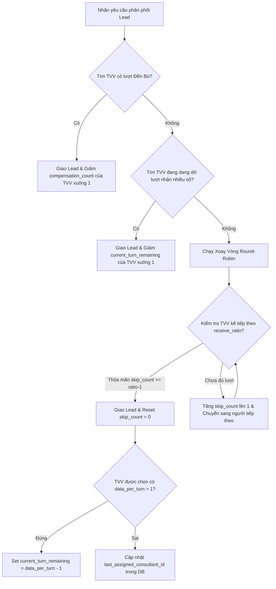

# BẢN AUDIT HỆ THỐNG PHÂN PHỐI LEAD (DOMATION DATA)
Tài liệu cấu trúc hệ thống, schema database, luồng nghiệp vụ cốt lõi và API phục vụ tối ưu hóa context cho AI Agent.

---

## 1. KIẾN TRÚC TỔNG QUAN (SYSTEM ARCHITECTURE)
Hệ thống quản lý, đồng bộ và phân phối lead tự động từ Google Sheets / Landing Page cho đội ngũ tư vấn viên (Sale / Consultant) qua Email và Zalo Bot.

*   **Frontend**: React (TypeScript) + Vite. Single Page Application (SPA), sử dụng cơ chế giữ trạng thái Tabs để tránh unmount/remount các trang chính.
*   **Backend**: PHP thuần (PHP 8.x). Gồm API chính (`api.php`), API Webhook (`webhook.php`), Zalo Webhook (`zalo_webhook.php`), và các script Cron chạy tự động.
*   **Database**: MySQL/MariaDB. Hỗ trợ cơ chế tự động chạy di chuyển dữ liệu (Auto-migration) tích hợp trong kết nối DB để nâng cấp phiên bản schema.
*   **Zalo OA Bot**: Zalo Bot dùng gửi thông báo phân bổ lead, quản lý báo lỗi dữ liệu (Ticket), tra cứu thông tin lead và phê duyệt ticket lỗi trực tiếp thông qua câu lệnh chat.

---

## 2. BẢN ĐỒ CƠ SỞ DỮ LIỆU (DATABASE SCHEMA MAP)

### 2.1. Bảng `accounts` (Tài khoản quản trị & hệ thống)
*   **Mô tả**: Lưu trữ tài khoản của Quản trị viên (Admin), Trợ lý (Assistant) và người xem (Viewer).
*   **Cấu trúc cột**:
    *   `id` (INT, Primary Key, AUTO_INCREMENT)
    *   `username` (VARCHAR(100), UNIQUE)
    *   `password_hash` (VARCHAR(255))
    *   `role` (ENUM('admin', 'assistant', 'viewer'), Default 'viewer')
    *   `name` (VARCHAR(255))
    *   `email` (VARCHAR(255), UNIQUE) - Bắt buộc với Admin thường để nhận thông báo / bảo mật.
    *   `zalo_chat_id` (VARCHAR(255), NULL) - Zalo Chat ID để nhận tin nhắn/duyệt ticket từ Zalo OA.
    *   `is_confirmed` (TINYINT(1), Default 0) - Xác nhận qua email link.
    *   `confirm_token` (VARCHAR(64), NULL) - Token kích hoạt tài khoản.
    *   `last_login` (DATETIME, NULL) - Ghi nhận thời gian đăng nhập gần nhất.
    *   `created_at` (DATETIME, Default CURRENT_TIMESTAMP)

### 2.2. Bảng `consultants` (Nhân sự tư vấn viên / Sale)
*   **Mô tả**: Danh sách tư vấn viên nhận số, lưu trữ giờ làm việc và trạng thái nghỉ phép. ID của tư vấn viên được migrate tự động lên 4 chữ số (bắt đầu từ 1000) để phân biệt trong hệ thống.
*   **Cấu trúc cột**:
    *   `id` (INT, Primary Key, AUTO_INCREMENT) - Bắt đầu từ 1000.
    *   `name` (VARCHAR(255))
    *   `email` (VARCHAR(255), UNIQUE)
    *   `status` (ENUM('active', 'inactive', 'leave'), Default 'active') - Trạng thái hoạt động.
    *   `leave_start` (DATE, NULL) - Ngày bắt đầu nghỉ phép.
    *   `leave_end` (DATE, NULL) - Ngày kết thúc nghỉ phép.
    *   `zalo_chat_id` (VARCHAR(255), NULL) - Zalo Chat ID để Zalo Bot gửi data mới trực tiếp.
    *   `work_start_time` (VARCHAR(5), Default '00:00') - Định dạng HH:MM, giờ bắt đầu nhận số.
    *   `work_end_time` (VARCHAR(5), Default '23:59') - Định dạng HH:MM, giờ ngưng nhận số.
    *   `created_at` (DATETIME, Default CURRENT_TIMESTAMP)

### 2.3. Bảng `distribution_rounds` (Vòng xoay phân phối)
*   **Mô tả**: Các vòng xoay chứa nhóm tư vấn viên nhận số theo các dự án/nguồn lead khác nhau.
*   **Cấu trúc cột**:
    *   `id` (INT, Primary Key, AUTO_INCREMENT)
    *   `round_name` (VARCHAR(255))
    *   `description` (MEDIUMTEXT, NULL)
    *   `cc_emails` (MEDIUMTEXT, NULL) - Danh sách email CC (phân cách bằng dấu phẩy) để nhận email báo lead mới.
    *   `last_assigned_consultant_id` (INT, FK -> `consultants.id`, NULL) - Lưu vết người nhận cuối của lượt Round-Robin để xoay vòng tiếp theo.
    *   `is_active` (TINYINT(1), Default 1)

### 2.4. Bảng `round_consultants` (Bảng trung gian Vòng xoay - Tư vấn viên)
*   **Mô tả**: Cấu hình chi tiết cơ chế phân phối cho từng Sale thuộc vòng xoay.
*   **Cấu trúc cột**:
    *   `round_id` (INT, FK -> `distribution_rounds.id`, Cascade)
    *   `consultant_id` (INT, FK -> `consultants.id`, Cascade)
    *   `is_active` (TINYINT(1), Default 1) - Trạng thái hoạt động trong vòng này.
    *   `receive_ratio` (INT, Default 1) - Tỉ lệ nhận (Ví dụ: tỉ lệ = 3 thì bỏ qua 2 lượt, nhận 1 lượt).
    *   `skip_count` (INT, Default 0) - Bộ đếm số lần đã bỏ qua để tính tỉ lệ xoay tua.
    *   `compensation_count` (INT, Default 0) - Số lượt đền bù data (nhận số ưu tiên do ticket cũ lỗi).
    *   `data_per_turn` (INT, Default 1) - Số lead tối đa nhận liên tiếp trong một lượt trước khi chuyển sang người khác.
    *   `current_turn_remaining` (INT, Default 0) - Số lead còn lại cần giao tiếp tục trong lượt hiện tại.
*   **Khóa chính**: Composite Key (`round_id`, `consultant_id`).

### 2.5. Bảng `leads` (Dữ liệu khách hàng tiềm năng)
*   **Mô tả**: Danh sách khách hàng và thông tin phân bổ.
*   **Cấu trúc cột**:
    *   `id` (INT, Primary Key, AUTO_INCREMENT)
    *   `phone` (VARCHAR(20), UNIQUE) - Số điện thoại chuẩn hóa duy nhất.
    *   `email` (VARCHAR(255), NULL)
    *   `name` (VARCHAR(255), NULL)
    *   `source` (VARCHAR(255), NULL) - Nguồn lead.
    *   `type` (VARCHAR(100), NULL) - Loại chiến dịch / dự án.
    *   `note` (MEDIUMTEXT, NULL) - Ghi chú chi tiết, tích lũy lịch sử ghi chú nếu lead trùng.
    *   `assigned_to` (INT, FK -> `consultants.id`, NULL) - Sale đang sở hữu lead.
    *   `connection_id` (INT, NULL) - Nguồn kết nối Google Sheet đồng bộ.
    *   `last_interaction_date` (DATETIME, NULL) - Thời gian tương tác/nhận số cuối cùng.
    *   `created_at` (DATETIME, Default CURRENT_TIMESTAMP)
*   **Indexes**: `idx_phone`, `idx_email`, `idx_created_at`, `idx_connection_id`.

### 2.6. Bảng `distribution_logs` (Lịch sử phân phối lead)
*   **Mô tả**: Nhật ký chi tiết trạng thái phân bổ của từng lead trong vòng xoay.
*   **Cấu trúc cột**:
    *   `id` (INT, Primary Key, AUTO_INCREMENT)
    *   `lead_id` (INT, FK -> `leads.id`, Cascade)
    *   `assigned_to` (INT, FK -> `consultants.id`, Set Null)
    *   `round_id` (INT, FK -> `distribution_rounds.id`, Set Null)
    *   `status` (VARCHAR(50)) - Trạng thái: `success`, `error`, `reminder`, `silent`, `assigned`, `no_consultant`, `pending_work_hours`.
    *   `message` (MEDIUMTEXT) - Chi tiết lý do phân bổ hoặc lỗi phát sinh.
    *   `received_at` (DATETIME, Default CURRENT_TIMESTAMP)
*   **Indexes**: `idx_received_at`, `idx_status`, `idx_round_id`, `idx_assigned_to`, `idx_lead_id`, `idx_duplicate_check`, `idx_stats_group`.

### 2.7. Bảng `data_reports` (Ticket báo cáo lỗi lead)
*   **Mô tả**: Lưu trữ báo cáo lỗi dữ liệu khách hàng (số sai, không liên lạc được,...) từ Sale để xin đền bù số khác.
*   **Cấu trúc cột**:
    *   `id` (INT, Primary Key, AUTO_INCREMENT)
    *   `lead_id` (INT, FK -> `leads.id`, Cascade)
    *   `consultant_id` (INT, FK -> `consultants.id`, Cascade)
    *   `round_id` (INT, FK -> `distribution_rounds.id`, Cascade)
    *   `reason` (VARCHAR(255)) - Lý do báo cáo lỗi.
    *   `status` (VARCHAR(20), Default 'pending') - Trạng thái: `pending`, `approved` (được đền bù), `rejected` (bị bác bỏ).
    *   `reject_reason` (VARCHAR(255), NULL) - Lý do Admin từ chối ticket.
    *   `created_at` (DATETIME, Default CURRENT_TIMESTAMP)
    *   `resolved_at` (DATETIME, NULL)
*   **Indexes**: `idx_round_id`, `idx_report_lookup` (`lead_id`, `consultant_id`, `round_id`).

### 2.8. Bảng `routing_rules` (Quy tắc định tuyến lead)
*   **Mô tả**: Định tuyến lead vào vòng xoay phù hợp dựa trên từ khóa ở cột dữ liệu bất kỳ.
*   **Cấu trúc cột**:
    *   `id` (INT, Primary Key, AUTO_INCREMENT)
    *   `connection_id` (VARCHAR(255), NULL) - Cấu hình áp dụng cho nguồn kết nối cụ thể (VD: `-1` cho tất cả Sheets, `-2` cho Landing Page, `-3` cho thủ công, hoặc danh sách ID cụ thể).
    *   `target_round_id` (INT, FK -> `distribution_rounds.id`, Cascade)
    *   `condition_column` (VARCHAR(100)) - Tên cột / thuộc tính so khớp.
    *   `condition_operator` (VARCHAR(50), Default 'contains') - Toán tử so sánh: `contains`, `not_contains`, `equals`, `not_equals`, `starts_with`, `ends_with`, `is_empty`, `is_not_empty`, `date_before`, `date_after`, `date_equals`.
    *   `condition_value` (VARCHAR(255)) - Giá trị so sánh.
    *   `conditions_json` (LONGTEXT, NULL) - Chứa cấu trúc JSON của các nhánh điều kiện phức tạp (hỗ trợ nhiều điều kiện lồng nhau).
    *   `logical_operator` (VARCHAR(10), Default 'AND') - Toán tử logic giữa các nhánh điều kiện.
    *   `priority` (INT, Default 0) - Thứ tự ưu tiên đánh giá (số nhỏ hơn chạy trước).

### 2.9. Bảng `sheet_connections` (Kết nối Google Sheets / Webhook)
*   **Mô tả**: Lưu cấu hình kết nối đồng bộ giữa Google Sheets/Landing page và hệ thống.
*   **Cấu trúc cột**:
    *   `id` (INT, Primary Key, AUTO_INCREMENT)
    *   `sheet_name` (VARCHAR(255)) - Tên mô tả sheet.
    *   `spreadsheet_id` (VARCHAR(255), NULL) - Google Spreadsheet ID.
    *   `connection_type` (VARCHAR(20), Default 'sheets') - Loại: `sheets` hoặc `landing_page`.
    *   `webhook_token` (VARCHAR(64), UNIQUE) - Token webhook riêng bảo mật khi tích hợp đẩy dữ liệu.
    *   `sync_interval` (INT, Default 5) - Chu kỳ chạy đồng bộ (phút).
    *   `last_sync_at` (DATETIME, NULL)
    *   `sync_status` (VARCHAR(50), Default 'idle') - Trạng thái quét: `idle`, `syncing`, `success`, `error`.
    *   `email_template` (MEDIUMTEXT, NULL) - Bản mẫu nội dung email tùy biến gửi cho Sale.
    *   `require_both_contact` (TINYINT(1), Default 0) - Yêu cầu bắt buộc phải có cả SĐT và Email mới xử lý.
    *   `sync_mode` (ENUM('all', 'new_only'), Default 'all') - Cách quét: quét toàn bộ hoặc chỉ dòng mới.
    *   `is_initialized` (TINYINT(1), Default 0) - Trạng thái đã đồng bộ khởi tạo dữ liệu cũ ban đầu hay chưa.
    *   `is_silent` (TINYINT(1), Default 0) - Bật chế độ "Đồng bộ ẩn", chỉ đồng bộ để ghi nhận check trùng, không định tuyến chia số cho Sale.
    *   `sync_saleperson` (TINYINT(1), Default 0) - Lấy thông tin Sale được chỉ định sẵn trong Sheet để ghi nhận thay vì xoay vòng.
    *   `is_active` (TINYINT(1), Default 1)
    *   `created_at` (DATETIME, Default CURRENT_TIMESTAMP)

### 2.10. Các bảng bổ trợ hệ thống
*   **`field_mappings`**: Mapping tên cột của Google Sheet thành trường hệ thống (`phone`, `email`, `source`, `type`, `note`, `name`). Hỗ trợ thêm `custom_label` để tùy biến nhãn cột khi gửi Email/Zalo.
*   **`sheet_sync_records`**: Lưu băm dòng (`row_hash`) đã đồng bộ của từng sheet để tránh quét trùng.
*   **`mail_queue`**: Hàng đợi gửi email. Cột: `to_email`, `cc_email`, `subject`, `body_html`, `status` (`pending`, `sent`, `failed`), `attempts` (số lần thử gửi lại khi lỗi), `last_error`.
*   **`ticket_notify_settings`**: Cấu hình tài khoản admin nhận thông báo báo cáo lỗi qua Email.
*   **`system_settings`**: Cấu hình chung toàn hệ thống (`global_exclusion_keys`, `global_exclusion_contacts`, `zalo_daily_report_time`, `zalo_bot_token`, `zalo_webhook_secret`, `reassign_if_owner_inactive`,...).
*   **`admin_logs`**: Nhật ký hành động nghiệp vụ của quản trị viên (Thao tác duyệt, xóa, chỉnh sửa cài đặt...).

---

## 3. BẢN ĐỒ THƯ MỤC & TỆP TIN (FILE DIRECTORY MAP)

### 3.1. Thư mục Backend (`/backend`)
Thực thi toàn bộ logic nghiệp vụ phía máy chủ bằng PHP:
*   [db_connect.php](file:///e:/GIAO_DATA_GOOGLESHEETS/backend/db_connect.php): Khởi tạo kết nối MySQLi, thiết lập múi giờ `+07:00`, chứa bộ đệm tĩnh cấu hình `get_system_setting` tránh truy vấn lặp N+1, chạy auto-migration nâng cấp schema.
*   [api.php](file:///e:/GIAO_DATA_GOOGLESHEETS/backend/api.php): Endpoint chính cho Frontend. Quản lý xác thực JWT qua HTTP Header `X-Auth-Token` / `Authorization`, định tuyến tất cả các hành động CRUD tài khoản, sale, vòng xoay, rule, đồng bộ thủ công, hiển thị dashboard và báo cáo.
*   [webhook.php](file:///e:/GIAO_DATA_GOOGLESHEETS/backend/webhook.php): Cổng nhận Lead qua POST (từ Google Apps Script hoặc API Landing Page). Xác thực Token, áp dụng Khóa Đồng thời (`GET_LOCK`), trích xuất ánh xạ cột (`field_mappings`), gọi logic phân phối và đẩy vào hàng đợi mail/zalo.
*   [webhook_logic.php](file:///e:/GIAO_DATA_GOOGLESHEETS/backend/webhook_logic.php): Trái tim xử lý Lead: chứa hàm chuẩn hóa SĐT/Ngày tháng, kiểm tra trùng CRM, chạy bộ máy quy tắc định tuyến, và thuật toán phân chia Round-Robin.
*   [zalo_bot.php](file:///e:/GIAO_DATA_GOOGLESHEETS/backend/zalo_bot.php): SDK mini chứa hàm `sendZaloMessage()` gọi tới Zalo OA API.
*   [zalo_webhook.php](file:///e:/GIAO_DATA_GOOGLESHEETS/backend/zalo_webhook.php): Đón sự kiện từ Zalo OA Chatbot. Cho phép liên kết chatbot thông qua Passcode (`/start [Passcode]`), xử lý các lệnh tra cứu báo cáo nhanh cho quản trị viên.
*   [cron_sync.php](file:///e:/GIAO_DATA_GOOGLESHEETS/backend/cron_sync.php): Quét định kỳ tất cả kết nối Google Sheets hoạt động, phòng chống trùng lặp bằng file lock độc quyền `.lock`, thực thi check trùng chéo và phân phối số, giải phóng các số đang treo ngoài giờ làm việc.
*   [cron_mailer.php](file:///e:/GIAO_DATA_GOOGLESHEETS/backend/cron_mailer.php): Xử lý hàng đợi gửi email `mail_queue` theo lô (Batch) nhỏ để tránh nghẽn SMTP, hỗ trợ tự động gửi lại tối đa 3 lần nếu có lỗi kết nối.
*   [cron_daily_report.php](file:///e:/GIAO_DATA_GOOGLESHEETS/backend/cron_daily_report.php) & [cron_weekly_report.php](file:///e:/GIAO_DATA_GOOGLESHEETS/backend/cron_weekly_report.php): Biên tập dữ liệu thống kê lead phân bổ để gửi báo cáo tổng kết qua Zalo/Email cho admin theo lịch định sẵn. Tự động kiểm tra để khôi phục trạng thái nhận số (`status = 'active'`) cho Sale khi kết thúc kỳ nghỉ phép.
*   [mailer.php](file:///e:/GIAO_DATA_GOOGLESHEETS/backend/mailer.php): Cấu hình PHPMailer gửi thư báo lead cho Sale & CC Admins.

### 3.2. Thư mục Frontend (`/src`)
*   [App.tsx](file:///e:/GIAO_DATA_GOOGLESHEETS/src/App.tsx): Định tuyến chính bằng `react-router-dom`. Sử dụng `AppTabs` để lưu trữ layout DOM của các trang Dashboard, DataList, Consultants, Rounds, Tickets, Rules, Integrations, Settings, Accounts luôn sống (display block/none) nhằm tối ưu trải nghiệm và giảm tải cuộc gọi API reload liên tục.
*   **Trang (`/src/pages`)**:
    *   [Dashboard.tsx](file:///e:/GIAO_DATA_GOOGLESHEETS/src/pages/Dashboard.tsx): Hiển thị biểu đồ phân phối lead, tỉ lệ lỗi, trạng thái nhanh của các vòng và top Sale nhận số.
    *   [DataList.tsx](file:///e:/GIAO_DATA_GOOGLESHEETS/src/pages/DataList.tsx): Danh sách tất cả lead đã lưu trong hệ thống kèm tính năng lọc, tìm kiếm và phân bổ lại thủ công.
    *   [Consultants.tsx](file:///e:/GIAO_DATA_GOOGLESHEETS/src/pages/Consultants.tsx): Quản lý danh sách Sale, thiết lập Zalo Chat ID, thời gian làm việc cá nhân (`work_start_time`, `work_end_time`) và lịch nghỉ phép.
    *   [Rounds.tsx](file:///e:/GIAO_DATA_GOOGLESHEETS/src/pages/Rounds.tsx): Thiết lập các vòng xoay, tỉ lệ nhận số (`receive_ratio`), số lượng nhận một lượt (`data_per_turn`) và điều chỉnh số lượt đền bù số lỗi (`compensation_count`).
    *   [RuleSettings.tsx](file:///e:/GIAO_DATA_GOOGLESHEETS/src/pages/RuleSettings.tsx): Trình thiết kế luật phân phối trực quan đa điều kiện (Hỗ trợ lồng nhánh `AND`/`OR` phức tạp) và chức năng giả lập kết quả định tuyến thử nghiệm trước khi lưu.
    *   [Integrations.tsx](file:///e:/GIAO_DATA_GOOGLESHEETS/src/pages/Integrations.tsx): Quản lý các luồng nhập số từ Google Sheets / Landing Page Webhook, ánh xạ dữ liệu cột và cấu hình gửi email mẫu.
    *   [Tickets.tsx](file:///e:/GIAO_DATA_GOOGLESHEETS/src/pages/Tickets.tsx): Nơi Admin tiếp nhận và phê duyệt/bác bỏ các yêu cầu xin bù số lỗi từ Sale.
    *   [SalePortal.tsx](file:///e:/GIAO_DATA_GOOGLESHEETS/src/pages/SalePortal.tsx): Cổng tra cứu nhanh và báo lỗi số điện thoại dành riêng cho Sale đăng nhập bằng tài khoản Google (không cần mật khẩu).
    *   [Accounts.tsx](file:///e:/GIAO_DATA_GOOGLESHEETS/src/pages/Accounts.tsx): Quản trị danh sách người dùng đăng nhập hệ thống CRM.
    *   [ReportData.tsx](file:///e:/GIAO_DATA_GOOGLESHEETS/src/pages/ReportData.tsx) / [DemoEntry.tsx](file:///e:/GIAO_DATA_GOOGLESHEETS/src/pages/DemoEntry.tsx): Màn hình báo lỗi không cần tài khoản và chức năng chạy chế độ Demo giả lập dữ liệu ngoại tuyến.
*   **Hỗ trợ (`/src/utils`)**:
    *   [api.ts](file:///e:/GIAO_DATA_GOOGLESHEETS/src/utils/api.ts): Chứa hàm fetch API chung, cơ chế khóa chống redirect loop khi token hết hạn và thuật toán tự động thử lại 2 lần (Retry) khi gặp lỗi rớt mạng tạm thời.
    *   [mockEngine.ts](file:///e:/GIAO_DATA_GOOGLESHEETS/src/utils/mockEngine.ts) / [mockDataDb.ts](file:///e:/GIAO_DATA_GOOGLESHEETS/src/utils/mockDataDb.ts): Giả lập DB cục bộ và các tiến trình xử lý số để chạy thử ứng dụng không cần backend PHP thực tế.

---

## 4. CÁC LUỒNG NGHIỆP VỤ CỐT LÕI (CORE BUSINESS LOGIC)

### 4.1. Chuẩn hóa Lead (Normalization)
Mọi lead đi qua webhook hoặc quét cron đều chạy qua hai hàm định dạng trong `webhook_logic.php`:
1.  **normalizePhone($phoneRaw)**:
    *   Loại bỏ các tiền tố ký tự như `p:`, `tel:`, `phone:`.
    *   Nếu chuỗi chứa nhiều số điện thoại (tách nhau bởi dấu phẩy, khoảng trắng, gạch chéo hoặc chữ "hoặc", "và"), hàm sẽ tách ra và **chỉ lấy số điện thoại hợp lệ cuối cùng** để xử lý.
    *   Xóa toàn bộ ký tự đặc biệt, chỉ giữ lại số và dấu `+` ở đầu (nếu có).
    *   Nếu bắt đầu bằng `+84` hoặc `84`, chuyển về định dạng đầu số `0` thuần Việt.
    *   Nếu là số nước ngoài (giữ dấu `+` ở đầu và mã quốc gia khác), giữ nguyên.
    *   Nếu số Việt Nam bị thiếu số `0` ở đầu (ví dụ: `989xxxxxx`), tự động chèn thêm `0` vào trước.
2.  **normalizeDate($dateRaw)**:
    *   Đưa mọi định dạng ngày/giờ (kể cả Timestamp của Excel hay dạng chuỗi d/m/y H:i:s) về dạng chuẩn MySQL `YYYY-MM-DD HH:MM:SS`.

### 4.2. Định tuyến Lead (Evaluate Rules)
Được triển khai tại `evaluateRules()` trong `webhook_logic.php`:
*   Lead sau khi đọc sẽ được so khớp lần lượt với danh sách quy tắc (`routing_rules`) theo độ ưu tiên `priority` tăng dần.
*   Quy tắc lọc theo nguồn kết nối (`connection_id`), hỗ trợ cấu hình đa điều kiện thông qua trường `conditions_json`.
*   Một quy tắc có thể có nhiều nhánh điều kiện (nối với nhau bằng toán tử logic `OR`). Trong mỗi nhánh có thể chứa nhiều phép so sánh cột con (nối bằng toán tử logic `AND`).
*   **Dữ liệu tiêm vào (`Inject`)**: Nếu một quy tắc thỏa mãn và có cấu hình `inject`, các giá trị tĩnh cấu hình trước sẽ tự động ghi đè/bổ sung vào thuộc tính tương ứng của Lead trước khi lưu (VD: tự động gán nguồn hoặc phân loại đặc thù).
*   Nếu lead khớp quy tắc, nó trả về `target_round_id` tương ứng. Nếu không khớp quy tắc nào, lead sẽ tiếp tục được phân bổ theo vòng tròn mặc định của luồng kết nối đó.

### 4.3. Thuật toán Phân phối Xoay Vòng (Round-Robin Distribution)
Được định nghĩa tại hàm `getNextConsultantInRound()` trong `webhook_logic.php` sử dụng khóa cấm tranh chấp (`FOR UPDATE`). Việc phân chia tuân theo 3 cấp độ ưu tiên nghiêm ngặt:

*   **Priority 1: Lượt đền bù (Compensation)**
    *   Hệ thống quét Sale có `compensation_count > 0` trong vòng.
    *   Nếu tìm thấy, giao ngay lead cho người này và giảm `compensation_count` đi 1 đơn vị. Lượt phân phối này là ngoại lệ (out-of-band) nên **không làm cập nhật con trỏ** `last_assigned_consultant_id` của vòng xoay để tránh làm hỏng thứ tự Round-Robin bình thường.
*   **Priority 2: Đang trong lượt nhận số liên tục (Mid-Turn)**
    *   Nếu Sale trước đó được cấu hình nhận nhiều số một lần (`data_per_turn > 1`) và chưa nhận đủ số lượng quy định (`current_turn_remaining > 0`), lead tiếp theo lập tức chuyển cho Sale này và trừ `current_turn_remaining` đi 1.
    *   Giữ nguyên con trỏ xoay vòng bình thường.
*   **Priority 3: Xoay vòng Round-Robin tiêu chuẩn kết hợp Tỉ Lệ (Ratio)**
    *   Tìm Sale tiếp theo sau vị trí `last_assigned_consultant_id` (sắp xếp tăng dần theo ID của TVV hoạt động).
    *   Đánh giá qua thuộc tính `receive_ratio` (mặc định là 1 - nhận đều).
    *   Nếu một Sale có tỷ lệ nhận là `R` (với `R > 1`):
        *   Nếu số lần bị bỏ qua (`skip_count`) chưa đạt đến `R - 1`, hệ thống cộng `skip_count` lên 1 và chuyển tiếp kiểm tra người kế bên.
        *   Nếu `skip_count >= R - 1`, chọn Sale này làm người nhận, đồng thời reset `skip_count` về 0.
    *   Khi giao số thành công, nếu Sale này có cấu hình `data_per_turn > 1`, hệ thống khởi tạo giá trị `current_turn_remaining = data_per_turn - 1` để giữ chân số cho các lượt tiếp theo.
    *   Cập nhật `last_assigned_consultant_id` là ID của Sale vừa nhận số để đánh dấu mốc xoay vòng tiếp theo.

### 4.4. Kiểm tra Trùng Lead và Phân bổ lại (Duplicate Check & Reassignment)
Nằm tại hàm `checkCRMInteraction()` của `webhook_logic.php`:
*   Hệ thống kiểm tra xem SĐT hoặc Email của lead mới đã tồn tại trong CRM chưa.
*   Trước khi kiểm tra trùng lặp CRM, hệ thống luôn đánh giá trước bộ quy tắc định tuyến (`evaluateRules()`) để xác định đúng Vòng xoay phân phối mục tiêu (`target_round_id`). Điều này giúp:
    *   Áp dụng các cấu hình tiêm/ghi đè dữ liệu tĩnh (`inject` fields) trước tiên.
    *   Lấy cấu hình danh sách CC Email (`cc_emails`) và tên vòng xoay (`round_name`) tương ứng của Vòng xoay đó để đồng bộ hóa cho thông báo nhắc nhở trùng.
*   Nếu **đã tồn tại**, hệ thống tính khoảng cách thời gian (tháng) từ lúc tạo lead cũ đến nay.
*   **Xử lý trùng lặp**:
    *   Nếu tư vấn viên cũ (người đã nhận số lần đầu) đang ở trạng thái hoạt động (`status = 'active'`), lead trùng này sẽ được gán ngược lại cho chính Sale cũ đó (đánh dấu log trạng thái là `reminder` - nhắc lại).
    *   Nếu tư vấn viên cũ đang tạm ngưng hoặc nghỉ phép (`status` là `inactive` hoặc `leave`), việc xử lý phụ thuộc vào cấu hình hệ thống `reassign_if_owner_inactive`:
        *   Nếu bật (`= 1`): Coi lead như mới hoàn toàn, chạy xoay vòng phân bổ cho Sale mới đang hoạt động.
        *   Nếu tắt (`= 0`): Vẫn gán lại cho Sale cũ bất chấp tình trạng hoạt động của họ.
*   **Dòng thời gian lịch sử gần nhất**: Đối với các lead trùng lặp được kích hoạt thông báo nhắc nhở (Zalo / Email), hệ thống sẽ truy xuất lịch sử 5 lần phân phối/tương tác gần nhất bằng hàm `getLeadHistoryTimeline($conn, $leadId)` và hiển thị thành khối timeline trực quan trong thông tin gửi cho tư vấn viên.

### 4.5. Cơ chế Khóa Đồng Thời (Concurrency Prevention)
Để loại bỏ các hành động gọi Webhook trùng lặp song song (Concurrency race condition) khi người dùng bấm submit landing page nhiều lần hoặc Google Sheets đẩy lặp sự kiện:
*   Hệ thống dùng cơ chế khóa định danh Advisory Lock của MySQL: `GET_LOCK('webhook_lead_phone_[SĐT]', 10)`.
*   Tất cả các tiến trình trùng SĐT gọi cùng lúc sẽ phải xếp hàng chờ trong tối đa 10 giây. Tiến trình đầu tiên xử lý xong sẽ ghi nhận lead vào DB, các tiến trình sau khi vào được khóa sẽ bị chặn ngay ở bước kiểm tra trùng lặp CRM (Duplicate Check) và chuyển thành trạng thái `reminder` (nhắc lại) thay vì tạo ra các bản ghi phân phối mới.
*   Khóa được giải phóng an toàn bằng hàm đăng ký tắt tiến trình `register_shutdown_function` gọi `RELEASE_LOCK`.

### 4.6. Ràng buộc giờ làm việc (Work Hours Enforcement)
*   Khi phân bổ lead cho tư vấn viên, hệ thống đối chiếu giờ hiện tại với khung `work_start_time` và `work_end_time` của Sale đó.
*   Nếu thời điểm tiếp nhận số nằm **ngoài khung giờ làm việc**, hệ thống vẫn gán tạm thời lead cho Sale đó nhưng lưu log phân bổ dưới trạng thái `pending_work_hours` và **không gửi thông báo** (Email / Zalo) cho Sale nhằm tránh làm phiền ngoài giờ.
*   **Cronjob khôi phục**: Script `cron_sync.php` chạy định kỳ mỗi phút sẽ quét các lead đang treo trạng thái `pending_work_hours`. Khi giờ hệ thống bước vào khung hoạt động của Sale được gán, cronjob sẽ cập nhật trạng thái phân bổ về `assigned`/`compensation` tương ứng và kích hoạt lệnh gửi Email/Zalo thông báo.

---

## 5. HỆ THỐNG ZALO OA BOT COMMANDS

Bất cứ tin nhắn văn bản nào gửi đến tài khoản Zalo OA của hệ thống đều đi qua `zalo_webhook.php` để xử lý.

### 5.1. Liên kết Chatbot Zalo (`/start`)
*   Để nhận được lead hoặc duyệt lỗi qua Zalo, quản trị viên hoặc tư vấn viên phải liên kết tài khoản hệ thống với tài khoản Zalo cá nhân.
*   **Cách thức**: Người dùng lấy mã Passcode định danh trên giao diện CRM (Ví dụ: `s1002` cho Sale có ID 1002, hoặc `a12` cho Admin có ID 12). Người dùng gửi tin nhắn chứa mã passcode này vào Zalo OA. Chatbot sẽ xác minh mã khớp trên DB và cập nhật chat ID của người dùng vào cột `zalo_chat_id` trong bảng tương ứng.

### 5.2. Các câu lệnh điều khiển nhanh (Chỉ dành cho Admin)
Mọi tin nhắn chứa câu lệnh đều được Zalo Webhook xác minh quyền Admin dựa trên `zalo_chat_id` người gửi trước khi thực thi:

1.  **`/tools`**: Trả về danh sách hướng dẫn và các cú pháp lệnh nhanh.
2.  **`/report` hoặc `/report homnay`**: Báo cáo số lượng lead được chia và thống kê lỗi của từng Sale từ mốc giờ báo cáo của ngày hôm trước (cấu hình `zalo_daily_report_time`) đến thời điểm hiện tại.
3.  **`/report homqua`**: Báo cáo dữ liệu trọn vẹn của khung giờ báo cáo ngày hôm kia đến ngày hôm qua.
4.  **`/report dd/mm` hoặc `/report dd/mm to dd/mm`**: Xem báo cáo số liệu phân phối của một ngày cụ thể hoặc một khoảng thời gian.
5.  **`/check [SĐT hoặc Email]`**: Tra cứu toàn bộ lịch sử của khách hàng tiềm năng: Vòng phân bổ, Trạng thái (thành công/nhắc lại/lỗi), Sale đang chăm sóc và ghi chú tích lũy. (Hỗ trợ tra cứu linh hoạt mọi định dạng SĐT nhập vào).
6.  **`/ticket pending`**: Liệt kê tối đa 5 ticket báo lỗi lead gần nhất đang chờ được Admin duyệt.
7.  **`/ticket homnay`**: Thống kê số lượng ticket phát sinh, số ticket đã duyệt/từ chối trong ngày.
8.  **`/accept [Mã Ticket]`**: Duyệt nhanh ticket lỗi của Sale (Ví dụ: `/accept 12`). Hệ thống sẽ:
    *   Chuyển trạng thái ticket thành `approved`.
    *   Tự động cộng thêm 1 lượt đền bù (`compensation_count = compensation_count + 1`) cho Sale đó trong vòng xoay xảy ra lỗi.
    *   Gửi tin nhắn Zalo + Email tự động thông báo kết quả duyệt cho Sale nhận tin vui.
