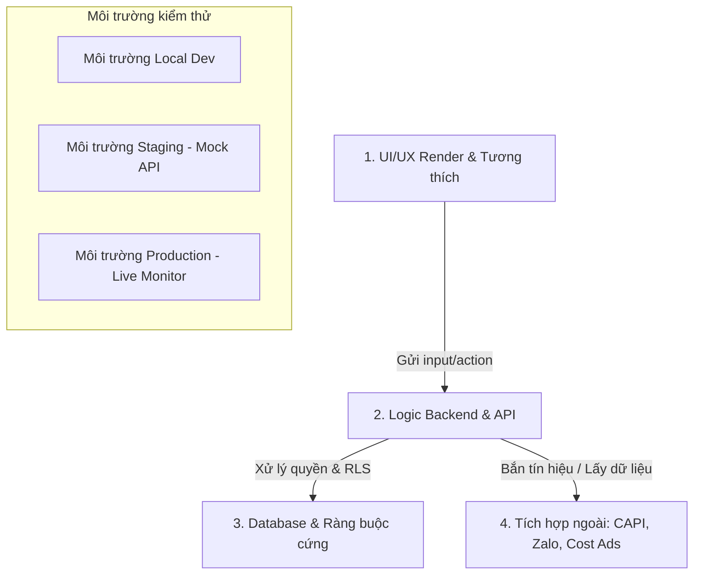

# 11. KẾ HOẠCH KIỂM THỬ TOÀN DIỆN (TEST PLAN)

> Trạng thái: ✅ ĐĂNG KÝ PHÊ DUYỆT 06/07/2026 — Khung kiểm thử tích hợp 4 lớp.
> Tài liệu bổ trợ cho toàn bộ 10 file thiết kế nghiệp vụ của hệ thống CRM RLVN.

---

## LỚP 1 — ẢNH CHỤP NHANH (SNAPSHOT)

**Sơ đồ phễu kiểm thử tích hợp:**

* **Vai trò tham gia:** QA/Tester (chịu trách nhiệm chính) · Dev (viết Unit Test & vá lỗi) · Admin/GĐKD (UAT - User Acceptance Test) · MKT (kiểm tra Match Quality & CAPI).
* **Đường đi:** Đi qua 4 lớp kiểm thử từ ngoài vào trong: Kiểm thử giao diện hiển thị -> Kiểm thử logic nghiệp vụ Backend -> Kiểm thử tính toàn vẹn dữ liệu Database -> Kiểm thử tích hợp API bên ngoài.
* **Đích cuối:** Đảm bảo hệ thống vận hành đúng 100% luật nghiệp vụ đã chốt, không lọt lỗi bảo mật (lộ dữ liệu chéo giữa các sale), và tối ưu hóa chi phí quảng cáo nhờ dữ liệu CAPI chuẩn xác.

---

## LỚP 2 — LUẬT KIỂM THỬ ĐÃ CHỐT (CHECKLIST & TEST CASES)

### A. Ma trận kiểm thử Phân quyền (Permission Matrix)
*Áp dụng ma trận quyền tại [09-Phan-Quyen.md](file:///d:/RICH_LAND_DATA_UI/markdown/09-Phan-Quyen.md) ở mọi API backend và giao diện:*

| # | Kịch bản kiểm thử | Mô tả chi tiết | Kết quả mong đợi (Pass Criteria) |
|---|---|---|---|
| **P.1** | **Bảo mật dòng dữ liệu (Row-Level Security)** | Dùng tài khoản Sale A để truy cập API lấy thông tin `KHTN` của Sale B. | Hệ thống trả về lỗi `403 Forbidden` hoặc không trả về bản ghi nào. Tuyệt đối không lộ thông tin chéo. |
| **P.2** | **Quyền đọc rộng - viết hẹp của MKT** | Dùng tài khoản Ads & Content để đọc KHTN và lịch sử chăm sóc; thử gửi yêu cầu cập nhật ghi chú hoặc chuyển trạng thái. | Đọc dữ liệu thành công (để phân tích). Gửi yêu cầu cập nhật bị từ chối (`403 Forbidden`). |
| **P.3** | **Tách quyền Quản trị & Hệ thống** | Dùng tài khoản Quản trị (Sếp) thử truy cập chức năng chỉnh sửa cấu trúc bảng (schema) hoặc cấu hình token API trực tiếp. | Bị chặn. Các cấu hình kỹ thuật sâu chỉ cho phép vai IT đụng vào để tránh rủi ro đứt gãy hệ thống. |
| **P.4** | **Quyền Admin Dự án (Cung ứng sản phẩm)** | Dùng tài khoản Admin Dự án thử đọc phễu KHTN trước trạng thái Booking. | Hệ thống chặn quyền truy cập. Chỉ cho phép thấy dữ liệu từ lúc phát sinh Booking/Đặt Cọc. |

### B. Kiểm thử 4 Quy tắc đặc thù (Workspace-Specific Rules)
*Ràng buộc bắt buộc theo `AGENTS.md`:*

| # | Kịch bản kiểm thử | Mô tả chi tiết | Kết quả mong đợi (Pass Criteria) |
|---|---|---|---|
| **R.1** | **Bể cọc trước doanh thu** | Khách hàng hủy đặt cọc khi công ty chưa thu được bất kỳ khoản phí môi giới nào. | 1. Trạng thái KHTN tự động tụt về mức trước đó (ví dụ: `Booking` hoặc `Đã Gặp`). 2. Đồng hồ bảo mật của Person được kích hoạt chạy lại. 3. Kiểm tra Person được giải phóng ra lại Databank khi hết hạn. |
| **R.2** | **Bể cọc sau doanh thu** | Khách hàng hủy đặt cọc nhưng đã đóng đợt 1 (công ty đã thực thu phí). | Trạng thái KHTN **giữ nguyên là Đặt Cọc** (vì đã phát sinh dòng tiền thực tế, được xác nhận là Khách hàng thật sự). |
| **R.3** | **Đổi căn (Unit Switching)** | Khách hàng đổi căn hộ hoặc dự án giao dịch trước khi ký Thỏa Thuận Cọc. | 1. Deal (giao dịch) cũ chuyển trạng thái Đóng (thất bại/đổi căn). 2. Tạo deal mới hoàn toàn cho mã căn mới. 3. Trường `dieu_chinh_tu_id` ở deal mới trỏ về ID deal cũ để giữ vết kiểm toán (audit trail). |
| **R.4** | **CAPI Forward-only** | Deal bị bể hoặc tụt trạng thái từ Đặt Cọc về Đã Gặp. | Hệ thống **tuyệt đối không gửi** bất kỳ tín hiệu lùi hoặc sự kiện hoàn tiền nào về Meta. Chỉ gửi tín hiệu một chiều (Forward-only). |

### C. Kiểm thử Logic 7 Luồng Nghiệp vụ (Flow Logic)

#### Luồng 1: Lead Vào ([02-Luong-1-Lead-Vao.md](file:///d:/RICH_LAND_DATA_UI/markdown/02-Luong-1-Lead-Vao.md))
* **L1.1 (Một cửa duy nhất)**: Đổ lead ảo qua API tiếp nhận. Xác minh lead bắt buộc được gán `nguon`, `campaign_id`, `du_an_id`.
* **L1.2 (Deduplication theo SĐT)**: Gửi 2 lead trùng SĐT. Xác minh chỉ tạo 1 `PERSON` duy nhất, nhưng tạo 2 bản ghi `LEAD` trỏ về cùng `PERSON`.
* **L1.3 (Khách cá nhân)**: Sale nhập tay khách cá nhân trùng SĐT với lead MKT đang hoạt động. Xác minh hệ thống cho phép lưu nhưng gắn flag cảnh báo cho Quản lý & MKT duyệt, không tự động chia.
* **L1.4 (Đối soát tự động)**: Chạy job đối soát sáng. Mock dữ liệu API Facebook trả về 100 leads, DB chỉ có 98. Xác minh hệ thống bắn cảnh báo lệch 2 leads kèm ID cụ thể qua email/Zalo IT.

#### Luồng 2: Chia Lead ([03-Luong-2-Chia-Lead.md](file:///d:/RICH_LAND_DATA_UI/markdown/03-Luong-2-Chia-Lead.md))
* **L2.1 (Cổng điều kiện nhận lead)**: Lập danh sách sale trong roster. Test tắt nút sẵn sàng hoặc không check-in. Xác minh vòng chia tự động bỏ qua sale này và ghi log lý do chặn.
* **L2.2 (Van chống ôm)**: Gán cho Sale A giữ quá X (ví dụ: 5) KHTN ở trạng thái "Chưa Xác Định". Đổ lead mới vào. Xác minh vòng chia bỏ qua Sale A. Chuyển 1 KHTN sang "Quan Tâm", đổ lead tiếp theo -> Sale A lại nhận được lead.
* **L2.3 (Timeout 2 phút)**: Đổ lead cho Sale B. Không bấm nhận trong 2 phút. Xác minh lead tự động thu hồi, chuyển cho Sale C; hệ thống ghi log "Timeout" và đánh giá tính sẵn sàng của Sale B giảm.
* **L2.4 (Ca đêm & Giờ vàng)**: Lúc 18h01, đổ lead vào hệ thống. Xác minh chỉ chia cho những sale đã đăng ký trực đêm trong app. Lúc 06h00 sáng, danh sách trực đêm tự động xóa (clear roster đêm). Hàng đợi lead đêm tự động bung cho những sale bật "Sẵn sàng" sớm (Giờ vàng 6h-8h30).

#### Luồng 3: Chăm sóc & Nhiệt độ ([04-Luong-3-Cham-Soc-Nhiet-Do.md](file:///d:/RICH_LAND_DATA_UI/markdown/04-Luong-3-Cham-Soc-Nhiet-Do.md))
* **L3.1 (Ghi chú có cấu trúc)**: Tạo ghi chú không chọn phân loại Nồi (Đất/Đồng/Áp Suất) hoặc thiếu thời lượng cuộc gọi. Xác minh API báo lỗi yêu cầu điền đầy đủ.
* **L3.2 (Nhiệt hybrid)**: Thêm 3 tương tác + 1 cuộc gọi > 5 phút. Xác minh máy đề xuất nhiệt độ là **Ấm**. Sale chốt nhiệt độ là **Lạnh**. Xác minh DB lưu cả hai cột `nhiet_may_doan` = `Warm` và `nhiet_sale_chot` = `Cold`.
* **L3.3 (Decay rớt nhiệt)**: Set up một KHTN trạng thái "Quan Tâm", nhiệt độ "Nóng", không có tương tác chất lượng trong 5 ngày. Chạy job decay. Xác minh nhiệt độ tự rớt về "Ấm" và hiển thị cảnh báo "Nguội".
* **L3.4 (Gating Form TTL1)**: Thử chuyển trạng thái KHTN sang "Đồng Ý Gặp" khi form TTL1 thiếu thông tin của >= 2 nhóm. Xác minh hệ thống chặn lại và hiển thị cảnh báo "chưa nên chuyển giai đoạn pha Than".
* **L3.5 (Bằng chứng trạng thái)**: Chuyển trạng thái sang "Đã Gặp". Không upload ảnh check-in/gặp mặt. Xác minh hệ thống chặn không cho lưu trạng thái mới.

#### Luồng 4: Hợp tác & Chia hoa hồng ([05-Luong-4-Hop-Tac-Hoa-Hong.md](file:///d:/RICH_LAND_DATA_UI/markdown/05-Luong-4-Hop-Tac-Hoa-Hong.md))
* **L4.1 (Mời hỗ trợ & Quyền ghi)**: Sale A (owner) mời Sale B hỗ trợ. Xác minh Sale B đọc được lịch sử ghi chú và tạo được ghi chú mới dưới tên Sale B. Thử dùng tài khoản Sale B chuyển trạng thái deal sang Booking -> Hệ thống chặn (chỉ owner được chuyển).
* **L4.2 (Tự sinh phiếu hợp tác)**: Sale A thu hồi quyền hỗ trợ của Sale B. Khi chuyển trạng thái sang Đặt Cọc, xác minh phiếu hợp tác tự sinh có cả tên Sale A và Sale B (gồm cả người đã bị thu hồi).
* **L4.3 (Ràng buộc 100%)**: Nhập tỉ lệ hoa hồng Sale A: 60%, Sale B: 30%. Thử lưu phiếu. Xác minh hệ thống chặn vì tổng mới đạt 90%. Sửa lại thành 60% - 40% -> Hệ thống cho lưu và gửi yêu cầu ký.
* **L4.4 (Chữ ký số & Khóa phiếu)**: Sale B bấm xác nhận, Sale A xác nhận. GĐKD bấm duyệt. Xác minh phiếu chuyển sang trạng thái `LOCKED` vĩnh viễn. Thử dùng quyền Admin sửa trực tiếp tỉ lệ % -> Hệ thống chặn.

#### Luồng 5: Kho data - Databank ([06-Luong-5-Kho-Data.md](file:///d:/RICH_LAND_DATA_UI/markdown/06-Luong-5-Kho-Data.md))
* **L5.1 (Loại trừ nguồn cá nhân)**: Tạo KHTN nguồn `ca_nhan` hết hạn tương tác. Xác minh không bao giờ bị đẩy ra Kho chung.
* **L5.2 (Ẩn/Hiện thông tin)**: Cấu hình Kho chung ở chế độ ẩn SĐT. Dùng tài khoản Sale C duyệt kho. Xác minh SĐT hiển thị dạng che (`090****123`). Bấm nhận lead thành công -> SĐT hiển thị đầy đủ.
* **L5.3 (Giới hạn nhận)**: Sale C nhận lead thứ 4 trong vòng 1 giờ. Xác minh hệ thống báo lỗi vượt hạn mức (hạn mức tối đa 3 lead/giờ/sale).
* **L5.4 (Rút kho vĩnh viễn)**: KHTN của Person X tại Sale D đạt trạng thái Đặt Cọc. Xác minh Person X tự động biến mất khỏi danh sách Kho chung ở chiến dịch đó.

#### Luồng 6: Tiền & Deals ([07-Luong-6-Tien.md](file:///d:/RICH_LAND_DATA_UI/markdown/07-Luong-6-Tien.md))
* **L6.1 (Đặt cọc nhanh)**: Khách hàng xuống tiền cọc căn hộ chưa có trong giỏ hàng. Sale nhập mã căn tự do và submit. Xác minh hệ thống cho phép tạo phiếu cọc, gắn cờ "chưa có trong danh mục" và trạng thái chuyển sang Đặt Cọc ngay lập tức mà không chặn.
* **L6.2 (UNC làm nguồn sự thật)**: Sale tải lên ảnh Ủy Nhiệm Chi (UNC) thanh toán đợt 2. Xác minh hệ thống tạo hàng đợi xác nhận cho Admin. Admin bấm xác nhận -> mốc thanh toán đợt 2 được đánh dấu hoàn thành.
* **L6.3 (Đầu ra Kế toán)**: Query dữ liệu xuất cho kế toán. Xác minh hệ thống chỉ xuất ra danh sách các căn hộ "Đủ điều kiện tính phí" kèm số đợt thanh toán, không chứa thông tin hạch toán nội bộ hay dòng tiền của công ty.

#### Luồng 7: Dữ liệu ngược - CAPI & Báo cáo ([08-Luong-7-Du-Lieu-Nguoc.md](file:///d:/RICH_LAND_DATA_UI/markdown/08-Luong-7-Du-Lieu-Nguoc.md))
* **L7.1 (Báo cáo tính từ data gốc)**: Thay đổi trạng thái KHTN trong bảng `LICH_SU_TRANG_THAI`. Kiểm tra dashboard của GĐKD. Xác minh số liệu cập nhật ngay lập tức dựa trên query trực tiếp từ event log, không lấy từ trường đệm/text lưu tĩnh.
* **L7.2 (Không bắn CAPI cho Đóng - Không Phù Hợp)**: Chuyển KHTN sang trạng thái "Đóng - Không Phù Hợp". Kiểm tra hàng đợi CAPI. Xác minh không sinh ra sự kiện `BAD` hay bất kỳ event nào gửi về Meta (tránh làm lệch thuật toán học của Meta).
* **L7.3 (Cảnh báo Stale CAPI)**: Giả lập chặn kết nối API với Meta trong 25 giờ. Xác minh hệ thống gửi cảnh báo đỏ cho IT/MKT vì có sự kiện nằm trong hàng đợi quá 24h chưa gửi được.

### D. Kiểm thử UI/UX Render & Tương thích
* **UI.1 (Tương thích thiết bị)**: Kiểm thử render trên các độ phân giải: Mobile (375px, 414px), Tablet (768px, 1024px) và Desktop (1440px, 1920px). Đảm bảo giao diện không bể khung, nút "Check-in selfie" hoạt động trơn tru trên camera điện thoại.
* **UI.2 (Hiệu ứng premium & Animation)**: Kiểm thử hiệu ứng kính mờ (glassmorphism), hover state của các nút bấm và micro-animations khi chuyển đổi nhiệt độ (Lạnh -> Ấm -> Nóng -> Sôi).
* **UI.3 (Tốc độ tải màn hình)**: Đo thời gian hiển thị dashboard của GĐKD chứa dữ liệu tổng hợp. Đạt yêu cầu khi thời gian phản hồi trang dưới **10 giây**.

### E. Kiểm thử Database & Tách tầng dữ liệu
* **DB.1 (Kiểm thử Foreign Keys)**: Thử xóa một `PERSON` khi đang có các `KHTN` liên kết. Xác minh Database chặn hành động này để bảo vệ toàn vẹn dữ liệu.
* **DB.2 (Mã hóa mật khẩu)**: Kiểm tra bảng `NHAN_VIEN`. Xác minh 100% mật khẩu được lưu dưới dạng hash (bcrypt/argon2), không còn ký tự plaintext nào.
* **DB.3 (Row-Level Security - RLS)**: Thiết lập RLS trên PostgreSQL/MySQL. Thử chạy query SQL thô dưới quyền user Sales A: `SELECT * FROM KHTN;`. Xác minh kết quả trả về chỉ gồm các dòng thuộc quyền sở hữu của Sales A.

---

## LỚP 3 — VÌ SAO (WHY)

* **Vì sao phải tách biệt 4 lớp kiểm thử rõ rệt?**
  Nếu chỉ kiểm thử trên UI (E2E), ta sẽ bỏ sót các lỗ hổng bảo mật nghiêm trọng ở tầng API (ví dụ: gọi API trực tiếp để xem khách của người khác). Nếu chỉ kiểm thử DB, ta không đo được trải nghiệm người dùng thực tế trên thiết bị di động của sale ngoài thực địa. Kiểm thử 4 lớp giúp cô lập lỗi nhanh: lỗi hiển thị thuộc UI, lỗi logic thuộc Backend, lỗi toàn vẹn thuộc DB, và lỗi đồng bộ thuộc Integration.
* **Vì sao kiểm thử RLS trực tiếp ở tầng Database thay vì tầng App?**
  CRM là hệ thống có dữ liệu khách hàng cực kỳ nhạy cảm. Nếu logic phân quyền chỉ viết ở code ứng dụng, một sai sót nhỏ khi viết API (quên check quyền trong controller) sẽ làm lộ toàn bộ tệp khách hàng. Đặt RLS trực tiếp dưới Database đảm bảo rằng dù code ứng dụng có lỗi, DB vẫn là chốt chặn cuối cùng ngăn chặn rò rỉ dữ liệu chéo.
* **Vì sao CAPI bắt buộc phải kiểm thử Forward-only chặt chẽ?**
  Meta Pixel và CAPI tự tối hóa thuật toán phân phối quảng cáo dựa trên các tín hiệu "Mua hàng" (Purchase). Nếu hệ thống gửi sự kiện lùi (ví dụ: hoàn tiền hoặc hủy cọc làm giảm giá trị đơn hàng), Meta không hỗ trợ xử lý trừ điểm học, dẫn đến thuật toán nhắm mục tiêu (targeting) của chiến dịch quảng cáo bị hỗn loạn, đẩy chi phí ads lên cao.

---

## LỚP 4 — CÒN MỞ (EDGE CASES & ROADMAP)

| # | Tình huống biên chưa chốt phương án kiểm thử | Đề xuất giải pháp kiểm thử |
|---|---|---|
| **M1** | **Độ trễ mạng khi bấm Check-in lúc 8h29m59s** | Giả lập mạng chậm (network throttling 3G chậm) để xem hệ thống xử lý giao dịch check-in trễ thế nào. Nếu request đến server lúc 8h30m05s thì có tính trễ không? |
| **M2** | **Kiểm thử hiệu năng (Stress Test) bảng GHI_CHU** | Khi số lượng ghi chú chăm sóc vượt 100.000 dòng/năm, các query lấy lịch sử chăm sóc của KHTN có bị chậm không? Cần chạy tool stress test (k6/JMeter) để kiểm tra độ trễ. |
| **M3** | **Xác thực ảnh selfie check-in bằng AI** | Hiện tại ảnh check-in là ảnh selfie thô. Tương lai có cần tích hợp kiểm thử so khớp khuôn mặt để tránh việc sale check-in hộ nhau không? |
| **M4** | **Môi trường Sandbox cho CAPI** | Cần thiết lập tài khoản Test của Meta (Sandbox Dataset) để bắn các sự kiện thử nghiệm trong quá trình staging, tránh bắn thẳng vào pixel thật làm loãng tệp học. |
