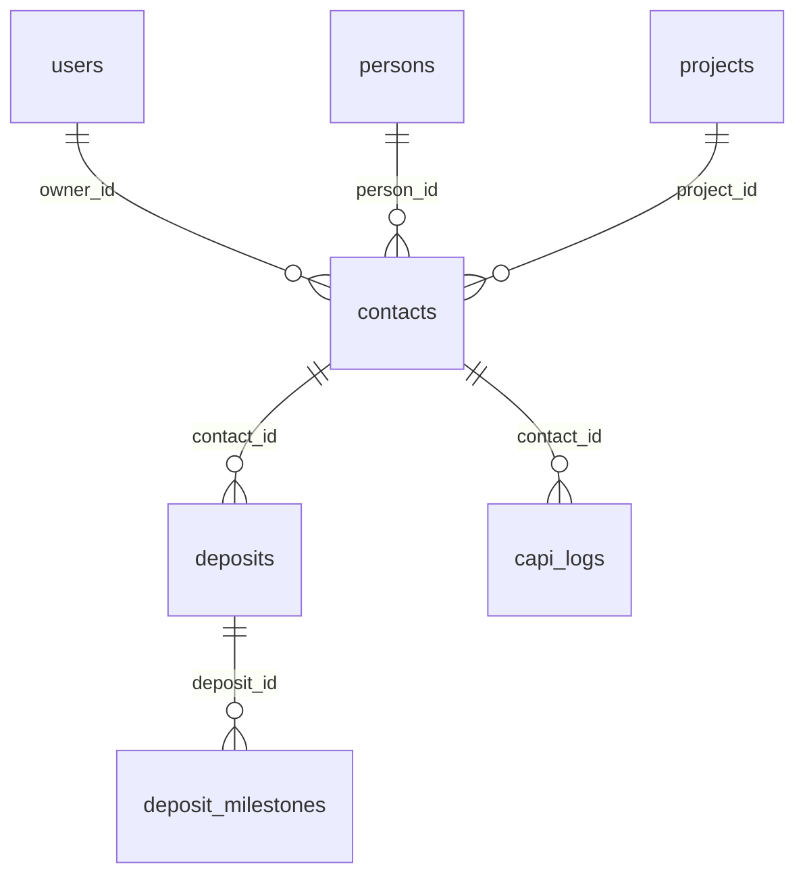

# RICH LAND CRM - CẨM NANG & HƯỚNG DẪN KỸ THUẬT TOÀN DIỆN (WORKSPACE PROFILE)

Tài liệu này là nguồn tham chiếu kỹ thuật tối cao dành cho các lập trình viên hoặc AI agent khi tiếp cận, sửa đổi và nâng cấp hệ thống RICH LAND CRM. Hãy luôn đọc kỹ tài liệu này để hiểu sâu các quy tắc nghiệp vụ đặc thù và bản đồ mã nguồn nhằm đảm bảo tính ổn định tối đa cho hệ thống.

---

## 1. Kiến Trúc Ứng Dụng & Luồng Định Tuyến (Routing & Auth Map)

### 1.1 Sơ đồ Client - Server
* **Frontend**: React (Single Page Application) sử dụng Vite.
  * Quản lý định tuyến bằng `react-router-dom` tại [src/App.tsx](file:///d:/RICH_LAND_DATA_UI/src/App.tsx).
  * Sử dụng giải pháp giữ kết nối DOM `<AppTabs>` giúp chuyển đổi qua lại giữa các trang trong CRM cực nhanh mà không làm mount/remount lại trang (giữ nguyên state).
* **Backend**: Cấu trúc API thuần bằng PHP kết nối với CSDL MySQL.
  * Mọi luồng API đi qua cổng vào duy nhất [backend/index.php](file:///d:/RICH_LAND_DATA_UI/backend/index.php). Tệp này xử lý CORS, bắt ngoại lệ hệ thống và phân phối định tuyến dựa trên tham số query action.

### 1.2 Authentication Middleware & JWT
Hàm `requireAuth()` trong [backend/index.php#L90](file:///d:/RICH_LAND_DATA_UI/backend/index.php#L90) thực thi các tác vụ:
1. Trích xuất Bearer token từ header `Authorization` hoặc query string `token`.
2. Sử dụng thư viện JWT ([backend/config/JWT.php](file:///d:/RICH_LAND_DATA_UI/backend/config/JWT.php)) để giải mã token.
3. **Chuẩn hóa quyền hạn (Role Normalization)**: 
   * Đổi quyền `'sale'` từ Frontend thành `'sales'` cho đồng bộ với kiểm tra phân quyền trong các Controller PHP.
   * Đồng bộ trường khóa chính `id` thành `user_id`.
   * Đồng bộ khóa `name` và `full_name` để tránh lỗi Undefined index cảnh báo từ PHP.

---

## 2. Lược Đồ Cơ Sở Dữ Liệu & Ràng Buộc Thể Hiện

Các thực thể quan trọng được quản trị bởi tệp [backend/unified_schema.sql](file:///d:/RICH_LAND_DATA_UI/backend/unified_schema.sql):

### 2.1 Bảng `users` (Tài khoản)
* Lưu trữ tập trung toàn bộ người dùng hệ thống. Vai trò người dùng (`role`) bao gồm: `super_admin`, `admin`, `manager`, `assistant`, `sales`, `viewer`.
* **Consultants & Accounts View**: CSDL định nghĩa View `consultants` (lọc các user có role `'sales'`) và View `accounts` (các role quản trị) nhằm tương thích ngược với mã nguồn CRM cũ.

### 2.2 Bảng `persons` & `contacts` (Chống trùng lặp lead)
* `persons`: Chứa thông tin định danh độc nhất thông qua trường `phone` (UNIQUE). Khi một khách hàng mới đổ về hệ thống, hệ thống sẽ kiểm tra bảng `persons` trước tiên.
* `contacts`: Chứa hồ sơ khách hàng tiềm năng cụ thể thuộc từng Tenant. Liên kết với `persons` qua trường `person_id`. Điều này cho phép một Person vật lý có thể có nhiều Contact ở các tenant/dự án khác nhau, nhưng trên cùng một Tenant thì luôn bảo đảm duy nhất.

### 2.3 Bảng `deposits` & `deposit_milestones` (Giao dịch tài chính)
* `deposits`: Ghi nhận phiếu đặt cọc (Mã căn, giá bán, hoa hồng).
* `deposit_milestones`: Theo dõi các đợt đóng tiền. Trạng thái đợt tiền gồm: `pending`, `approved`, `failed`. Mỗi khi một đợt tiền được Admin duyệt (`approved`), hệ thống sẽ tự động tạo hóa đơn tương ứng trong bảng `invoices`.

---

## 3. Thuật Toán Phân Phối Lead Xoay Vòng & 5 Cổng Kiểm Duyệt (Lead Distribution Gates)

Trong [backend/webhook_logic.php](file:///d:/RICH_LAND_DATA_UI/backend/webhook_logic.php#L1645), hàm `checkConsultantGates` kiểm duyệt từng Sales qua 5 cổng bảo vệ trước khi bàn giao lead:

### ❖ Cổng 1: Project Roster (Roster chiến dịch)
* Đối khớp các từ khóa tìm kiếm (mã dự án, tên dự án) xuất hiện trong tên chiến dịch, ghi chú hoặc nguồn lead với các dự án đang hoạt động (`projects` table).
* Nếu phát hiện dự án phù hợp, hệ thống kiểm tra bảng `project_roster`. Sales phải thuộc roster của dự án đó thì mới được nhận lead.

### ❖ Cổng 2: Selfie Check-in (Điểm danh ngày)
* Đối với ngày làm việc trong tuần (Thứ 2 đến Thứ 7), hệ thống kiểm tra bảng `check_ins` xem Sales đó đã điểm danh chụp ảnh selfie đầu ngày và được duyệt (`approved`) chưa. Chưa điểm danh => Không phát lead.

### ❖ Cổng 3: Vacation Mode & Status (Trạng thái hoạt động)
* Kiểm tra thuộc tính `status = 'active'` và chế độ nghỉ phép `vacation_mode = 0`. Nếu Sales bật chế độ tạm vắng (vacation mode) hoặc ở trạng thái ngưng hoạt động => Bị loại trừ.

### ❖ Cổng 4: Backpressure Valve (Van chống ôm lead)
* Tính toán số lượng khách hàng chưa tương tác đang được Sales nắm giữ. Điều kiện tính lead chưa tương tác:
  * Trạng thái pipeline là `chua_xac_dinh`.
  * HOẶC trạng thái pipeline là `quan_tam` nhưng **chưa hề có** bất kỳ ghi chú tương tác nào (`notes`) được Sales tạo cho khách hàng đó.
* Nếu số lượng này vượt quá giới hạn hệ thống `backpressure_limit` (mặc định là 5), Sales sẽ bị chặn nhận lead mới nhằm thúc giục họ phải tương tác hết số lead hiện tại.

### ❖ Cổng 5: Quota (Hạn mức phân phối)
* Giới hạn số lượng lead tối đa Sales có thể nhận theo giờ (`databank_limit_per_hour`, mặc định 3), ngày (`databank_limit_per_day`, mặc định 2), và tháng (`databank_limit_per_month`, mặc định 300). Dữ liệu được tính dựa trên số dòng ghi nhận trong bảng `distribution_logs`.

---

## 4. Các Quy Tắc Nghiệp Vụ Đặc Thù (Business Rules)

### 4.1 Quy Tắc Hủy Đặt Cọc (Bể cọc)
Được quản lý chặt chẽ trong hàm `cancelDeposit` ở [DepositController.php](file:///d:/RICH_LAND_DATA_UI/backend/controllers/DepositController.php#L270):

* **Trường hợp 1: Hủy cọc trước khi phát sinh doanh thu thực tế**
  * *Điều kiện*: Số đợt thanh toán đã được duyệt trong `deposit_milestones` bằng 0.
  * *Hành vi*: Hệ thống hạ trạng thái pipeline khách hàng về `booking` (Đặt chỗ), giảm nhiệt độ quan tâm xuống 1 cấp (`hot` -> `warm` -> `neutral` -> `cool` -> `cold`), đặt thời gian bảo mật chạy lại 3 tháng (`security_expires_at = DATE_ADD(NOW(), INTERVAL 3 MONTH)`). Khách hàng có thể bị đẩy ra Kho chung (Databank) nếu hết hạn.
* **Trường hợp 2: Hủy cọc sau khi đã có doanh thu**
  * *Điều kiện*: Khách hàng đã thanh toán và được duyệt ít nhất 1 đợt tiền (đã có UNC và được kế toán duyệt đóng đợt 1).
  * *Hành vi*: Giữ nguyên trạng thái `dat_coc` / `customer` của khách hàng, phiếu cọc đổi sang trạng thái hủy (`cancelled`) và ghi nhận lý do cụ thể, dòng tiền không bị thay đổi.

### 4.2 Quy Tắc Đổi Căn (Unit Switching)
* Khi khách hàng thay đổi căn hộ hoặc dự án quan tâm:
  1. Tiến hành đóng/hủy phiếu đặt cọc cũ (đánh dấu thất bại hoặc đổi căn).
  2. Tạo một phiếu cọc/deal mới tương ứng với căn hộ mới.
  3. Gắn thông tin ghi chú liên kết dạng "Đổi căn từ căn hộ [A]" tại phiếu cọc mới để lưu giữ trọn vẹn vết kiểm toán tài chính (audit trail).

### 4.3 Quy Tắc Meta Conversion API (CAPI) Forward-only
* Tín hiệu CAPI gửi dữ liệu chuyển đổi về Meta Pixel chỉ đi một chiều tiến lên (Lead -> Schedule -> Purchase).
* Không bắn lùi tín hiệu (không gửi sự kiện hoàn tiền, hủy bỏ hoặc hạ cấp trạng thái khách hàng về Meta).
* Một khi sự kiện `Purchase` đã gửi đi thành công cho khách hàng tiềm năng, hệ thống sẽ ghi nhận vào bảng `capi_logs`. Tất cả các sự kiện tiếp theo gửi lên cho khách hàng đó sẽ bị bỏ qua lập tức nhằm duy trì tính chính xác của dữ liệu học máy phía Meta.

---

## 5. Hướng Dẫn Lập Trình & Quy Trình Tránh Lỗi (Developer Guidelines)

### A. Ràng buộc Lưu trữ ở CustomerProfileDrawer
* Khi có bất kỳ trường thông tin khách hàng nào cần hiển thị và chỉnh sửa trên UI Drawer:
  1. Thêm trường đó vào mảng `editableFields` ở hook `hasChanges` tại dòng 682.
  2. Thêm trường đó vào mảng `allowedFields` ở hàm `handleSave` tại dòng 712.
  * Nếu không cấu hình, nút **Lưu** sẽ không sáng lên khi người dùng thay đổi dữ liệu, hoặc dữ liệu chỉnh sửa sẽ bị lọc bỏ khỏi payload gửi lên API cập nhật.

### B. Lưu trữ thông tin phụ của nhân viên (ERP Profile Extra Fields)
* Do không muốn thay đổi cấu trúc bảng `users` gốc, các trường ERP phụ như: Quê quán (`hometown`), Quốc tịch (`nationality`), Tình trạng hôn nhân (`marital_status`), Email cá nhân (`personal_email`), Chi nhánh ngân hàng (`bank_branch`) được chuyển hóa thành JSON và lưu trong cột `address` dưới thuộc tính `erp_profile`. 
* Khi đọc và ghi dữ liệu nhân viên, hãy sử dụng các hàm parser tương ứng để mã hóa/giải mã thông tin này.

### C. Phân quyền Tài liệu nhân sự (HR Documents)
* Thẻ tài liệu nhân viên hiển thị danh sách các file thuộc category `consultant_[ID]`.
* **Phân quyền cực kỳ nghiêm ngặt**:
  * Sales: Chỉ có quyền Đọc & Tải xuống (`GET /cloud-files`) tài liệu thuộc về chính họ.
  * Admin / Manager / Assistant: Được quyền Tải lên (`POST /cloud-files`) và Xóa tài liệu (`DELETE /cloud-files/:id`) của bất kỳ nhân sự nào.
